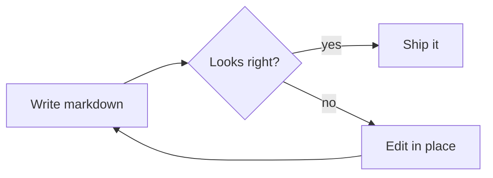

# Quoin Markdown Guide

Everything on this page is live — click any block to edit it, press
**Escape** or **✓ done** when finished, and **⌘Z** undoes anything.
This document is a copy in your library; scribble on it freely.

## Text basics

Write **bold** with `**stars**`, *italic* with `*one star*`,
~~strikethrough~~ with `~~tildes~~`, ==highlights== with `==equals==`,
`inline code` with backticks, and [links](https://example.com) with
`[label](url)`. Click into this paragraph and watch the markdown
delimiters reveal themselves around your cursor — that's how all prose
editing works in Quoin.

## Headings and structure

Headings use `#` through `######`. The outline panel (⌥⌘0) follows
them, and the status bar shows where you are. A horizontal rule is
three dashes on their own line:

---

> Blockquotes start lines with `>`. They nest, and they can hold
> other blocks — lists, code, even diagrams.

## Lists and tasks

- Bullets with `-`, `*`, or `+`
- Nest by indenting two spaces
  - Like this
1. Numbered lists just work
2. And keep counting

- [ ] Task lists are clickable — try this checkbox
- [x] Done items check off in the file itself

## Code

Fenced code blocks get syntax highlighting and a copy button:

```swift
func greet(_ name: String) -> String {
    "Hello, \(name)!"
}
```

Supported prominently: Swift, Python, JavaScript/TypeScript, JSON,
HTML/CSS, shell, and more. Indented code blocks work too.

## Tables

| Feature | Syntax | Live? |
| --- | --- | --- |
| Tables | Pipes and dashes | Yes |
| Alignment | `:---`, `:---:`, `---:` | Yes |
| Add rows/columns | Right-click the table | Yes |

Paste tab-separated cells from a spreadsheet and Quoin builds the
table for you.

## Math

Inline math with single dollars ($e^{i\pi} + 1 = 0$) and display math
with double:

$$
x = \frac{-b \pm \sqrt{b^2 - 4ac}}{2a}
$$

Fractions, roots, sums, integrals, limits, Greek, matrices, `cases`,
`aligned`, and more — click **‹/› edit** on the equation above to edit
its LaTeX with a live preview beside your cursor.

Accents, binomials, braces, and stretchy arrows all typeset natively:

$$
\hat{x} + \vec{v}, \quad \binom{n}{k}, \quad
\overbrace{a + b + c}^{\text{sum}}, \quad
A \xrightarrow{f} B
$$

The math alphabets — `\mathbb{R}`, `\mathcal{L}`, `\mathfrak{g}` — map to
real Unicode glyphs, and you can recolor with `\color`:

$$
\mathbb{R} \subset \mathbb{C}, \quad \boxed{E = mc^2}, \quad
\color{#3478f6}{\nabla \cdot \mathbf{F}}
$$

Define your own shorthands once with `\newcommand` and use them anywhere
in the document — the definitions apply across every equation:

$$
\newcommand{\abs}[1]{\left|#1\right|}
\abs{x} + \abs{y} \ge \abs{x + y}
$$

If a construct isn't typeset yet, the equation degrades to a tidy source
card whose caption names the command — nothing ever silently breaks.

## Diagrams

Mermaid diagrams render natively — no web engine involved:



Flowcharts, sequence, class, state, ER, gantt, pie, and mindmap
diagrams are supported. Click **‹/› edit** to change one and watch it
re-render as you type.

## Callouts

> [!NOTE]
> GitHub-style callouts: NOTE, TIP, IMPORTANT, WARNING, and CAUTION.

> [!TIP]
> Try **focus mode** (⌥⌘F) while writing — everything but your
> paragraph recedes.

## Front matter

Documents may start with a YAML front-matter block (three dashes),
shown as a compact chip above the title. Click it to edit the fields.

## The keyboard, briefly

| | |
| --- | --- |
| ⇧⌘O | Quick open (empty = recents) |
| ⌘0 / ⌥⌘0 | Sidebar / outline |
| ⌥⌘F / ⌥⌘T | Focus mode / typewriter scrolling |
| ⌘↩ | Edit / done editing a block |
| ⌘[ / ⌘] | Back / forward through jumps |
| ⌥⌘↑ / ⌥⌘↓ | Move the current block |
| ⌘D | Today's note |
| ⇧⌘E | Export (Markdown, HTML, PDF) |

Your documents are plain `.md` files on disk — no database, no lock-in,
nothing leaves your Mac.
