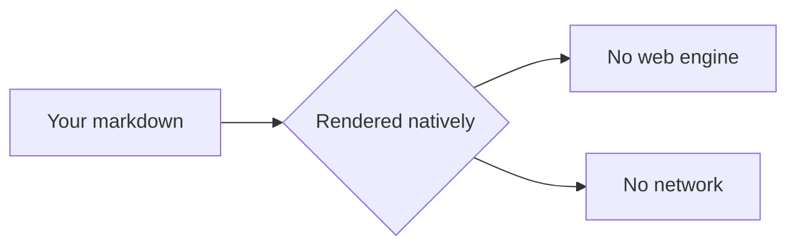

# Welcome to Quoin

Quoin is a markdown editor where the rendered page *is* the editor.
This document is yours — everything here is editable. **Click into
this paragraph right now** and watch the markdown appear around your
cursor without anything moving.

## Writing is just… writing

This line has **bold**, *italic*, ==a highlight==, `inline code`, and
a [link](https://daringfireball.net/projects/markdown/). Put your
cursor inside the bold word — see the `**` appear? The characters were
always in your file; Quoin just tucks them away until you need them.
Press **Escape** when you're done with a block.

## Things you can click

- [ ] Check this box — Quoin writes the `x` into the file itself
- [ ] Then open this file in any other editor and see for yourself
- [x] No database, no lock-in, ever

## Diagrams are native

Click **‹/› edit** on the chart above, change a label, and watch the
diagram redraw as you type. Click **✓ done** — or press **⌘↩**.

## So is math

$$
x = \frac{-b \pm \sqrt{b^2 - 4ac}}{2a}
$$

Same idea: **‹/› edit** opens the LaTeX with a live preview beside
your cursor.

## A table, because you'll need one

| Day | Plan | Done |
| --- | --- | :---: |
| Monday | Write | ✓ |
| Tuesday | Edit | ✓ |
| Wednesday | Ship |  |

Double-click a table to edit its markdown. Right-click for
*Add Table Row* and *Add Table Column*.

## Your library

- **⇧⌘O** — quick open (empty search shows your recent documents)
- **⌘N** — new document (its first `# Heading` becomes the filename)
- **⌘D** — today's note, in `Journal/`
- Drag an image in — it copies into `assets/` next to your file

## When you want to disappear

Try **⌥⌘F** on this paragraph: focus mode dims everything but where
you are. **⌥⌘T** adds typewriter scrolling — the line you're typing
holds still and the page moves instead. **⌥⌘0** toggles the outline.

## The fine print (it's short)

- Every document is a plain `.md` file on disk
- Saves are automatic and byte-lossless — there is no Save button
- Nothing ever leaves your Mac

Want the full tour of what renders? Open **Help ▸ Markdown Guide**.
