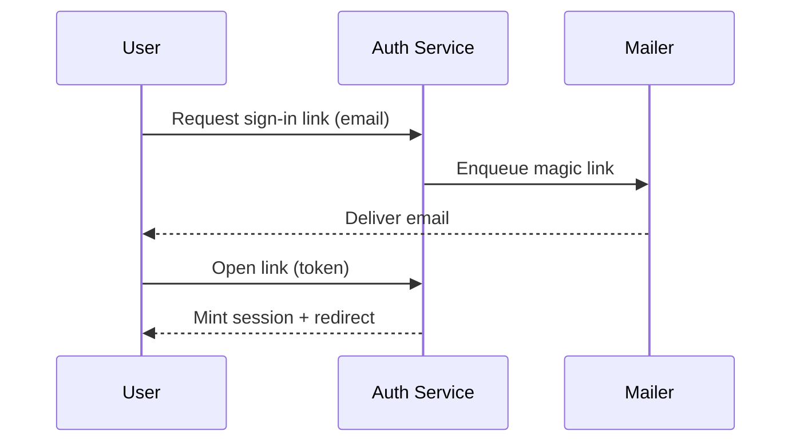

# Passwordless Sign-In

## Overview

Today roughly {~~a third~>38%~~}{#s1} of failed sign-ins are password
resets, and each reset costs us a support ticket and a frustrated user.
This spec proposes replacing the password field with a **magic link** sent
to the user's verified email, backed by a short-lived one-time code for
clients that can't follow deep links. The goal is to make the {==common
case a single tap==}{>>Is this still true for enterprise SSO tenants? They
can't tap an email on a managed device.<<}{#c1} while keeping the account
recovery story at least as strong as it is today.

We are explicitly *not* removing passwords in this release — existing
credentials keep working. Passwordless is offered as the default path for
new accounts and an opt-in for everyone else.

## Goals

- Cut password-reset support volume by at least half within two quarters.
- Reduce median time-to-first-session for new users {++from 90s to under
  30s++}{#s2}.
- Keep the auth flow WCAG 2.2 AA accessible on web and both mobile
  platforms.
- Ship behind a feature flag with a clean rollback.

## Non-Goals

- Replacing our SSO / SAML integrations {--for enterprise tenants--}{#s3}.
- Biometric or passkey (WebAuthn) support — that is tracked separately in
  RFC-214 and will build on this flow's session plumbing.
- Migrating existing password hashes off bcrypt.

## Requirements

- [x] Magic-link email sends within 5 seconds at p95.
- [x] Links expire after 15 minutes and are single-use.
- [ ] Fallback 6-digit code entry for clients without deep-link handling.
- [ ] Rate-limit link requests to {~~5~>3~~}{#s4} per email per hour.
- [ ] Localize the email template for all currently supported locales.
- [ ] Instrument the funnel: request → open → session, with drop-off at
  each step. {>>We'll want this dashboard live before GA, not after —
  otherwise we're flying blind on the rollout.<<}{#c3}

## Design

The link carries an opaque token; the server holds the mapping and the
token itself reveals nothing. On click we verify, mint a session, and
{--immediately--}{#s5} invalidate the token so a leaked link in a mail
archive is inert.

| Component      | Responsibility                          | Owner   |
| -------------- | --------------------------------------- | ------- |
| Link service   | Mint, store, and expire tokens          | bob     |
| Mailer         | Render and deliver the templated email  | alice   |
| Session broker | Exchange a valid token for a session    | priya   |
| Rate limiter   | Throttle requests per email and per IP  | bob     |

Token records are stored with a TTL so expiry is handled by the datastore
rather than a sweep job:

```json
{
  "token": "opaque-256-bit-urlsafe",
  "email": "user@example.com",
  "purpose": "signin",
  "expires_at": "2026-07-14T18:30:00Z",
  "single_use": true
}
```

The end-to-end flow is a short round-trip between the client, our auth
service, and the user's inbox:



## Security Notes

Tokens are 256 bits of CSPRNG output, URL-safe encoded, and stored hashed
so a datastore leak doesn't hand out live links. We treat the email
channel as {==trusted but not confidential==}{>>Can we cite the threat
model doc here? This phrasing contradicts the "inert if leaked" claim
above unless we're precise about it.<<}{#c2} — hence single-use plus a
tight expiry. Requests are rate-limited per email and per source IP to
blunt enumeration and spam-the-inbox harassment.

## Open Questions

- Do we let a user request a fresh link while a prior one is still valid,
  or invalidate the old one on {++each new request++}{#s6}? Leaning toward
  invalidate-on-issue for a cleaner mental model.
- What's the fallback when email delivery is delayed past the 15-minute
  window — resend, or extend the current token?

---
comments:
  c1:
    by: alice
    at: "2026-07-14T15:12:00Z"
  c2:
    by: bob
    at: "2026-07-14T15:40:00Z"
  c3:
    by: alice
    at: "2026-07-14T16:03:00Z"
  c4:
    body: "Overall this is in good shape — my only blocker is nailing down the SSO story in the overview before we call it GA-ready."
    by: bob
    at: "2026-07-14T16:20:00Z"
  c5:
    body: "Agreed. I'll add an explicit SSO carve-out to the non-goals and link RFC-214. Nice work otherwise — ship it once that lands."
    by: priya
    at: "2026-07-14T16:35:00Z"
    re: c4
suggestions:
  s1: { by: alice, at: "2026-07-14T15:05:00Z" }
  s2: { by: bob, at: "2026-07-14T15:08:00Z" }
  s3: { by: priya, at: "2026-07-14T15:15:00Z" }
  s4: { by: bob, at: "2026-07-14T15:22:00Z" }
  s5: { by: alice, at: "2026-07-14T15:31:00Z" }
  s6: { by: priya, at: "2026-07-14T15:48:00Z" }
  s0:
    by: priya
    at: "2026-07-14T14:50:00Z"
    status: resolved
    resolved: "accepted · working title → Passwordless Sign-In"
</content>
</invoke>
