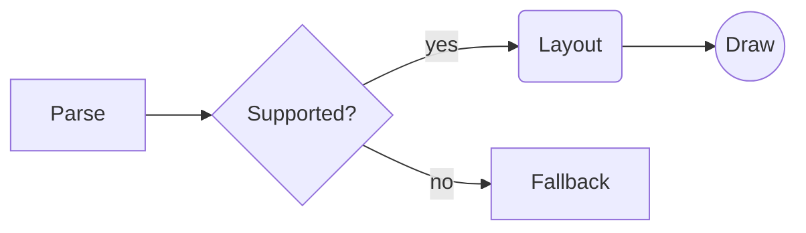
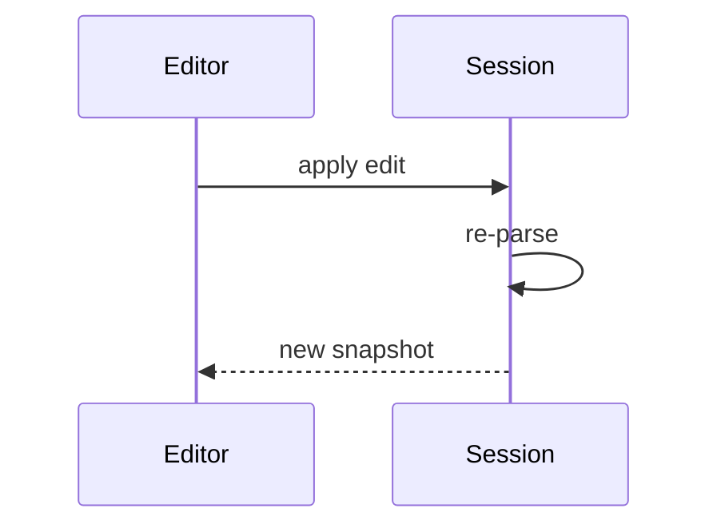
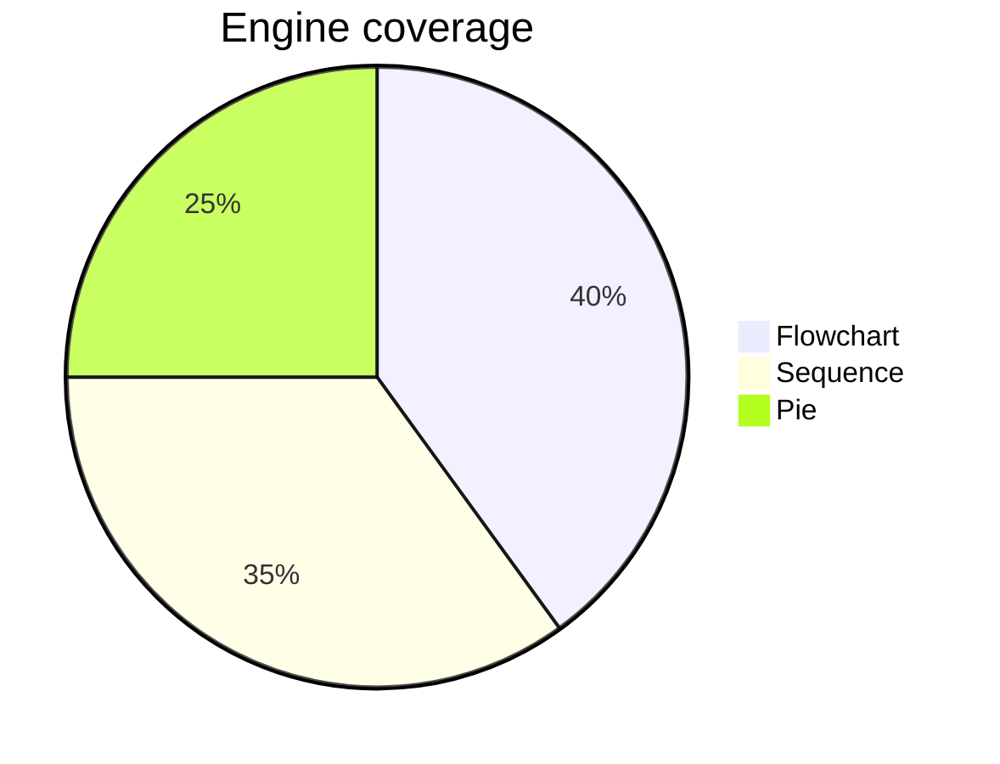

# Native Engines

Inline math like $e^{i\pi} + 1 = 0$ and $\alpha \leq \sum x_i^2$ sits in the text.

$$
\int_0^1 x^2 \, dx = \frac{1}{3}
$$

Display-style operators take their limits above and below:

$$
\sum_{i=1}^{n} i = \frac{n(n+1)}{2}
$$

