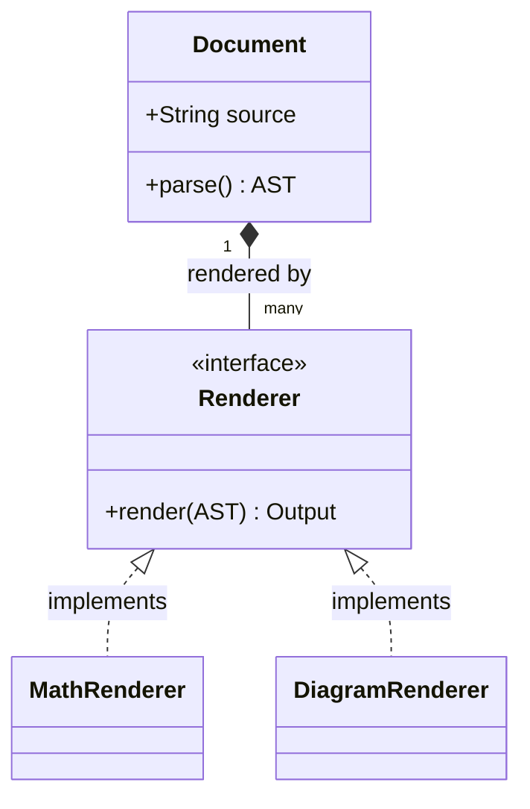
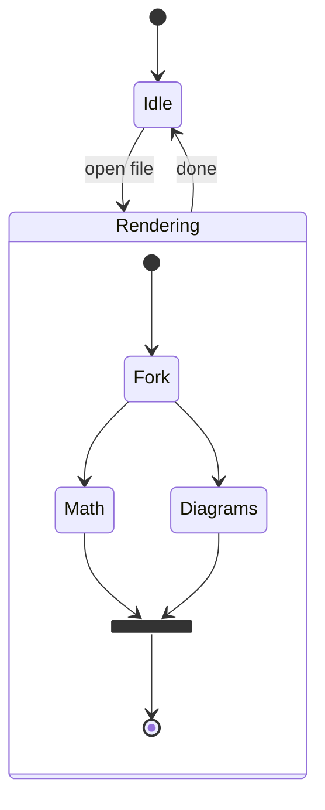

# Native Diagrams

```mermaid
classDiagram
    class Document {
        +String source
        +parse() AST
    }
    class Renderer {
        <<interface>>
        +render(AST) Output
    }
    Document "1" *-- "many" Renderer : rendered by
    Renderer <|.. MathRenderer : implements
    Renderer <|.. DiagramRenderer : implements
```

```mermaid
stateDiagram-v2
    [*] --> Idle
    Idle --> Rendering : open file
    state Rendering {
      [*] --> Fork
      state Fork <<fork>>
      Fork --> Math
      Fork --> Diagrams
      state Join <<join>>
      Math --> Join
      Diagrams --> Join
      Join --> [*]
    }
    Rendering --> Idle : done
```
