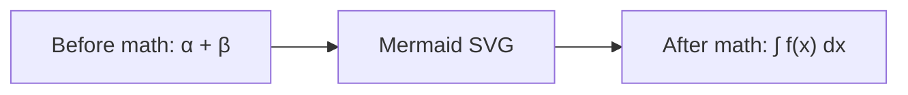

# Math (inline, display & MathJax gallery)

> Inline and block math in both $…$ and \[…\] delimiters; matrices, cases, aligned environments, greek, fractions, big operators.

### 13.1 Inline and Block Math

Inline math: $E = mc^2$, $a^2 + b^2 = c^2$, and $\frac{1}{\sqrt{2\pi\sigma^2}}e^{-\frac{(x-\mu)^2}{2\sigma^2}}$.

Block math:

$$
\nabla \cdot \mathbf{E} = \frac{\rho}{\varepsilon_0}
$$

KaTeX-style fenced math:

```math
\int_{-\infty}^{\infty} e^{-x^2}\,dx = \sqrt{\pi}
```


## 19. Extreme MathJax / TeX Gallery

This section mixes CommonMark, GFM, MathJax, TeX, LaTeX-style environments, raw MathML, and fenced math-ish code. Some renderers only support MathJax when explicitly configured. Unsupported syntax should remain readable rather than breaking the Markdown document.

### 19.1 Math Delimiter Coverage

Inline with backslash delimiters: \(E = mc^2\), \(a^2 + b^2 = c^2\), and \(\nabla \cdot \vec{E} = \rho/\varepsilon_0\).

Inline with dollar delimiters, if enabled: $\sum_{k=1}^{n} k = \frac{n(n+1)}{2}$ and $f(x)=\int_{-\infty}^{x} e^{-t^2}\,dt$.

Display with backslash-square delimiters:

\[
\int_{0}^{1} x^p(1-x)^q\,dx = \frac{\Gamma(p+1)\Gamma(q+1)}{\Gamma(p+q+2)}
\]

Display with double-dollar delimiters:

$$
\lim_{n\to\infty}\left(1 + \frac{x}{n}\right)^n = e^x
$$

Currency collision test: this costs \$2.50, not math, while `$x + y$` inside code should not typeset.

### 19.2 Basic Symbols, Greek, Relations, Operators

\[
\alpha, \beta, \gamma, \delta, \epsilon, \varepsilon, \zeta, \eta, \theta, \vartheta, \lambda, \mu, \pi, \rho, \sigma, \tau, \phi, \varphi, \omega
\]

\[
\forall x \in \mathbb{R},\quad \exists y \in \mathbb{C}:\quad x \le y \iff x-y \le 0
\]

\[
A \subseteq B \subsetneq C,\qquad A \cup B,\quad A \cap B,\quad A \setminus B,\quad A \triangle B
\]

\[
\sum_{i=1}^{n} i^2 = \frac{n(n+1)(2n+1)}{6},\qquad
\prod_{k=1}^{n} k = n!
\]

### 19.3 Fractions, Roots, Scripts, Stacked Accents

\[
\frac{\sqrt[3]{x^2 + y^2}}{1 + \frac{1}{1+\frac{1}{1+x}}}
\]

\[
\hat{x},\ \bar{x},\ \vec{x},\ \tilde{x},\ \dot{x},\ \ddot{x},\ \widehat{ABC},\ \overline{z_1z_2}
\]

\[
{}^{235}_{92}\mathrm{U} + {}^{1}_{0}\mathrm{n} \longrightarrow {}^{141}_{56}\mathrm{Ba} + {}^{92}_{36}\mathrm{Kr} + 3{}^{1}_{0}\mathrm{n}
\]

### 19.4 Alignment Environments

\[
\begin{aligned}
  (x+y)^2 &= x^2 + 2xy + y^2 \\
  (x-y)^2 &= x^2 - 2xy + y^2 \\
  x^2-y^2 &= (x-y)(x+y)
\end{aligned}
\]

\[
\begin{align}
  \nabla \cdot \mathbf{E} &= \frac{\rho}{\varepsilon_0} &
  \nabla \cdot \mathbf{B} &= 0 \\
  \nabla \times \mathbf{E} &= -\frac{\partial \mathbf{B}}{\partial t} &
  \nabla \times \mathbf{B} &= \mu_0\mathbf{J}+\mu_0\varepsilon_0\frac{\partial\mathbf{E}}{\partial t}
\end{align}
\]

\[
\begin{alignedat}{3}
  a_1 &= b_1 + c_1,\qquad & a_2 &= b_2 + c_2,\qquad & a_3 &= b_3 + c_3 \\
  x_1 &= y_1 - z_1,       & x_2 &= y_2 - z_2,       & x_3 &= y_3 - z_3
\end{alignedat}
\]

### 19.5 Cases and Piecewise Functions

\[
f(x)=
\begin{cases}
  -1, & x < 0, \\
  0, & x = 0, \\
  x^2\sin\left(\frac{1}{x}\right), & x > 0.
\end{cases}
\]

\[
\operatorname{sgn}(x)=
\begin{cases}
  -1 & \text{if } x<0,\\
   0 & \text{if } x=0,\\
   1 & \text{if } x>0.
\end{cases}
\]

### 19.6 Matrices and Arrays

\[
\begin{matrix}
1 & 2 & 3 \\
4 & 5 & 6 \\
7 & 8 & 9
\end{matrix}
\qquad
\begin{pmatrix}
a & b \\
c & d
\end{pmatrix}
\qquad
\begin{bmatrix}
\alpha & \beta \\
\gamma & \delta
\end{bmatrix}
\]

\[
\begin{vmatrix}
a & b \\
c & d
\end{vmatrix}
= ad-bc
\qquad
\begin{Vmatrix}
\vec{u} & \vec{v}
\end{Vmatrix}
\]

\[
\left[
\begin{array}{c|ccc}
 & x_1 & x_2 & x_3 \\
\hline
r_1 & 1 & 0 & 0 \\
r_2 & 0 & 1 & 0 \\
r_3 & 0 & 0 & 1
\end{array}
\right]
\]

### 19.7 Determinants, Linear Algebra, Eigenvalues

\[
A = Q\Lambda Q^{-1},\qquad
\det(A-\lambda I)=0,\qquad
\mathbf{x}^{\mathsf{T}}A\mathbf{x} > 0
\]

\[
\begin{bmatrix}
2 & -1 & 0 \\
-1 & 2 & -1 \\
0 & -1 & 2
\end{bmatrix}
\begin{bmatrix}
x_1\\x_2\\x_3
\end{bmatrix}
=
\begin{bmatrix}
1\\0\\1
\end{bmatrix}
\]

\[
\left\lVert \mathbf{x} \right\rVert_2 = \sqrt{\sum_{i=1}^{n} x_i^2},\qquad
\left\langle u, v \right\rangle = \int_a^b u(t)v(t)\,dt
\]

### 19.8 Calculus, Limits, Integrals, Series

\[
\frac{d}{dx}\left[x^x\right] = x^x(\ln x + 1)
\]

\[
\int_{-\infty}^{\infty} e^{-x^2}\,dx = \sqrt{\pi}
\]

\[
\oint_{\partial \Omega} \mathbf{F}\cdot d\mathbf{r}
= \iint_{\Omega} \left(\frac{\partial Q}{\partial x} - \frac{\partial P}{\partial y}\right)\,dA
\]

\[
\sum_{n=0}^{\infty} \frac{x^n}{n!}=e^x,
\qquad
\sum_{n=1}^{\infty}\frac{1}{n^2}=\frac{\pi^2}{6}
\]

### 19.9 Probability and Statistics

\[
P(A\mid B)=\frac{P(B\mid A)P(A)}{P(B)}
\]

\[
X \sim \mathcal{N}(\mu,\sigma^2),\qquad
f_X(x)=\frac{1}{\sigma\sqrt{2\pi}}\exp\left(-\frac{(x-\mu)^2}{2\sigma^2}\right)
\]

\[
\mathbb{E}[X]=\sum_x x\,p(x),\qquad
\operatorname{Var}(X)=\mathbb{E}[X^2]-\mathbb{E}[X]^2
\]

### 19.10 Logic, Inference, Type Rules

\[
\frac{\Gamma \vdash e_1 : \tau_1 \to \tau_2 \qquad \Gamma \vdash e_2 : \tau_1}
     {\Gamma \vdash e_1\ e_2 : \tau_2}
\quad\text{T-App}
\]

\[
\begin{array}{c}
P \Rightarrow Q \\
Q \Rightarrow R \\
\hline
P \Rightarrow R
\end{array}
\qquad
\neg(P\land Q) \equiv \neg P \lor \neg Q
\]

### 19.11 Commutative-Diagram-ish Array

\[
\begin{array}{ccc}
A & \xrightarrow{f} & B \\
\downarrow^{g} & & \downarrow^{h} \\
C & \xrightarrow{k} & D
\end{array}
\qquad
h\circ f = k\circ g
\]

### 19.12 Braces, Delimiters, Over/Under Annotations

\[
\left\{\frac{a}{b}\right\}_{b\ne 0},\qquad
\left\langle \frac{x+y}{2}, \sqrt{xy} \right\rangle,
\qquad
\left.\frac{d}{dx}f(x)\right|_{x=0}
\]

\[
\overbrace{1+1+\cdots+1}^{n\text{ times}} = n,
\qquad
\underbrace{x+x+\cdots+x}_{m\text{ times}} = mx
\]

### 19.13 Text, Fonts, Colors, Spacing

\[
\text{plain text inside math},\quad
\mathrm{roman},\quad
\mathit{italic},\quad
\mathbf{bold},\quad
\mathsf{sans},\quad
\mathtt{mono},\quad
\mathcal{C},\quad
\mathfrak{g},\quad
\mathbb{R}
\]

\[
\color{red}{x} + \color{blue}{y} = \color{purple}{z},\qquad
x\,y\;z\quad w\qquad q
\]

### 19.14 Custom Macros and Operators

\[
\newcommand{\vect}[1]{\mathbf{#1}}
\newcommand{\RR}{\mathbb{R}}
\newcommand{\inner}[2]{\left\langle #1,#2 \right\rangle}
\DeclareMathOperator{\argmax}{arg\,max}
\vect{x}\in\RR^n,\qquad
\inner{\vect{x}}{\vect{y}} = \sum_{i=1}^{n}x_i y_i,\qquad
\argmax_{x\in\RR} f(x)
\]

Macro reuse test in a later paragraph: \(\vect{z}\in\RR^3\) should render only if macro definitions persist across math items in the renderer configuration.

### 19.15 Equation Numbering and Tags

\[
\begin{equation}
  a^2+b^2=c^2
  \tag{Pythagoras}
\end{equation}
\]

\[
\begin{align}
  f(x) &= x^2 + 1 \tag{A1}\\
  f'(x) &= 2x \tag{A2}
\end{align}
\]

### 19.16 Long Equation Stress

\[
\begin{aligned}
L(\theta) ={}& \sum_{i=1}^{n}\log p_\theta(y_i\mid x_i)
- \lambda_1\sum_{j=1}^{m}|\theta_j|
- \lambda_2\sqrt{\sum_{j=1}^{m}\theta_j^2}
+ \int_{\Omega}\left(\nabla\cdot \mathbf{F}_\theta\right)^2\,d\Omega \\
&+ \operatorname{KL}\left(q_\phi(z\mid x)\,\middle\|\,p_\theta(z)\right)
+ \mathbb{E}_{z\sim q_\phi}\left[\log p_\theta(x\mid z)\right]
\end{aligned}
\]

### 19.17 Fenced Math Code Block

Some Markdown renderers support fenced `math`; others show it as a code block. Either result is acceptable for a stress fixture if the page remains stable.

```math
\begin{aligned}
  \mathrm{softmax}(x_i) &= \frac{e^{x_i}}{\sum_j e^{x_j}} \\
  \nabla_x \log \sum_j e^{x_j} &= \mathrm{softmax}(x)
\end{aligned}
```

### 19.18 Fenced TeX / LaTeX Source Blocks

```tex
\documentclass{article}
\usepackage{amsmath,amssymb}
\begin{document}
\[
  \forall \epsilon > 0,\ \exists \delta > 0:\ |x-a|<\delta \Rightarrow |f(x)-f(a)|<\epsilon.
\]
\end{document}
```

```latex
\begin{align*}
  y &= mx+b \\
  \frac{\partial y}{\partial m} &= x
\end{align*}
```

### 19.19 AsciiMath-ish Text

AsciiMath often requires explicit MathJax configuration. This line is intentionally code-like: `sum_(i=1)^n i^3=((n(n+1))/2)^2`.

```asciimath
sum_(i=1)^n i^3=((n(n+1))/2)^2
sqrt(x^2+y^2)
```

### 19.20 Raw MathML Block

<math xmlns="http://www.w3.org/1998/Math/MathML" display="block">
  <mrow>
    <mi>f</mi>
    <mo stretchy="false">(</mo>
    <mi>x</mi>
    <mo stretchy="false">)</mo>
    <mo>=</mo>
    <msubsup>
      <mo>∫</mo>
      <mn>0</mn>
      <mi>∞</mi>
    </msubsup>
    <msup>
      <mi>e</mi>
      <mrow><mo>−</mo><mi>x</mi></mrow>
    </msup>
    <mi>d</mi><mi>x</mi>
  </mrow>
</math>

### 19.21 HTML + Math Boundary Stress

<div class="math-boundary-test">
  <p>Math inside raw HTML paragraph: \(x^2+y^2=z^2\). Some processors skip math inside raw HTML blocks.</p>
  <p>Dollar signs in HTML: $not always math$ and escaped \$9.99.</p>
</div>

### 19.22 Markdown Inside Math Boundaries Should Not Parse as Markdown

\[
\text{This is not **bold** and not a [link](https://example.com) inside math.}
\]

And math inside Markdown emphasis should behave predictably: **bold text with \(x+y\)**, *italic text with $a/b$*, and `code with \(not math\)`.

### 19.23 Bad Math That Should Fail Locally

The following invalid TeX is inside a plain code block, so it should never crash a MathJax pass:

```text
\[
\begin{broken}
  x +
\end{not-the-same}
\]
```

The next display intentionally has a recoverable TeX issue in many renderers. A robust renderer should isolate the error visually without breaking the document after it.

\[
\frac{1}{\text{missing maybe?}}
\]

### 19.24 MathJax Stress Table

| Feature | Inline sample | Display-heavy sample |
| --- | --- | --- |
| Greek | \(\alpha+\beta\) | \[\Gamma(z)=\int_0^\infty t^{z-1}e^{-t}\,dt\] |
| Sets | \(x\in A\cap B\) | \[A\times B=\{(a,b):a\in A,b\in B\}\] |
| Probability | \(P(A\mid B)\) | \[P(A\cup B)=P(A)+P(B)-P(A\cap B)\] |
| Matrix | \(\begin{smallmatrix}1&2\\3&4\end{smallmatrix}\) | \[\begin{bmatrix}1&2\\3&4\end{bmatrix}\] |
| Text | \(\text{hello}\) | \[\text{Markdown markers like ** do not apply here}\] |

### 19.25 Mixed Mermaid + MathJax Prose

A renderer that does incremental hydration should avoid race conditions where Mermaid alters the DOM while MathJax scans it. For example, the text before a diagram contains math \(\alpha + \beta\), the diagram follows, and then display math follows.



\[
\int_0^{2\pi}\sin(x)\,dx = 0
\]

### 19.26 MathJax Visual Regression Checklist

- Inline baseline alignment: text before \(\frac{1}{2}\) text after.
- Display centering and overflow: \[\sum_{i=1}^{100} \frac{1}{i}\]
- SVG/CHTML output should not overlap following paragraphs.
- Tables containing math should not double-render or escape backslashes.
- Code spans containing TeX delimiters, like `\(x\)`, should remain code.
- Escaped currency should remain text: \$1, \$2, and \$3.

---

