# Mermaid Diagram Gallery

> Flowchart, sequence, class, ER, state (native); the full extreme gallery including types that degrade to a tidy source card.

### 13.2 Mermaid Diagram

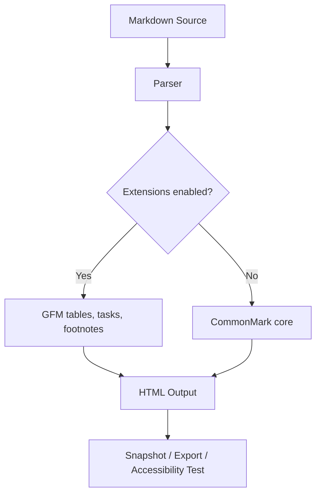
```mermaid
flowchart TD
    A[Markdown Source] --> B[Parser]
    B --> C{Extensions enabled?}
    C -->|Yes| D[GFM tables, tasks, footnotes]
    C -->|No| E[CommonMark core]
    D --> F[HTML Output]
    E --> F
    F --> G[Snapshot / Export / Accessibility Test]
```

### 13.3 Sequence Diagram

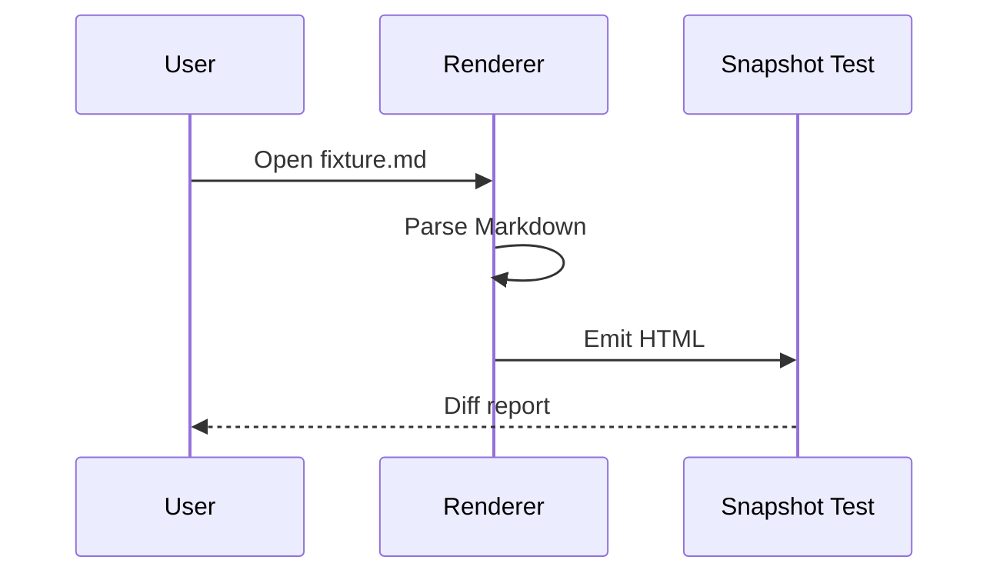
```mermaid
sequenceDiagram
    participant U as User
    participant R as Renderer
    participant S as Snapshot Test
    U->>R: Open fixture.md
    R->>R: Parse Markdown
    R->>S: Emit HTML
    S-->>U: Diff report
```


## 18. Extreme Mermaid Diagram Gallery

This section is intentionally much broader than the small Mermaid sample earlier in the file. It targets the Mermaid 11.16-era diagram catalog, including stable diagram types, experimental/beta diagram types, and compatibility aliases. A Markdown renderer should either render these diagrams, preserve them as legible fenced code blocks, or fail gracefully without corrupting the surrounding document.

### 18.1 Mermaid Feature Coverage Checklist

| Diagram family | Fence included | Notes |
| --- | :---: | --- |
| Flowchart / graph | ✅ | Standard flowchart plus shape, edge, class, subgraph, and config stress. |
| Swimlanes | ✅ | Mermaid `swimlane-beta`, new in Mermaid 11.16+. |
| Sequence | ✅ | Actors, participants, autonumber, loops, branches, parallel blocks, critical/break, notes. |
| Class | ✅ | Classes, annotations, namespaces, cardinality, methods, notes. |
| State | ✅ | Composite states, choices, forks/joins, terminal states. |
| Entity Relationship | ✅ | Attributes, keys, cardinality. |
| User Journey | ✅ | Sections, actors, scores. |
| Gantt | ✅ | Dates, dependencies, milestones, critical/done/active states. |
| Pie | ✅ | `showData`, quoted labels. |
| Quadrant | ✅ | Quadrant labels and weighted points. |
| Requirement | ✅ | Requirements, functional/performance/interface requirements, elements, relationships. |
| GitGraph | ✅ | Branches, checkouts, merges, tags, cherry-pick. |
| C4 | ✅ | Context, Container, Component, Dynamic, and Deployment examples. |
| Mindmap | ✅ | Indentation hierarchy and odd labels. |
| Timeline | ✅ | Sections and multiple events. |
| ZenUML | ✅ | Alternate sequence syntax, loops, branches. |
| Sankey | ✅ | CSV-like rows, commas, quoted labels. |
| XY Chart | ✅ | Bar/line series and labels. |
| Block | ✅ | Columns, blocks, edges. |
| Packet | ✅ | Packet field ranges and bit-count syntax. |
| Kanban | ✅ | Columns, tasks, metadata, priorities. |
| Architecture | ✅ | Groups, services, junctions, directional edges. |
| Radar | ✅ | Axes, multiple curves, keyed values. |
| Event Modeling | ✅ | Timeline frames and inline data. |
| Treemap | ✅ | Indentation hierarchy, values, classes. |
| Venn | ✅ | Sets, unions, labels, sizes. |
| Ishikawa | ✅ | Fishbone indentation hierarchy. |
| Wardley | ✅ | Anchors, components, evolution, notes. |
| Cynefin | ✅ | Domains, items, transitions. |
| TreeView | ✅ | Directory-like hierarchy, annotations, optional icons. |

### 18.2 Mermaid Initialization Directive Stress

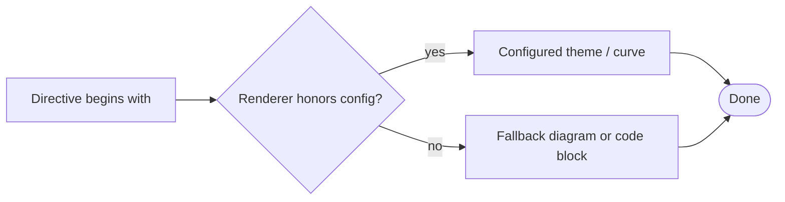
```mermaid
%%{init: {"theme": "base", "look": "classic", "flowchart": {"htmlLabels": true, "curve": "basis"}}}%%
flowchart LR
    accTitle: Mermaid init directive stress test
    accDescr: Tests a Mermaid init directive embedded inside a fenced code block.
    A["Directive begins with %%{init: ... }%%"] --> B{"Renderer honors config?"}
    B -->|yes| C["Configured theme / curve"]
    B -->|no| D["Fallback diagram or code block"]
    C --> E([Done])
    D --> E
```

### 18.3 Flowchart — Complex Shapes, Subgraphs, Classes, Markdown-ish Labels

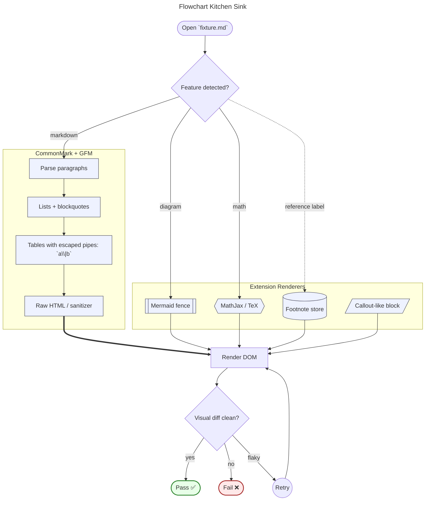
```mermaid
---
title: Flowchart Kitchen Sink
config:
  layout: dagre
  look: classic
---
flowchart TB
    accTitle: Complex Markdown renderer pipeline
    accDescr: A flowchart with subgraphs, branches, edge labels, custom classes, and escaped characters.

    Start(["Open `fixture.md`"]) --> Detect{"Feature detected?"}

    subgraph MD["CommonMark + GFM"]
      direction TB
      P["Parse paragraphs"] --> L["Lists + blockquotes"]
      L --> T["Tables with escaped pipes: `a\\|b`"]
      T --> H["Raw HTML / sanitizer"]
    end

    subgraph EXT["Extension Renderers"]
      direction TB
      M[["Mermaid fence"]]
      X{{"MathJax / TeX"}}
      F[("Footnote store")]
      C[/"Callout-like block"/]
    end

    Detect -->|markdown| P
    Detect -->|diagram| M
    Detect -->|math| X
    Detect -.->|reference label| F
    H ==> Render["Render DOM"]
    M --> Render
    X --> Render
    F --> Render
    C --> Render
    Render --> Audit{"Visual diff clean?"}
    Audit -->|yes| Pass(["Pass ✅"])
    Audit -->|no| Fail(["Fail ❌"])
    Audit -->|flaky| Retry(("Retry")) --> Render

    classDef hot fill:#ffe8e8,stroke:#a33,stroke-width:2px;
    classDef ok fill:#e8ffe8,stroke:#383,stroke-width:2px;
    classDef neutral fill:#eef2ff,stroke:#445,stroke-width:1px;
    class Fail hot;
    class Pass ok;
    class P,L,T,H,M,X,F,C neutral;
```

### 18.4 Graph Alias Compatibility

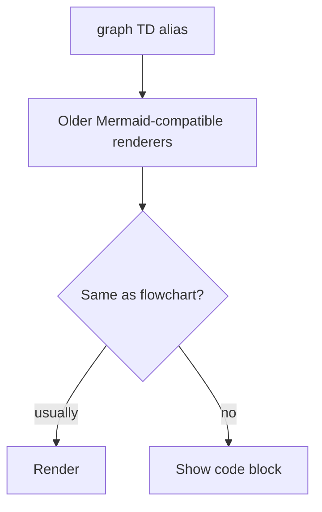
```mermaid
graph TD
    A[graph TD alias] --> B[Older Mermaid-compatible renderers]
    B --> C{Same as flowchart?}
    C -->|usually| D[Render]
    C -->|no| E[Show code block]
```

### 18.5 Swimlanes — Cross-Team Responsibility Flow

```mermaid
swimlane-beta LR
    accTitle: Swimlane support workflow
    accDescr: A support request moving across customer, support, engineering, and release lanes.

    subgraph customer["Customer"]
      C0(["Reports rendering bug"])
      C1["Confirms fix"]
    end

    subgraph support["Support"]
      S0["Triage reproduction"]
      S1{"Needs engineering?"}
    end

    subgraph engineering["Engineering"]
      E0["Write failing fixture"]
      E1["Patch parser"]
      E2["Add regression test"]
    end

    subgraph release["Release"]
      R0["Canary deploy"]
      R1(["Stable release"])
    end

    C0 --> S0 --> S1
    S1 -->|yes, attach fixture| E0 --> E1 --> E2 --> R0 --> C1 --> R1
    S1 -->|no, docs issue| R1
```

### 18.6 Sequence Diagram — Autonumber, Actors, Branches, Parallelism, Critical Blocks

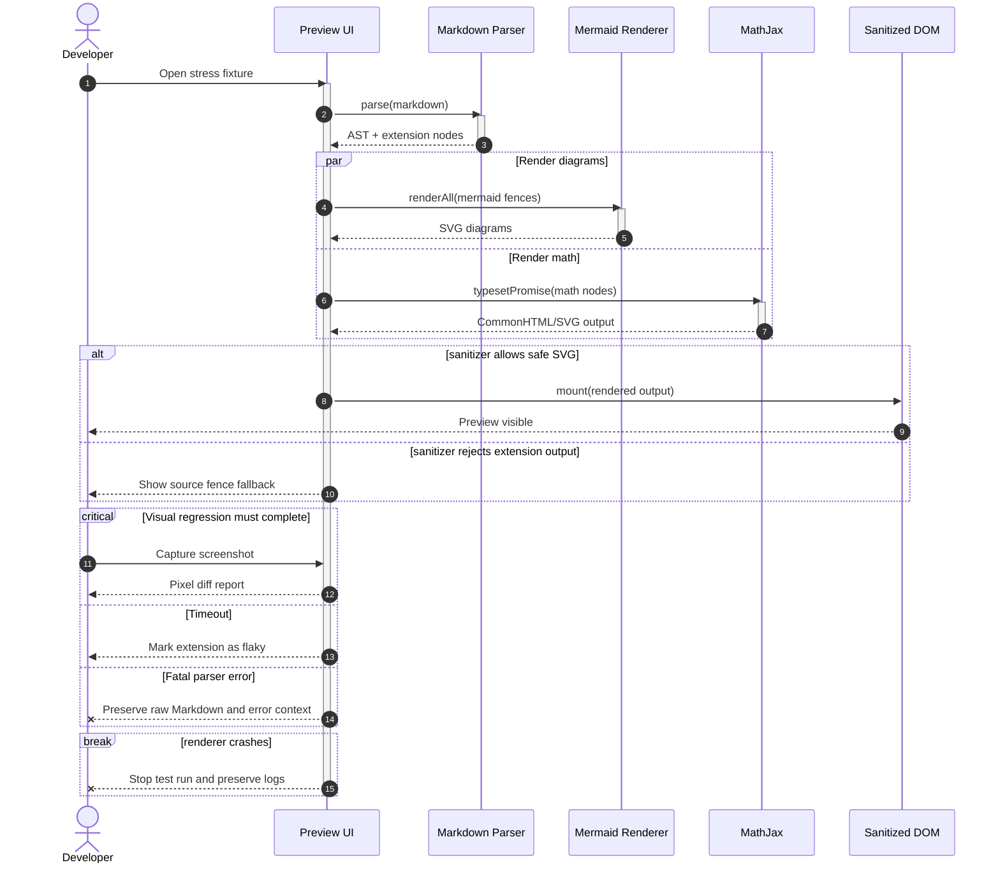
```mermaid
%%{init: {"sequence": {"showSequenceNumbers": true}}}%%
sequenceDiagram
    autonumber
    actor Dev as Developer
    participant UI as Preview UI
    participant Parser as Markdown Parser
    participant Mermaid as Mermaid Renderer
    participant Math as MathJax
    participant DOM as Sanitized DOM

    Dev->>UI: Open stress fixture
    activate UI
    UI->>Parser: parse(markdown)
    activate Parser
    Parser-->>UI: AST + extension nodes
    deactivate Parser

    par Render diagrams
        UI->>Mermaid: renderAll(mermaid fences)
        activate Mermaid
        Mermaid-->>UI: SVG diagrams
        deactivate Mermaid
    and Render math
        UI->>Math: typesetPromise(math nodes)
        activate Math
        Math-->>UI: CommonHTML/SVG output
        deactivate Math
    end

    alt sanitizer allows safe SVG
        UI->>DOM: mount(rendered output)
        DOM-->>Dev: Preview visible
    else sanitizer rejects extension output
        UI-->>Dev: Show source fence fallback
    end

    critical Visual regression must complete
        Dev->>UI: Capture screenshot
        UI-->>Dev: Pixel diff report
    option Timeout
        UI-->>Dev: Mark extension as flaky
    option Fatal parser error
        UI--xDev: Preserve raw Markdown and error context
    end

    break renderer crashes
        UI--xDev: Stop test run and preserve logs
    end

    deactivate UI
```

### 18.7 Class Diagram — Namespaces, Annotations, Cardinality, Notes

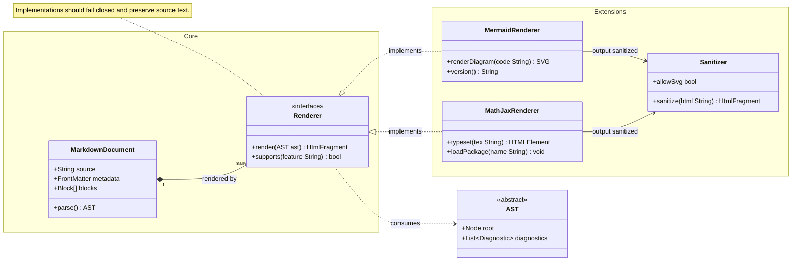
```mermaid
classDiagram
    direction LR

    namespace Core {
      class MarkdownDocument {
        +String source
        +FrontMatter metadata
        +Block[] blocks
        +parse() AST
      }

      class Renderer {
        <<interface>>
        +render(AST ast) HtmlFragment
        +supports(feature String) bool
      }
    }

    namespace Extensions {
      class MermaidRenderer {
        +renderDiagram(code String) SVG
        +version() String
      }
      class MathJaxRenderer {
        +typeset(tex String) HTMLElement
        +loadPackage(name String) void
      }
      class Sanitizer {
        +allowSvg bool
        +sanitize(html String) HtmlFragment
      }
    }

    MarkdownDocument "1" *-- "many" Renderer : rendered by
    Renderer <|.. MermaidRenderer : implements
    Renderer <|.. MathJaxRenderer : implements
    MermaidRenderer --> Sanitizer : output sanitized
    MathJaxRenderer --> Sanitizer : output sanitized
    Renderer ..> AST : consumes

    class AST {
      <<abstract>>
      +Node root
      +List~Diagnostic~ diagnostics
    }

    note for Renderer "Implementations should fail closed and preserve source text."
```

### 18.8 State Diagram — Composite States, Choices, Forks, Joins

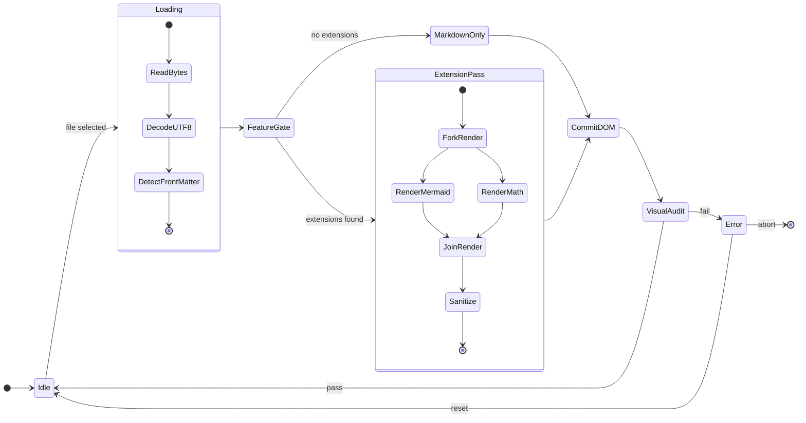
```mermaid
stateDiagram-v2
    direction LR
    [*] --> Idle
    Idle --> Loading : file selected

    state Loading {
      [*] --> ReadBytes
      ReadBytes --> DecodeUTF8
      DecodeUTF8 --> DetectFrontMatter
      DetectFrontMatter --> [*]
    }

    Loading --> FeatureGate
    state FeatureGate <<choice>>
    FeatureGate --> MarkdownOnly : no extensions
    FeatureGate --> ExtensionPass : extensions found

    state ExtensionPass {
      [*] --> ForkRender
      state ForkRender <<fork>>
      ForkRender --> RenderMermaid
      ForkRender --> RenderMath
      RenderMermaid --> JoinRender
      RenderMath --> JoinRender
      state JoinRender <<join>>
      JoinRender --> Sanitize
      Sanitize --> [*]
    }

    MarkdownOnly --> CommitDOM
    ExtensionPass --> CommitDOM
    CommitDOM --> VisualAudit
    VisualAudit --> Idle : pass
    VisualAudit --> Error : fail
    Error --> Idle : reset
    Error --> [*] : abort
```

### 18.9 Entity Relationship Diagram — Markdown Fixture Schema

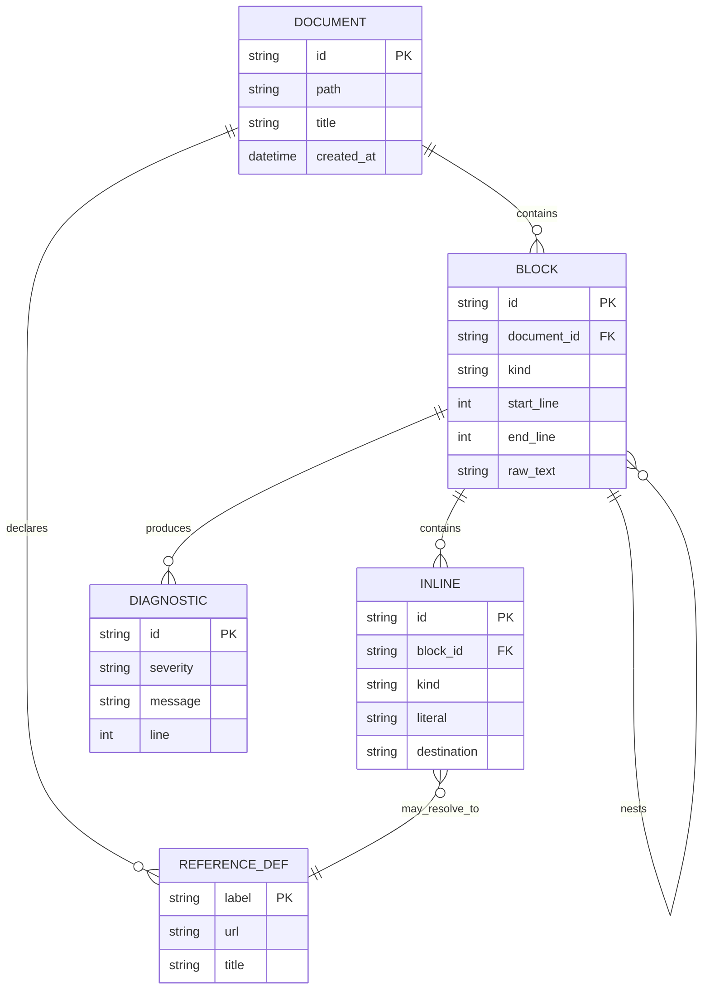
```mermaid
erDiagram
    DOCUMENT ||--o{ BLOCK : contains
    DOCUMENT ||--o{ REFERENCE_DEF : declares
    BLOCK ||--o{ INLINE : contains
    BLOCK ||--o{ BLOCK : nests
    INLINE }o--|| REFERENCE_DEF : may_resolve_to
    BLOCK ||--o{ DIAGNOSTIC : produces

    DOCUMENT {
      string id PK
      string path
      string title
      datetime created_at
    }

    BLOCK {
      string id PK
      string document_id FK
      string kind
      int start_line
      int end_line
      string raw_text
    }

    INLINE {
      string id PK
      string block_id FK
      string kind
      string literal
      string destination
    }

    REFERENCE_DEF {
      string label PK
      string url
      string title
    }

    DIAGNOSTIC {
      string id PK
      string severity
      string message
      int line
    }
```

### 18.10 User Journey — Renderer Developer Experience

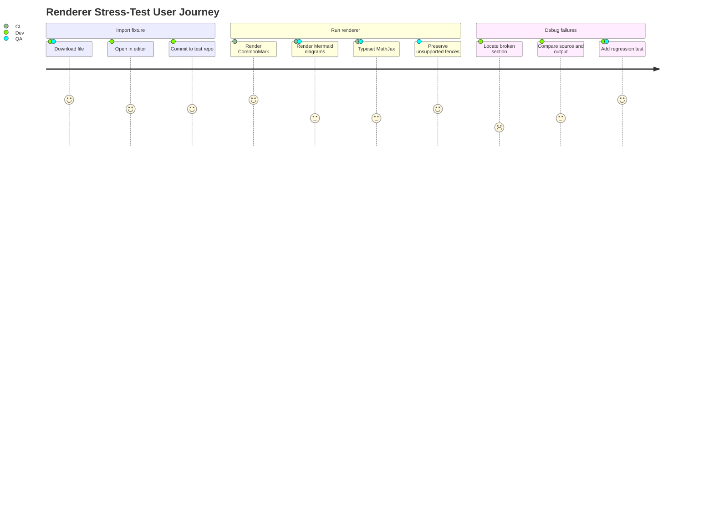
```mermaid
journey
    title Renderer Stress-Test User Journey
    section Import fixture
      Download file: 5: Dev, QA
      Open in editor: 4: Dev
      Commit to test repo: 4: Dev
    section Run renderer
      Render CommonMark: 5: CI
      Render Mermaid diagrams: 3: CI, QA
      Typeset MathJax: 3: CI, QA
      Preserve unsupported fences: 4: QA
    section Debug failures
      Locate broken section: 2: Dev
      Compare source and output: 3: Dev
      Add regression test: 5: Dev, QA
```

### 18.11 Gantt — Renderer Hardening Plan

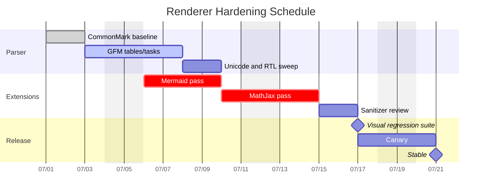
```mermaid
gantt
    title Renderer Hardening Schedule
    dateFormat  YYYY-MM-DD
    axisFormat  %m/%d
    excludes    weekends

    section Parser
    CommonMark baseline       :done,    cm, 2026-07-01, 2d
    GFM tables/tasks          :active,  gfm, after cm, 3d
    Unicode and RTL sweep     :         uni, after gfm, 2d

    section Extensions
    Mermaid pass              :crit,    mer, 2026-07-06, 4d
    MathJax pass              :crit,    mj,  after mer, 3d
    Sanitizer review          :         san, after mj, 2d

    section Release
    Visual regression suite   :milestone, vr, 2026-07-17, 0d
    Canary                    :         canary, after vr, 2d
    Stable                    :milestone, stable, after canary, 0d
```

### 18.12 Pie Chart — Fixture Composition

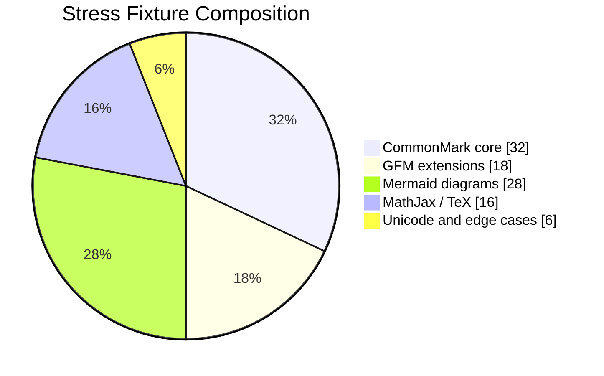
```mermaid
pie showData title Stress Fixture Composition
    "CommonMark core" : 32
    "GFM extensions" : 18
    "Mermaid diagrams" : 28
    "MathJax / TeX" : 16
    "Unicode and edge cases" : 6
```

### 18.13 Quadrant Chart — Risk vs. Complexity

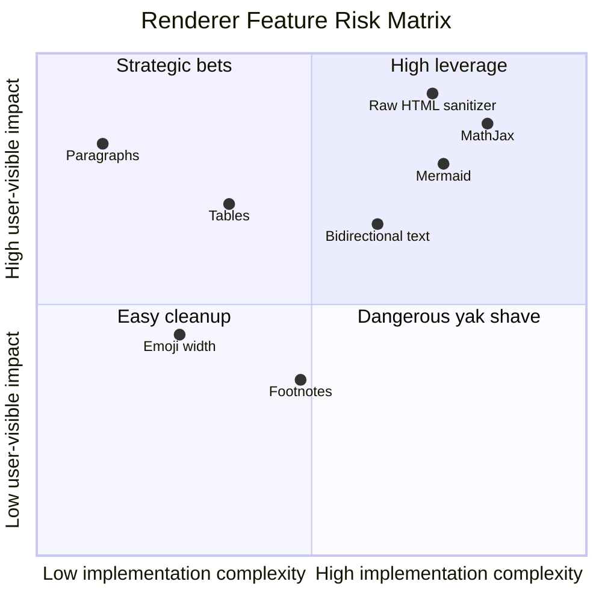
```mermaid
quadrantChart
    title Renderer Feature Risk Matrix
    x-axis Low implementation complexity --> High implementation complexity
    y-axis Low user-visible impact --> High user-visible impact
    quadrant-1 High leverage
    quadrant-2 Strategic bets
    quadrant-3 Easy cleanup
    quadrant-4 Dangerous yak shave
    "Paragraphs": [0.12, 0.82]
    "Tables": [0.35, 0.70]
    "Mermaid": [0.74, 0.78]
    "MathJax": [0.82, 0.86]
    "Raw HTML sanitizer": [0.72, 0.92]
    "Footnotes": [0.48, 0.35]
    "Emoji width": [0.26, 0.44]
    "Bidirectional text": [0.62, 0.66]
```

### 18.14 Requirement Diagram — Test Contract

```mermaid
requirementDiagram
    requirement commonmark_core {
      id: R-CORE-001
      text: Renderer shall preserve CommonMark block and inline semantics.
      risk: high
      verifymethod: test
    }

    functionalRequirement gfm_tables {
      id: R-GFM-002
      text: Renderer shall support GFM tables, task lists, autolinks, and strikethrough where enabled.
      risk: medium
      verifymethod: inspection
    }

    performanceRequirement large_doc {
      id: R-PERF-003
      text: Renderer shall render a large fixture without layout lockups.
      risk: medium
      verifymethod: demonstration
    }

    interfaceRequirement extension_fences {
      id: R-EXT-004
      text: Unsupported extension fences shall degrade to readable code blocks.
      risk: high
      verifymethod: test
    }

    element fixture_file {
      type: file
      docref: markdown_renderer_extreme_stress_test.md
    }

    element visual_diff {
      type: test
      docref: screenshot-baseline
    }

    fixture_file - satisfies -> commonmark_core
    fixture_file - satisfies -> gfm_tables
    fixture_file - satisfies -> extension_fences
    visual_diff - verifies -> large_doc
    visual_diff - verifies -> extension_fences
```

### 18.15 GitGraph — Renderer Release Branches

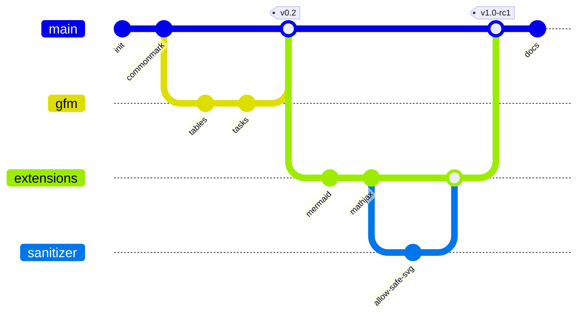
```mermaid
gitGraph
    commit id: "init"
    commit id: "commonmark"
    branch gfm
    checkout gfm
    commit id: "tables"
    commit id: "tasks"
    checkout main
    merge gfm tag: "v0.2"
    branch extensions
    checkout extensions
    commit id: "mermaid"
    commit id: "mathjax"
    branch sanitizer
    checkout sanitizer
    commit id: "allow-safe-svg"
    checkout extensions
    merge sanitizer
    checkout main
    merge extensions tag: "v1.0-rc1"
    commit id: "docs"
```

### 18.16 C4 Context Diagram

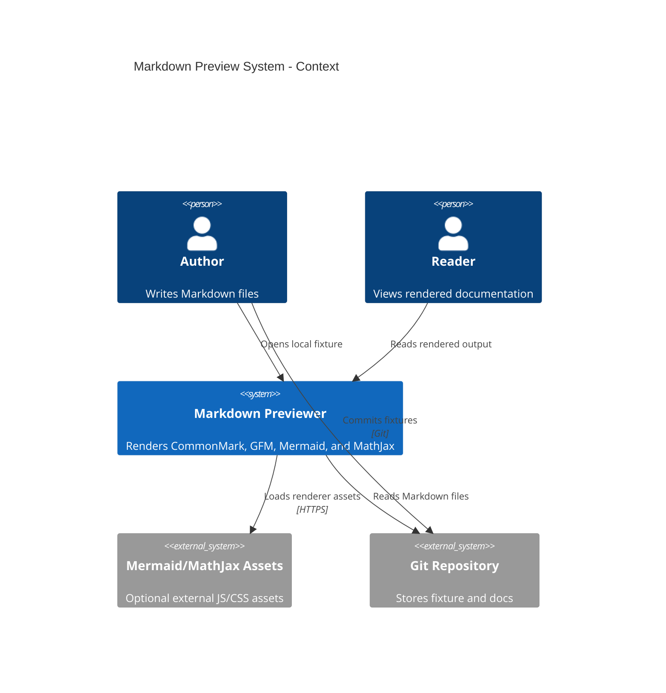
```mermaid
C4Context
    title Markdown Preview System - Context
    Person(author, "Author", "Writes Markdown files")
    Person(reader, "Reader", "Views rendered documentation")
    System(preview, "Markdown Previewer", "Renders CommonMark, GFM, Mermaid, and MathJax")
    System_Ext(cdn, "Mermaid/MathJax Assets", "Optional external JS/CSS assets")
    System_Ext(repo, "Git Repository", "Stores fixture and docs")

    Rel(author, preview, "Opens local fixture")
    Rel(reader, preview, "Reads rendered output")
    Rel(preview, cdn, "Loads renderer assets", "HTTPS")
    Rel(author, repo, "Commits fixtures", "Git")
    Rel(preview, repo, "Reads Markdown files")
```

### 18.17 C4 Container Diagram

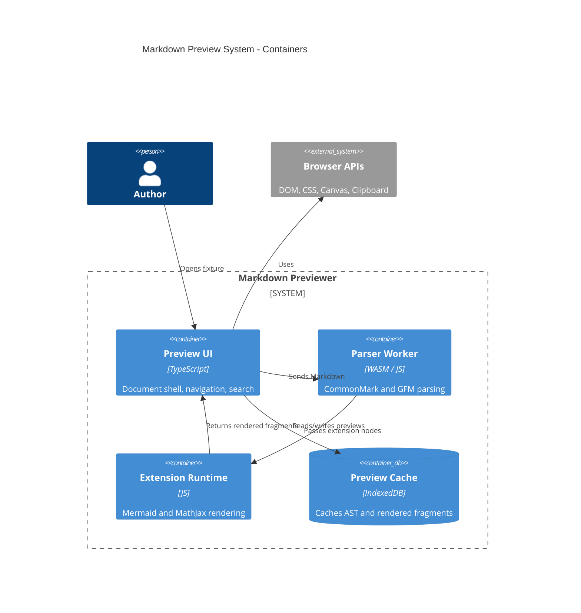
```mermaid
C4Container
    title Markdown Preview System - Containers
    Person(author, "Author")
    System_Boundary(system, "Markdown Previewer") {
      Container(ui, "Preview UI", "TypeScript", "Document shell, navigation, search")
      Container(parser, "Parser Worker", "WASM / JS", "CommonMark and GFM parsing")
      Container(ext, "Extension Runtime", "JS", "Mermaid and MathJax rendering")
      ContainerDb(cache, "Preview Cache", "IndexedDB", "Caches AST and rendered fragments")
    }
    System_Ext(browser, "Browser APIs", "DOM, CSS, Canvas, Clipboard")

    Rel(author, ui, "Opens fixture")
    Rel(ui, parser, "Sends Markdown")
    Rel(parser, ext, "Passes extension nodes")
    Rel(ext, ui, "Returns rendered fragments")
    Rel(ui, cache, "Reads/writes previews")
    Rel(ui, browser, "Uses")
```

### 18.18 C4 Component Diagram

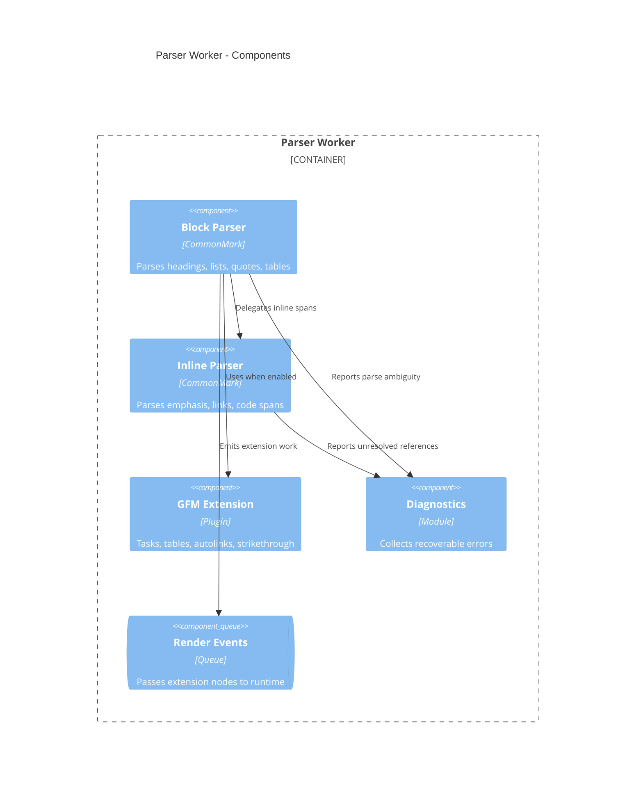
```mermaid
C4Component
    title Parser Worker - Components
    Container_Boundary(worker, "Parser Worker") {
      Component(block, "Block Parser", "CommonMark", "Parses headings, lists, quotes, tables")
      Component(inline, "Inline Parser", "CommonMark", "Parses emphasis, links, code spans")
      Component(gfm, "GFM Extension", "Plugin", "Tasks, tables, autolinks, strikethrough")
      Component(diag, "Diagnostics", "Module", "Collects recoverable errors")
      ComponentQueue(events, "Render Events", "Queue", "Passes extension nodes to runtime")
    }

    Rel(block, inline, "Delegates inline spans")
    Rel(block, gfm, "Uses when enabled")
    Rel(block, diag, "Reports parse ambiguity")
    Rel(inline, diag, "Reports unresolved references")
    Rel(block, events, "Emits extension work")
```

### 18.19 C4 Dynamic Diagram

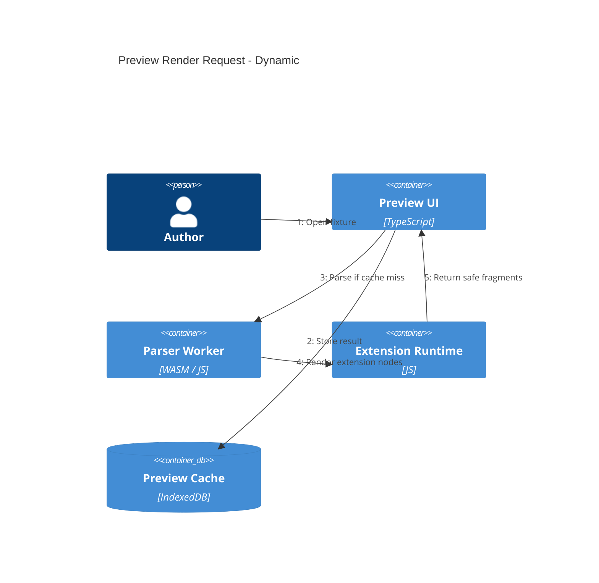
```mermaid
C4Dynamic
    title Preview Render Request - Dynamic
    Person(author, "Author")
    Container(ui, "Preview UI", "TypeScript")
    Container(parser, "Parser Worker", "WASM / JS")
    Container(ext, "Extension Runtime", "JS")
    ContainerDb(cache, "Preview Cache", "IndexedDB")

    RelIndex(1, author, ui, "Open fixture")
    RelIndex(2, ui, cache, "Check cached AST")
    RelIndex(3, ui, parser, "Parse if cache miss")
    RelIndex(4, parser, ext, "Render extension nodes")
    RelIndex(5, ext, ui, "Return safe fragments")
    RelIndex(6, ui, cache, "Store result")
```

### 18.20 C4 Deployment Diagram

```mermaid
C4Deployment
    title Markdown Previewer - Deployment
    Deployment_Node(local, "Developer Laptop", "macOS") {
      Deployment_Node(browser, "Browser", "Safari / Chrome") {
        Container(ui, "Preview UI", "TypeScript")
        Container(ext, "Extension Runtime", "Mermaid + MathJax")
      }
      Deployment_Node(fs, "Local Filesystem", "APFS") {
        ContainerDb(files, "Markdown Fixtures", "Files")
      }
    }

    Deployment_Node(ci, "CI Runner", "Linux") {
      Container(test, "Visual Regression Runner", "Playwright")
    }

    Rel(files, ui, "Loaded by")
    Rel(test, ui, "Captures screenshots")
```

### 18.21 Mindmap — Extension Surface Area

```mermaid
mindmap
  root((Markdown Renderer))
    CommonMark
      Blocks
        Paragraphs
        Lists
        Blockquotes
        Code fences
      Inline
        Emphasis
        Code spans
        Links
        Images
    GFM
      Tables
      Task lists
      Strikethrough
      Autolinks
    Mermaid
      Stable diagrams
      Beta diagrams
      Init directives
      Accessibility labels
    MathJax
      Inline math
      Display math
      AMS environments
      Macros
    Edge Cases
      Unicode 🧪
      RTL العربية
      Long lines
      Raw HTML
```

### 18.22 Timeline — Markdown Evolution Sample

```mermaid
timeline
    title Markdown Renderer Milestones
    2004 : Markdown introduced
         : Plain-text authoring becomes mainstream
    2014 : CommonMark project begins
         : Formalized parsing edge cases
    2017 : GFM specification published
         : Tables and task lists become widely expected
    2020s : Mermaid and MathJax become common in docs platforms
          : Extension fallback behavior becomes important
    2026 : Stress fixture upgraded
         : New Mermaid beta diagram families included
```

### 18.23 ZenUML — Alternate Sequence Syntax

```mermaid
zenuml
    title Extension Render Flow
    @Actor Developer
    @Boundary PreviewUI
    @Control ParserWorker
    @Entity ExtensionRuntime

    Developer->PreviewUI.openFixture() {
      PreviewUI->ParserWorker.parseMarkdown() {
        ParserWorker->ExtensionRuntime.renderMermaid()
        ParserWorker->ExtensionRuntime.typesetMath()
        if(hasErrors) {
          ExtensionRuntime->PreviewUI.showFallback()
        } else {
          ExtensionRuntime->PreviewUI.mountSafeHtml()
        }
      }
    }
```

### 18.24 Sankey — Renderer Time Budget

```mermaid
sankey-beta
Source Markdown,Parse Blocks,35
Source Markdown,Parse Inline,25
Parse Blocks,GFM Extensions,12
Parse Blocks,Mermaid Render,18
Parse Inline,MathJax Typeset,16
GFM Extensions,Sanitize,10
Mermaid Render,Sanitize,15
MathJax Typeset,Sanitize,13
Sanitize,DOM Commit,30
DOM Commit,"Visual Diff, Screenshot",22
```

### 18.25 XY Chart — Performance Across Fixture Size

```mermaid
xychart-beta
    title "Renderer timing by fixture size"
    x-axis ["1 KB", "10 KB", "50 KB", "100 KB", "250 KB", "1 MB"]
    y-axis "Milliseconds" 0 --> 1200
    bar [4, 18, 82, 140, 420, 1100]
    line [3, 12, 44, 90, 210, 760]
```

### 18.26 XY Chart with Point Labels

```mermaid
xychart-beta
    title "Visual regressions over time"
    x-axis ["Mon", "Tue", "Wed", "Thu", "Fri"]
    y-axis "Open bugs" 0 --> 12
    line [10:"baseline", 8, 6:"tables fixed", 7, 3:"release candidate"]
```

### 18.27 Block Diagram — Render Pipeline

```mermaid
block-beta
    columns 4
    source["Markdown source"] parser["Parser"] ast(("AST")) planner["Render planner"]
    mermaid["Mermaid"] mathjax["MathJax"] html["HTML"] css["CSS"]
    sanitizer["Sanitizer"] dom["DOM"] screenshot["Screenshot"] diff["Visual diff"]

    source --> parser --> ast --> planner
    planner --> mermaid
    planner --> mathjax
    planner --> html
    html --> sanitizer
    mermaid --> sanitizer
    mathjax --> sanitizer
    css --> dom
    sanitizer --> dom --> screenshot --> diff
```

### 18.28 Packet Diagram — Bit Ranges

```mermaid
packet-beta
    title IPv4 Header-ish Packet Layout
    0-3: "Version"
    4-7: "IHL"
    8-13: "DSCP"
    14-15: "ECN"
    16-31: "Total Length"
    32-47: "Identification"
    48-50: "Flags"
    51-63: "Fragment Offset"
    64-71: "TTL"
    72-79: "Protocol"
    80-95: "Header Checksum"
    96-127: "Source Address"
    128-159: "Destination Address"
```

### 18.29 Packet Diagram — Bit Count Syntax

```mermaid
packet
    title Compact Packet Field Count Syntax
    +4: "version"
    +4: "type"
    +8: "flags"
    +16: "payload length"
    +32: "message id"
    +64: "timestamp"
```

### 18.30 Kanban — Tasks with Metadata

```mermaid
---
title: Renderer QA Kanban
config:
  kanban:
    ticketBaseUrl: 'https://example.invalid/browse/#TICKET#'
---
kanban
    backlog[Backlog]
        task1[Add all Mermaid diagrams]@{ assigned: 'QA', ticket: MD-101, priority: 'Very High' }
        task2[Add MathJax matrices and cases]@{ assigned: 'Docs', ticket: MD-102, priority: 'High' }
    doing[In Progress]
        task3[Run visual diff]@{ assigned: 'CI', ticket: MD-103, priority: 'High' }
    blocked[Blocked]
        task4[Renderer lacks beta diagram support]@{ assigned: 'Platform', ticket: MD-104, priority: 'Low' }
    done[Done]
        task5[CommonMark baseline]@{ assigned: 'Parser', ticket: MD-001, priority: 'Very Low' }
```

### 18.31 Architecture Diagram — Services, Groups, Junctions

```mermaid
architecture-beta
    group client(cloud)[Client]
    group app(server)[Renderer Application]
    group data(database)[Local Data]

    service browser(internet)[Browser] in client
    service ui(server)[Preview UI] in app
    service worker(server)[Parser Worker] in app
    service ext(server)[Extension Runtime] in app
    service cache(database)[Preview Cache] in data
    service files(disk)[Markdown Files] in data
    junction join

    browser:R --> L:ui
    ui:R --> L:worker
    worker:R --> L:ext
    worker:B --> T:join
    files:T --> B:join
    join:R --> L:cache
    cache:T --> B:ui
```

### 18.32 Radar Chart — Renderer Capability Comparison

```mermaid
radar-beta
    title Renderer Capability Radar
    axis CM["CommonMark"], GFM["GFM"], DIA["Diagrams"], MATH["Math"], A11Y["Accessibility"], PERF["Performance"]
    curve baseline["Baseline"]{CM: 90, GFM: 65, DIA: 10, MATH: 5, A11Y: 55, PERF: 88}
    curve extended["Extended"]{CM: 92, GFM: 82, DIA: 74, MATH: 79, A11Y: 70, PERF: 76}
    curve aspirational["Aspirational"]{CM: 98, GFM: 95, DIA: 92, MATH: 94, A11Y: 90, PERF: 90}
    max 100
    min 0
    ticks 5
    graticule polygon
```

### 18.33 Event Modeling — Shopping Cart Example

```mermaid
eventmodeling
    title Shopping Cart Event Model
    tf 01 ui CartPage { visibleItems: 2, total: "$42.00" }
    tf 02 cmd AddItem { sku: "SKU-123", quantity: 1 }
    tf 03 evt ItemAdded { sku: "SKU-123", quantity: 1, cartId: "C-9" }
    tf 04 view CartSummary { itemCount: 3, total: "$55.00" }
    tf 05 cmd Checkout { cartId: "C-9" }
    tf 06 evt CheckoutStarted { cartId: "C-9", paymentState: "pending" }
```

### 18.34 Treemap — Hierarchical Fixture Weight

```mermaid
treemap-beta
    "Markdown Fixture"
        "CommonMark": 32
        "GFM"
            "Tables": 7
            "Task Lists": 4
            "Autolinks": 3
            "Strikethrough": 4
        "Mermaid"
            "Stable diagrams": 18
            "Beta diagrams": 14
        "MathJax"
            "Inline": 5
            "Display": 8
            "Macros": 3
        "Edge Cases": 12
```

### 18.35 Venn — Overlapping Renderer Responsibilities

```mermaid
venn-beta
    set CM["CommonMark"]: 80
    set GFM["GFM"]: 45
    set EXT["Extensions"]: 60
    set SAFE["Sanitization"]: 50
    union CM GFM: 30
    union GFM EXT: 18
    union EXT SAFE: 24
    union CM SAFE: 12
    union CM GFM EXT: 8
    union CM EXT SAFE: 6
```

### 18.36 Ishikawa — Fishbone Cause Analysis

```mermaid
ishikawa-beta
Renderer Regression
    Parser
        Ambiguous emphasis
        Lazy continuation lines
        Backtick fence length
    Extensions
        Mermaid version mismatch
        MathJax delimiter config
        Unsupported beta diagram
    Browser
        Font fallback
        SVG sanitizer policy
        CSS overflow clipping
    Test Data
        Missing RTL sample
        No long-line fixture
        Broken image URL
    Process
        Golden screenshot stale
        CI browser differs
        Unpinned dependency
```

### 18.37 Wardley Map — Renderer Platform Strategy

```mermaid
wardley-beta
    title Markdown Renderer Platform Map
    size [1000, 650]
    anchor Author [0.95, 0.90]
    anchor Reader [0.92, 0.85]
    component Preview UI [0.82, 0.62] (build)
    component CommonMark Parser [0.65, 0.72] (build)
    component Mermaid Support [0.56, 0.45] (build)
    component MathJax Support [0.58, 0.55] (buy)
    component Browser DOM [0.42, 0.90] (market)
    component Sanitizer [0.62, 0.68] (buy)
    component Visual Regression [0.38, 0.50] (build)

    Author -> Preview UI
    Reader -> Preview UI
    Preview UI -> CommonMark Parser
    Preview UI -> Mermaid Support
    Preview UI -> MathJax Support
    Preview UI -> Sanitizer
    Sanitizer -> Browser DOM
    Visual Regression -> Preview UI

    evolve Mermaid Support 0.72
    evolve Visual Regression 0.66
    note "Extension rendering is differentiating until docs platforms converge." [0.30, 0.42]
```

### 18.38 Cynefin — Feature Decision Map

```mermaid
cynefin-beta
    title Markdown Renderer Work Classification

    complex
      "Mermaid beta diagram support"
      "RTL + mixed-direction layout"
      "User plugin compatibility"

    complicated
      "MathJax configuration"
      "Raw HTML sanitization"
      "Visual regression debugging"

    clear
      "Paragraph rendering"
      "ATX headings"
      "Thematic breaks"

    chaotic
      "Renderer crashes on load"
      "Untrusted script execution"

    confusion
      "Unknown dependency version"
      "Platform-specific bug"

    complex --> complicated : "Pattern found"
    complicated --> clear : "Documented best practice"
    clear --> chaotic : "Complacency / missing tests"
    chaotic --> complex : "Stabilized enough to probe"
```

### 18.39 TreeView — Project Layout

```mermaid
---
config:
  treeView:
    showIcons: true
---
treeView-beta
    markdown-renderer/
        package.json ## dependency versions
        README.md :::highlight
        fixtures/
            markdown_renderer_extreme_stress_test.md ## this file
            screenshots/
                baseline-light.png
                baseline-dark.png
        src/
            parser/
                commonmark.ts
                gfm.ts
                extensions.ts
            renderers/
                mermaid.ts icon(file)
                mathjax.ts icon(file)
                sanitizer.ts
        test/
            visual.spec.ts
            parser.spec.ts
```

### 18.40 Mermaid Edge Cases That Should Not Poison the Page

The following is intentionally **not** marked as Mermaid. It contains Mermaid-looking text that includes common parser breakers and should remain inert source text.

```text
flowchart TD
  end --> ThisCanBreakSomeFlowcharts
  A["A node with { braces } and %% comment-ish symbols"] --> B
  %%{init: { this is not valid JSON }}%%
  B --> C[Unclosed label
```

---

