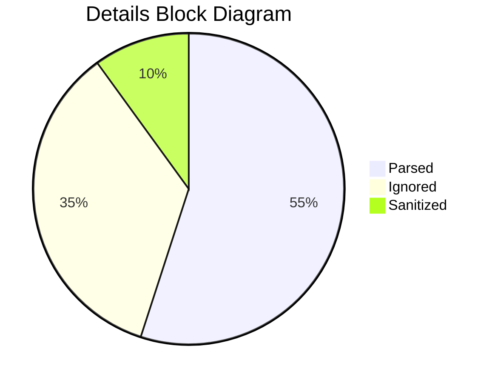

# Torture & Large Content

> Deeply nested and repeated blocks, pathological inputs, and a large repeated-content section for performance.

## 16. Large Content Section

This section provides enough ordinary content to stress scrolling, text wrapping, anchor navigation, search indexing, export pagination, and incremental rendering. The paragraphs repeat a theme but include varied inline features.

### 16.1 Fixture Story: The Renderer Observatory

At the top of a fictional observatory, a small team watches Markdown documents pass through a constellation of parsers. Each parser claims to know the stars by name, but every table, footnote, and nested quote introduces a small gravitational wobble. The team keeps notes in a ledger called `fixtures.md`, because names are hard and tests are harder.

The first telescope is calibrated for CommonMark. It loves ordinary paragraphs, honest headings, strict fences, and well-behaved links. When it sees a table, it politely asks whether a GFM lens has been installed. When it sees math, it leaves the symbols untouched, which is perfectly valid behavior and occasionally refreshing.

The second telescope has a GitHub-shaped eyepiece. It sees task lists, tables, bare URLs, and ~~deleted plans~~. It notices `#123` and thinks of issues. It notices `@octocat` and thinks of people. It notices a SHA and quietly wonders whether the commit message had enough context.

The third telescope belongs to the extension guild. It sees diagrams in fenced blocks, footnotes at the bottom of the page, attributes after paragraphs, and admonitions that look like blockquotes wearing safety vests. It is powerful, cheerful, and occasionally overconfident.

A good renderer does not have to support every telescope. It only has to be honest about what it sees. Unsupported syntax should remain legible. Dangerous HTML should not become dangerous. Long words should not shove the moon off the screen.

### 16.2 Repeated Mixed Blocks

#### Batch 1

- **Goal:** ensure repeated sections do not collapse together.
- **Inline sample:** `batch_1`, [example](https://example.com/batch/1), ~~old result~~, *new result*.
- **Task:** [x] completed check; [ ] inline brackets not a task by themselves.

| Batch | Parser | Result |
| ---: | --- | --- |
| 1 | CommonMark | Paragraphs, headings, lists |
| 1 | GFM | Tables, tasks, strikethrough |

> Batch 1 quote with `code`, **strong text**, and [a link](https://example.com).

```text
batch=1
status="ok"
```

#### Batch 2

- **Goal:** test another repeated block with similar shapes.
- **Inline sample:** `batch_2`, [example](https://example.com/batch/2), ~~old result~~, *new result*.
- **Task:** [x] completed check; [ ] inline brackets not a task by themselves.

| Batch | Parser | Result |
| ---: | --- | --- |
| 2 | CommonMark | Paragraphs, headings, lists |
| 2 | GFM | Tables, tasks, strikethrough |

> Batch 2 quote with `code`, **strong text**, and [a link](https://example.com).

```text
batch=2
status="ok"
```

#### Batch 3

- **Goal:** test repeated anchors and predictable text extraction.
- **Inline sample:** `batch_3`, [example](https://example.com/batch/3), ~~old result~~, *new result*.
- **Task:** [x] completed check; [ ] inline brackets not a task by themselves.

| Batch | Parser | Result |
| ---: | --- | --- |
| 3 | CommonMark | Paragraphs, headings, lists |
| 3 | GFM | Tables, tasks, strikethrough |

> Batch 3 quote with `code`, **strong text**, and [a link](https://example.com).

```text
batch=3
status="ok"
```

#### Batch 4

- **Goal:** test longer paragraphs inside repeated structures.
- **Inline sample:** `batch_4`, [example](https://example.com/batch/4), ~~old result~~, *new result*.
- **Task:** [x] completed check; [ ] inline brackets not a task by themselves.

This batch contains a paragraph with enough text to wrap on small screens. It includes punctuation, inline `code`, a [relative link](../fixtures/batch-4.md), and an escaped star \* that should remain visible. It also includes a raw URL: https://example.com/batch/4?with=query&and=ampersand.

| Batch | Parser | Result |
| ---: | --- | --- |
| 4 | CommonMark | Paragraphs, headings, lists |
| 4 | GFM | Tables, tasks, strikethrough |

> Batch 4 quote with `code`, **strong text**, and [a link](https://example.com).

```text
batch=4
status="ok"
```

#### Batch 5

- **Goal:** test nested content inside repeated structures.
- **Inline sample:** `batch_5`, [example](https://example.com/batch/5), ~~old result~~, *new result*.
- **Task:** [x] completed check; [ ] inline brackets not a task by themselves.

1. Ordered item inside batch five.
   - Nested unordered item.
   - Nested task list item: [ ] not a task unless parsed at list start in some renderers.
2. Second ordered item.

| Batch | Parser | Result |
| ---: | --- | --- |
| 5 | CommonMark | Paragraphs, headings, lists |
| 5 | GFM | Tables, tasks, strikethrough |

> Batch 5 quote with `code`, **strong text**, and [a link](https://example.com).

```text
batch=5
status="ok"
```

### 16.3 Closing Stress Paragraph

The final ordinary paragraph mixes everything lightly: **strong**, *emphasis*, `code`, [reference links][full-reference], bare URLs like https://example.com/final, emoji 🧪, CJK 日本語, RTL العربية, escaped characters \* \[ \], and a final footnote.[^closing-footnote]

[^closing-footnote]: Closing footnote near the end of the large content section.

---


## 20. Combined Extension Torture Section

### 20.1 Nested List With Math, Mermaid Fence, Footnotes, and Table

1. First item with inline math \(a+b=c\).
2. Second item containing a Mermaid diagram:

   ```mermaid
   flowchart LR
       A["Nested fence"] --> B["Inside ordered list"]
       B --> C{"Indent preserved?"}
       C -->|yes| D["Good"]
       C -->|no| E["Renderer bug"]
   ```

3. Third item with a footnote reference.[^combined-extension-note]

   | Inline | Display-ish |
   | --- | --- |
   | \(x^2\) | `\[x^2\]` |
   | `$maybe$` | `$$maybe$$` |

[^combined-extension-note]: Footnote inside the combined extension torture section.

### 20.2 Blockquote With Mermaid and Math

> A quoted paragraph can contain math \(e^{i\pi}+1=0\).
>
> ```mermaid
> sequenceDiagram
>     participant Quote
>     participant Renderer
>     Quote->>Renderer: Render fenced diagram inside blockquote
>     Renderer-->>Quote: Preserve nesting
> ```
>
> And then continue with text after the fence.

### 20.3 Details/Summary Containing Math and Diagram

<details>
<summary>Expandable extension stress: math \(x+y\), diagram, table</summary>

Inside an HTML details block. Some Markdown processors will not parse Markdown here unless configured.



\[
\int_0^1 x^2\,dx = \frac{1}{3}
\]

| Thing | Value |
| --- | ---: |
| alpha | 1 |
| beta | 2 |

</details>

### 20.4 Display Math With Setext-Lookalike Interior Lines

A bare `=` line inside display math looks like a setext underline to cmark; the span must stay ONE math block and never leak a phantom heading into the outline.

\[
\begin{bmatrix}
2 & -1 & 0 \\
-1 & 2 & -1 \\
0 & -1 & 2
\end{bmatrix}
\begin{bmatrix}
x_1\\x_2\\x_3
\end{bmatrix}
=
\begin{bmatrix}
1\\0\\1
\end{bmatrix}
\]

### 20.5 Final Extension Paragraph

Final extension stress line: `code`, \(inline\;math\), [link with math-looking query](https://example.com/?q=%5Cfrac%7B1%7D%7B2%7D), emoji 🧮, Mermaid-looking text `flowchart LR`, and a deliberately long TeX-ish code span `\begin{aligned} a&=b+c\\d&=e+f\end{aligned}` that should not typeset while inside backticks.

