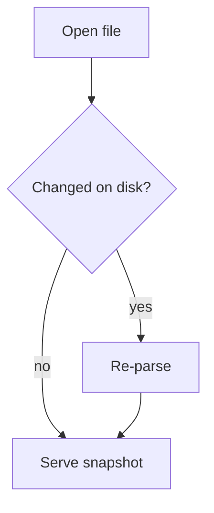

# Quoin Showcase

A quick tour of everything the reading core should handle. Open this file
in Quoin and edit it in another editor to watch live reloading.

[TOC]

## Extended syntax

Text can be ==highlighted like this== and claims can carry footnotes.[^one]
Even ==highlights with **bold** inside== work, and ⇧⌘H cycles the palette:
=={pink}pink==, =={yellow}yellow==, =={blue}blue==, =={orange}orange==.

> [!NOTE]
> Callouts render with a semantic tint and title.

> [!WARNING]
> Four kinds: note, tip, warning, danger.

[^one]: Footnotes gather at the end of the document.

## Text

Regular text with **bold**, *italic*, ***both***, ~~strikethrough~~,
`inline code`, a [link](https://example.com), and an internal link to
[Tables](#tables). Unicode: Zürich, naïveté, 東京, 🎉.

> Block quotes work too — including **formatting** inside them.
>
> Second paragraph of the quote.

## Tasks

- [x] Design the core model
- [x] Parse GFM correctly
- [ ] Ship the native math engine
- [ ] Ship the native mermaid engine
- Plain item without a checkbox

Click a checkbox: the change is written back to this file, byte-precise.

## Tables

| Feature        | Status      | Milestone |
|:---------------|:------------|----------:|
| Tables         | native      |        M1 |
| Task lists     | interactive |        M1 |
| Math           | fallback    |       M2a |
| Mermaid        | fallback    |       M2b |

## Math

Inline math like $e^{i\pi} + 1 = 0$ and $a_b + c_d$ stays intact.
Dollar amounts like $5 and $10 are not math.

$$
\int_0^1 x^2 \, dx = \frac{1}{3}
$$

## Code

```swift
let document = MarkdownConverter.parse(source)
print(document.stats.wordCount)
```

## Mermaid



## Lists

1. First ordered item
2. Second, with nesting:
   - Nested bullet
   - Another one
3. Third

---

That thematic break above should render as a quiet separator.
