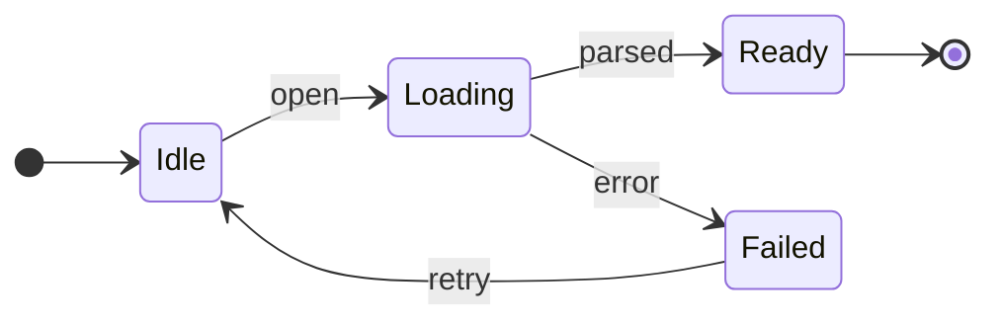
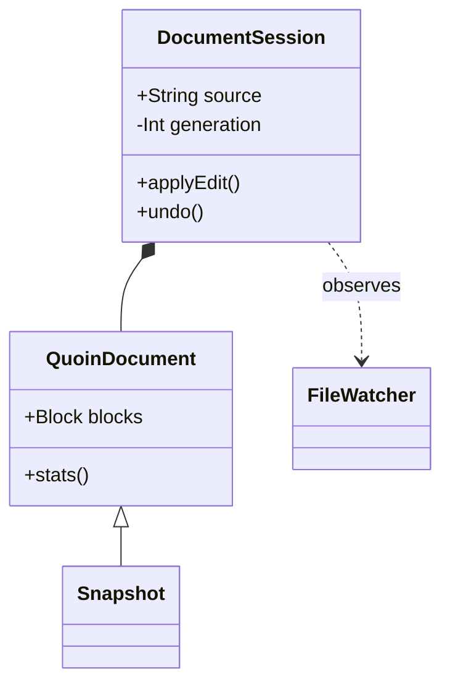
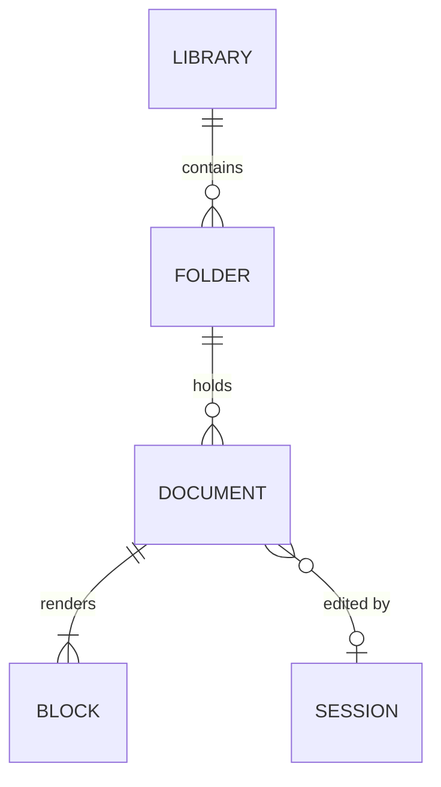

# Structure Diagrams

State machines, class models, and entity relationships — all native.

```mermaid
stateDiagram-v2
    direction LR
    [*] --> Idle
    Idle --> Loading: open
    Loading --> Ready: parsed
    Loading --> Failed: error
    Ready --> [*]
    Failed --> Idle: retry
```

```mermaid
classDiagram
    class DocumentSession {
        +String source
        -Int generation
        +applyEdit()
        +undo()
    }
    class QuoinDocument {
        +Block blocks
        +stats()
    }
    DocumentSession *-- QuoinDocument
    QuoinDocument <|-- Snapshot
    DocumentSession ..> FileWatcher : observes
```

```mermaid
erDiagram
    LIBRARY ||--o{ FOLDER : contains
    FOLDER ||--o{ DOCUMENT : holds
    DOCUMENT ||--|{ BLOCK : renders
    DOCUMENT }o--o| SESSION : "edited by"
```
