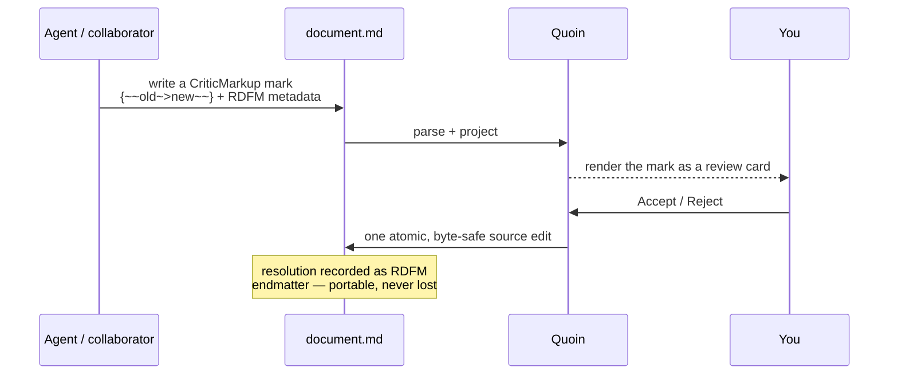
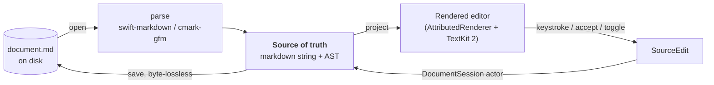
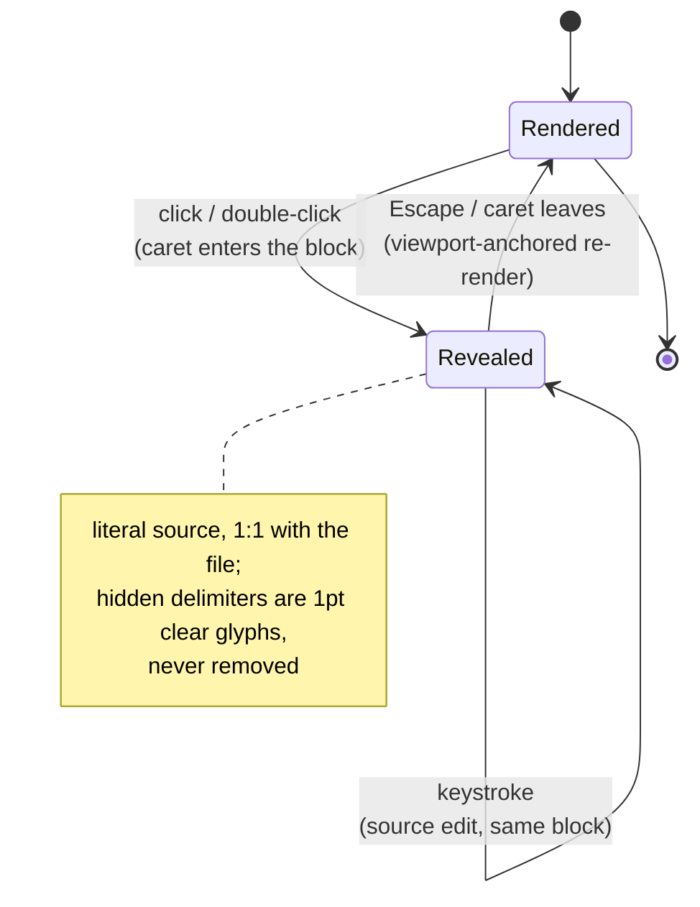
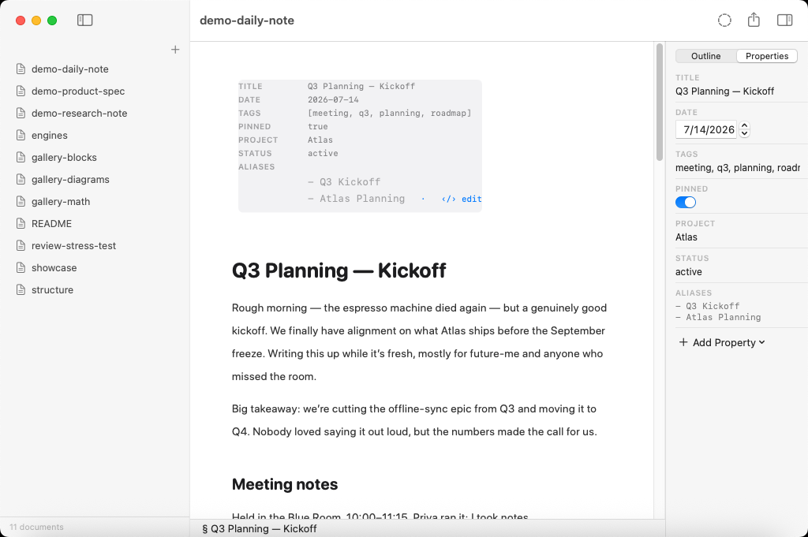
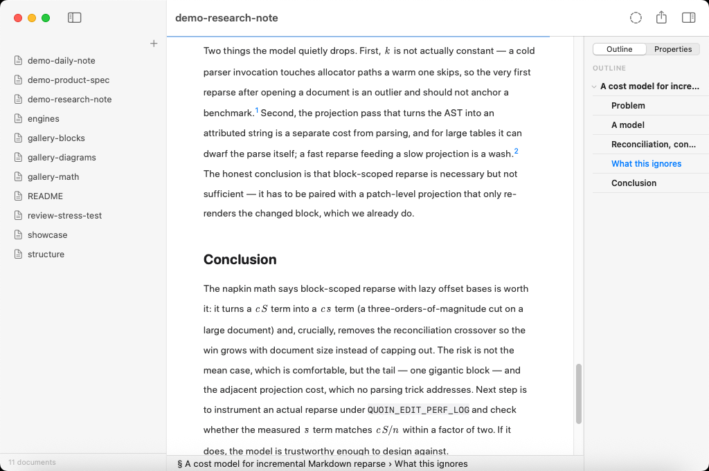
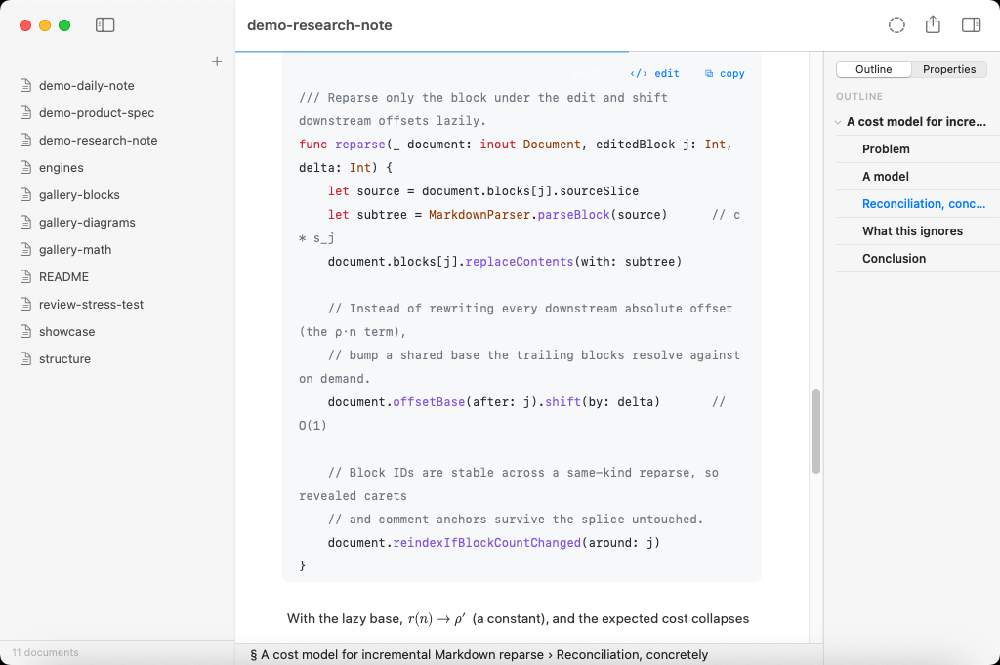
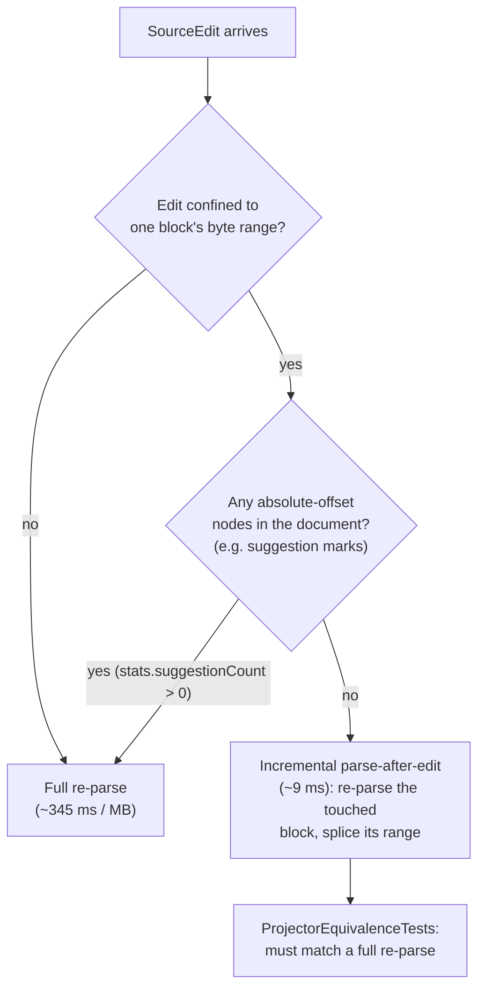
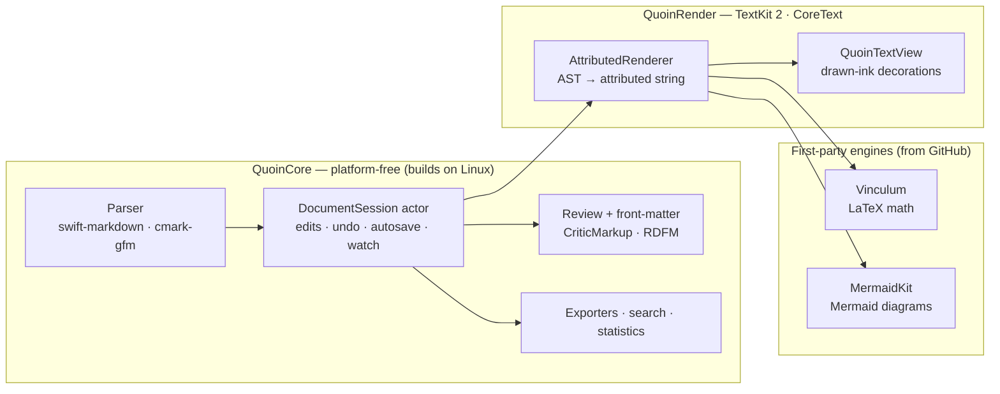

# Quoin

[](https://github.com/clintecker/quoin/actions/workflows/ci.yml)
[](https://www.apple.com/macos/)
[](https://swift.org)
[](LICENSE)

**A native WYSIWYG markdown editor for macOS with a review loop that lives
inside the file — suggestions, comments, and tracked changes as plain bytes an
agent or a person can write. Zero JavaScript, zero web views, local-only.**

Quoin edits real `.md` files with a rendered feel. The markdown string and its
AST are the single source of truth — never an attributed string — so opening a
file, editing one paragraph, and saving leaves every untouched byte identical.
Tables, callouts, footnotes, and a full review / suggestions loop all render
natively with TextKit 2 — and math and diagrams get best-in-class native
rendering from two first-party partner projects,
**[Vinculum](https://github.com/clintecker/Vinculum)** (TeX-quality LaTeX) and
**[MermaidKit](https://github.com/clintecker/MermaidKit)** (native Mermaid),
drawn with CoreText and CoreGraphics. Both are consumed under Quoin's
[dependency policy](docs/reference/dependencies.md) like any other package.
There is no embedded browser, no JS bridge, and no network at runtime.

New to Quoin? The [getting-started guide](docs/guide/getting-started.md) walks
through opening a library and making a first edit.

A *quoin* is the wedge a letterpress printer uses to lock type into the
chase — the small, precise tool that makes the whole page hold.

Quoin editing a real Markdown document — the library sidebar, a rendered
document with a front-matter chip and headings, the live outline, and the
floating format pill, all native:


---

## What makes Quoin different

### The review loop lives in the file

Quoin's defining feature is a Google-Docs-class review loop expressed in plain
markdown bytes — no sidecar database, no proprietary format. Suggestions and
comments are [CriticMarkup](https://github.com/CriticMarkup/CriticMarkup-toolkit)
marks; their metadata (author, time, resolution) rides along as RDFM YAML
endmatter that plain renderers ignore. Because the file *is* the review, it is
portable, git-diffable, and agent-readable — and that is the whole point: **any
tool that writes markdown can propose durable edits, and a human accepts or
rejects them in a real UI.**



- **Marks render as tracked changes.** The raw delimiters never appear in the
  read projection — you see accent underlays, strikeouts, suggestion tints, and
  review chips.
- **A review inspector** lists every mark as a card (author, relative time, the
  change body) with Accept / Reject / Dismiss, plus Accept All / Reject All.
- **Every resolution is one atomic, byte-safe source edit = one undo.** Bulk
  actions apply right-to-left as a single edit.
- **Review Mode (⌃⌘R)** turns ordinary typing into suggestion marks, with
  coalescing so consecutive keystrokes grow one mark instead of minting one per
  character.
- **Safety by construction.** Every resolution and annotation is computed inside
  the session actor at apply time against current truth — it refuses on drift
  rather than splicing stale offsets, and self-calibrates by re-parsing the
  candidate edit before committing it.

| Mark | Source | Renders as |
| :--- | :--- | :--- |
| Insertion | `{++added++}` | accent underlay |
| Deletion | `{--removed--}` | strike + red tint |
| Substitution | `{~~old~>new~~}` | both halves in suggestion tints |
| Comment | `{>>note<<}` | collapsed chip → review card |
| Highlight | `{==marked==}` | accent pill |

Design + rationale: [`docs/design/suggestions.md`](docs/design/suggestions.md).

A spec under review: tracked changes render inline in the prose (strike-through
deletions, green insertions, a highlighted comment anchor), while the Review
inspector on the right lists each mark as a card with Accept / Reject / Dismiss:


### The source is the document

The markdown string + AST are authoritative; the editor is a *projection* — see
[`docs/design/editor-modes.md`](docs/design/editor-modes.md) for the full
projection model. Edits mutate the source through a session actor, and the
renderer re-projects. This one decision is why round-trips are lossless, why an
agent can safely rewrite a file Quoin has open, and why there is no hidden
document model to drift out of sync with the bytes on disk.



Round-trip (open → edit → save) is **[byte-lossless](docs/reference/invariants.md)
for every untouched region**, by rule — enforced by conformance and round-trip
tests. Click into a paragraph and it re-renders as its literal source,
character-for-character 1:1 with the file: hidden delimiters become 1-point
clear glyphs rather than being removed, so caret math never lies. Only the span
under the caret reveals its `**` / `*` / `==` delimiters; structural prefixes
(`>`, `- [ ]`) stay faded-visible. Escape flips back to rendered — and on any
projection change the line the caret is on does not move on screen (the
[viewport invariant](docs/reference/invariants.md)).

Each block toggles independently between its rendered and revealed
projections — this is what makes syntax-reveal editing feel instant rather
than modal:



### Best-in-class native math and diagrams — no JavaScript

Quoin's math and diagram rendering is best-in-class *and* fully native, powered
by two first-party partner projects it develops and ships as standalone Swift
packages:

- **[Vinculum](https://github.com/clintecker/Vinculum)** — a TeX-quality math
  typesetter (~400 LaTeX commands: inter-atom spacing classes, stacked
  big-operator limits, radicals with indices, auto-sized fences, `matrix` /
  `cases` / `aligned` grids), drawn with CoreText. No MathJax, no KaTeX.
- **[MermaidKit](https://github.com/clintecker/MermaidKit)** — a native Mermaid
  engine (Sugiyama-style layering, orthogonal elbow routing, cycle-safe layout,
  UML markers, composite states, front-matter `title`/`config`), drawn with
  CoreGraphics. No Mermaid.js, no headless browser.

Both are Quoin-owned, independently versioned, CI-tested, and reusable by any
Swift host — so the quality is a shared, provable asset, not a black box buried
in the app. No headless browser, no network. Unsupported LaTeX constructs and
Mermaid types degrade to a tidy labelled source card whose caption *names the
command* that isn't typeset — legible, not a shrug. Pathological input
(10k-deep nesting, unclosed everything) parses to *something* without crashing;
the torture suite keeps it that way.

Inline and display LaTeX and a Mermaid flowchart, all typeset natively in the
same document — Vinculum draws the math, MermaidKit the diagram:


---

## Feature overview

A scannable tour; the full walkthrough is in
[`docs/guide/features.md`](docs/guide/features.md).

- **Write** — WYSIWYG editing on a plain-text source,
  [syntax-reveal](docs/design/editor-modes.md) on the active block, smart pairs
  and wrap-selection, ⌘B / ⌘I / ⌘K / ⇧⌘H and a floating format pill, live
  formatting as source edits.
- **Review** — CriticMarkup suggestions + comments, a review inspector, Review
  Mode, block-adjacent comments for opaque blocks (code, tables, diagrams,
  math), atomic byte-safe accept/reject.
- **Structure** — YAML front matter as a field grid plus a Properties inspector
  with typed editors (date picker, bool toggle, number field, list-as-CSV,
  Edit-as-Text escape hatch), `[TOC]`, footnotes with click-to-jump, hover
  preview, and ↩ backlinks.
- **Organize** — library sidebar (folders = directories), document tabs,
  multi-folder windows, outline panel with live section tracking, quick open,
  in-document find (⌘F / ⌘G), library-wide search (⇧⌘F), jump history.
- **Read & render** — CommonMark + GFM (tables, task lists, strikethrough,
  autolinks), callouts, highlights, code with 12 selectable syntax themes,
  native math and diagrams, live reload with a non-blocking external-change
  banner.
- **Ship** — export to PDF, HTML, Markdown, RTF, and TXT (light or dark), word
  count, reading time, per-element statistics, focus mode, typewriter scrolling.

---

## Support matrix

### Markdown

| Feature | Status | Notes |
| :--- | :---: | :--- |
| CommonMark core (headings, emphasis, lists, links, images, code, quotes, breaks) | ✅ | via swift-markdown / cmark-gfm |
| GFM tables | ✅ | per-column alignment, numeric columns right-aligned |
| GFM task lists | ✅ | checkboxes toggle with a click and write back to source |
| GFM strikethrough & autolinks | ✅ | |
| Callouts / alerts (`> [!NOTE]` …) | ✅ | 5 semantic types: note, tip, important, warning, caution |
| Highlights (`==text==`) | ✅ | palette cycling with ⇧⌘H (`=={pink}…==`) |
| Footnotes (`[^id]`) | ✅ | click-to-jump to definition, hover-preview bubble, ↩ backlinks |
| YAML front matter | ✅ | rendered as a field grid; edited via the Properties inspector (typed editors) |
| `[TOC]` | ✅ | live table-of-contents block |
| Code syntax highlighting | ✅ | Swift, Python, JS/TS, Go, Rust, Ruby, C/C++/ObjC, Java/Kotlin, shell, SQL, YAML/TOML, JSON, HTML/XML/CSS; **12 selectable canvas themes**, default follows app appearance |
| Review / suggestions (CriticMarkup + RDFM) | ✅ | insert/delete/replace/comment/highlight marks, review inspector, Review Mode |
| Math (LaTeX, `$…$` / `$$…$$` / `\(…\)` / `\[…\]`) | ✅ | native TeX-style typesetting via Vinculum (~400 commands) |
| Diagrams (Mermaid fenced blocks) | ✅ | native layout + drawing via MermaidKit |
| Raw HTML blocks | 🟡 | shown as a labelled source card (no HTML engine, by design) |
| Local images | ✅ | async decode at display size; drag-and-drop copies into `assets/` |
| Remote images | 🟡 | placeholder by default (local-only policy) |

Rich blocks — callouts, tables, task lists, and code — rendered natively:


### Editor & app

| Feature | Status |
| :--- | :---: |
| Syntax-reveal editing (click to edit, Esc to close) | ✅ |
| Double-click to edit code, tables, and TOC | ✅ |
| [Diagrams & math](docs/design/embed-editing-ux.md) open via the explicit ‹/› edit chip, ⌘↩, or the context menu | ✅ |
| Side-by-side live preview while editing diagrams & math (last-good render held while mid-edit source is broken) | ✅ |
| Review inspector — suggestion/comment cards with Accept / Reject / Dismiss and Accept All / Reject All | ✅ |
| Review Mode (⌃⌘R) — typing becomes suggestion marks, with coalescing | ✅ |
| Block-adjacent comments for opaque blocks (code, tables, diagrams, math) | ✅ |
| Properties inspector — front matter as a key/value panel with typed editors | ✅ |
| Footnotes — click-to-jump, hover preview, backlinks | ✅ |
| Code syntax themes — 12 selectable; default follows app appearance | ✅ |
| Smart pairs, wrap-selection, word-under-caret formatting | ✅ |
| ⌘B / ⌘I / ⇧⌘H / ⌘K + floating format pill | ✅ |
| Library sidebar (folders = directories), document tabs, quick open | ✅ |
| Multi-folder windows — Open Folder in New Window; each window restores its folder on relaunch | ✅ |
| Outline panel with live section tracking (manual collapse is authoritative) | ✅ |
| Find in document (⌘F / ⌘G), library-wide search (⇧⌘F) | ✅ |
| Live reload + non-blocking conflict banner on external change | ✅ |
| Source-level undo/redo through the session | ✅ |
| First-H1 auto-rename of Untitled files | ✅ |
| Export: PDF, HTML, Markdown, RTF, TXT — light or dark | ✅ |
| Word count, reading time, per-element statistics | ✅ |
| Focus mode, typewriter scrolling, jump history (⌘[ / ⌘]) | ✅ |
| Dark mode (code canvas constant across appearances, per design spec) | ✅ |

A few of these surfaces, up close:

**Properties inspector.** Front matter becomes a typed key/value panel — a date
picker for dates, a toggle for booleans, comma-separated lists for arrays —
editing the YAML in place without you touching the raw syntax.



**Footnotes.** A reference is click-to-jump to its definition, with a
hover-preview bubble and a backlink to return — footnotes stay navigable
instead of scrolling you away.



**Syntax themes.** Code blocks render in any of twelve selectable themes — six
light, six dark — and by default follow the app's appearance. GitHub Light and
Dracula, side by side:

<table>
<tr>
<td width="50%"></td>
<td width="50%"></td>
</tr>
</table>

## Math (LaTeX)

Math is powered by **[Vinculum](https://github.com/clintecker/Vinculum)** —
Quoin's own native TeX-style typesetter (no MathJax, no KaTeX). LaTeX is parsed
into a TeX-style atom tree and laid out with real inter-atom spacing classes,
stacked big-operator limits, radicals with indices, auto-sized fences, and grid
environments (`matrix`/`pmatrix`/…, `cases`, `aligned`), then drawn with
CoreText. Inline `$…$` `\(…\)` and display `$$…$$` `\[…\]` are both supported.

Coverage is large (~400 commands). Quoin does not restate the command table —
a duplicated list drifts. The always-current matrix is in Vinculum's own
docs: [COVERAGE.md](https://github.com/clintecker/Vinculum/blob/main/docs/COVERAGE.md)
and [COMMANDS.md](https://github.com/clintecker/Vinculum/blob/main/docs/COMMANDS.md).
Unsupported commands fall back to a named source card.

A gallery of Vinculum's typesetting — fractions, integrals with limits, big
operators, radicals, auto-sized fences, and aligned/matrix environments:


## Diagrams (Mermaid)

Diagrams are powered by **[MermaidKit](https://github.com/clintecker/MermaidKit)**
— Quoin's own native Mermaid engine (no Mermaid.js, no network). Sources are
parsed and laid out with Sugiyama-style layering, orthogonal elbow routing,
cycle-safe layering, UML relationship markers, and recursive composite states;
front-matter `title` / `config` and `accTitle` / `accDescr` are honored. Every
Mermaid block in this README is exactly the kind of diagram Quoin renders
inline.

MermaidKit's repository is the source of truth for the per-type support
matrix — its `Fixtures/diagrams/` corpus and CI gallery — so the list can't
quietly drift. Unsupported diagram types fall back to a named source card.

A gallery of flowcharts, sequence, state, class, and ER diagrams, all drawn
natively by MermaidKit — no browser, no Mermaid.js:


## Screenshots

Every image on this page is a real capture of the running app, committed under
[`docs/images/`](docs/images/). They're automated: launch arguments preset app
state (library, syntax-reveal, find, export, review, properties, code-theme),
CI regenerates them on every push, and the full set is also published to the
`ci-screenshots` branch. The full catalogue, launch arguments, and committed
paths are in the [screenshot manifest](docs/guide/screenshots.md).

## Performance

Budgets from the product spec, enforced in CI (`PerformanceTests`);
representative benchmarks on a ~1.2 MB / 5,402-line / 2,701-block document
([`docs/reference/performance.md`](docs/reference/performance.md)):

- Parse 1 MB of markdown to interactive: **< 1 s** (initial full parse ~345 ms)
- Apply one byte-precise middle edit: **~0.8 ms**; incremental parse-after-edit
  fast path: **~9 ms**
- Keystroke → paint: one block re-rendered, one region re-laid-out (fragment
  cache + text-storage splicing)
- 70k-character stress documents scroll at full frame rate — TextKit 2 lays out
  only the visible viewport

The ~9 ms figure is a *fast path*, not the only path: an edit is only
reparsed incrementally when it's provably safe to do so, and falls back to a
full parse otherwise.



## Architecture

Quoin is three layers: a platform-free document engine, a native rendering
layer, and the two first-party math/diagram engines it consumes from GitHub.



- **`QuoinCore`** — platform-free engine: parse, `DocumentSession` (edits, undo,
  autosave, file watching), search, statistics, exporters, and the **entire
  review + front-matter machinery**, with zero AppKit imports. Builds and tests
  on Linux.
- **`QuoinRender`** — `AttributedRenderer` projects the AST into one attributed
  string; `QuoinTextView` (an NSTextView subclass) draws block decorations,
  code canvases, callout boxes, diagram frames, and review chrome behind the
  text via TextKit 2 fragment frames.
- **`Vinculum`** / **`MermaidKit`** — first-party math and diagram engines,
  layout/render split behind theme seams, consumed from GitHub and tested by
  their own CI.

See [`docs/reference/architecture.md`](docs/reference/architecture.md) for the
full data-flow and the [docs map](docs/README.md) for everything else.

## Building

Requires Xcode 16+ / Swift 6 tools on macOS 14+.

```sh
swift build            # QuoinCore + QuoinRender
swift test             # full suite — unit, torture, performance, conformance
```

App targets are generated with XcodeGen:

```sh
brew install xcodegen
cd App/macOS && xcodegen && open Quoin.xcodeproj      # macOS
cd App/iOS   && xcodegen && open QuoinIOS.xcodeproj   # iOS/iPadOS
```

Fixtures for every feature area live in [`Fixtures/renderer/`](Fixtures/renderer/) —
they drive the CI conformance harness (parse + metric snapshots + diagram-layout
invariants) and double as in-app preview documents. CI runs the full test suite,
builds both apps, enforces the performance budgets, and publishes UI screenshots
to the `ci-screenshots` branch on every push.

## Dependency policy

One third-party code dependency:
[swift-markdown](https://github.com/swiftlang/swift-markdown) (Apple's cmark-gfm
wrapper, pinned `from: 0.8.0`).
[MermaidKit](https://github.com/clintecker/MermaidKit) (`from: 0.10.0`) and
[Vinculum](https://github.com/clintecker/Vinculum) (`from: 0.23.0`) are
**first-party** — Quoin's own published engines, consumed from GitHub like any
host app would, and exempt from the policy. Anything new requires written
justification; the default answer is no. See
[`docs/reference/dependencies.md`](docs/reference/dependencies.md).

## Privacy

Local-only by design: no network calls, no telemetry, no indexing services.
Documents are plain `.md` files on disk; folders are directories. Remote images
are placeholders unless explicitly enabled per document. Nothing you write leaves
your machine, and no runtime engine phones home — the math and diagram renderers
are native code, not bundled web assets.

## Documentation

The docs tree is organized by audience — full index in
[`docs/README.md`](docs/README.md):

- **Capability spec:** [`docs/PRODUCT.md`](docs/PRODUCT.md) — what Quoin is and
  does, every claim backed by a test, doc, or CI screenshot.
- **User guide:** [`docs/guide/getting-started.md`](docs/guide/getting-started.md)
  (first run) · [`docs/guide/features.md`](docs/guide/features.md) (feature
  tour) · [`docs/guide/screenshots.md`](docs/guide/screenshots.md) (shot
  manifest).
- **Reference:** [`docs/reference/architecture.md`](docs/reference/architecture.md) ·
  [`docs/reference/invariants.md`](docs/reference/invariants.md) ·
  [`docs/reference/performance.md`](docs/reference/performance.md) ·
  [`docs/reference/dependencies.md`](docs/reference/dependencies.md) ·
  [`docs/reference/distribution.md`](docs/reference/distribution.md)
  (release, notarization, Sparkle updates) ·
  [`docs/reference/adr/`](docs/reference/adr/README.md) (decision records).
- **Design specs:** [`docs/design/handoff.md`](docs/design/handoff.md) (the
  visual/interaction handoff) ·
  [`docs/design/editor-modes.md`](docs/design/editor-modes.md) (projection
  model) · [`docs/design/suggestions.md`](docs/design/suggestions.md) (the
  review-loop design) ·
  [`docs/design/embed-editing-ux.md`](docs/design/embed-editing-ux.md) (embed
  editing) · [`docs/design/platforms.md`](docs/design/platforms.md)
  (macOS/iOS/Linux directions).
- **Engines:** [MermaidKit](https://github.com/clintecker/MermaidKit) (diagram
  capability matrix) · [Vinculum](https://github.com/clintecker/Vinculum) (math
  coverage).
