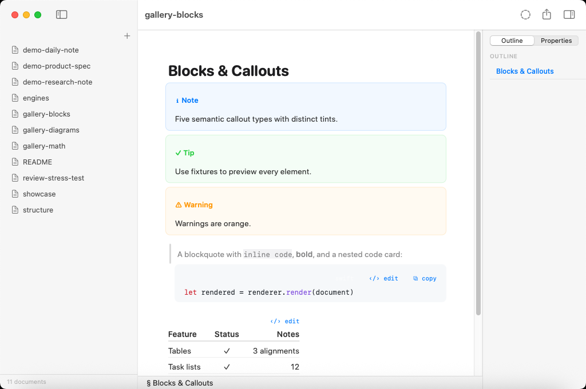
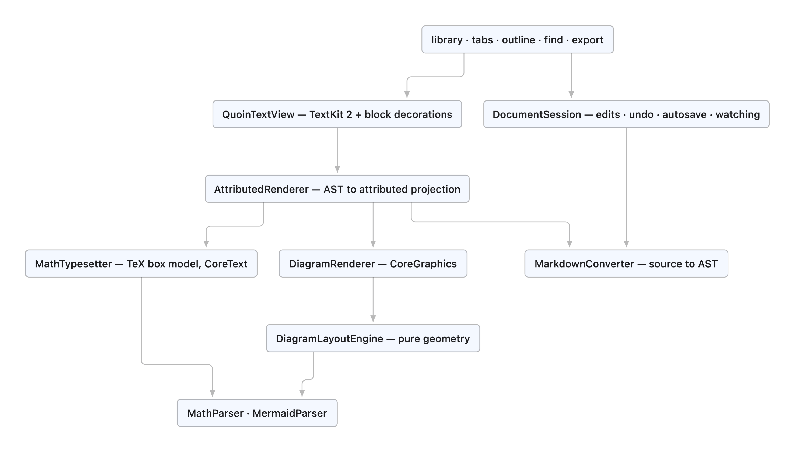

# Quoin

**A native WYSIWYG markdown editor for macOS with a review loop that lives
inside the file — suggestions, comments, and tracked changes as plain bytes an
agent or a person can write. Zero JavaScript, zero web views, local-only.**

Quoin edits real `.md` files with a rendered feel. The markdown string and its
AST are the single source of truth — never an attributed string — so opening a
file, editing one paragraph, and saving leaves every untouched byte identical.
Math, diagrams, tables, callouts, footnotes, and a full review / suggestions
loop all render natively with TextKit 2, CoreText, and CoreGraphics. There is no
embedded browser, no JS bridge, and no network at runtime.

A *quoin* is the wedge a letterpress printer uses to lock type into the
chase — the small, precise tool that makes the whole page hold.


---

## What makes Quoin different

### The review loop lives in the file

Quoin's defining feature is a Google-Docs-class review loop expressed in plain
markdown bytes — no sidecar database, no proprietary format. Suggestions and
comments are [CriticMarkup](https://github.com/CriticMarkup/CriticMarkup-toolkit)
marks; their metadata (author, time, resolution) rides along as RDFM YAML
endmatter that plain renderers ignore. Because the file *is* the review, it is
portable, git-diffable, and agent-readable — and that is the whole point: **any
tool that writes markdown can propose durable edits, and a human accepts or
rejects them in a real UI.**

- **Marks render as tracked changes.** The raw delimiters never appear in the
  read projection — you see accent underlays, strikeouts, suggestion tints, and
  review chips.
- **A review inspector** lists every mark as a card (author, relative time, the
  change body) with Accept / Reject / Dismiss, plus Accept All / Reject All.
- **Every resolution is one atomic, byte-safe source edit = one undo.** Bulk
  actions apply right-to-left as a single edit.
- **Review Mode (⌃⌘R)** turns ordinary typing into suggestion marks, with
  coalescing so consecutive keystrokes grow one mark instead of minting one per
  character.
- **Safety by construction.** Every resolution and annotation is computed inside
  the session actor at apply time against current truth — it refuses on drift
  rather than splicing stale offsets, and self-calibrates by re-parsing the
  candidate edit before committing it.

| Mark | Source | Renders as |
| :--- | :--- | :--- |
| Insertion | `{++added++}` | accent underlay |
| Deletion | `{--removed--}` | strike + red tint |
| Substitution | `{~~old~>new~~}` | both halves in suggestion tints |
| Comment | `{>>note<<}` | collapsed chip → review card |
| Highlight | `{==marked==}` | accent pill |

Design + rationale: [`docs/design/suggestions.md`](docs/design/suggestions.md).

<!-- SCREENSHOT: review-panel — Review inspector cards beside a marked document; see docs/guide/screenshots.md -->
<!-- SCREENSHOT: review-mode — status-bar "Suggesting" chip while typing produces marks; see docs/guide/screenshots.md -->

### The source is the document

The markdown string + AST are authoritative; the editor is a *projection*. Edits
mutate the source through a session actor and the renderer re-projects.
Round-trip (open → edit → save) is **byte-lossless for every untouched region**,
by rule — enforced by conformance and round-trip tests. Click into a paragraph
and it re-renders as its literal source, character-for-character 1:1 with the
file: hidden delimiters become 1-point clear glyphs rather than being removed,
so caret math never lies. Only the span under the caret reveals its `**` / `*` /
`==` delimiters; structural prefixes (`>`, `- [ ]`) stay faded-visible. Escape
flips back to rendered — and on any projection change the line the caret is on
does not move on screen.

### Native math and diagrams — no JavaScript

LaTeX math is typeset by [Vinculum](https://github.com/clintecker/Vinculum) and
Mermaid diagrams by [MermaidKit](https://github.com/clintecker/MermaidKit) —
Quoin's own first-party engines, drawn with CoreText/CoreGraphics. No MathJax,
no KaTeX, no Mermaid.js, no headless browser, no network. Unsupported LaTeX
constructs and Mermaid types degrade to a tidy labelled source card whose
caption *names the command* that isn't typeset yet — legible, not a shrug.
Pathological input (10k-deep nesting, unclosed everything) parses to *something*
without crashing; the torture suite keeps it that way.

---

## Feature overview

A scannable tour; the full walkthrough is in
[`docs/guide/features.md`](docs/guide/features.md).

- **Write** — WYSIWYG editing on a plain-text source, syntax-reveal on the
  active block, smart pairs and wrap-selection, ⌘B / ⌘I / ⌘K / ⇧⌘H and a
  floating format pill, live formatting as source edits.
- **Review** — CriticMarkup suggestions + comments, a review inspector, Review
  Mode, block-adjacent comments for opaque blocks (code, tables, diagrams,
  math), atomic byte-safe accept/reject.
- **Structure** — YAML front matter as a field grid plus a Properties inspector
  with typed editors (date picker, bool toggle, number field, list-as-CSV,
  Edit-as-Text escape hatch), `[TOC]`, footnotes with click-to-jump, hover
  preview, and ↩ backlinks.
- **Organize** — library sidebar (folders = directories), document tabs,
  multi-folder windows, outline panel with live section tracking, quick open,
  in-document find (⌘F / ⌘G), library-wide search (⇧⌘F), jump history.
- **Read & render** — CommonMark + GFM (tables, task lists, strikethrough,
  autolinks), callouts, highlights, code with 12 selectable syntax themes,
  native math and diagrams, live reload with a non-blocking external-change
  banner.
- **Ship** — export to PDF, HTML, Markdown, RTF, and TXT (light or dark), word
  count, reading time, per-element statistics, focus mode, typewriter scrolling.

---

## Support matrix

### Markdown

| Feature | Status | Notes |
| :--- | :---: | :--- |
| CommonMark core (headings, emphasis, lists, links, images, code, quotes, breaks) | ✅ | via swift-markdown / cmark-gfm |
| GFM tables | ✅ | per-column alignment, numeric columns right-aligned |
| GFM task lists | ✅ | checkboxes toggle with a click and write back to source |
| GFM strikethrough & autolinks | ✅ | |
| Callouts / alerts (`> [!NOTE]` …) | ✅ | 5 semantic types: note, tip, important, warning, caution |
| Highlights (`==text==`) | ✅ | palette cycling with ⇧⌘H (`=={pink}…==`) |
| Footnotes (`[^id]`) | ✅ | click-to-jump to definition, hover-preview bubble, ↩ backlinks |
| YAML front matter | ✅ | rendered as a field grid; edited via the Properties inspector (typed editors) |
| `[TOC]` | ✅ | live table-of-contents block |
| Code syntax highlighting | ✅ | Swift, Python, JS/TS, Go, Rust, Ruby, C/C++/ObjC, Java/Kotlin, shell, SQL, YAML/TOML, JSON, HTML/XML/CSS; **12 selectable canvas themes**, default follows app appearance |
| Review / suggestions (CriticMarkup + RDFM) | ✅ | insert/delete/replace/comment/highlight marks, review inspector, Review Mode |
| Math (LaTeX, `$…$` / `$$…$$` / `\(…\)` / `\[…\]`) | ✅ | native TeX-style typesetting via Vinculum (~400 commands) |
| Diagrams (Mermaid fenced blocks) | ✅ | native layout + drawing via MermaidKit |
| Raw HTML blocks | 🟡 | shown as a labelled source card (no HTML engine, by design) |
| Local images | ✅ | async decode at display size; drag-and-drop copies into `assets/` |
| Remote images | 🟡 | placeholder by default (local-only policy) |

### Editor & app

| Feature | Status |
| :--- | :---: |
| Syntax-reveal editing (click to edit, Esc to close) | ✅ |
| Double-click to edit code, tables, and TOC | ✅ |
| Diagrams & math open via the explicit ‹/› edit chip, ⌘↩, or the context menu | ✅ |
| Side-by-side live preview while editing diagrams & math (last-good render held while mid-edit source is broken) | ✅ |
| Review inspector — suggestion/comment cards with Accept / Reject / Dismiss and Accept All / Reject All | ✅ |
| Review Mode (⌃⌘R) — typing becomes suggestion marks, with coalescing | ✅ |
| Block-adjacent comments for opaque blocks (code, tables, diagrams, math) | ✅ |
| Properties inspector — front matter as a key/value panel with typed editors | ✅ |
| Footnotes — click-to-jump, hover preview, backlinks | ✅ |
| Code syntax themes — 12 selectable; default follows app appearance | ✅ |
| Smart pairs, wrap-selection, word-under-caret formatting | ✅ |
| ⌘B / ⌘I / ⇧⌘H / ⌘K + floating format pill | ✅ |
| Library sidebar (folders = directories), document tabs, quick open | ✅ |
| Multi-folder windows — Open Folder in New Window; each window restores its folder on relaunch | ✅ |
| Outline panel with live section tracking (manual collapse is authoritative) | ✅ |
| Find in document (⌘F / ⌘G), library-wide search (⇧⌘F) | ✅ |
| Live reload + non-blocking conflict banner on external change | ✅ |
| Source-level undo/redo through the session | ✅ |
| First-H1 auto-rename of Untitled files | ✅ |
| Export: PDF, HTML, Markdown, RTF, TXT — light or dark | ✅ |
| Word count, reading time, per-element statistics | ✅ |
| Focus mode, typewriter scrolling, jump history (⌘[ / ⌘]) | ✅ |
| Dark mode (code canvas constant across appearances, per design spec) | ✅ |

<!-- SCREENSHOT: properties-panel — Properties inspector editing front-matter fields; see docs/guide/screenshots.md -->
<!-- SCREENSHOT: footnotes — footnote reference with hover-preview bubble; see docs/guide/screenshots.md -->
<!-- SCREENSHOT: code-theme — a code block in a selectable syntax theme; see docs/guide/screenshots.md -->

## Math (LaTeX)

Math is powered by **[Vinculum](https://github.com/clintecker/Vinculum)** —
Quoin's own native TeX-style typesetter (no MathJax, no KaTeX). LaTeX is parsed
into a TeX-style atom tree and laid out with real inter-atom spacing classes,
stacked big-operator limits, radicals with indices, auto-sized fences, and grid
environments (`matrix`/`pmatrix`/…, `cases`, `aligned`), then drawn with
CoreText. Inline `$…$` `\(…\)` and display `$$…$$` `\[…\]` are both supported.

Coverage is large (~400 commands). **Quoin does not restate the command table —
it drifts when duplicated.** The always-current matrix is in Vinculum's own
docs: [COVERAGE.md](https://github.com/clintecker/Vinculum/blob/main/docs/COVERAGE.md)
and [COMMANDS.md](https://github.com/clintecker/Vinculum/blob/main/docs/COMMANDS.md).
Unsupported commands fall back to a named source card.


## Diagrams (Mermaid)

Diagrams are powered by **[MermaidKit](https://github.com/clintecker/MermaidKit)**
— Quoin's own native Mermaid engine (no Mermaid.js, no network). Sources are
parsed and laid out with Sugiyama-style layering, orthogonal elbow routing,
cycle-safe layering, UML relationship markers, and recursive composite states;
front-matter `title` / `config` and `accTitle` / `accDescr` are honored.

**Quoin does not restate the per-type diagram matrix** — the source of truth is
MermaidKit's repository (its `Fixtures/diagrams/` corpus and CI gallery), so the
list can't quietly drift. Unsupported diagram types fall back to a named source
card. See [`docs/history/diagram-gallery.md`](docs/history/diagram-gallery.md)
for Quoin-specific in-editor behaviour.




## Screenshots

The images above (`hero.png` and the three galleries) are committed under
[`docs/images/`](docs/images/). Live application screenshots — library,
syntax-reveal, find, export, review, properties, and code-theme states — are
**automated**, regenerated on every push and published to the `ci-screenshots`
branch. The full catalogue, launch arguments, and committed paths are in the
[screenshot manifest](docs/guide/screenshots.md). Placeholders above mark shots
whose curated copy isn't committed yet — a broken image link is worse than a
missing one, so they're never linked before the pixels exist.

## Performance

Budgets from the PRD, enforced in CI (`PerformanceTests`); representative
benchmarks on a ~1.2 MB / 5,402-line / 2,701-block document
([`docs/reference/performance.md`](docs/reference/performance.md)):

- Parse 1 MB of markdown to interactive: **< 1 s** (initial full parse ~345 ms)
- Apply one byte-precise middle edit: **~0.8 ms**; incremental parse-after-edit
  fast path: **~9 ms**
- Keystroke → paint: one block re-rendered, one region re-laid-out (fragment
  cache + text-storage splicing)
- 70k-character stress documents scroll at full frame rate — TextKit 2 lays out
  only the visible viewport

## Architecture

<picture>
  <source media="(prefers-color-scheme: dark)" srcset="docs/images/architecture-overview-dark.png">
  
</picture>

<sub>The image above is drawn by **Quoin's own native Mermaid engine** — no Mermaid.js, no JavaScript. Regenerate with `QUOIN_DOC_DIAGRAMS=$PWD swift test --filter testRenderDocDiagrams`.</sub>

- **`QuoinCore`** — platform-free engine: parse, `DocumentSession` (edits, undo,
  autosave, file watching), search, statistics, exporters, and the **entire
  review + front-matter machinery**, with zero AppKit imports. Builds and tests
  on Linux.
- **`QuoinRender`** — `AttributedRenderer` projects the AST into one attributed
  string; `QuoinTextView` (an NSTextView subclass) draws block decorations,
  code canvases, callout boxes, diagram frames, and review chrome behind the
  text via TextKit 2 fragment frames.
- **`Vinculum`** / **`MermaidKit`** — first-party math and diagram engines,
  layout/render split behind theme seams, consumed from GitHub and tested by
  their own CI.

See [`docs/reference/architecture.md`](docs/reference/architecture.md) for the
full data-flow and the [docs map](docs/README.md) for everything else.

## Building

Requires Xcode 16+ / Swift 6 tools on macOS 14+.

```sh
swift build            # QuoinCore + QuoinRender
swift test             # full suite: 641 tests — unit, torture, performance, conformance
```

App targets are generated with XcodeGen:

```sh
brew install xcodegen
cd App/macOS && xcodegen && open Quoin.xcodeproj      # macOS
cd App/iOS   && xcodegen && open QuoinIOS.xcodeproj   # iOS/iPadOS
```

Fixtures for every feature area live in [`Fixtures/renderer/`](Fixtures/renderer/) —
they drive the CI conformance harness (parse + metric snapshots + diagram-layout
invariants) and double as in-app preview documents. CI runs the full test suite,
builds both apps, enforces the performance budgets, and publishes UI screenshots
to the `ci-screenshots` branch on every push.

## Dependency policy

One third-party code dependency:
[swift-markdown](https://github.com/swiftlang/swift-markdown) (Apple's cmark-gfm
wrapper, pinned `from: 0.8.0`).
[MermaidKit](https://github.com/clintecker/MermaidKit) (`from: 0.10.0`) and
[Vinculum](https://github.com/clintecker/Vinculum) (`from: 0.23.0`) are
**first-party** — Quoin's own published engines, consumed from GitHub like any
host app would, and exempt from the policy. Anything new requires written
justification in the TRD; the default answer is no. See
[`docs/reference/dependencies.md`](docs/reference/dependencies.md).

## Privacy

Local-only by design: no network calls, no telemetry, no indexing services.
Documents are plain `.md` files on disk; folders are directories. Remote images
are placeholders unless explicitly enabled per document.

## Documentation

The docs tree is organized by audience — full index in
[`docs/README.md`](docs/README.md):

- **Capability spec:** [`docs/PRODUCT.md`](docs/PRODUCT.md) — what Quoin is and
  does, every claim backed by a test, doc, or CI screenshot.
- **User guide:** [`docs/guide/features.md`](docs/guide/features.md) (feature
  tour) · [`docs/guide/screenshots.md`](docs/guide/screenshots.md) (shot
  manifest).
- **Reference:** [`docs/reference/architecture.md`](docs/reference/architecture.md) ·
  [`docs/reference/invariants.md`](docs/reference/invariants.md) ·
  [`docs/reference/performance.md`](docs/reference/performance.md) ·
  [`docs/reference/dependencies.md`](docs/reference/dependencies.md) ·
  [`docs/reference/adr/`](docs/reference/adr/README.md) (decision records).
- **Design specs:** [`docs/design/`](docs/design/) — the visual/interaction
  handoff, editor modes, the review-loop design, embed editing, and the road to
  1.0.
- **History & archive:** [`docs/history/`](docs/history/) (ledgers, roadmaps,
  engine-extraction notes) · [`docs/archive/`](docs/archive/) (the legacy PRD /
  TRD, superseded by the handoff).
