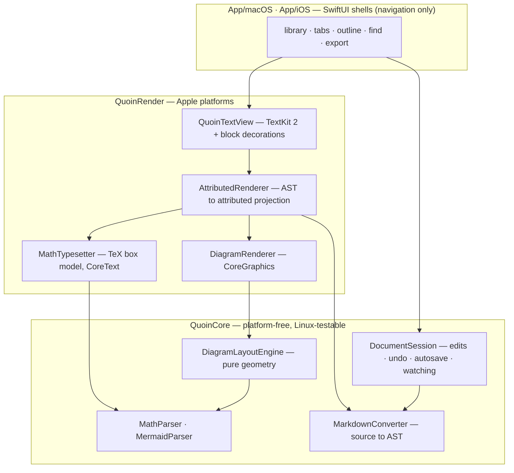

# Quoin

**A native WYSIWYG markdown editor for macOS (and a reader for iOS). Zero
JavaScript, zero web views, local-only.**

Quoin renders markdown — including LaTeX math and Mermaid diagrams — entirely
with TextKit 2, CoreText, and CoreGraphics. There is no embedded browser, no
JS bridge, and no network at runtime. Documents are plain `.md` files on disk;
folders are directories; the round-trip is byte-lossless.

A *quoin* is the wedge a letterpress printer uses to lock type into the
chase — the small, precise tool that makes the whole page hold.


## What makes Quoin different

**The source is the document.** The markdown string and its AST are the single
source of truth — never the attributed string. The editor is a *projection*:
edits mutate the source through a session actor and the renderer re-projects.
Opening a file, editing one paragraph, and saving leaves every untouched byte
identical.

**Syntax-reveal editing.** Click into a paragraph and it re-renders as its
literal source, character-for-character 1:1 with the file — hidden delimiters
become 1-point clear glyphs rather than being removed, so caret math never
lies. Only the span under the caret reveals its `**` / `*` / `==` delimiters;
structural prefixes (`>`, `- [ ]`) stay faded-visible. Escape flips back to
rendered.

**A native math typesetter.** LaTeX is parsed into a TeX-style atom tree and
laid out with real inter-atom spacing classes, stacked big-operator limits,
radicals with indices, auto-sized fences, and grid environments
(`matrix`/`pmatrix`/…, `cases`, `aligned`) — then drawn with CoreText. No
MathJax, no KaTeX.


**Native diagram engines.** Mermaid sources are parsed and laid out by
purpose-built engines: Sugiyama-style layering with fan-out edge attachment,
orthogonal elbow routing with per-face slots, cycle-safe layering, UML
relationship markers (▷ ◆ ◇, crow's feet), and recursive composite states
with fork/join bars and choice diamonds.


**Incremental rendering.** Re-renders reuse per-block fragments keyed by
content-hash-stable block IDs, and updates splice only the changed span into
the live text storage. A keystroke re-renders one block, TextKit 2 re-lays-out
one region, and the viewport never jumps.

**Degrade, never break.** Unsupported LaTeX constructs and Mermaid types render
as a tidy labelled source card with a copy button — degradation looks
intentional, not broken. Pathological input (10k-deep nesting, unclosed
everything) parses to *something* without crashing; the torture suite keeps it
that way.


## Support matrix

### Markdown

| Feature | Status | Notes |
| :--- | :---: | :--- |
| CommonMark core (headings, emphasis, lists, links, images, code, quotes, breaks) | ✅ | via swift-markdown / cmark-gfm |
| GFM tables | ✅ | per-column alignment, numeric columns right-aligned |
| GFM task lists | ✅ | checkboxes toggle with a click and write back to source |
| GFM strikethrough & autolinks | ✅ | |
| Callouts / alerts (`> [!NOTE]` …) | ✅ | 5 semantic types: note, tip, important, warning, caution |
| Highlights (`==text==`) | ✅ | palette cycling with ⇧⌘H (`=={pink}…==`) |
| Footnotes (`[^id]`) | ✅ | gathered at document end, superscript references |
| YAML front matter | ✅ | rendered as a compact metadata chip |
| `[TOC]` | ✅ | live table-of-contents block |
| Code syntax highlighting | ✅ | Swift, Python, JS/TS, Go, Rust, Ruby, C/C++/ObjC, Java/Kotlin, shell, SQL, YAML/TOML, JSON, HTML/XML/CSS |
| Raw HTML blocks | 🟡 | shown as a labelled source card (no HTML engine, by design) |
| Local images | ✅ | async decode at display size; drag-and-drop copies into `assets/` |
| Remote images | 🟡 | placeholder by default (local-only policy) |

### Math (LaTeX)

| Feature | Status |
| :--- | :---: |
| Delimiters: `$…$`, `$$…$$`, `\(…\)`, `\[…\]` | ✅ |
| Greek, operators, relations, arrows, `\infty` `\partial` `\nabla` … | ✅ |
| Fractions, `\sqrt[n]{}`, sub/superscripts | ✅ |
| Big operators with stacked limits (`\sum` `\int` `\prod`) | ✅ |
| `\left…\right` auto-sized fences | ✅ |
| `matrix` `pmatrix` `bmatrix` `Bmatrix` `vmatrix` `Vmatrix` | ✅ |
| `cases` (piecewise) | ✅ |
| `aligned` `align` `alignedat` `split` `gather` | ✅ |
| `\text{}` `\mathbb{}` `\mathbf{}`, upright function names | ✅ |
| Accents (`\vec` `\hat`), `\hline`, `array` column rules | 🟡 source-card fallback |

### Diagrams (Mermaid)

| Type | Status | Notes |
| :--- | :---: | :--- |
| Flowchart / graph | ✅ | layered placement, fan-out attachment, back-edges routed around the band |
| Sequence | ✅ | lifelines, self-message loops |
| Pie | ✅ | |
| Class | ✅ | compartments, orthogonal routing, ▷ ◆ ◇ markers, multiplicity labels |
| ER | ✅ | crow's-foot cardinalities, identifying/non-identifying |
| State (v2) | ✅ | composite states, choice diamonds, fork/join bars, per-scope `[*]` |
| Gantt | ✅ | sections, `after` dependencies, date/duration timeline, statuses, milestones |
| Timeline | ✅ | vertical spine, sectioned event cards, multi-event continuation lines |
| Mindmap | ✅ | tidy horizontal tree, per-branch tints, indentation hierarchy, shape labels |
| User Journey | ✅ | sectioned task rows, 1–5 satisfaction badges, actors |
| Quadrant | ✅ | 2×2 tinted matrix, axis-end labels, plotted points |
| Packet | ✅ | 32-bit grid, fields wrap across rows, bit indices |
| XY Chart | ✅ | grouped bars + line series, value axis, gridlines |
| gitGraph, requirement, C4, sankey, block, kanban, architecture, radar, treemap, … | 🟡 | tidy labelled source card |

### Editor & app

| Feature | Status |
| :--- | :---: |
| Syntax-reveal editing (click to edit, Esc to close) | ✅ |
| Double-click to edit embeds (code / tables / diagrams / math) | ✅ |
| Smart pairs, wrap-selection, word-under-caret formatting | ✅ |
| ⌘B / ⌘I / ⇧⌘H / ⌘K + floating format pill | ✅ |
| Library sidebar (folders = directories), document tabs, quick open | ✅ |
| Outline panel with live section tracking | ✅ |
| Find in document (⌘F / ⌘G) | ✅ |
| Live reload + non-blocking conflict banner on external change | ✅ |
| Source-level undo/redo through the session | ✅ |
| First-H1 auto-rename of Untitled files | ✅ |
| Export: PDF, HTML, Markdown, RTF — light or dark | ✅ |
| Word count, reading time, per-element statistics | ✅ |
| Dark mode (code canvas constant across appearances, per design spec) | ✅ |

## Performance

Budgets from the PRD, enforced in CI (`PerformanceTests`):

- Parse 1 MB of markdown to interactive: **< 1 s**
- Re-parse after a small edit (save-to-screen): **< 100 ms**
- Keystroke → paint: one block re-rendered, one region re-laid-out (fragment
  cache + text-storage splicing)
- 70k-character stress documents scroll at full frame rate — TextKit 2 lays
  out only the visible viewport

## Architecture

<picture>
  <source media="(prefers-color-scheme: dark)" srcset="docs/images/architecture-overview-dark.png">
  
</picture>

<sub>The image above is drawn by **Quoin's own native Mermaid engine** — no Mermaid.js, no JavaScript — from the source below. Regenerate with `QUOIN_DOC_DIAGRAMS=$PWD swift test --filter testRenderDocDiagrams`.</sub>

<details><summary>Mermaid source</summary>



</details>

See [docs/architecture.md](docs/architecture.md) for the full data-flow and
[docs/rendering-roadmap.md](docs/rendering-roadmap.md) for what's next.

## Building

Requires Xcode 16+ / Swift 5.10 on macOS 14+.

```sh
swift build            # QuoinCore + QuoinRender
swift test             # full suite: unit, torture, performance, conformance
```

App targets are generated with XcodeGen:

```sh
brew install xcodegen
cd App/macOS && xcodegen && open Quoin.xcodeproj      # macOS
cd App/iOS   && xcodegen && open QuoinIOS.xcodeproj   # iOS/iPadOS
```

Fixtures for every feature area live in [`Fixtures/renderer/`](Fixtures/renderer/) —
they drive the CI conformance harness (parse + metric snapshots + diagram-layout
invariants) and double as in-app preview documents. CI runs the full test
suite, builds both apps, enforces the performance budgets, and publishes UI
screenshots to the `ci-screenshots` branch on every push.

## Dependency policy

One code dependency: [swift-markdown](https://github.com/swiftlang/swift-markdown)
(Apple's cmark-gfm wrapper). New dependencies require written justification in
the TRD; the default answer is no.

## Privacy

Local-only by design: no network calls, no telemetry, no indexing services.
Remote images are placeholders unless explicitly enabled per document.
