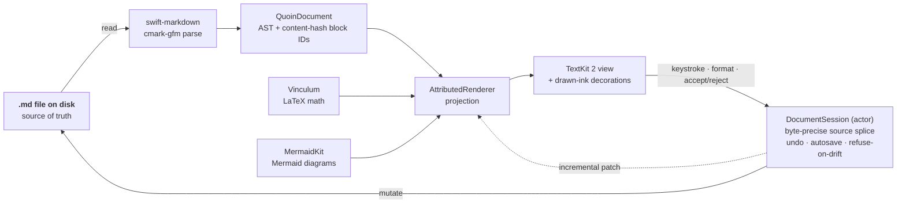

# Quoin — Product Data

This is a data specification for downstream consumption (marketing, design,
documentation). It records what Quoin is and what it does, with claims backed
by tests, docs, or CI-generated screenshots. It deliberately contains no
taglines and makes no visual or format decisions for those surfaces.

Feature groups are labeled **G1–G9** and referenced by shorthand throughout.

---

## Identity

| Key | Value |
| :--- | :--- |
| Name | Quoin |
| Definition | A native macOS WYSIWYG markdown editor. Documents are plain `.md` files; the editor is a live projection of the source, never a separate representation. |
| Status | Pre-release, active development (macOS shipping target; iOS/iPadOS and Linux directions in `docs/design/platforms.md`) |
| License | Application source (repository terms) |
| Repository | github.com/clintecker/quoin |
| Platforms | macOS 14+ (primary). `QuoinCore` is platform-free and builds + tests on Linux; iOS/iPadOS reader exists behind a UIKit path. |
| Language / runtime | Swift 6.0 tools (QuoinCore in Swift 6 language mode), SwiftUI + TextKit 2. Zero JavaScript at runtime; local-only. |
| Rendering | Native attributed-string projection + drawn-ink decorations. No web view, no MathJax/KaTeX, no Mermaid.js. |
| Dependencies | One third-party package (swift-markdown / cmark-gfm). Two first-party engine packages consumed from GitHub: MermaidKit (`from: 0.10.0`) and Vinculum (`from: 0.23.0`). |
| Verification | A comprehensive package test suite (600+ tests) passes with zero failures; the platform-free core suite also runs headless on Linux. |
| Origin | Built as a WYSIWYG markdown editor whose source of truth is the markdown string + AST, so that any tool writing markdown — including agents — writes Quoin documents. |

---

## Architecture at a glance

The `.md` file is the single source of truth. The editor is a projection of it:
the file is parsed to an AST, rendered to one attributed string, and drawn
natively. Every edit — a keystroke, a formatting command, a review resolution —
is computed as a byte-precise splice into the source and re-projected, so what
is on screen and what is on disk never diverge.

Math (Vinculum) and diagrams (MermaidKit) are first-party engines that feed the
same native projection — no web view, no JavaScript. `QuoinCore` (parse,
session, review, front matter, export) carries no AppKit and builds on Linux, so
the whole document engine is reusable without a UI.

---

## Target Audiences

| Audience | Job to be done | Features that matter most |
| :--- | :--- | :--- |
| Writers & note-takers | Edit real markdown files with a WYSIWYG feel, losing no fidelity and no ownership of the file | G1, G2, G6 |
| Technical & scientific authors | Write documents mixing prose, code, math, diagrams, and tables in one native surface | G2, G3 |
| Reviewers & collaborators | Read a document and accept/reject suggested changes in place, byte-safely | G4 |
| AI / agent workflows | Have an agent propose edits as durable, portable marks in the file; review them in a real UI | G4, G8 |
| Knowledge-base keepers | Manage a folder of documents with an outline, quick-open, search, and structured front matter | G5, G7 |
| Platform / editor engineers | Reuse a platform-free document engine (parse, session, review, export) without a UI | G8, G9 |

---

## Feature Groups

### G1 — WYSIWYG editing on a plain-text source

The editor is a projection; edits mutate the markdown string and the renderer
re-projects. See `docs/reference/invariants.md`, `docs/design/editor-modes.md`.

| Feature | Specific |
| :--- | :--- |
| Source of truth | The markdown string + AST (swift-markdown / cmark-gfm), never an attributed string. Round-trip (open → edit → save) is byte-lossless for untouched regions. |
| In-place syntax reveal | The active block re-renders as its literal source, character-for-character 1:1 with the file; hidden delimiters become 1-point clear glyphs (never removed), so caret mapping and edits stay exact. |
| Viewport invariant | On any projection change — reveal, close, keystroke, for every block type — the line the caret/click is on does not move on screen; edit mode preserves the block's vertical skeleton. Enforced by RevealFidelityTests + CaretLineAnchorTests. |
| Patch-not-rerender | Activation flips and per-keystroke edits splice only the changed span into live storage; patch-vs-full-render equivalence is proven across the fixture corpus (ProjectorEquivalenceTests). |
| Live formatting | Bold ⌘B, italic ⌘I, link ⌘K, highlight ⇧⌘H (palette cycling), all as source edits. |
| Width & layout stability | Sidebar toggles and window resizes hold the reading position; the caret/top line is anchored across reflow. |

### G2 — Markdown, math, and diagram coverage

Rendered natively; degrade-never-break for unsupported constructs. Source
support matrix in `README.md`.

| Feature | Specific |
| :--- | :--- |
| CommonMark core | Headings, emphasis, lists, links, images, code, quotes, breaks (via cmark-gfm). |
| GFM | Tables (per-column alignment, numeric columns right-aligned), task lists (click-toggle, written back to source), strikethrough, autolinks. |
| Callouts | The five GFM alert types — note, tip, important, warning, caution (`> [!NOTE]`); `danger`/`error` are recognized as aliases of the caution severity. |
| Extended inline | Highlights `==text==` with palette cycling; footnotes `[^id]` with click-to-jump, hover preview, and ↩ backlinks; `[TOC]` live table-of-contents. |
| Code | Syntax highlighting for Swift, Python, JS/TS, Go, Rust, Ruby, C/C++/ObjC, Java/Kotlin, shell, SQL, YAML/TOML, JSON, HTML/XML/CSS. 12 selectable canvas themes; default follows the app appearance. |
| Math (LaTeX) | ~400 classed symbols, fractions, roots, scripts, big operators with correct limits, matrices, alignment environments; inline `$…$` `\(…\)` and display `$$…$$` `\[…\]`. Powered by Vinculum (native TeX-style typesetting; no MathJax/KaTeX). |
| Diagrams (Mermaid) | Parsed and laid out natively by MermaidKit (no Mermaid.js); front-matter `title`/`config` and `accTitle`/`accDescr` supported. |
| Front matter | YAML front matter rendered as a field grid; editable via the Properties panel (G5). |
| Degrade, never break | Unsupported LaTeX commands and Mermaid diagram types render as a labeled source card with a specific reason, never a blank or a crash. Raw HTML blocks show as labeled source cards (no HTML engine, by design). |

### G3 — Documents, embeds, and interaction

| Feature | Specific |
| :--- | :--- |
| Embed editing | Code, math, and diagram blocks reveal their source with a live side-panel preview (not an inline run); the last-good render is held while mid-edit source is broken, so height never flashes with parse validity. |
| Interactive runs | Task checkboxes, heading-anchor jumps, code-block copy buttons, and `‹/› edit` chips are link-plumbed interactions over the projection. |
| Block operations | Move up/down, duplicate, delete, and table row/column insertion — all byte-exact source splices via the context menu. |
| Images | Local images decode async at display size; drag-and-drop copies into `assets/`. Remote images are placeholders by default (local-only policy). |

### G4 — Review: suggestions and comments in the file

A complete RDFM/CriticMarkup review loop. Marks live in the `.md` file;
resolutions are atomic, byte-safe source edits. See
`docs/design/suggestions.md`.

| Feature | Specific |
| :--- | :--- |
| Mark rendering | `{++insert++}` `{--delete--}` `{~~old~>new~~}` `{>>comment<<}` `{==highlight==}`, rendered as tracked changes; raw delimiters never appear in the read projection. |
| Review inspector | A sidebar mode listing every mark as a card (author, relative time, the change in suggestion tints); Accept / Reject / Dismiss per card and Accept All / Reject All, each one atomic edit = one undo. |
| Card ↔ document linkage | Clicking a card scrolls its mark to viewport center and flashes an accent ring; caret-in-mark highlights the card. Resolutions pulse the spliced location; offscreen changes scroll into view. |
| History | Resolutions are recorded as RDFM endmatter (`status: resolved`) — portable, agent-readable, never lost; the Review tab persists once history exists. |
| Create without editing prose | Select text → Add Comment (⇧⌘M), Suggest Replacement (⇧⌘R), Suggest Deletion, Highlight — each one atomic annotation (mark + `by:`/`at:` endmatter entry). Marks wrap the prose byte-exactly; only resolution changes what the document says. |
| Comment opaque blocks | Code, tables, diagrams, and math get a block-adjacent `{>>comment<<}` paragraph (RDFM opacity is normative; marks never inject into runnable content). |
| Review Mode | A toggle (⌃⌘R) where ordinary typing becomes suggestion marks (insertions `{++…++}`, deletions `{--…--}`, replacements `{~~…~>…~~}`), with stateless coalescing so a keystroke grows one mark rather than minting many. |
| Safety | Every resolution/annotation is computed inside the session actor at apply time against current truth, refusing on drift rather than splicing stale offsets; structure-preserving (an annotation that would change document structure refuses). Self-calibrating: candidate edits are re-parsed and rejected unless exactly the expected mark comes back. |

### G5 — Library, navigation, and properties

| Feature | Specific |
| :--- | :--- |
| Library | A user-picked folder (security-scoped bookmark) as the document tree; folders are directories, documents are plain files. Per-window folders: Open Folder in New Window; each window restores its folder on relaunch. |
| Navigation | Outline inspector (manual collapse is authoritative), quick open, recents, daily note (⌘D), library-wide search (⇧⌘F), in-document find & replace (⌘F; ⌘G / ⇧⌘G cycle matches). Replace operates on the raw source as atomic edits (Replace All is one undo). Tabs (⌘1–9) with positional close focus; the tab bar compresses and never forces the window wider than the screen. |
| Properties | A Properties inspector editing front matter as a key/value panel with type-appropriate editors — date picker, bool toggle, number field, CSV for lists, plain text otherwise — and an Edit-as-Text escape hatch. Byte-conservative: a value that does not parse cleanly as its type stays a string; typed writes preserve the original precision. |
| Focus & flow | Focus mode (dim all but the current block/sentence), typewriter scrolling, word-count goals, jump history (⌘[ / ⌘]). |

### G6 — Fidelity and correctness

| Feature | Specific |
| :--- | :--- |
| Byte-lossless round-trip | Untouched source regions survive edit → save unchanged; enforced by conformance and round-trip tests. |
| Projection equivalence | The four projection paths (full render, activation flip, per-keystroke patch, caret-move restyle) are proven byte- and attribute-identical across the fixture corpus on every CI run (no drift). |
| Reveal fidelity | The revealed active block is character-exact with the source; per-line vertical skeleton is preserved (RevealFidelityTests, CaretLineAnchorTests). |
| Content-hash block IDs | Blocks are identified by content hash + occurrence, so edits splice only the changed span and identities match a full parse. |
| Degrade contract | Unsupported constructs render as labeled cards with a specific reason; never blank, never crash (torture fixtures). |

### G7 — Editing responsiveness

Incremental parse + patch rendering keep the edit loop cheap on large
documents. Baselines in `docs/reference/performance.md`.

| Metric (release, ~1.2 MB / 5,402-line document, 2,701 blocks) | Value |
| :--- | ---: |
| Initial full parse | 344.85 ms |
| Cold render | 98.00 ms |
| Activate block (reveal) | 75.44 ms |
| Apply one byte-precise middle edit | 0.79 ms |
| Incremental parse-after-edit (fast path) | 8.86 ms |
| Fast-path strategy for a middle insert | `plainParagraphFastPath` |

Incremental parsing has two fast paths (plain-paragraph and fenced-block); a
per-keystroke edit patches a single fragment and shifts block ranges by one
delta rather than re-rendering the document. Suggestion marks carry absolute
ranges, so a document containing live marks re-anchors via a full parse (guard).

### G8 — Platform-free engine and interop

| Feature | Specific |
| :--- | :--- |
| QuoinCore | Parse, `DocumentSession` (undo, autosave, conflict handling), search, statistics, exporters, and the entire review + front-matter machinery — with zero AppKit imports. Builds and tests on Linux. |
| In-actor edit APIs | `applyResolution`, `applyBulkResolution`, `applyAnnotation`, `applyFrontMatterEdit`, `removeFrontMatterField` — all compute at apply time and refuse on drift; the seam a CLI or second host reuses. |
| Interop by construction | Because the file is the source of truth, any tool that writes markdown (or RDFM/CriticMarkup) writes Quoin documents; the review loop is the agent-handoff story — an agent writes marks, the app renders cards. |
| Exporters | Plain-text, Markdown (round-trip), and HTML exporters as pure functions of the document. |
| First-party engines | Math and diagrams are Quoin-owned packages (Vinculum, MermaidKit), layout/render split behind theme seams, tested by their own CI. |

### G9 — Engineering & verification

| Feature | Specific |
| :--- | :--- |
| Test suite | A comprehensive package test suite (600+ tests, zero failures), including performance budgets (PerformanceTests) and pathological inputs (TortureTests). |
| Invariant enforcement | Named invariants (`docs/reference/invariants.md`) with dedicated tests: viewport anchoring, reveal fidelity, projection equivalence, decoration geometry. |
| No flaky tests | Intermittent failures are diagnosed to a definitive cause, never labeled environmental (ADR-0007); corpus tests assert minimum check counts so silent bailing cannot fake a pass. |
| Decision records | `docs/reference/adr/` records non-obvious roads taken and rejected, each with cited evidence. |
| Cross-platform | The platform-free core suite runs green headless on Linux; word-count parity is pinned across platforms. |
| Screenshot automation | Launch arguments preset app state; CI publishes PNGs to the `ci-screenshots` branch on every push. |

---

## Approach

Positioned in design space, not against named competitors.

| Concern | WebView renderer (Mermaid.js / KaTeX) | Separate markdown viewer + editor | Quoin |
| :--- | :--- | :--- | :--- |
| Document truth | HTML/DOM; markdown is an import/export format | Two representations kept in sync | The markdown string + AST is authoritative; the view is a projection |
| Round-trip | Lossy by construction (HTML → markdown) | Depends on the sync layer | Byte-lossless for untouched regions, by rule |
| Runtime | JavaScript engine + web view | Varies | Native TextKit 2; zero JS at runtime |
| Math / diagrams | Third-party JS libraries in a web view | External renderers or images | Native first-party engines (Vinculum, MermaidKit); degrade never break |
| Review / suggestions | App-specific data model or none | Usually none | RDFM/CriticMarkup marks in the file; atomic, portable, agent-writable |
| Offline / privacy | Depends on bundled assets | Varies | Local-only; documents are plain files on disk |
| Reuse without UI | Coupled to the web stack | Coupled to the app | Platform-free `QuoinCore` engine (Linux-buildable) |

---

## Image Asset Inventory

Repository images live under `docs/images/`; CI-generated application
screenshots are published to the `ci-screenshots` branch on every push and
refresh automatically.

| Asset | Shows | Suited for |
| :--- | :--- | :--- |
| `docs/images/hero.png` | The editor with a rich document | Hero |
| `docs/images/gallery-math.png` | Native LaTeX math typesetting | Feature (G2) |
| `docs/images/gallery-diagrams.png` | Native Mermaid diagrams | Feature (G2) |
| `docs/images/gallery-blocks.png` | Blocks, callouts, and tables | Feature (G2) |
| `docs/images/architecture-overview.png` (+ `-dark`) | System architecture map | Reference (G8) |
| `docs/images/data-flow.png` (+ `-dark`) | Document data flow | Reference (G1) |
| `ci-screenshots` branch | Live app screenshots per push (light/dark) | Proof, marketing |

---

## Documentation Index

| Module | Content |
| :--- | :--- |
| `README.md` | Public overview + support matrix (the capability source of truth) |
| `docs/reference/architecture.md` | Contributor-level machinery map (data flow, editing model, engines, invariants) |
| `docs/reference/invariants.md` | The named invariants and the tests that enforce them |
| `docs/reference/adr/` | Architecture Decision Records (roads taken and rejected, with evidence) |
| `docs/design/handoff.md` | The visual/interaction spec (colors, type ramp, spacing, states) |
| `docs/design/suggestions.md` | The review loop design (RDFM/CriticMarkup) |
| `docs/design/editor-modes.md` | The projection/editing-mode architecture |
| `docs/design/embed-editing-ux.md` | Embed reveal + side-panel preview UX |
| `docs/design/platforms.md` | iPhone/iPad and Linux direction |
| `docs/reference/performance.md` | Editing-responsiveness benchmarks |
| `docs/archive/TRD.html`, `docs/archive/PRD.html` | Architecture and original scoped PRD |
| MermaidKit repo | Diagram engine capability matrix + docs |
| Vinculum repo | Math engine coverage (`COVERAGE.md`, `COMMANDS.md`) + docs |

---

## Note on Modularization

This spec references the two engine packages (MermaidKit, Vinculum) rather than
restating their capabilities, which drift when duplicated. Feature groups G1–G9
are self-indexing by shorthand; a marketing or docs surface can lift any single
group as a standalone section, and the Approach table and Asset Inventory are
each usable independently. Numeric claims (test counts, symbol counts,
benchmark timings) should be re-pulled from the cited sources at publish time,
as they move with the codebase.
