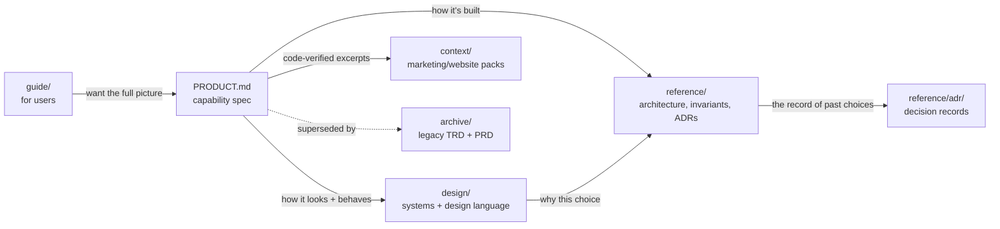

# Documentation map


Where to look, by question. The tree is organized by audience:

```
docs/
  PRODUCT.md          capability spec — the reference for "what it does"
  guide/              for users: getting started, the feature tour
  reference/          for developers: architecture, invariants, ADRs, deps, performance
  design/             how the major systems work + the design language
  context/            code-verified feature packs for marketing/website work
  archive/            legacy specs kept for reference
  internal/           development records (ledgers, plans) — not reader documentation
  images/             the images the docs and README embed
```

The categories build on each other more than the flat list suggests: the guide
is the front door, [PRODUCT.md](PRODUCT.md) is the capability spec everything
else answers to, `design/` explains how it looks and behaves, `reference/` is
how it's built underneath, and `context/` is a code-verified digest of
`PRODUCT.md` for people writing about Quoin rather than building it.



## New here? Start with the guide

- **[guide/getting-started.md](guide/getting-started.md)** — open Quoin, pick a
  library folder, edit your first document, learn the essential shortcuts.
- **[guide/features.md](guide/features.md)** — the full feature tour, organized
  by what you *do*: write, review, organize, read.

## What is Quoin, and what does it do?

- **[PRODUCT.md](PRODUCT.md)** — the reference-grade capability spec; every
  claim backed by a test, doc, or screenshot. The source of truth for
  capabilities; downstream surfaces (marketing, website) lift from here.
- **[`../README.md`](../README.md)** — the public overview and support matrix.

## How does the review & commenting system work?

- **[design/suggestions.md](design/suggestions.md)** — the differentiator:
  tracked changes and comments as literal marks in your `.md` file, an
  agent-writable review loop, and byte-safe accept/reject. The best starting
  point for the feature that makes Quoin unique.

## How does it work (for developers)?

- **[reference/architecture.md](reference/architecture.md)** — the machinery
  map: markdown string + AST as source of truth → parse → session → project →
  display; the editing model; the review subsystem; the engine seams.
- **[reference/invariants.md](reference/invariants.md)** — the guarantees that
  keep Quoin correct (byte-lossless round-trip, the caret/viewport invariant,
  projection equivalence, atomic edits) and how the code enforces them.
- **[reference/adr/](reference/adr/README.md)** — the key architectural
  decisions and *why* they were made.
- **[reference/dependencies.md](reference/dependencies.md)** — the
  one-third-party-dependency philosophy and the full graph, including the
  platform-free/platform-render split for the first-party engines.
- **[reference/performance.md](reference/performance.md)** — how Quoin stays
  fast: incremental parsing, patch rendering, viewport-lazy layout.
- **[reference/distribution.md](reference/distribution.md)** — how a release
  actually ships: notarization, the Sparkle appcast, and the signing keys.

## How does editing work?

- **[design/editor-modes.md](design/editor-modes.md)** — the projection model:
  the document is a live rendering of the source; clicking a block reveals its
  literal markdown; the caret line never moves.
- **[design/embed-editing-ux.md](design/embed-editing-ux.md)** — editing code,
  math, and diagram embeds with a live side-panel preview.

## What does it look like, and where does it run?

- **[design/handoff.md](design/handoff.md)** — Quoin's visual and interaction
  design language (the Graphite aesthetic, type ramp, spacing, principles);
  the high-fidelity mockup it's drawn from sits alongside it as
  [`design/Markdown Editor Design Doc.dc.html`](design/Markdown%20Editor%20Design%20Doc.dc.html)
  (and a PDF export).
- **[design/platforms.md](design/platforms.md)** — Quoin across platforms:
  macOS today, and the iPhone/iPad and Linux directions.
- **[guide/screenshots.md](guide/screenshots.md)** — the screenshot manifest:
  every shot, its launch args, and where it's used. Shots regenerate on every
  push.

## What can it render?

- **[`../README.md`](../README.md)** — the public support matrix.
- **Engines:** [MermaidKit](https://github.com/2389-research/MermaidKit) (diagrams)
  and [Vinculum](https://github.com/2389-research/Vinculum) (math) document
  themselves — their repos are the source of truth for coverage, described in
  more depth in [reference/dependencies.md](reference/dependencies.md). Quoin's
  docs deliberately don't duplicate those matrices (they drift; see
  [ADR 0003](reference/adr/0003-first-party-engines.md)).
- **[context/quoin-features.md](context/quoin-features.md)** /
  **[context/mermaidkit-features.md](context/mermaidkit-features.md)** —
  code-verified feature packs for marketing and website work.

## Where do the original specs live?

Superseded by the documents above for scope and detail, but kept for the
architectural reasoning they still carry:

- **[archive/TRD.html](archive/TRD.html)** — the original technical
  requirements doc: native engines, the session model. Where it conflicts with
  [design/handoff.md](design/handoff.md), the handoff wins.
- **[archive/PRD.html](archive/PRD.html)** — the original viewer-scoped
  product spec, superseded in scope by [PRODUCT.md](PRODUCT.md) but still
  valid for performance budgets and the privacy stance.

## Contributor conventions

- **[`../CLAUDE.md`](../CLAUDE.md)** — working conventions, build/debug
  recipes, and hard-won pitfalls.
- **`internal/`** — development records (ledgers, plans, extraction notes).
  Useful history, but not part of the reader-facing documentation.
