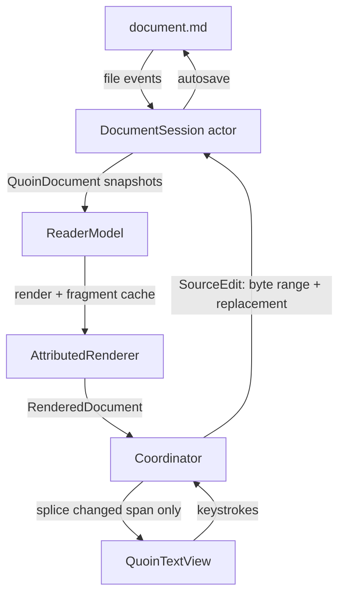

# Quoin architecture

This is the contributor-level map: how a markdown file becomes pixels, how an
edit flows back to disk, and which invariants hold everything together. The
visual/interaction spec lives in `docs/design/handoff.md`; this document is
about the machinery.

## The one rule

**The markdown source string (plus its AST) is the only source of truth.**
The attributed string on screen is a *projection* of that source. Nothing in
the app ever treats the text view's contents as data: every keystroke is
intercepted, converted to a source edit, applied to the source, re-parsed, and
re-projected. This is what makes the round-trip byte-lossless — untouched
regions of the file are never re-serialized, because the file is never
serialized *from* the view at all.

## Dependencies

Quoin has exactly **one third-party dependency** and two first-party packages
of its own (all pinned in `Package.swift`):

| Package | Version | Role | Policy |
| --- | --- | --- | --- |
| `swift-markdown` (swiftlang) | `from: 0.8.0` | CommonMark/GFM parse via cmark-gfm | the one allowed third-party dep |
| `MermaidKit` (clintecker) | `from: 0.9.0` | Mermaid diagrams (`MermaidLayout` + `MermaidRender`) | first-party, exempt |
| `Vinculum` (clintecker) | `from: 0.23.0` | LaTeX math (`VinculumLayout` + `VinculumRender`) | first-party, exempt |

MermaidKit and Vinculum are Quoin's own published packages, consumed from
GitHub exactly like any other host app would — they were extracted out of
this repo, not vendored in, so their engines are versioned and CI-tested on
their own. The one-third-party-dependency rule still bites for anything
genuinely external: a new outside dependency requires a written TRD case
first, and the default answer is no. Each first-party package splits a
platform-free layout product (Foundation-only, Linux-clean) from an
Apple-only render product; QuoinCore `@_exported import`s the layout product
of each (`MermaidReexport.swift`, `VinculumReexport.swift`) so their public
types stay reachable through `import QuoinCore`.

## Data flow

The edit loop is a one-way cycle: keystrokes never mutate the view directly —
they become source edits, and the view only ever receives re-projections.

<picture>
  <source media="(prefers-color-scheme: dark)" srcset="images/data-flow-dark.png">
  
</picture>

Rendered by Quoin's own native Mermaid engine from the source below, so
this document doubles as a fixture. Regenerate with `QUOIN_DOC_DIAGRAMS=$PWD
swift test --filter testRenderDocDiagrams`.

Mermaid source

### Parse (QuoinCore)

`MarkdownConverter.parse` runs swift-markdown (cmark-gfm) and post-processes:

- **Source map.** Every block carries a `ByteRange` into the UTF-8 source.
  Block identity (`BlockID`) is `contentHash:occurrence` — stable across
  re-parses when content is unchanged, which is what the fragment cache and
  scroll anchoring key on.
- **Math scanning** happens against the *raw source slice*, not the parsed
  inline tree: cmark has no math extension and mangles `$a_b + c_d$` into
  emphasis. The scanner recognises `$…$`, `$$…$$`, `\(…\)`, and `\[…\]`
  (`MathScanner`, a Vinculum type re-exported through QuoinCore); the
  non-math remainder is re-parsed as inline markdown. Standalone display
  blocks (`$$`/`\[` alone on their lines, blank-line separated) are claimed
  from the raw source *before* cmark (`DisplayMathPrescan`, same
  split-before-cmark precedent as front matter): a setext-lookalike
  interior line (bare `=`, `---`) would otherwise tear the span into
  paragraph + phantom heading + orphan tail. A span the scanner does not
  confirm as exactly one display segment is left to cmark untouched.
- **Extension post-passes** splice highlights (`==…==`), callout detection,
  front matter, `[TOC]`, and footnote gathering.

### Session (QuoinCore)

`DocumentSession` is an actor owning the live document: it applies
`SourceEdit`s, maintains source-level undo/redo, autosaves, watches the file,
and publishes immutable `QuoinDocument` snapshots. External changes while
edits are unsaved surface as a non-blocking conflict banner (keep mine / take
disk); self-inflicted file events are recognised by source hash.

**Session ownership (app layer).** `OpenDocumentStore` is an app-global
registry: exactly ONE `ReaderModel` (and thus one `DocumentSession` /
autosaver) per file, keyed by the resolved + standardized URL and
ref-counted across every window and tab (launch ledger #12). A first-H1
rename re-keys the entry and broadcasts so every window re-points its tab.
Because the model outlives the transient editor view, switching tabs keeps
the session and undo history alive, and the editor stashes its scroll +
caret in the model (`ViewportSnapshot`) on teardown and restores them on
return (ledger #22).

**Keystroke fast paths.** `MarkdownConverter.parseAfterEdit` re-parses
block-locally for the two things a caret does all day: typing in a plain
paragraph and typing inside a fenced embed block (code / mermaid / math).
Both paths re-parse only the edited block's source slice with the real
parser — never a hand-rolled imitation (cmark's smart punctuation once made
an imitation diverge) — and self-calibrate: the old slice must reproduce the
old block exactly, and the new slice must stay one block of the same family,
grown by exactly the edit's byte delta. Anything structural (a new fence, a
paragraph turning into a list, a footnote in the document) falls back to the
full parse; conservative rejections are always safe. Container blocks below
the edit get their ids re-derived, because a container's `contentHash`
covers its children's ranges and moves with every byte inserted above it.
The editing-latency contract — every keystroke's core slice fits in a 60 Hz
frame at ANY document size, charts or not — is enforced in CI by
`EditingLatencyTests` (strategy assertions + wall-clock ceilings over
generated small/medium/large/novel fixtures) and, for the render slice, by
`EditingRenderLatencyTests`.

### Project (QuoinRender)

`AttributedRenderer.render` walks the block list and emits one attributed
string:

- Every block's range is tagged `QuoinAttribute.blockID`; block chrome is
  tagged `QuoinAttribute.blockDecoration` (drawn by the view, see below).
- **Fragment cache:** unchanged blocks (same `BlockID`) reuse their rendered
  fragment; only changed blocks re-render. Fragments holding unresolved async
  content (a still-decoding image placeholder) are deliberately *not* cached,
  or the placeholder would stick forever.
- **The active block** renders as literal source (`MarkdownSourceStyler`)
  instead of its projection — see “Editing model”.
- **Presentation owner:** which block is editing and how it styles is decided
  ONCE per projection by the pure `presentation(for:activeBlockID:)`
  (`BlockPresentation.swift`) — `.rendered` or `.editing(flavor:chrome:)`,
  where the flavor table (prose / verbatim / preview) is the single place a
  block kind maps to reveal behavior. Exactly one block edits at a time (an
  invariant, not an accident).
- **Single derivations:** the block separator (characters AND clamp styling)
  comes from one `separator(after:before:revealedSlice:)`; the reveal's
  styler configuration comes from one `revealStylerConfig(kind:slice:)`,
  carried on `RenderedDocument.revealStyler` so the view-side caret-move
  restyle consumes it verbatim. Patch producers validate against these same
  derivations, so projection paths cannot drift (see Testing).
- **Patch producers:** the activation flip (`activationFlipUpdate`) and the
  per-keystroke active-block edit (`activeBlockEditUpdate`) build bounded
  `RenderStoragePatch`es IN the renderer, next to the render loop they must
  agree with. `RenderedDocument.storagePatches` + `patchBaseLength` carry
  them to the view; any validity failure returns nil and the model falls
  back to the always-correct full render.
- **Live preview retention** (mermaid/math side panel): the last-good
  artifact is `HeldPreview` — SESSION state owned by `ReaderModel` and
  threaded through render passes as an explicit `inout`; the renderer holds
  no hidden mutable state.

### Display (QuoinRender)

`QuoinTextView` (TextKit 2) displays the projection. Updates go through
`Coordinator.spliceChanges`, which diffs common prefix/suffix and replaces
only the changed span of the live `NSTextStorage` — TextKit re-lays-out just
that region, so unchanged content keeps its exact layout and the scroll offset
never jumps. A full `setAttributedString` happens only when most of the
document changed, and only that path re-anchors scroll.

**Block decorations** (code canvases, callout boxes, quote rules, diagram
frames, table rules, the front-matter chip) are drawn in
`drawBackground(in:)` from laid-out fragment frames — *never* with
`.backgroundColor` attributes, which render as ugly per-line strips.

**Every draw is a settled draw:** `viewWillDraw` finishes the viewport's
layout before any pixel paints (preserving the caret line's screen position
across the settle — the viewport invariant applies to the settle itself),
so decorations never draw against estimated geometry. One measure pass per
draw (`measureVisibleRuns`, viewport-culled) produces the geometry snapshot
every chrome consumer reads: the draw pass, the ✓ done chip's hit-test and
tooltip, the preview-panel anchor, and the accessibility element all derive
from `EditingChrome` — one measured box, so they can never disagree. The
chip itself draws in `draw(_:)`, ABOVE the glyphs, and is exposed to
VoiceOver as a pressable "Done editing" button.

## Editing model (syntax reveal)

Clicking a block activates it: the renderer swaps that block's projection for
its **literal source**, styled but character-for-character 1:1 with the file.
Hidden span delimiters are 1-point clear glyphs — never removed — so a caret
offset in the revealed text *is* a source offset (UTF-16 → UTF-8 mapped at
the edit boundary via `EditMapping`).

- Span delimiters (`**`, `*`, `==`, backticks, link syntax) reveal only when
  the caret is inside the span; structural prefixes (`>`, `- [ ]`) stay
  faded-visible. Caret movement restyles attributes only — the text never
  changes, so selection and the 1:1 mapping survive.
- Keystrokes are intercepted in `shouldChangeTextIn` and become relative
  byte-range edits routed through the session; the storage itself is never
  mutated by typing (always returns `false`).
- Code, tables, TOC, and HTML blocks flip to source on **double-click**;
  diagrams and math open only through explicit intent — the ‹/› edit chip,
  ⌘↩, or the context menu — so a single click (or double-click) can admire
  or select a rendered artifact without turning it into text.
- Smart pairs complete/type-over delimiters; typing a delimiter over a
  selection wraps it; format commands (⌘B etc.) without a selection act on
  the word under the caret.

When adding a new inline span type you must touch **both** sides: a renderer
case in `AttributedRenderer` and a styler pass in `MarkdownSourceStyler`, and
register its delimiter in the claimed-ranges ordering (`**` before `*`, links
before emphasis).

## Math engine (Vinculum)

Math is **not** Quoin code. It lives in **Vinculum**
(`github.com/clintecker/Vinculum`), Quoin's own published package, consumed
from GitHub exactly like MermaidKit — first-party, so exempt from the
one-third-party-dependency policy. Vinculum ships two products:
`VinculumLayout` (Foundation-only, builds/tests on Linux — parsing, macros,
all typesetting geometry, the OpenType MATH-table constants, the device-
independent `MathScene` IR) and `VinculumRender` (Apple-only — measuring,
drawing via CoreText/CoreGraphics, the bundled font, the cached
`NSTextAttachment`). QuoinCore `@_exported import`s `VinculumLayout`
(`VinculumReexport.swift`), so `MathParser`, `MathNode`, `MathScanner`,
`MathMacros`, `MathAlphabet`, and the model enums stay reachable through
`import QuoinCore` with no per-file import — the same pattern as
`MermaidReexport`.

The breadth is now large — on the order of **400 commands** across 24
`MathNode` cases: TeX-model atom-class spacing, generalized fractions,
accents, over/under constructs, stretchy delimiters with real MATH-table
size variants, boxes, stateful `\color`, math alphabets, and ~400 symbols.
The exhaustive, current coverage matrix is Vinculum's to own — see
`Vinculum/docs/ARCHITECTURE.md`, `COVERAGE.md`, and `COMMANDS.md` rather
than duplicating a list here that would only drift. `MathParser.parse`
never fails: unknown commands become `.unsupported` leaves, and
`isFullySupported` / `unsupportedCommands(in:)` gate native rendering vs.
the source-card fallback.

**What Quoin owns is the integration, not the typesetting:**

- **Scanning.** `MarkdownConverter` runs `MathScanner` (a Vinculum type,
  re-exported) over the *raw source slice* — cmark has no math extension and
  would mangle `$a_b$` — recognising `$…$`, `$$…$$`, `\(…\)`, `\[…\]`.
- **Macros.** The `\newcommand`/`\def` pre-pass is host-driven: because
  definitions are document-scoped, `MarkdownConverter` collects them across
  every math segment up front (order-independent) and expands each equation's
  latex before it's stored. The source range is untouched, so byte-lossless
  round-trip and syntax reveal still see the literal source.
- **The theme seam.** `Theme.mathTheme` projects Quoin's design system onto
  Vinculum's `MathTheme` (just ink + `prefersDark`) — the same adapter
  pattern as `diagramTheme`. `AttributedRenderer` calls
  `MathImageRenderer.attachmentString(latex:display:mathTheme:baseSize:)`
  (from VinculumRender); a `nil` return means unsupported and drops to the
  styled source card, whose caption is built from `MathParser
  .unsupportedCommands` naming the offending `\command`s.

Vinculum's own CI tests the parser, layout geometry (headless, via an
injected measurer), and golden renders — not Quoin's. To co-develop, point
`Package.swift` at a local checkout (`.package(path: "../Vinculum")`, don't
commit it) or `swift package edit Vinculum`, then publish, tag, and bump the
version here. See `docs/math-extraction.md` for the extraction history.

## Diagram engine (MermaidKit)

Diagrams, like math, are a separate first-party package: **MermaidKit**
(`github.com/clintecker/MermaidKit`), consumed from GitHub and exempt from
the dependency policy. It splits the same way Vinculum does:
`MermaidLayout` (platform-free parser + layout + scene IR + geometry linter,
Linux-clean) and `MermaidRender` (CoreGraphics/CoreText drawing behind a
`DiagramTheme` seam). QuoinCore `@_exported import`s `MermaidLayout`
(`MermaidReexport.swift`), so `MermaidParser` and friends stay reachable
through `import QuoinCore`. All Mermaid diagram types render natively
(flowchart/graph, sequence, class, state, ER, pie, gantt, journey, …); the
layout internals (Sugiyama layering, dummy-node edge routing, composite-state
recursion) are MermaidKit's to document.

Quoin's side is again just the seam and the fallback: `Theme.diagramTheme`
projects Quoin's design system onto MermaidKit's `DiagramTheme` (ink,
secondary/tertiary text, canvas, accent, hairline, `prefersDark`), and
`AttributedRenderer` calls `MermaidRenderer.attachmentString(source:theme:)`
(from MermaidRender) — an unparseable or unsupported source returns `nil`
and drops to the tidy source card. Diagram-engine changes are tested by
MermaidKit's own CI, not Quoin's; co-develop via a local `.package(path:)`
or `swift package edit MermaidKit`, then publish, tag, and bump.

## Platform layering

The engine is built to be reused anywhere Swift compiles; only the view shell
is platform-specific.

- **`QuoinCore`** imports no UI framework at all (no AppKit/UIKit/SwiftUI) —
  `CGRect`/`CGPoint`/`CGFloat` come from Foundation on Linux and CoreGraphics
  on Apple platforms, guarded by `#if canImport(CoreGraphics)`. It builds on
  macOS, iOS, iPadOS, visionOS, and Linux.
- **`QuoinRender`** splits into shared engine and platform views. The shared
  files — `AttributedRenderer`, `MarkdownSourceStyler`, `Theme`,
  `BlockDecoration`, `QuoinAttributes`, `TableLayout`, `AsyncImageStore`,
  `DocumentExporters` — are guarded
  `canImport(AppKit) || canImport(UIKit)` and branch on `PlatformFont` /
  `PlatformColor` / `PlatformImage` typealiases, so one body compiles on both
  AppKit and UIKit. The platform view layers live in their own subfolders:
  `AppKit/` holds the macOS `NSTextView` editor (`QuoinTextView`,
  `ReaderCoordinator`, `MarkdownReaderView`); `UIKit/` holds the
  iOS/iPadOS/visionOS reader (`MarkdownReaderViewIOS`). Each is gated so it
  simply compiles out on the other platform.

The macOS editor is *not* a separate SwiftPM target on purpose: it depends on
module-internal render helpers (`QuoinTextView.invalidateDecorations`,
`MarkdownSourceStyler`, the decoration-drawing internals), and hoisting it
across a target boundary would force that surface public — weakening
encapsulation instead of strengthening it. The `#if` gate already gives clean
per-platform compilation with everything kept internal.

Mac Catalyst is not currently supported: on Catalyst `canImport(AppKit)` is
true, so the AppKit guards select the AppKit branch inside a UIKit runtime and
fail to compile. Supporting it means changing those guards to
`canImport(AppKit) && !targetEnvironment(macCatalyst)` throughout.

## Testing strategy

- **Unit** (`Tests/QuoinCoreTests`): parsers, layout geometry, sessions,
  search, exporters — all platform-free, run on Linux in principle.
- **Torture** (`TortureTests`): pathological inputs must parse to *something*
  — 10k-deep nesting, null bytes, unclosed everything, brace bombs.
- **Performance** (`PerformanceTests`): the PRD budgets as assertions.
- **Conformance** (`RendererConformanceTests`): parses every fixture module
  in `Fixtures/renderer/`, snapshots structural metrics
  (`Snapshots/renderer-metrics.json`), and asserts every native diagram lays
  out non-degenerately. Regenerate after intentional changes with
  `QUOIN_UPDATE_SNAPSHOTS=1 swift test`.
- **Render golden** (`Tests/QuoinRenderTests`, macOS/iOS only): renders every
  fixture module through `AttributedRenderer` and snapshots a *deterministic*
  digest of the attributed string — per-run QuoinAttribute keys, font
  size/weight/traits, paragraph-style scalars, block-decoration kinds, and
  semantic color tokens (`Snapshots/render-digests.json`, same
  `QUOIN_UPDATE_SNAPSHOTS=1` idiom). It never snapshots font glyph widths,
  rasterised math/diagram bytes, or the user-configurable accent RGB (mapped
  to an `"accent"` token), so the golden is portable across machines. Math and
  diagrams are checked by attachment existence + non-degeneracy and
  font-independent structural invariants, not pixels. Also covers the extracted
  render helpers (code-token colors, non-BMP offset mapping, card spacing,
  source-styler 1:1 mapping).
- **Projection equivalence** (`ProjectorEquivalenceTests`): the big guard.
  For every renderer fixture × scripted interaction (activation flips,
  keystroke edits including the trailing-newline clamp case), the PATCH
  paths applied to live storage must be byte- and attribute-identical to a
  fresh full render (attachments compared by presence; held preview
  threaded identically on both sides). Any separator, offset, styling, or
  base-length drift between projection paths fails CI forever. Extend its
  interaction script when adding projection paths.
- **Screenshots** (`App/macOS/UITests`): CI drives the real app over the
  fixture library and publishes window captures to the `ci-screenshots`
  branch — how a cloud session gets eyes on the app.

## Invariants worth defending

1. Round-trip is byte-lossless for untouched regions — nothing serializes
   the document from the view.
2. `QuoinCore` stays platform-free (`CoreGraphics` types only via
   Foundation/corelibs; no AppKit/UIKit).
3. One *third-party* dependency (swift-markdown). The two first-party GitHub
   packages — MermaidKit (diagrams) and Vinculum (math) — are Quoin's own,
   published and consumed like a host app would, and are explicitly exempt
   (the policy script allowlists them). Any new third-party dependency needs
   a written TRD case.
4. Unknown input degrades to a labelled source card — never a crash, never a
   half-render.
5. Never override system shortcuts (⌘P print, ⌘E use-selection-for-find,
   ⌘H hide).
6. Decorations are drawn geometry, not text attributes.

## Addendum — subsystems added in the July 2026 push

- **Embed editing** (`docs/design/embed-editing-ux.md`): typed
  `CaretHint.rendered/.source` (two coordinate spaces, one caret),
  keystroke replay through `activateBlock(pendingInsertion:)`,
  `RevealedFragment` (fragment + 1:1 editable subrange), `quoin-edit://`
  chips, the drawn `✓ done`/`editingFrame` decoration, and reverse caret
  mapping on flip-back.
- **Live preview panel** (`PreviewPanelView` + `PreviewPanelChoreographer`):
  the active diagram/equation renders side-by-side as a click-transparent
  overlay; a pure clock-injected decision table paces presentation
  (instant success, 500ms typing-idle paused badge, ghost dissolves).
  Held last-good render survives kind flaps via slice-lineage guarding.
- **Flip motion** (`FlipTransitionController`): snapshot-overlay
  choreography, delta-keyed, cosmetic by construction (real layout is
  instant). Overlay pixels ship as NSImageView-on-CGImage-crops; the
  fidelity test self-calibrates a CARenderer readout with an NSImageView
  anchor — no readback API is trusted about orientation.
- **Edit-echo serialization** (`ReaderCoordinator`): keystrokes arriving
  before the previous edit's projection echo queue and flush one per ack
  — positions are never computed against a stale projection.
- **Block operations** (`QuoinCore/BlockEditing`): byte-exact move/
  duplicate/delete splices (separator bytes untouched), table row/column
  growth, tabular smart paste.
- **Reading chrome**: focus mode + sentence scope (TextKit rendering
  attributes, zero reflow), typewriter scrolling (the caret-pin reused),
  jump history, breadcrumb path, outline collapse + hover peek, link
  hover previews, reading-progress hairline.
- **Verification harnesses**: compositor-truth flip fidelity; per-feature
  latency budgets (see `docs/launch-ledger.md` for the enrollment gaps).
  Math golden PNGs and the diagram geometry linter now live with their
  engines — they are Vinculum's and MermaidKit's CI, not Quoin's.
- **Ledgers**: `docs/rendering-ledger.md` (field reports → fixes),
  `docs/launch-ledger.md` (four-track pre-launch review).
