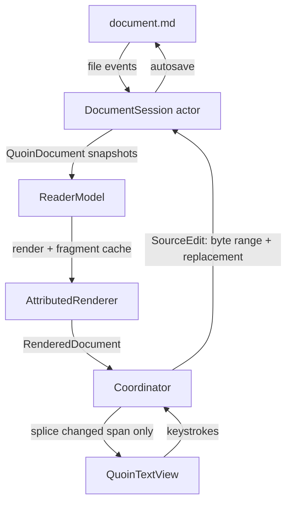

# Quoin architecture

This is the contributor-level map: how a markdown file becomes pixels, how an
edit flows back to disk, and which invariants hold everything together. The
visual/interaction spec lives in `docs/design/handoff.md`; this document is
about the machinery.

## The one rule

**The markdown source string (plus its AST) is the only source of truth.**
The attributed string on screen is a *projection* of that source. Nothing in
the app ever treats the text view's contents as data: every keystroke is
intercepted, converted to a source edit, applied to the source, re-parsed, and
re-projected. This is what makes the round-trip byte-lossless — untouched
regions of the file are never re-serialized, because the file is never
serialized *from* the view at all.

## Data flow

The edit loop is a one-way cycle: keystrokes never mutate the view directly —
they become source edits, and the view only ever receives re-projections.

<picture>
  <source media="(prefers-color-scheme: dark)" srcset="images/data-flow-dark.png">
  
</picture>

Rendered by Quoin's own native Mermaid engine from the source below, so
this document doubles as a fixture. Regenerate with `QUOIN_DOC_DIAGRAMS=$PWD
swift test --filter testRenderDocDiagrams`.

Mermaid source

### Parse (QuoinCore)

`MarkdownConverter.parse` runs swift-markdown (cmark-gfm) and post-processes:

- **Source map.** Every block carries a `ByteRange` into the UTF-8 source.
  Block identity (`BlockID`) is `contentHash:occurrence` — stable across
  re-parses when content is unchanged, which is what the fragment cache and
  scroll anchoring key on.
- **Math scanning** happens against the *raw source slice*, not the parsed
  inline tree: cmark has no math extension and mangles `$a_b + c_d$` into
  emphasis. The scanner recognises `$…$`, `$$…$$`, `\(…\)`, and `\[…\]`
  (see `MathScanner`); the non-math remainder is re-parsed as inline markdown.
- **Extension post-passes** splice highlights (`==…==`), callout detection,
  front matter, `[TOC]`, and footnote gathering.

### Session (QuoinCore)

`DocumentSession` is an actor owning the live document: it applies
`SourceEdit`s, maintains source-level undo/redo, autosaves, watches the file,
and publishes immutable `QuoinDocument` snapshots. External changes while
edits are unsaved surface as a non-blocking conflict banner (keep mine / take
disk); self-inflicted file events are recognised by source hash.

**Keystroke fast paths.** `MarkdownConverter.parseAfterEdit` re-parses
block-locally for the two things a caret does all day: typing in a plain
paragraph and typing inside a fenced embed block (code / mermaid / math).
Both paths re-parse only the edited block's source slice with the real
parser — never a hand-rolled imitation (cmark's smart punctuation once made
an imitation diverge) — and self-calibrate: the old slice must reproduce the
old block exactly, and the new slice must stay one block of the same family,
grown by exactly the edit's byte delta. Anything structural (a new fence, a
paragraph turning into a list, a footnote in the document) falls back to the
full parse; conservative rejections are always safe. Container blocks below
the edit get their ids re-derived, because a container's `contentHash`
covers its children's ranges and moves with every byte inserted above it.
The editing-latency contract — every keystroke's core slice fits in a 60 Hz
frame at ANY document size, charts or not — is enforced in CI by
`EditingLatencyTests` (strategy assertions + wall-clock ceilings over
generated small/medium/large/novel fixtures) and, for the render slice, by
`EditingRenderLatencyTests`.

### Project (QuoinRender)

`AttributedRenderer.render` walks the block list and emits one attributed
string:

- Every block's range is tagged `QuoinAttribute.blockID`; block chrome is
  tagged `QuoinAttribute.blockDecoration` (drawn by the view, see below).
- **Fragment cache:** unchanged blocks (same `BlockID`) reuse their rendered
  fragment; only changed blocks re-render. Fragments holding unresolved async
  content (a still-decoding image placeholder) are deliberately *not* cached,
  or the placeholder would stick forever.
- **The active block** renders as literal source (`MarkdownSourceStyler`)
  instead of its projection — see “Editing model”.

### Display (QuoinRender)

`QuoinTextView` (TextKit 2) displays the projection. Updates go through
`Coordinator.spliceChanges`, which diffs common prefix/suffix and replaces
only the changed span of the live `NSTextStorage` — TextKit re-lays-out just
that region, so unchanged content keeps its exact layout and the scroll offset
never jumps. A full `setAttributedString` happens only when most of the
document changed, and only that path re-anchors scroll.

**Block decorations** (code canvases, callout boxes, quote rules, diagram
frames, table rules, the front-matter chip) are drawn in
`drawBackground(in:)` from laid-out fragment frames — *never* with
`.backgroundColor` attributes, which render as ugly per-line strips. Geometry
is re-queried after any attribute pass that changes fonts
(`invalidateDecorations` schedules a second draw after TextKit settles).

## Editing model (syntax reveal)

Clicking a block activates it: the renderer swaps that block's projection for
its **literal source**, styled but character-for-character 1:1 with the file.
Hidden span delimiters are 1-point clear glyphs — never removed — so a caret
offset in the revealed text *is* a source offset (UTF-16 → UTF-8 mapped at
the edit boundary via `EditMapping`).

- Span delimiters (`**`, `*`, `==`, backticks, link syntax) reveal only when
  the caret is inside the span; structural prefixes (`>`, `- [ ]`) stay
  faded-visible. Caret movement restyles attributes only — the text never
  changes, so selection and the 1:1 mapping survive.
- Keystrokes are intercepted in `shouldChangeTextIn` and become relative
  byte-range edits routed through the session; the storage itself is never
  mutated by typing (always returns `false`).
- Embed blocks (code, tables, diagrams, math) flip to source on
  **double-click**, so a single click can admire or select a rendered diagram
  without turning it into text.
- Smart pairs complete/type-over delimiters; typing a delimiter over a
  selection wraps it; format commands (⌘B etc.) without a selection act on
  the word under the caret.

When adding a new inline span type you must touch **both** sides: a renderer
case in `AttributedRenderer` and a styler pass in `MarkdownSourceStyler`, and
register its delimiter in the claimed-ranges ordering (`**` before `*`, links
before emphasis).

## Math engine

`MathParser` (QuoinCore, platform-free) tokenizes LaTeX into a `MathNode`
tree deliberately close to TeX's model: symbols carry atom classes
(ordinary / binary / relation / operator / …) so the typesetter can apply
real inter-atom spacing. Environments (`\begin{…}`) become `.matrix` grids
with per-environment alignment (centered / cases / aligned-at-`&`). Unknown
commands become `.unsupported` leaves — the parse never fails, and
`isFullySupported` gates native rendering vs. the styled source-card
fallback. A linear pre-scan bounds brace/environment nesting so pathological
input degrades instead of overflowing the parse stack.

`MathTypesetter` (QuoinRender) lays each node out as a `MathBox`
(width/ascent/descent + a draw closure in y-up baseline coordinates):
fractions on the math axis, stacked limits for display-style big operators,
radicals with degree indices, fences scaled to body height, grids with
per-column widths and per-row baselines. `MathImageRenderer` rasterises the
box into an `NSTextAttachment` at theme size.

## Diagram engine

`MermaidParser` (QuoinCore) parses flowchart/graph, sequence, pie, class, ER,
state (v2, recursive composites; nesting depth capped), and gantt (sections,
`after` dependencies, date/duration timeline resolved to day offsets at parse
time, statuses, milestones). Anything else returns nil → tidy source card.

`DiagramLayoutEngine` (QuoinCore) is pure geometry with an injected text
measurer, so it unit-tests without fonts:

- **Flowcharts:** Sugiyama layered drawing — longest-path layering with DFS
  back-edge exclusion (cycles must not drift nodes downward), then **dummy
  nodes** for every edge spanning more than one layer (Graphviz/dagre-style):
  they join their layer and reserve a channel in barycenter ordering +
  coordinate assignment, so long and back edges route *between* the nodes they
  cross, not under them. Each edge is routed through its dummy-chain waypoints
  (vertical runs in the channels, horizontal jogs confined to inter-layer
  gaps); attachment points project onto node outlines. Edge labels are placed
  by a collision-scoring pass so they don't overprint boxes.
- **Box diagrams (class/ER/state):** shared `layeredRoutes` — the same
  dummy-node layered routing as the flowchart, top-down: layers, dummy nodes
  for multi-layer edges reserving channels, barycenter ordering, coordinate
  assignment, then orthogonal routing through each edge's chain. Near-aligned
  edges snap to a shared column so they stay straight; same-layer edges take a
  short side-face route. Composite states lay out recursively; each child scope
  becomes a fixed-size titled container in its parent, then flattens to
  absolute coordinates.

`DiagramRenderer` (QuoinRender) draws layouts with CoreGraphics — nodes,
polylines, arrowheads, UML markers, crow's feet — and caches rendered images
keyed by source + appearance.

## Platform layering

The engine is built to be reused anywhere Swift compiles; only the view shell
is platform-specific.

- **`QuoinCore`** imports no UI framework at all (no AppKit/UIKit/SwiftUI) —
  `CGRect`/`CGPoint`/`CGFloat` come from Foundation on Linux and CoreGraphics
  on Apple platforms, guarded by `#if canImport(CoreGraphics)`. It builds on
  macOS, iOS, iPadOS, visionOS, and Linux.
- **`QuoinRender`** splits into shared engine and platform views. The shared
  files — `AttributedRenderer`, `MathTypesetter`, `DiagramRenderer`,
  `MathImageRenderer`, `MarkdownSourceStyler`, `Theme`, `BlockDecoration`,
  `QuoinAttributes`, `AsyncImageStore`, `DocumentExporters` — are guarded
  `canImport(AppKit) || canImport(UIKit)` and branch on `PlatformFont` /
  `PlatformColor` / `PlatformImage` typealiases, so one body compiles on both
  AppKit and UIKit. The platform view layers live in their own subfolders:
  `AppKit/` holds the macOS `NSTextView` editor (`QuoinTextView`,
  `ReaderCoordinator`, `MarkdownReaderView`); `UIKit/` holds the
  iOS/iPadOS/visionOS reader (`MarkdownReaderViewIOS`). Each is gated so it
  simply compiles out on the other platform.

The macOS editor is *not* a separate SwiftPM target on purpose: it depends on
module-internal render helpers (`QuoinTextView.invalidateDecorations`,
`MarkdownSourceStyler`, the decoration-drawing internals), and hoisting it
across a target boundary would force that surface public — weakening
encapsulation instead of strengthening it. The `#if` gate already gives clean
per-platform compilation with everything kept internal.

Mac Catalyst is not currently supported: on Catalyst `canImport(AppKit)` is
true, so the AppKit guards select the AppKit branch inside a UIKit runtime and
fail to compile. Supporting it means changing those guards to
`canImport(AppKit) && !targetEnvironment(macCatalyst)` throughout.

## Testing strategy

- **Unit** (`Tests/QuoinCoreTests`): parsers, layout geometry, sessions,
  search, exporters — all platform-free, run on Linux in principle.
- **Torture** (`TortureTests`): pathological inputs must parse to *something*
  — 10k-deep nesting, null bytes, unclosed everything, brace bombs.
- **Performance** (`PerformanceTests`): the PRD budgets as assertions.
- **Conformance** (`RendererConformanceTests`): parses every fixture module
  in `Fixtures/renderer/`, snapshots structural metrics
  (`Snapshots/renderer-metrics.json`), and asserts every native diagram lays
  out non-degenerately. Regenerate after intentional changes with
  `QUOIN_UPDATE_SNAPSHOTS=1 swift test`.
- **Render golden** (`Tests/QuoinRenderTests`, macOS/iOS only): renders every
  fixture module through `AttributedRenderer` and snapshots a *deterministic*
  digest of the attributed string — per-run QuoinAttribute keys, font
  size/weight/traits, paragraph-style scalars, block-decoration kinds, and
  semantic color tokens (`Snapshots/render-digests.json`, same
  `QUOIN_UPDATE_SNAPSHOTS=1` idiom). It never snapshots font glyph widths,
  rasterised math/diagram bytes, or the user-configurable accent RGB (mapped
  to an `"accent"` token), so the golden is portable across machines. Math and
  diagrams are checked by attachment existence + non-degeneracy and
  font-independent structural invariants, not pixels. Also covers the extracted
  render helpers (code-token colors, non-BMP offset mapping, card spacing,
  source-styler 1:1 mapping).
- **Screenshots** (`App/macOS/UITests`): CI drives the real app over the
  fixture library and publishes window captures to the `ci-screenshots`
  branch — how a cloud session gets eyes on the app.

## Invariants worth defending

1. Round-trip is byte-lossless for untouched regions — nothing serializes
   the document from the view.
2. `QuoinCore` stays platform-free (`CoreGraphics` types only via
   Foundation/corelibs; no AppKit/UIKit).
3. One dependency (swift-markdown). New ones need a written TRD case.
4. Unknown input degrades to a labelled source card — never a crash, never a
   half-render.
5. Never override system shortcuts (⌘P print, ⌘E use-selection-for-find,
   ⌘H hide).
6. Decorations are drawn geometry, not text attributes.

## Addendum — subsystems added in the July 2026 push

- **Embed editing** (`docs/design/embed-editing-ux.md`): typed
  `CaretHint.rendered/.source` (two coordinate spaces, one caret),
  keystroke replay through `activateBlock(pendingInsertion:)`,
  `RevealedFragment` (fragment + 1:1 editable subrange), `quoin-edit://`
  chips, the drawn `✓ done`/`editingFrame` decoration, and reverse caret
  mapping on flip-back.
- **Live preview panel** (`PreviewPanelView` + `PreviewPanelChoreographer`):
  the active diagram/equation renders side-by-side as a click-transparent
  overlay; a pure clock-injected decision table paces presentation
  (instant success, 500ms typing-idle paused badge, ghost dissolves).
  Held last-good render survives kind flaps via slice-lineage guarding.
- **Flip motion** (`FlipTransitionController`): snapshot-overlay
  choreography, delta-keyed, cosmetic by construction (real layout is
  instant). Overlay pixels ship as NSImageView-on-CGImage-crops; the
  fidelity test self-calibrates a CARenderer readout with an NSImageView
  anchor — no readback API is trusted about orientation.
- **Edit-echo serialization** (`ReaderCoordinator`): keystrokes arriving
  before the previous edit's projection echo queue and flush one per ack
  — positions are never computed against a stale projection.
- **Block operations** (`QuoinCore/BlockEditing`): byte-exact move/
  duplicate/delete splices (separator bytes untouched), table row/column
  growth, tabular smart paste.
- **Reading chrome**: focus mode + sentence scope (TextKit rendering
  attributes, zero reflow), typewriter scrolling (the caret-pin reused),
  jump history, breadcrumb path, outline collapse + hover peek, link
  hover previews, reading-progress hairline.
- **Verification harnesses**: math golden PNGs
  (`MathGoldenRenderTests`, `Tests/fixtures/math-golden/`) doubling as a
  coverage ledger; compositor-truth flip fidelity; per-feature latency
  budgets (see `docs/launch-ledger.md` for the enrollment gaps).
- **Ledgers**: `docs/rendering-ledger.md` (field reports → fixes),
  `docs/launch-ledger.md` (four-track pre-launch review).
