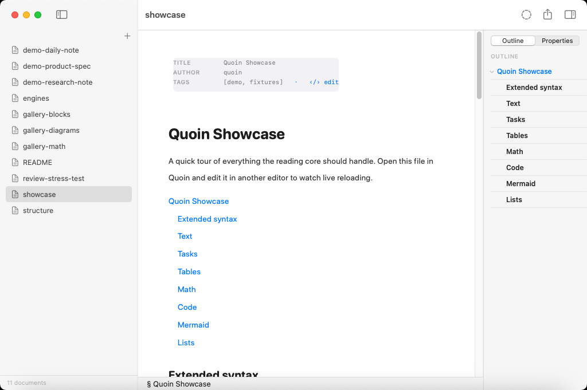
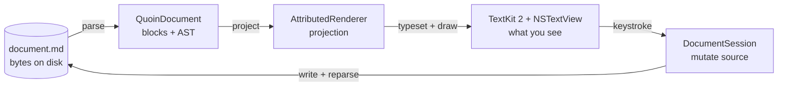
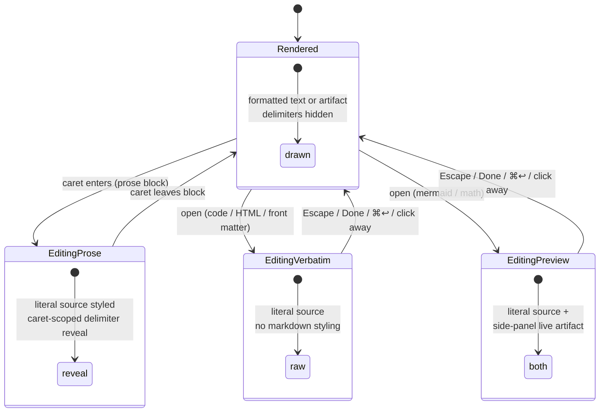
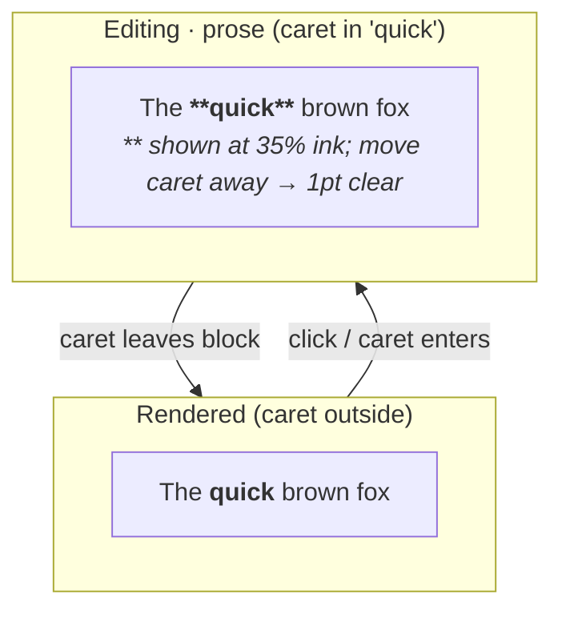
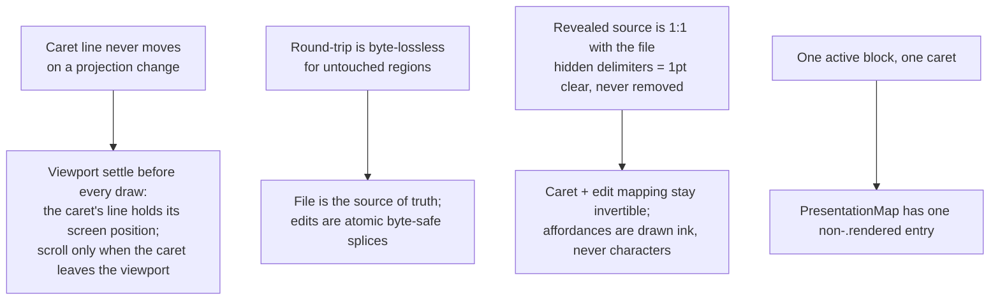
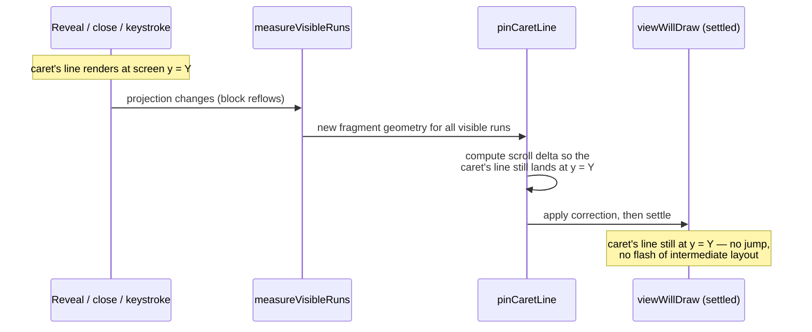

# Editor modes — how Quoin shows and edits a block

Quoin is a WYSIWYG markdown editor whose **source of truth is the markdown
string** (plus the AST cmark-gfm parses from it), never an attributed string.
What you see on screen is a **projection** of that source. Edits mutate the
source; the renderer re-projects.

That single choice creates one unavoidable duality: every element has a
**rendered form** (what you read) and a **source form** (what you edit). A
heading is either the large styled title *Introduction* or the literal
`## Introduction`. A diagram is either a drawn figure or a `mermaid` fenced
code block. The screen defaults to rendered but must let you edit source
locally, right where the caret is.

**"Modes" are not a feature — they are the mechanism that resolves this
duality, per element, per moment.** This document defines that mechanism: the
presentation model, caret-scoped syntax reveal for prose, the rendered↔source
flip for [embeds](embed-editing-ux.md), and the side-panel live preview for
diagrams and math. It sits below `docs/design/handoff.md` in authority; where
they conflict, the handoff (the visual spec) wins. This is the
[machinery](../reference/architecture.md) behind the handoff's visuals.

---

## 1. The projection model

The document lives on disk as a plain `.md` file. Opening it parses the bytes
into a `QuoinDocument` (an ordered list of blocks, each with a stable
`BlockID`). The renderer projects that document into a single attributed string;
TextKit 2 typesets it; a subclassed `NSTextView` draws block-level chrome behind
the glyphs. Every keystroke edits the underlying source through
`DocumentSession`, which re-parses the touched region and re-projects.





Why this way, and not a rich-text model that keeps an attributed string as the
truth?

- **Byte-lossless round-trips.** Open → edit → save must leave untouched
  regions byte-for-byte identical. The file *is* the document, so there is no
  lossy import/export step to drift through. Your markdown stays yours.
- **The file is portable and durable.** It opens in any editor, diffs cleanly in
  git, and outlives Quoin. A collaborator or an agent can propose edits to the
  same `.md` and you triage them — the [review loop](suggestions.md) is
  byte-safe because the substrate is bytes.
- **Native rendering, no webview.** Math (via the first-party
  [Vinculum](https://github.com/2389-research/Vinculum) package), diagrams (via
  first-party [MermaidKit](https://github.com/2389-research/MermaidKit)), code,
  and tables are drawn with CoreText/CoreGraphics, not HTML — see
  [dependencies](../reference/dependencies.md) for the policy. There is zero
  JavaScript at runtime and nothing leaves the machine.

Because the projection is a pure function of source plus a little activation
state, the same input always yields the same screen — the property that lets
Quoin patch one block on a keystroke and know it matches a full re-render.

---

## 2. Presentation states

A block is in exactly one **presentation state** at any moment. The whole space
is small:

| State | What it shows | Applies to |
|---|---|---|
| **Rendered** (default) | Formatted text; delimiters hidden; embeds show their drawn artifact | Every block, when not being edited |
| **Editing · prose** | Markdown source, styled; inline delimiters reveal only around the caret | Paragraph, heading, list, quote, callout, table, thematic break |
| **Editing · verbatim** | Raw source, zero markdown styling | Code, HTML, front matter, review end-matter |
| **Editing · preview** | Raw source **plus** a side-panel live artifact (last-good held while unparseable) | Mermaid, math |

Exactly one block can be in an editing state at a time — one active block, one
caret. That is an [invariant](../reference/invariants.md) the model relies on,
not a coincidence.

Every block moves through the same small state machine — this is the
projection/reveal model in one picture:



Only `EditingProse` reveals on mere caret transit; `EditingVerbatim` and
`EditingPreview` are embeds, and embeds open only on a deliberate action (see
§4). Every keystroke inside any editing state mutates the source and re-enters
the same state — the machine only ever exits back to `Rendered`.

Two things are **orthogonal** to this state and never change *which*
representation is shown:

- **Always-on affordances** ride along regardless of state: the checkbox, the
  blockquote gutter, the list marker, the heading level, and interactive runs
  (task toggle, heading-anchor jump, code copy button, the `‹/› edit` chip).
- **Display filters** dim or scroll but never swap representation: focus mode,
  typewriter scrolling, search highlight.

### The type that owns it

The state is a real value, not something re-derived ad hoc at each draw. One
pure function computes it, and every consumer reads the same answer:

```
presentation(for: document, activeBlockID:) -> PresentationMap
```

- `EditingFlavor.of(kind)` is the single table mapping a block kind to
  `.prose`, `.verbatim`, or `.preview`. Every reveal decision consults it,
  never the raw kind.
- `BlockPresentation` is `.rendered` or
  `.editing(flavor:, chrome:)`, where `chrome` marks the embed set (plus front
  matter) — the blocks whose open state draws an accent frame and a `✓ done`
  chip. Prose reveals are deliberately chrome-free: for prose, the caret *is*
  the mode, so no affordance is needed.
- `PresentationMap` is compact by construction — one active block means one
  non-`.rendered` entry — and the function is pure, so the model (on a
  projection change) and the view (on a caret-move restyle) compute the same
  presentation and cannot disagree.

The renderer, the decoration layer, the editing chrome, and the flip transition
all *read* this one value. No consumer re-answers "is this block editing?"

---

## 3. Syntax reveal for prose

Click into a paragraph, or move the caret into one, and it activates as prose.
The block re-renders as its **literal markdown source**, styled so the content
still looks close to final while the delimiters obey a caret-scoped rule:

- The inline span **containing the caret** shows its delimiters at 35% ink in a
  mono font — `**bold**` shows its asterisks only while you are inside that
  bold run.
- **Every other span's** delimiters collapse to invisible.
- Structural line prefixes (`>`, `- [ ]`, list markers, heading `#`s) stay
  faded-visible the whole time — they orient you without shouting.

This is a Raskin-clean quasimode: the caret is the mode selector, there is no
chrome, and prose stays instant with no animation.


**The crucial constraint: nothing is inserted or removed.** Every character of
the source is present exactly once. Hidden delimiters are not deleted — they are
rendered as **1pt clear text**. This is what keeps caret and edit mapping 1:1
with the file: when you type at rendered offset *n*, the source offset it maps
to is unambiguous because the projected string and the source string share a
stable, invertible alignment.



Adding a new inline span type therefore touches two coordinated places: a
renderer case (how it projects) and a styler pass in `MarkdownSourceStyler` (how
its source reveals), with the delimiter registered in the claimed-ranges
ordering so overlapping markers resolve deterministically (`**` before `*`,
links before emphasis).

Verbatim blocks — code, HTML, front matter — reveal the same way structurally
but skip markdown styling entirely: their markup *is* the content, so the source
shows in the code font with no span collapse. (Collapsing an HTML block's tags
would hide the block; treating `**not bold**` inside code as emphasis would
hijack it. The flavor table prevents both.)

---

## 4. The rendered↔source flip for embeds

Embeds — code blocks, diagrams, math, tables, front matter — are *drawn
artifacts*, not text you would casually click into. So they don't auto-reveal on
caret transit. You open one deliberately: **double-click it**, click its
`‹/› edit` chip, or press **⌘↩** with the caret on it. Typing on a rendered
embed also opens it and replays the keystroke, so a character is never dropped.

When an embed opens, the artifact **stays exactly where it is** and its markdown
source unfolds beneath it, caret placed at the point you aimed at. An accent
frame and a `✓ done` chip mark the open block. You close it with **Escape**, the
**Done** chip, **⌘↩** again, or by clicking away — and the artifact simply
remains, updated, never having moved a pixel. Closing always commits; every
keystroke is already in the file, so backing out is ⌘Z's job, not the exit's.

```mermaid
sequenceDiagram
  participant U as You
  participant V as Reader view
  participant M as Model / session
  participant D as document.md

  Note over V: block shown RENDERED (drawn artifact)
  U->>V: double-click / ‹/› edit / ⌘↩
  V->>M: activate(blockID, CaretHint)
  M->>V: re-project block as EDITING source
  Note over V: accent frame + ✓ done chip;<br/>artifact stays put, source unfolds below
  U->>V: type
  V->>M: mutate source at mapped offset
  M->>D: live-commit + reparse
  M->>V: re-render fragment (+ live preview)
  U->>V: Escape / Done / ⌘↩ / click away
  V->>M: deactivate → caret to rendered image
  Note over V: back to RENDERED, updated, unmoved
```

Two details make the flip feel like one continuous change instead of a jump:

- **The `✓ done` chip and accent frame are a decoration, not a text run.** They
  are drawn ink (with their own hit-testing and tooltip) in the same layer as
  the code canvas and diagram frame — because inserting affordance *characters*
  into the range would break the revealed source's 1:1 mapping with the file.
- **Motion is cosmetic by construction.** The real layout applies instantly
  (splice → pin caret line → settle). A `FlipTransitionController` freezes the
  pre-splice pixels into an overlay, then dismantles it in slices that converge
  on the true geometry: the old block crossfades out over the new one, and
  content *below* the block slides its real reflow distance so the eye can track
  what moved. Content above the pinned caret line never moves, so it is never
  covered. Nothing here writes to storage or scroll position; a wrong animation
  costs a frame, never correctness. Reduce Motion collapses it to a short
  crossfade, and a watchdog removes the overlay unconditionally.

The `CaretHint` carried into activation is typed by coordinate space:
`.rendered(n)` for prose (aligned to source through the edit mapping) and
`.source(n)` for embeds (whose body maps 1:1 into the source slice, used
verbatim). The distinction is load-bearing — feeding a source offset through the
rendered mapping lands the caret a few characters early.

---

## 5. The side-panel live preview

For the two embeds whose source is unreadable as its own output — **mermaid
diagrams** and **math** — revealing raw source alone would hide the very thing
you are editing. So editing flavor `.preview` opens the source *and* keeps a
live rendered artifact beside it, in a side panel anchored at the editing
frame's right edge.

```mermaid
flowchart LR
  subgraph Open["Editing · preview (a diagram open)"]
    direction LR
    src["```mermaid<br/>flowchart LR<br/>&nbsp;&nbsp;A --> B<br/>```<br/><i>raw source, editable</i>"]
    panel["live render<br/>(last-good held)"]
    src --- panel
  end
```


The panel's behavior:

- **Live, not debounced.** The native engines render inside the
  [performance budget](../reference/performance.md), so every keystroke
  re-renders in milliseconds. Latency is the product; the morphing artifact is
  the feedback.
- **Never flickers.** While mid-edit source is unparseable, the **last good
  render is held** — never blank, never flashing. That retention is a
  `HeldPreview` value owned by the model (one entry: one active block at a time)
  and threaded through render passes as explicit `inout` state, so the renderer
  keeps no hidden mutable state. When a different block activates, the model
  resets it, so a stale artifact can never appear over foreign source.
- **Patient about errors.** A "Preview paused" capsule badge appears only after
  a grace period of typing-idle-while-invalid; the grace timer resets on every
  keystroke, so mid-word transits never flash a warning. Recovery clears the
  moment a fixing keystroke lands. The badge overlays the panel corner and never
  steals image height; the held artifact stays full-opacity, because a dimmed
  diagram reads as broken. While paused is admitted, the editing frame's stroke
  turns amber — ambient liveness at the edge of where you are looking.
- **Presentation only.** The panel is click-transparent; the caret and all
  editing stay in the source. It wears the diagram's own chrome (hairline,
  radius 8) because it *is* the artifact, not new UI. Its image scale locks per
  session so the node you are watching does not drift as the bounding box
  changes per keystroke. Its entire motion vocabulary is dissolve
  (`PreviewPanelChoreographer` decides each swap); slide stays the text's verb.

The revealed source reserves matching horizontal room for the panel via a tail
indent on its paragraphs, so text and panel share one layout. The preview lives
*beside* the source, not inline — the whole-fragment patch on each keystroke
refreshes the panel without disturbing the 1:1 source below it.

---

## 6. The invariants every state obeys

Every presentation state and transition is constrained by a small set of
non-negotiable rules. They are why the model is shaped the way it is; the full
rule-book lives in [`docs/reference/invariants.md`](../reference/invariants.md).



The most load-bearing of these — the caret line never moving — is a timing
guarantee, not just a layout rule. Every projection change runs the same
settle sequence before a single pixel paints:



Content above the caret's line never moves, so it is never covered — the same
mechanism the embed flip's crossfade (§4) and the syntax reveal's per-line
style transplant (§3) both depend on. This diagram and the invariants above
are enforced in code by `RevealFidelityTests` and `CaretLineAnchorTests`; see
[`docs/reference/invariants.md`](../reference/invariants.md) for the complete
rule-book.

- **The caret line never moves.** On *any* projection change — reveal, close,
  keystroke, for every block type — the line the caret or click is on must hold
  its position on screen. Edit mode keeps the block's vertical skeleton (a
  per-line style transplant), so revealing source adds no vertical jump. Scroll
  only happens when the caret leaves the viewport, and then minimally. Enforced
  by `RevealFidelityTests` and `CaretLineAnchorTests`.
- **Byte-lossless round-trips.** Open → edit → save leaves untouched regions
  identical. This is what makes the file a trustworthy substrate for the review
  loop and for git.
- **1:1 revealed source.** Hidden delimiters are 1pt clear text, never deleted,
  so the projected string and the source string stay invertible. Edit mapping
  depends on it.
- **Patch/full-render equivalence.** A per-keystroke storage patch must produce
  the same result a full re-render would. Enforced by
  `ProjectorEquivalenceTests`; extend its interaction script when touching any
  projection path.

When you add a block type or a projection path, extend `RevealFidelityTests`,
`CaretLineAnchorTests`, and `ProjectorEquivalenceTests` together — the model
stays correct only because these three keep it honest.

---

## 7. How the pieces fit in code

A developer map of where each concern lives:

| Concern | Where |
|---|---|
| The presentation state + the single derivation | `BlockPresentation.swift` — `EditingFlavor.of`, `BlockPresentation`, `presentation(for:activeBlockID:)` |
| Projecting the whole document | `AttributedRenderer.swift` — `render`, plus `renderEditableSourceFragment` for the open block |
| Caret-scoped source styling | `MarkdownSourceStyler.swift` — the `.prose` reveal passes |
| Block-level chrome (canvas, frame, quote rule, `✓ done` chip) | `BlockDecoration.swift`, drawn in `QuoinTextView.drawBackground(in:)` |
| Activation, caret hints, escape restore, interactive links | `ReaderCoordinator.swift` |
| The embed flip motion | `FlipTransitionController.swift` (cosmetic overlay; real layout is instant) |
| The live preview panel + its swap decisions | `PreviewPanelView.swift`, `PreviewPanelChoreographer.swift` |

The through-line: **state is a pure function of source plus activation; the view
is a pure projection of that state; adornments live in a decoration layer mapped
across changes, never mixed into the document; and layout reads happen in one
settled measure pass, never interleaved with writes.** These are the moves every
mature structured editor (CodeMirror, ProseMirror, Zed's display map) shares,
adapted here to TextKit 2 and AppKit.

### Related

- [`embed-editing-ux.md`](embed-editing-ux.md) — the interaction design behind
  embed editing: chip placement, keyboard grammar, the motion budget.
- [`docs/reference/architecture.md`](../reference/architecture.md) — the
  contributor-level machinery map this document's mechanism sits inside.
- [`docs/reference/invariants.md`](../reference/invariants.md) — the complete
  correctness rule-book, including the caret-line and round-trip guarantees
  this document explains.
- [`docs/reference/performance.md`](../reference/performance.md) — the perf
  budgets that make live preview and per-keystroke reprojection feel instant.
- [`suggestions.md`](suggestions.md) — the review/CriticMarkup loop that
  depends on this document's byte-lossless projection.
- `docs/PRODUCT.md` and `docs/guide/features.md` — the product-level feature
  list this machinery serves.
