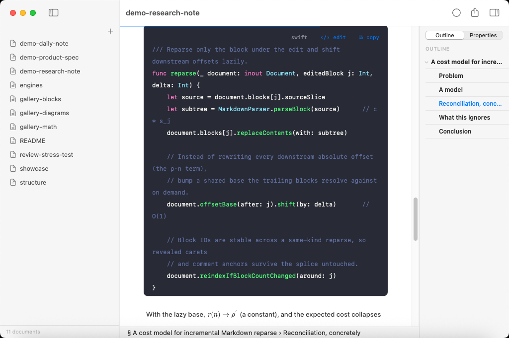
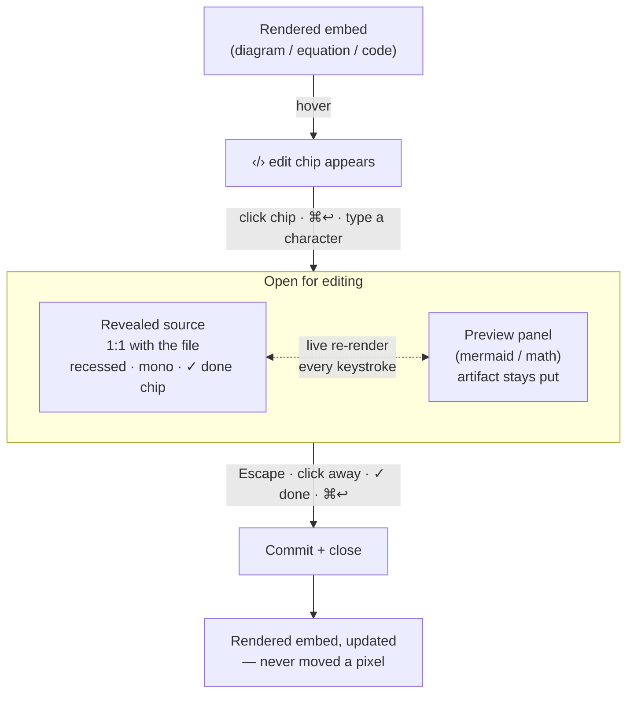
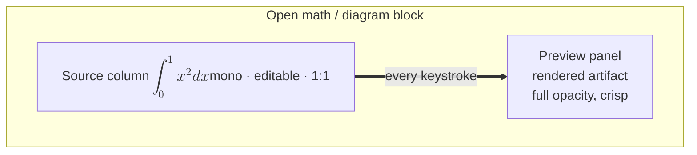
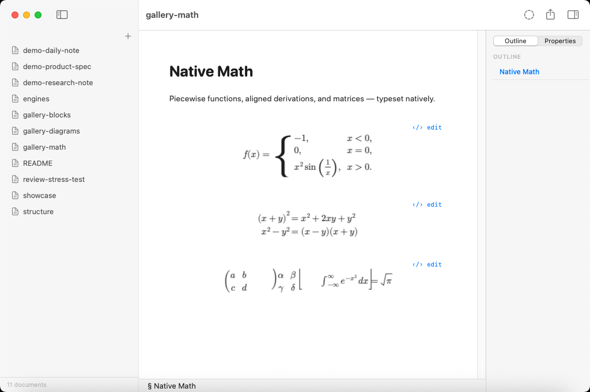
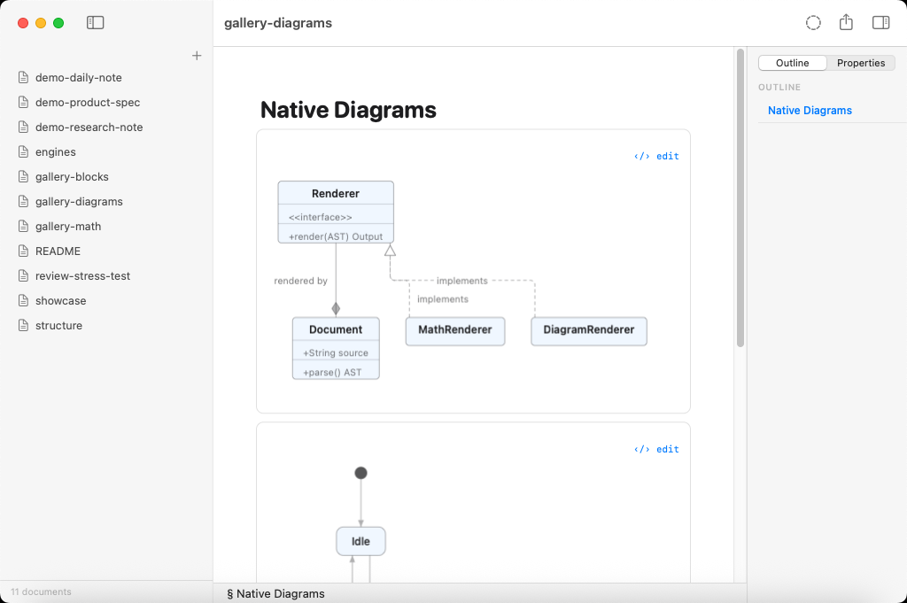
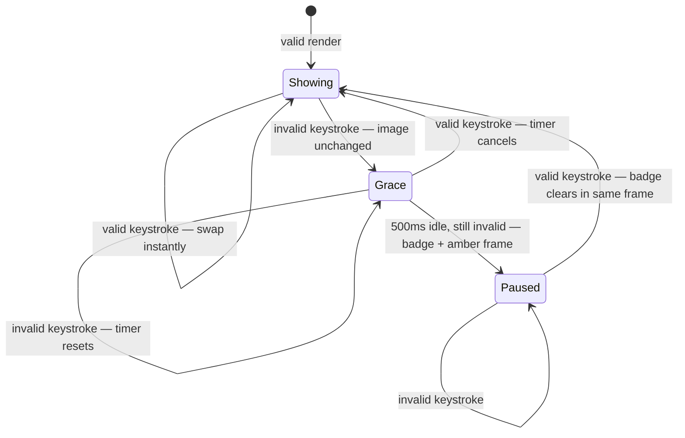
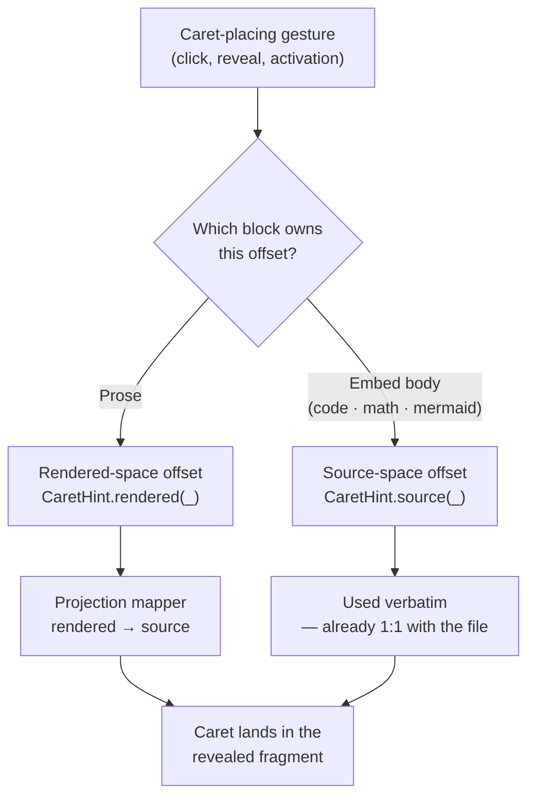

# Editing embeds: code, diagrams, math, and tables

Most of a Quoin document is prose, and prose edits with no ceremony: put the
caret in a paragraph and it [reveals its own markdown source](editor-modes.md),
character for character, right where you're reading. The caret *is* the
mode. There is no button to press and nothing to enter or leave.

A few block types can't work that way. A Mermaid diagram, a LaTeX equation,
and a syntax-highlighted code block are all [*projections*](editor-modes.md)
of markdown that looks nothing like the thing you see — a rendered flowchart
has no per-character correspondence to its `graph TD` source, and an
integral sign is not editable text. These are **embeds** (see the
[embeds capability group](../PRODUCT.md) in the product spec), and they get
a deliberate, visible editing affordance instead of silent caret-driven
reveal.

This document explains what an embed is, how you edit one, and how the
machinery behind it upholds Quoin's core promise: [the markdown file is the
source of truth](../reference/invariants.md), the editor is a live
projection, and nothing on screen ever jumps, disappears, or asks what mode
you're in.

## What counts as an embed

| Block type | Rendered as | Editable source is… |
|---|---|---|
| Fenced code | Highlighted canvas (12 themes) | The code between the fences |
| Mermaid | A drawn diagram (via [MermaidKit](https://github.com/2389-research/MermaidKit)) | The `mermaid` fence body |
| Math | A typeset equation (via [Vinculum](https://github.com/2389-research/Vinculum)) | The `$$…$$` / `\[…\]` body |
| Table | Ruled grid | The pipe-and-dash markdown |
| Front matter | The Properties chip | The YAML key/value block |

Both engines are first-party and platform-free — see
[dependencies](../reference/dependencies.md) for the policy that keeps
Quoin at a single third-party dependency (swift-markdown) plus these two
exempt, self-published engines. A code block's highlighted canvas, in one
of its twelve selectable syntax themes, looks like this:



What unites them: the rendered form **hides that it is markdown**. You
cannot see, and could not usefully place a caret inside, the source. So each
one carries an explicit invitation to edit — the `‹/› edit` chip — and each,
when open, wears an unmistakable editing frame.

Math and diagrams rendering side by side in one document, both fully
native — no webview, no JavaScript:


## The promise

Hover an embed and a quiet `‹/› edit` chip is there. Open it and the
rendered artifact stays exactly where it is while its markdown source unfolds
beneath, caret ready at the point you aimed at. For diagrams and math, the
rendered image *stays on screen* the whole time, re-rendering live as you
type. Broken source keeps the last good render and lights one calm note —
never a blank, never a flash. Escape, click away, or press Done and the
source folds away; the artifact simply remains, updated, never having moved a
pixel. Undo works across the whole thing like ordinary typing.

Four ideas make that possible, and they are non-negotiable:

1. **Commit on exit, always.** Every keystroke is already in the file — Quoin
   is a live-commit editor, so there is no "save" and no draft buffer.
   Escape, click-away, and Done all mean *done*; none of them reverts.
   Backing out is what `⌘Z` is for, and undo behaves identically whether the
   block is open or rendered. A reverting exit would be a data-loss bug by
   definition.
2. **[The 1:1 mapping](../reference/invariants.md) is untouchable.** When a
   block is open, its revealed text is byte-for-byte the file's source.
   Edits mutate that source directly. Nothing — no animation, no affordance
   — is allowed to write to storage or move the scroll position on its own
   behalf.
3. **[The viewport invariant](../reference/invariants.md) holds through
   every flip.** The line you're working on does not move on screen when a
   block opens or closes. Motion radiates outward from that pinned line;
   the line itself is still.
4. **Rendering is native and instant.** Diagrams and equations render
   through CoreGraphics/CoreText in milliseconds, so the live preview can
   re-render on *every keystroke* with no webview, no worker, no debounce on
   success. Latency is the product.

## The edit flow

All of it runs through a single [activation path](../reference/architecture.md)
in the rendering pipeline, no matter which embed kind is opening:



### Opening

Three gestures open an embed, and they all funnel through one activation
path so the behavior is identical:

- **Click the `‹/› edit` chip.** Every embed shows one. On a code block it
  sits in the header row beside `⧉ copy` (`‹/› edit    ⧉ copy`); on a
  diagram or equation it's a quiet right-aligned caption line inside the
  frame; on a table it's in the band above the grid; on front matter it's
  appended to the Properties chip as `· ‹/› edit`. Its tooltip is
  **"Edit Source (⌘↩)"**.
- **Press `⌘↩`** with the caret on or the selection touching the block.
  `⌘↩` also *closes* an open block — it's a toggle.
- **Just start typing** on a rendered block. The keystroke both reveals the
  source *and* is inserted at the mapped caret position, atomically. Typing
  on an embed never drops the character that opened it.

The chip is intentionally `‹/›`, not a pencil. A pencil promises direct
manipulation of the rendered thing; `‹/›` promises the *source*, which is the
truth you're actually editing.

### Editing

The open block reveals its source with an unmistakable editing identity: a
recessed background, monospaced text, an accent frame, and a `✓ done` chip in
the top-right corner. The frame and chip are the mode indicator, announced
right at the locus of attention — chrome, not tint alone, because a
peripheral color wash doesn't reliably prevent mode errors.

The revealed text is the file's bytes, 1:1. There is no separate editable
buffer to keep in sync — the fragment you're typing into *is* the source
slice.

### Closing

Escape, clicking away, `⌘↩`, or the `✓ done` chip all commit and close. The
document was never out of sync, so "commit" just means the block flips back
to its rendered form. The caret lands at the rendered image of wherever it
was in the source, rounded backward to visible content so it never jumps
forward into the next block.

## The live preview panel (diagrams and math)

For Mermaid and math embeds, the rendered artifact does not disappear while
you edit. It stays on screen in a **side panel** beside the source, anchored
where the diagram already was. The source unfolds below; the panel holds the
image. This is the same
[live preview and flip motion machinery](../reference/architecture.md)
described in the architecture map, applied to the two embed kinds tall
enough to make it matter.



The two engines behind that preview cover a wide surface each: the
[Vinculum](https://github.com/2389-research/Vinculum) math gallery —



— and the [MermaidKit](https://github.com/2389-research/MermaidKit) diagram
gallery:



This is the centerpiece of embed editing, and it exists because a diagram is
tall. If the rendered image vanished the moment you opened the source, the
whole page below would jump up to fill the gap, then jump back down on close
— exactly the disorientation the viewport invariant exists to prevent. By
pinning the *preview* in place and expanding the source panel downward, the
tall content never disappears, so there is nothing to jump.

### Holding the last good render

The engine re-renders on every keystroke. But a diagram source spends a lot
of its editing life *temporarily unparseable* — you're halfway through typing
a node name, a fence is unbalanced, a brace is open. Blanking the panel on
every such transit would make editing a strobe light.

So the panel **holds the last successful render** and never blinks:

- A valid keystroke swaps the new image in **instantly**. Good news is never
  debounced — the morphing artifact *is* the feedback.
- An invalid keystroke changes nothing visible. The held image stays at full
  opacity — a grayed-out diagram reads as "broken," which is a lie when the
  last render is perfectly good.
- Brokenness is admitted only after **half a second of typing idle** while
  still invalid. A small material badge — "Preview paused — showing the last
  good render" — appears in the panel's corner, and the editing frame's
  stroke turns amber. The grace timer resets on every keystroke, so
  mid-word transits through invalid states never flash anything.
- Recovery is synchronous: the fixing keystroke clears the badge and swaps
  the good render in the same frame.

That grace period is a small state machine, driven by keystroke validity and
a clock rather than by anything visual:



The retention is session state. Each editing session owns exactly one held
preview (there is only ever one open block at a time), and it is cleared the
instant a different block activates — a stale artifact can never appear over a
foreign block's source. The retained state travels through the render passes
as an explicit value, so the renderer itself holds no hidden mutable state.

The panel wears the diagram's own chrome — the same hairline and corner
radius the rendered artifact has — because it *is* the artifact, not a new
piece of UI. Image scale locks for the session, anchored top-leading, so the
node you're watching doesn't drift as the bounding box grows and shrinks per
keystroke. When the window is too narrow for a side-by-side layout (below a
~340pt source column) the panel yields to a stacked layout below the source.

The panel's whole motion vocabulary is *dissolve*. Swaps that land inside
typing cadence are hard cuts — a crossfade at typing speed just smears. An
isolated swap whose size changed, or the first swap after a paused episode
(the resume you must not blink-miss), dissolves via a brief ghost of the
outgoing image. This presentation logic is a pure decision table with an
injected clock — deterministic and testable in isolation.

## Caret and coordinate handling

The subtle correctness problem in embed editing is that an embed lives in
*[two coordinate spaces at once](../reference/invariants.md)*, and a caret
offset means something different in each:

- **Rendered space** — an offset into the projected text the reader sees,
  where delimiters and prefixes the projection dropped (`**`, `### `, hard-
  break spaces, entity source) simply aren't present.
- **Source space** — an offset into the raw file slice, 1:1 with the bytes
  on disk.

For prose, the caret lands in rendered space and gets aligned to source
through the projection mapper. For an embed *body*, the source is already 1:1
with what you'll edit, so the offset is a source offset and must be used
verbatim. Feeding a source offset through the rendered mapper (or vice versa)
lands the caret a few characters off — early in a code body by the width of
the header run.



Quoin makes the coordinate space explicit in the type system rather than
trusting every call site to remember:

```swift
public enum CaretHint: Equatable, Sendable {
    case rendered(Int)   // offset into the block's projected text
    case source(Int)     // offset directly into the block's source slice
}
```

Every activation carries a `CaretHint`. Embed clicks resolve to
`.source(offset)`; prose clicks resolve to `.rendered(offset)`. The
activation path pattern-matches on the case — `.source` is clamped and used
directly, `.rendered` is run through the mapper — so the space is honored by
construction and the two can never be confused.

The revealed fragment carries its own invariant: **the editable source
starts at offset 0 of the fragment.** The fragment *is* the editable source —
there is no leading chrome inside the text to skip past (the preview lives in
the side panel, not inline), so only the fragment's length is meaningful.

## Commit-on-exit and fence healing

Because exit always commits, closing a block whose source is currently
*broken* needs a safety net. The dangerous case is an unbalanced code fence:
if a block committed without its closing ` ``` `, it would swallow every
following block into one giant code block.

So on close, if the block's own source is missing the fence it opened with,
Quoin heals it — appending the closing fence as an ordinary, undoable,
byte-honest session edit *before* the projection flips back. The fix goes
through the same edit path as your typing, so `⌘Z` steps through it like
anything else.

## Motion

Opening and closing a block changes its height — a one-line `$E=mc^2$` and
its typeset form are different sizes. Rather than hard-cutting between them,
the flip is choreographed so it reads as one continuous change.

The choreography is **[cosmetic by construction](../reference/invariants.md).**
The real layout applies
*instantly* — splice the new fragment, pin the caret line, settle the
viewport — with nothing written to storage or scroll position. Just before
the splice, the current pixels are frozen into an overlay covering the
viewport; after the settle pass, the overlay is dismantled in slices that
converge on the real geometry:

- The old block's region **crossfades** out over the new block already laid
  out beneath it.
- Everything below the block **slides** its true reflow distance — sliding
  the *real* reflow rather than masking it, so the eye can track what moved.
- Content above the pinned line never moves at all, so it is never covered.

The treatment is keyed to how far the height changed:

| Height delta | Treatment |
|---|---|
| ≤ 40pt (a typical code flip) | **Instant** — this is a high-frequency check-the-render loop; any mediation taxes every cycle |
| Moderate | Block crossfade + below-content slide |
| More than half the viewport | Full-viewport crossfade — sliding most of a screen would read as scrolling, which is a lie |
| Reduce Motion | Collapse to a 120ms crossfade |
| Very large documents / offscreen | No motion |

Any user input or a newer projection truncates the animation to its end
state immediately, and an unconditional watchdog removes the overlay after
500ms — a stuck cover is the worst possible failure, so it is the one thing
guaranteed not to happen. The caret, the pin correction, and the mode chrome
are **never** animated: those are binary signals, and a faded binary signal
reads as uncertainty.

## Why it works this way

**Why not just reveal the source inline, like prose?** A rendered image has
no per-line decomposition — there is no "the caret's line" in a diagram to
selectively reveal. Line-scoped reveal is category-inapplicable to the exact
blocks that most need a good editing story.

**Why a side panel and not an inline preview run?** An inline preview would
be a text run, and a text run inside the revealed source breaks the 1:1
mapping the entire edit model depends on. The panel keeps the source pristine
and the artifact anchored.

**Why never revert on exit?** Because every keystroke is already committed to
the file. There is no draft to discard. A "cancel" that threw away your
typing would be silently destroying data the file already holds; that job
belongs to undo, where it is visible and reversible.

**Why hold the last good render instead of showing errors?** Because you're
*mid-edit* — transient brokenness is the normal state of typing, not an error
worth shouting about. The held render plus a patient, debounced badge tells
you the truth (nothing new rendered) without punishing every intermediate
keystroke.

**Why a single first-responder text view instead of child editors per
block?** Nested `NSTextView`s per embed would each fight for IME and focus.
Quoin's whole document is one text view; that is why input methods, focus,
and selection never break across a flip.

### Deliberately not done

- **A pencil icon** — promises direct manipulation of the render; `‹/›`
  correctly promises the source.
- **Reverting on Escape** — a data-loss bug by definition (see above).
- **Popover or modal source editors** — they say "you have left the
  document." The source unfolds *in place* instead.
- **Overloading Return** — plain Return in text always inserts a newline;
  opening an embed is `⌘↩` or the chip, never a naked keystroke that would
  collide with typing.

## Related

- [Editor modes](editor-modes.md) — the projection model and syntax reveal
  for prose, which embed editing extends to blocks that can't reveal
  line-by-line.
- [Architecture](../reference/architecture.md) — where embed editing, the
  live preview, and flip motion fit in the parse → session → project →
  display pipeline.
- [Invariants](../reference/invariants.md) — the full rule book: byte-lossless
  round-trip, the 1:1 revealed-source guarantee, the viewport invariant, and
  caret coordinate spaces.
- [Dependencies](../reference/dependencies.md) — the policy behind consuming
  [MermaidKit](https://github.com/2389-research/MermaidKit) and
  [Vinculum](https://github.com/2389-research/Vinculum) as exempt first-party
  packages.
- [Product spec](../PRODUCT.md) — where embeds sit in the overall capability
  map.
