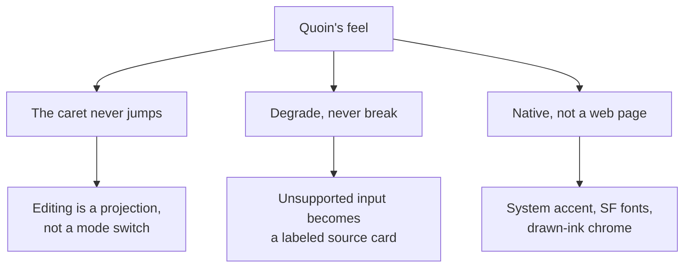
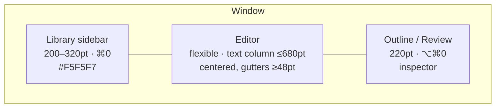
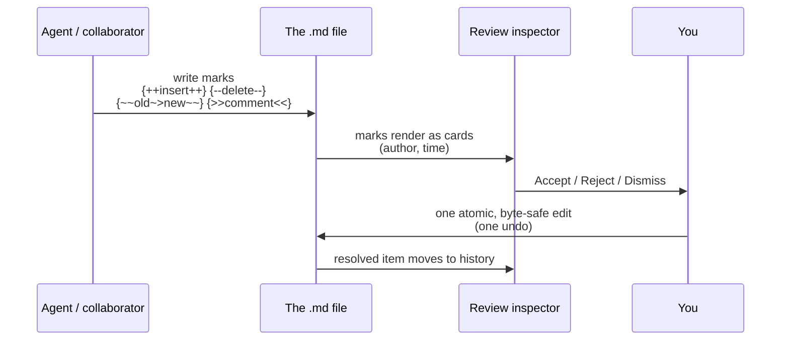
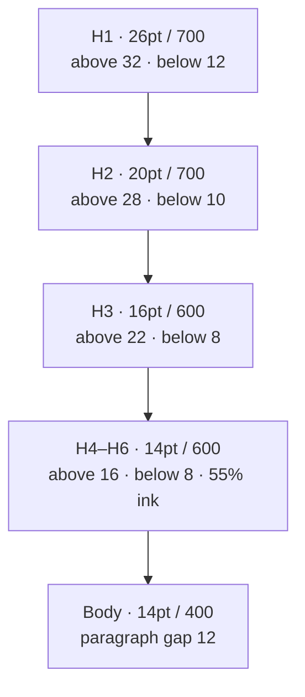
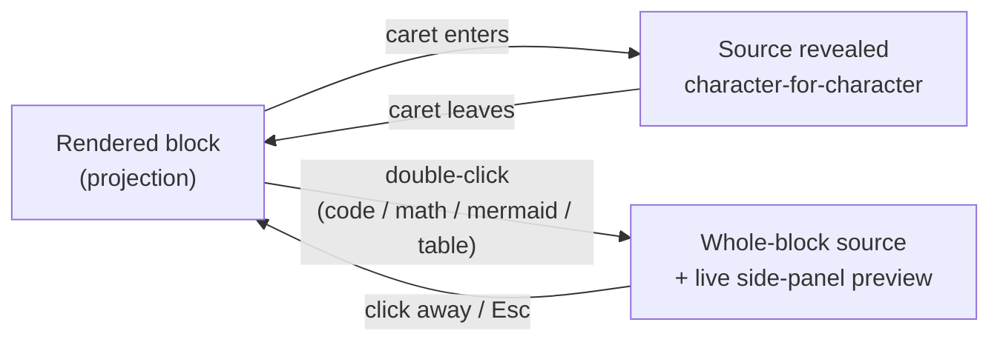
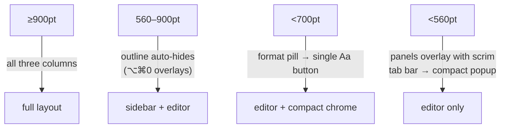
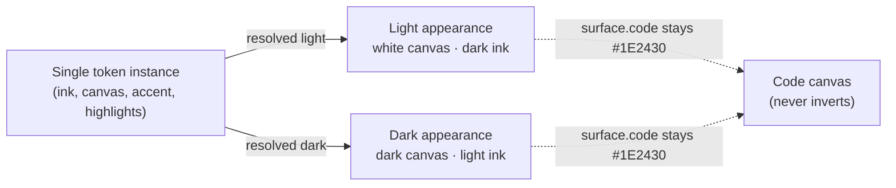
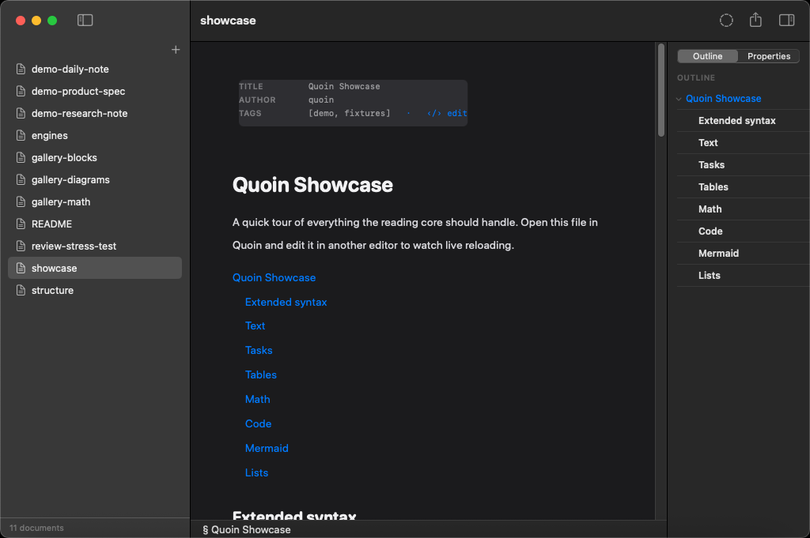

# Quoin's Design Language

This is the visual and interaction spec for Quoin: the aesthetic, the type
ramp, the spacing and color system, and — most importantly — the interaction
principles that give the editor its feel. It is the canonical answer to "what
should this look like, and why does it behave this way." Where another document
disagrees on visuals, this one wins.

Quoin is a native macOS WYSIWYG markdown editor (portable to iPadOS/iOS — see
[platforms.md](platforms.md) for the shape of those ports). The markdown
*file* is the source of truth; the editor is a live projection of it.
Everything renders natively — no web view, no JavaScript at runtime, everything
local. For what the app actually does, feature by feature, see the capability
spec in [PRODUCT.md](../PRODUCT.md).

---

## The three principles

Every decision below serves one of three principles. When a detail is ambiguous,
resolve it toward these.

### 1. The caret never jumps

The single most important feeling in Quoin is that the document does not lurch
under you. On **any** projection change — revealing a block's source, closing
it, a keystroke, a checkbox toggle — the line the caret or click is on must not
move on screen. When a block flips to edit mode it keeps its vertical skeleton
(the same number of lines in the same places), so nothing reflows beneath your
eyes. Scrolling only happens when the caret genuinely leaves the viewport, and
then by the minimum amount.

This is why the source of truth is the markdown string, not an attributed
string: the editor is a *projection* you can re-derive at will, so revealing raw
source and re-rendering it are the same document seen two ways, not two
documents you jump between.

### 2. Degrade, never break

Quoin renders a large surface natively — CommonMark, GFM, callouts, highlights,
footnotes, LaTeX math, Mermaid diagrams. When it meets something it cannot
render — an unsupported LaTeX command, an unknown diagram type, a raw HTML block
— it shows a **labeled source card** with a specific reason, never a blank space
and never a crash. The user always sees their content and always knows why it
looks the way it does.

### 3. Native, not a web page

Quoin looks and feels like a Mac app because it *is* one. It defers to the
system accent color (`controlAccentColor`), uses the SF font family, and draws
its chrome as ink behind TextKit 2 text rather than faking it with CSS (the
rendering pipeline behind that ink is mapped in
[architecture.md](../reference/architecture.md)). The
aesthetic — **Graphite** — is a white canvas, a light graphite sidebar, hairline
rules, and generous whitespace. Restraint is the brand.

---

## The Graphite aesthetic

| Surface | The design |
| :--- | :--- |
| **Overall** | Native macOS. White editor canvas, `#F5F5F7` sidebar, system accent throughout. Minimalist; whitespace carries the layout. |
| **Sidebar** | A classic file tree: SF Symbol icons, filled-accent selection, disclosure chevrons. It mirrors the folder on disk. |
| **Outline** | A ruled tree: a hairline under each row, chevrons that collapse subtrees, indent by heading level. |
| **Text styling** | Rounded: the editor face is **SF Pro Rounded**; highlights are soft pills. This is what makes Quoin feel warmer than a code editor without feeling toylike. |

The editor face is SF Pro Rounded; the UI face is SF Pro; mono is SF Mono. This
pairing is deliberate: the rounded editor face reads as *prose*, the crisp UI
face reads as *chrome*, and the eye separates them without thinking about it.

---

## Anatomy of the window

Default size ~1180×760pt. Three columns, thresholds measured on the **editor
column width**, not the window width.

Those three regions in the running app — the library sidebar at left, the
centered editor with its front-matter chip and format pill, and the outline
panel at right:

### Library sidebar

Surface `#F5F5F7`, 1px right border `rgba(0,0,0,.07)`.

- **Header** — traffic lights; trailing `plus` (new document) and
  `sidebar.leading` (toggle) buttons.
- **Search field** — `rgba(0,0,0,.05)` fill, radius 6.
- **Section label** — 10.5pt semibold, 40% ink.
- **Rows** — 12.5pt system, 26pt tall (44pt on touch), radius 5–6, icon +
  name. Folder rows get a disclosure chevron; nesting indents +14pt.
- **Footer** — document count and sync state, 10.5pt, 40% ink, top hairline.

Rows carry a full set of drag-and-drop states, because moving a row moves the
file on disk:

| State | Treatment |
| :--- | :--- |
| Default | Transparent |
| Hover | `rgba(0,0,0,.05)` fill |
| Selected | Accent fill, white text, weight 500 |
| Dragging | White card, shadow `0 4 14 rgba(0,0,0,.18)`, −1.5° tilt |
| Drop-between | 2pt accent caret line with circle terminal |
| Drop-into-folder | 2pt accent inset ring; folder spring-opens after 400ms hover |
| Rename | Inline text field, 1.5pt accent border |
| Non-md asset | 35% ink, not openable |

### Tab bar

Surface `#FAFAFA`, bottom hairline. Active tab: white background, 12pt medium.
Inactive: 50% ink. Unsaved marker: a 6pt accent dot that swaps to a ✕ close
control on hover. Tabs are ≥120pt and overflow scrolls.

With a single document open the tabs hide, but the chrome row persists: the
**format pill** (B/I/U, white, radius 14, hairline border; expands to the full
format menu on click and floats over content when scrolled) and the **outline
toggle** (`sidebar.trailing`).

### Editor

The reading surface. Caret and selection use the accent color. The text column
never exceeds 680pt regardless of window size — long measure hurts reading, and
the cap is non-negotiable. See the element spec below.

### Status bar

Top hairline, 10.5pt mono, 40% ink. Left: the current section (`§ Key types`).
Right: live statistics (`412 words · 2,304 chars · 2 min read`). Clicking the
statistics opens a detail popover; selecting text swaps the counts to the
selection. Hideable in Settings.

### Outline / Review panel

White, left hairline. This inspector has multiple modes.

**Outline** — an `OUTLINE` label (10pt caps, 35% ink) over rows at 12pt with a
hairline rule under each (`rgba(0,0,0,.08)`), indented by heading level
(0 / 16 / 34pt). H1 bold, H2 semibold, H3+ regular. Chevrons collapse subtrees;
the current section shows accent + weight 500; clicking scrolls to it. Generated
live from the heading tree.

**Review** — the same panel switched to list every suggestion and comment in the
document as a card. This is Quoin's differentiator, and it earns a place beside
the outline rather than a separate window: reviewing is reading.

**Properties** — the front matter as an editable key/value grid, with typed
editors (date pickers, boolean toggles, arrays as CSV).

---

## The review loop

Suggestions and comments live *in the markdown file* (RDFM / CriticMarkup), so
an agent or a collaborator can propose edits anywhere and you triage them in a
real UI — byte-safely. The raw delimiters never show; the marks render as
tracked changes and as cards.

Because the marks *are* the file, the review loop is the entire interface
between a human and an agent — there is no side channel, no database, no
proprietary diff. The document you accept into is the document you had, minus
exactly the bytes the mark named. The full mark syntax, card model, and
resolution rules are covered in [suggestions.md](suggestions.md).

---

## Element render spec (editor, default text size)

`⌘＋` / `⌘−` scales the whole ramp uniformly.

### Type ramp

| Element | Size / line | Weight | Spacing | Color |
| :--- | :--- | :--- | :--- | :--- |
| **H1** | 26 / 1.25 | 700 | above 32, below 12 | ink |
| **H2** | 20 / 1.3 | 700 | above 28, below 10 | ink |
| **H3** | 16 / 1.35 | 600 | above 22, below 8 | ink |
| **H4–H6** | 14 | 600 | above 16, below 8 | 55% ink |
| **Body** | 14 / 1.7 | 400 | paragraph gap 12 | `#333` |

The ramp steps down in size, weight, and surrounding space together — each
level's whitespace shrinks along with its type, so hierarchy reads from
spacing as much as from size:

### Inline

- **Bold** `#1D1D1F` · **italic** · **strikethrough** 45% ink
- **Link** accent with 35%-alpha underline
- **Inline code** 12.5pt mono on `#F2F2F4`, radius 4, pad 1×5
- **Footnote ref** superscript accent
- **Highlight** a pill (radius 3, pad 0×2), lime by default

### Blocks

- **Lists** — marker column 24pt, nested indent +24; bullets/numbers in accent;
  tasks are interactive 15pt checkboxes (radius 4). Checking one fills the box
  accent, draws a white check, and strikes + fades the row to 40%, animated.
- **Blockquote** — 3pt rule `rgba(0,0,0,.15)`, pad-left 16, italic, 55% ink;
  nested quotes stack rules.
- **Callouts** — radius 8, 4% tint background + 15% border of the semantic
  color; 12.5pt semibold title with an SF Symbol. Types: note (blue),
  tip (green), important (purple), warning (amber), caution / danger (red).
- **Code block** — canvas `#1E2430` in **both** appearances, radius 8. Header
  row is a language chip (10.5pt mono, 45% white) plus a copy button on hover.
  Code is 12 / 1.6 mono `#D6DCE6`. Twelve selectable canvas themes; the default
  follows the app appearance. (Sample keyword `#C792EA`, function `#82AAFF`,
  type `#FFCB6B`, comment `#697794`.)
- **Table** — header 600 with a 1.5pt bottom rule @15% ink; body rows 1pt @7%;
  cell pad 6×10; numeric columns tabular-nums, right-aligned; hover reveals
  add-row / add-column controls at the edges.
- **Math** — inline `$…$` / `\(…\)`, display `$$…$$` / `\[…\]` centered with 16
  above/below. Typeset natively by
  **[Vinculum](https://github.com/2389-research/Vinculum)** (TeX-style geometry,
  no MathJax/KaTeX).
- **Mermaid** — laid out natively by
  **[MermaidKit](https://github.com/2389-research/MermaidKit)** (no Mermaid.js)
  inside a radius-8 bordered block.
- **Images** — max-width 100%, radius 8; drag-drop or paste copies the asset
  into the library; alt text renders as an 11pt centered caption.
- **HR** — 1px hairline @12%, 20 above/below.
- **Footnotes** — gathered at document end, 12 / 1.6 secondary, top hairline,
  bidirectional jump on click, hover preview.
- **[TOC]** — an inline linked list mirroring the outline.
- **YAML front matter** — collapses to a compact metadata chip above the H1;
  click to edit as a field grid (Properties).

Both engines are first-party packages with their own dependency-policy
exemption; see [dependencies.md](../reference/dependencies.md) for how that
policy works.

Why the code canvas stays dark in light mode: code wants maximum contrast and a
stable token palette, and a light-on-light code block reads as an afterthought.
The dark canvas signals "this is machine text" instantly, in either appearance.

---

## Syntax reveal — the core WYSIWYG rule

Quoin is WYSIWYG on a plain `.md` file: the rendered document *is* the editor.
The mechanism is syntax reveal, whose full machinery — reveal, activation,
patch-vs-render equivalence — lives in [editor-modes.md](editor-modes.md);
this section covers only its visual contract.

- When the caret enters a styled inline span, its markdown delimiters fade in at
  35% ink in mono; leaving hides them. Delimiters appear **only** for the span
  containing the caret.
- Whole blocks (code, math, mermaid, tables) flip to their full literal source
  on double-click. Revealed source is character-for-character 1:1 with the file
  — hidden delimiters become 1-point clear glyphs, never removed, so caret
  mapping and edits stay exact.
- **Smart pairs** auto-close `**` `_` `==` `$` `` ` `` — suspended inside code
  spans and fences.

The live preview for math and Mermaid is a **side panel** beside the source, not
an inline run: the last good render is held while the mid-edit source is
temporarily broken, so the block's height never flashes with parse validity.
This is principle 1 (the caret never jumps) applied to structured embeds.

---

## Interactions & behavior

- All transitions 150ms ease-out; drag uses the system lift shadow.
- **Sidebar** — drag to reorder / nest (multi-select ⌘-click), right-click
  context menu, inline rename; ⌘Z undoes moves, including on disk.
- **Highlight** — ⇧⌘H cycles the five-color palette on the selection.
- **Format** — ⌘B / ⌘I bold/italic, ⌘K link.

### Keyboard map

Conflict-audited against the system. ⌘P and ⌘E keep their system meanings and
are never overridden.

| Keys | Action |
| :--- | :--- |
| ⌘N / ⌘T / ⌘W | New document / new tab / close |
| ⌘1–9 | Jump to tab |
| ⌘0 / ⌥⌘0 | Toggle sidebar / outline |
| ⇧⌘O | Quick open |
| ⌘F / ⇧⌘F | In-document find / library-wide search |
| ⌘B / ⌘I / ⌘K | Bold / italic / link |
| ⇧⌘H | Cycle highlight color |
| ⇧⌘E | Export |
| ⌘＋ / ⌘− | Text size |

### Additional screens

- **Quick open (⇧⌘O)** — a centered floating panel (white, radius 10, shadow
  `0 12 32 rgba(0,0,0,.14)`): search row over a results list with fuzzy titles,
  full-text snippets with the match bolded, and the path in secondary. Selected
  row uses accent fill.
- **Export sheet (⇧⌘E)** — a native sheet titled *Export ‹doc name›*, with a
  format grid (radius-7 cards): PDF (default: 2pt accent border, 5% accent
  fill), standalone HTML with inlined assets, MD + asset folder, RTF, TXT.
  Options: include-footnotes, theme picker. PDF uses the element spec as its
  print stylesheet; math and Mermaid rasterize @2x.
- **Empty states** — *No document open*: a centered `doc.text` symbol at 35%,
  "No document open" (13pt semibold, 55% ink), "Select a document, or press
  ⌘N", and an outlined accent "New Document" pill. *New document*: a ghost
  "Untitled" H1 placeholder at 30% ink with the caret in the title. The first
  H1 becomes the filename live until manually renamed; duplicates get a " 2"
  suffix — never a modal.

---

## Responsive behavior

Thresholds are on the **editor column width**, not the window.

The status bar sheds statistics first and the section name last. The editor text
column never exceeds 680pt at any size.

### Platform ports

- **iPadOS** — the same split view; outline via the trailing inspector; 44pt
  rows.
- **iOS** — push navigation (library → document); outline as a bottom sheet;
  the format bar docks above the keyboard.
- Multi-window is supported everywhere; each window keeps independent panel
  state.

---

## Design tokens

### Color

| Token | Value |
| :--- | :--- |
| `ink` | `#1D1D1F` — headings, bold |
| `ink.body` | `#333333` — body text |
| `ink.secondary` | 55% ink |
| `ink.tertiary` | 35–40% ink |
| `canvas` | `#FFFFFF` — the page |
| `surface.sidebar` | `#F5F5F7` |
| `fill.codeInline` | `#F2F2F4` |
| `surface.code` | `#1E2430` — same in both appearances |
| `accent` | `controlAccentColor`; `#2A6FDB` is the marketing value |

**Highlights** (all ≥4.5:1 with `ink.body`): lime `#D9F59B` (default) · pink
`#F7D9F0` · yellow `#FDEEAA` · blue `#CFE6FB` · orange `#FEDBC6`.

**Callout tints** — 4% background + 15% border of the semantic blue / green /
purple / amber / red.

**Dark mode** — a full first-class appearance, not an afterthought. Ink and
canvas invert; `surface.code` holds (the code canvas is dark in both); highlight
colors have hand-tuned dark variants (e.g. lime → `#5A6B33`) so the pills stay
legible without glowing. Every color resolves per-appearance at draw time from a
single stable instance, so light and dark are the same projection under two
palettes.

Light and dark are not two designs to maintain but one token instance resolved
two ways at draw time — the only holdout is the code canvas, which refuses to
invert on purpose:

That inversion applied to a real document — ink and background flip, while the
code canvas and highlight pills hold their color for legibility:

### Spacing & shape

- **Spacing scale** — 4 · 8 · 12 · 16 · 24 · 32.
- **Radii** — 4 inline code · 6 rows/buttons · 8 blocks · 10 panels.
- **Hit targets** — ≥28pt on Mac, ≥44pt on touch.

### Iconography

SF Symbols only — `doc.text`, `folder`, `photo`, `pin.fill`, `magnifyingglass`,
`sidebar.leading`, `sidebar.trailing`, `plus`, `info.circle`. No custom icon
set; the system family carries the whole UI.

---

## Acceptance checklist

The behaviors this design promises, testable end to end:

- [ ] The markdown string + AST is the only source of truth; round-trip
      (open → edit → save) is byte-lossless for untouched regions (the full
      rule set is [invariants.md](../reference/invariants.md)).
- [ ] Syntax reveal shows delimiters only for the span containing the caret.
- [ ] On any projection change, the caret/click line does not move on screen.
- [ ] The first H1 renames the file live; duplicate names get a " 2" suffix
      silently.
- [ ] A task checkbox toggles with animation; done rows strike + fade to 40%.
- [ ] The outline tracks scroll position; clicking scrolls to the heading;
      chevrons collapse subtrees.
- [ ] Dragging a document onto a folder moves the file on disk; ⌘Z restores it.
- [ ] An external edit while clean reloads silently; while dirty it shows a
      non-blocking merge banner.
- [ ] Code blocks stay dark (`#1E2430`) in light and dark appearance.
- [ ] The editor column is ≤680pt at every window size; panels collapse in
      order (outline → sidebar).
- [ ] Every shortcut works; ⌘P prints; ⌘E does Use-Selection-for-Find.
- [ ] With one document open, the tab bar hides but the format pill + outline
      toggle remain.
- [ ] Export produces PDF, standalone HTML, MD + assets, RTF, and TXT.
- [ ] A suggestion or comment renders as a card; Accept / Reject is one atomic,
      byte-safe edit.

---

## Related documents

- **`Markdown Editor Design Doc.dc.html`** (this folder) — the hi-fi visual
  spec with static mockups; anatomy, the element sheet, states, flows,
  responsive, and tokens.
- **[editor-modes.md](editor-modes.md)** — the machinery behind these visuals:
  reveal, activation, patch-vs-render equivalence.
- **[suggestions.md](suggestions.md)** — the review loop in full: mark syntax,
  card model, resolution.
- **[../reference/architecture.md](../reference/architecture.md)** — the
  contributor-level map of the rendering pipeline.
- **[../reference/invariants.md](../reference/invariants.md)** — the viewport
  and round-trip invariants stated as enforceable rules.
