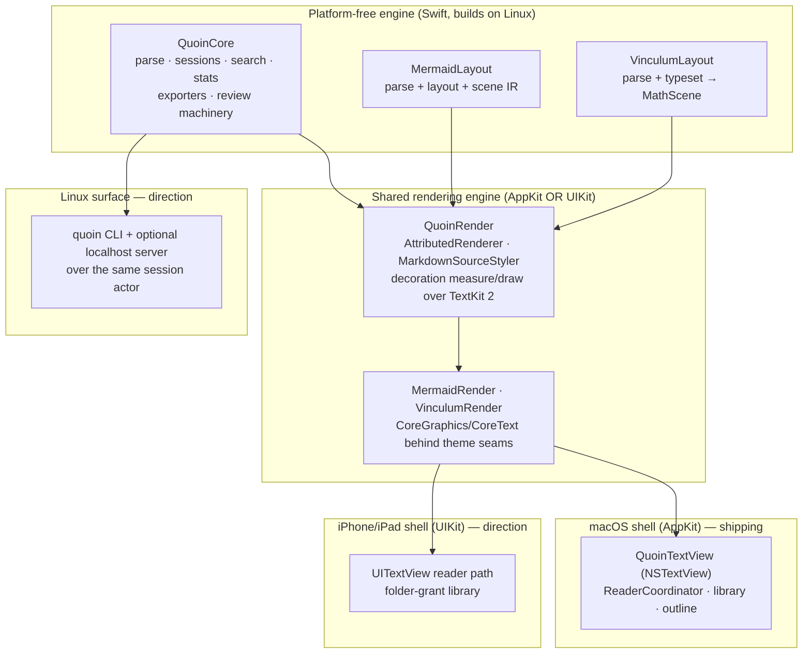
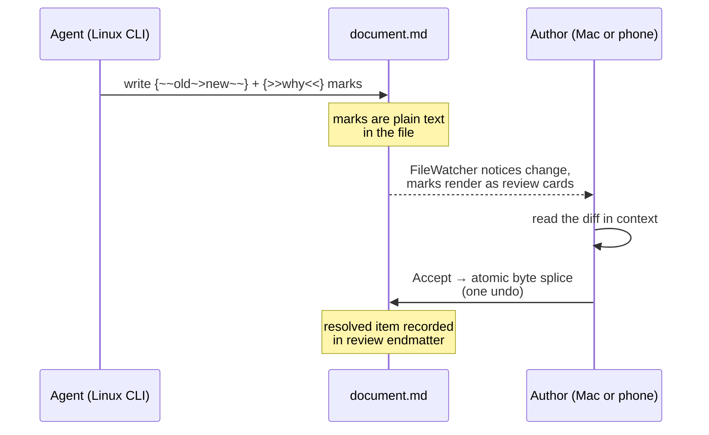
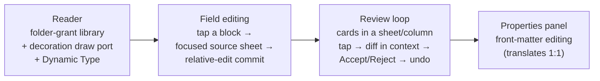
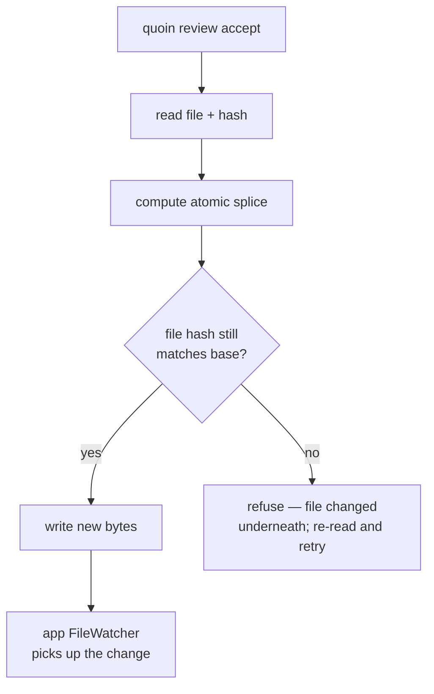
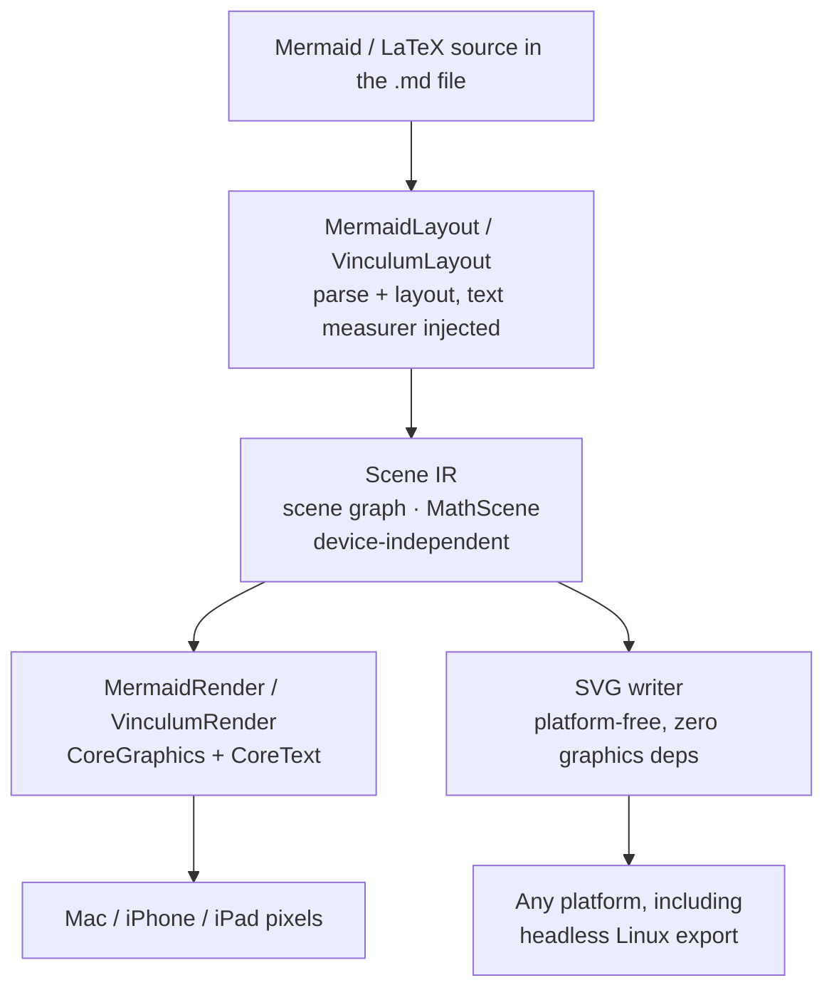

# Quoin across platforms

Quoin ships on macOS today. This document explains **where it can go next —
iPhone, iPad, Linux — and why those directions are open at all.** The short
answer is architectural: the part of Quoin that knows what a document *is*
carries no platform code, and the feature that makes Quoin distinctive — the
in-file review loop — is a file operation, not a UI trick. Anything that can
read and write a `.md` file can participate.

Companions: the architecture map (`docs/reference/architecture.md`), the
review-loop design (`docs/design/suggestions.md`), and the product spec
(`docs/PRODUCT.md`).

---

## The one idea that makes portability possible

Quoin's source of truth is the markdown **file** — the string plus its parsed
AST — never an attributed string or an app-specific document format. The
editor is a [*projection*](editor-modes.md) of that file; every edit
mutates the source and the renderer re-projects. (Why this matters is covered
in `docs/reference/architecture.md`, but the one-line version: the file is
the thing you own, and the app is just a lens on it.)

That single decision has a portability consequence. Because the document, the
sessions that mutate it, and all the review machinery are expressed in terms
of *bytes on disk*, they need nothing from AppKit, UIKit, or any windowing
system. They live in a platform-free engine. Only the drawing and the
input-handling — the lens — are platform-specific.



The rule is simple: **QuoinCore has zero AppKit imports.** It is the document
brain, and it already builds and tests headlessly on Linux. What differs
between platforms is the shell that draws the projection and routes input.

---

## What lives where

| Concern | Layer | Platform-bound? |
| :--- | :--- | :--- |
| Parse markdown, hold the AST | QuoinCore | No — Linux-clean |
| Edit sessions, [byte-lossless](../reference/invariants.md) splices, drift checks | QuoinCore (`DocumentSession` actor) | No |
| Review marks: author, resolve, accept/reject | QuoinCore (`SuggestionResolver`, `ReviewAuthoring`, `ReviewEndmatter`) | No |
| Search, stats, outline, exporters | QuoinCore | No |
| Diagram + math layout → device-independent scene IR | MermaidLayout / VinculumLayout | No |
| Attributed-string projection + source reveal | QuoinRender | Needs AppKit **or** UIKit |
| Decoration draw (code canvas, callouts, rules, frames) | QuoinRender view layer | Yes — per platform |
| Text view, library, outline, menus | App shell | Yes — per platform |
| File-change watching | QuoinCore (`FileWatcher`) | Darwin-only today; needs an inotify backend for Linux |

The gradient is the whole story: everything above the double line moves to a
new platform **for free**; everything below it is a port.

---

## macOS today

The shipping product is the macOS app: a `SwiftUI` shell around an
`NSTextView` subclass (`QuoinTextView`) that draws Quoin's decorations behind
the text using TextKit 2 fragment frames. It is the full editor —
CommonMark + GFM, callouts, highlights, footnotes, front-matter Properties,
code with twelve themes, native LaTeX math ([Vinculum](https://github.com/2389-research/Vinculum))
and Mermaid diagrams ([MermaidKit](https://github.com/2389-research/MermaidKit)),
and the complete review loop. Both engines are first-party dependencies —
see `docs/reference/dependencies.md` for how that fits Quoin's one-dependency
policy. Everything the rest of this document describes as a "direction" is
measured against this bar.


macOS is where the review loop is used live: an agent or collaborator writes
suggestion marks into the file, they render as cards in the Review
inspector, and Accept/Reject is a single atomic, byte-safe edit (the same
invariant behind `docs/reference/invariants.md`). See
`docs/guide/features.md` for the feature tour.


---

## The engine is the product

Before talking about phones and servers, it is worth being precise about *why*
the review loop is the cross-platform story and not, say, WYSIWYG editing.

WYSIWYG editing is inherently a rich-interaction, per-platform problem: caret
management, text views, keyboard and pointer handling. It ports, but it ports
slowly. The **review loop does not have that shape.** A suggestion is text in
the file:

```markdown
The {~~quick~>swift~~} brown fox {>>is this too fast?<<}
```

Proposing a change is *writing those bytes*. Triage is *reading them and
splicing an accept or reject*. Both are pure QuoinCore operations that already
run on Linux with no display at all. That is what makes the review loop the
natural first thing to reach every surface — an agent on a server, a
collaborator on a phone, and the author at the Mac can all touch the same
marks in the same file.



Every arrow into `File` is a QuoinCore operation. No platform owns it.

---

## iPhone and iPad

The mobile direction is **reviewer-first**, and it follows the same gradient
the architecture already draws: reach the thing that is cheap and distinctive
before the thing that is expensive and ordinary.

A UIKit reader path already exists and compiles in CI, but it is a spike, not
the product: a small `UITextView`-based view without the decoration layer that
gives the Mac its code canvases, callout boxes, and ruled quotes. Bringing the
phone to the Mac's bar is a real port of the *draw* layer, not a new engine —
the target is the visual language fixed in `docs/design/handoff.md`, not a
phone-native reinterpretation of it. The likely order:



- **Reader** first, because a reader is achievable and the decoration draw is
  the honest bulk of the work: a UIKit port of the measure/draw pass over
  TextKit 2 fragment frames, a folder-grant library (`UIDocumentPicker` +
  security-scoped bookmark), Dynamic Type via `UIFontMetrics`, and an explicit
  iOS behavior for each `quoin-*` interaction URL scheme.
- **Field editing** next — tap a block, edit its source in a focused sheet,
  commit through the same relative-edit session API the Mac uses. "Read plus
  fix a typo" is the smallest app that isn't embarrassing.
- **The review loop** is the payoff: triage suggestions from the couch. It
  reuses QuoinCore's resolver wholesale; the new work is presentation (cards,
  jump-and-flash diff, undo) and the sync mechanics below.
- **A full WYSIWYG editor** is deliberately last and demand-gated. Porting the
  TextKit 2 / `UITextView` editing coordinator is the largest single piece,
  and it earns its place only once the reviewer is excellent.

Throughout, **iPad is treated as a first-class keyboard-and-pointer device**,
not a stretched phone: arrow-key card navigation, ⌘-return to accept, ⌘F, and
pointer hover are what separate a real iPad app from a scaled-up one.

### What has to be true first: sync

The phone story rests on files arriving on the device, which on iOS means
iCloud — and iCloud is not free sync. A picker-granted folder holds *dataless
placeholders*; a plain file watcher sees nothing until the file is
materialized. The mechanics the review-on-phone experience depends on:

- **Discovery + download** of dataless files via `NSMetadataQuery` before they
  can be read.
- **Coordinated reads and writes** so the app and iCloud's own daemon don't
  race, and **`NSFileVersion` conflict handling** as first-class UX rather than
  a crash.
- **Pull awareness** — because iCloud won't wake the app, a background scan
  plus a local notification and badge ("3 new suggestions in Weekly Notes").
  A reviewer nobody is told about is a room nobody enters.

The quality of the couch-review experience is exactly the quality of this
section — which is why the mobile work is scoped to *demonstrate* the async
review appetite before committing to the larger surfaces, not to assume it.

---

## Linux

Linux is where "any tool that writes markdown writes Quoin documents" stops
being a slogan. The engine is already there: QuoinCore is AppKit-free and its
core suite runs headless on Linux. What Linux needs is a *surface* over that
engine, and the honest medium-term answer is a command-line tool, not a GUI.

### The `quoin` CLI

A CLI is the direct expression of the engine's public API — the same in-actor,
drift-checked operations the app uses:

| Command group | What it does |
| :--- | :--- |
| `quoin stats \| outline \| lint` | read-only document introspection |
| `quoin export --format html\|md\|txt` | the existing exporters, headless |
| `quoin review list` | enumerate marks as versioned JSON (agents pin to the schema) |
| `quoin review add \| accept \| reject \| reply` | drive the review loop from a script |

This is the agent handoff made concrete: an agent proposes edits with
`quoin review add`, the author triages at the Mac, and everything stays in the
file. Pairing it with a Claude Code skill makes the loop usable the day it
lands.

### What has to be true first: cross-process write safety

`DocumentSession` guarantees atomicity **within one process.** The moment a
second writer exists — a CLI invocation, an agent — racing the app's open
session and its autosave, that guarantee needs to extend across processes.
The engine already carries the primitive: sessions hash content
(`SHA256Hex`) and **refuse to apply an edit computed against a stale base**
rather than corrupt the file. A CLI write becomes a compare-and-swap against
that content hash with the same refuse-don't-corrupt posture, and the app's
`FileWatcher` absorbs an external CLI write exactly as it absorbs any external
edit.



### `FileWatcher` needs an inotify backend

Today `FileWatcher` is built on Darwin's `DispatchSource` file-system events
(kqueue). Linux `quoin watch` — and any live-reload surface — needs an inotify
backend behind the same interface. The interface is already platform-neutral;
the implementation is guarded and swappable.

### A localhost server, later

Longer term, a `quoin serve` localhost server over the session actor gives
Linux a real editing surface in a browser without a GUI toolkit port. It is a
sketch, not a commitment, because it has genuine design questions to answer
first:

1. **An HTTP server against the [one-dependency policy](../reference/dependencies.md).**
   `swift-nio` would need TRD justification, or a minimal hand-rolled epoll
   server — a decision to make deliberately, not a library to reach for.
2. **The zero-JavaScript stance, honestly.** Server-rendered HTML with no
   frameworks, ever. Live reload without any client script does not really
   exist and meta-refresh loses scroll and form state, so the honest position
   is *at most one small inline script* for live-reload and scroll
   preservation — an explicit, documented exception to the letter of zero-JS
   that keeps its spirit — or no live reload at all.

Until that server exists, the shippable Linux reality is unglamorous and real:
the CLI, plus `$EDITOR`, plus `quoin export html` opened in a browser.

---

## Rendering everywhere: scene IR

Both engine packages already produce a **device-independent scene IR** —
`MermaidLayout` emits a scene graph, `VinculumLayout` emits a `MathScene` —
which the platform renderers turn into pixels. That indirection is what lets
diagrams and math travel: platform-free **SVG writers** in MermaidKit and
Vinculum turn the same scene IR into strings, giving full-fidelity export on
any platform, including headless Linux, with zero graphics dependencies. Both
layout engines also accept an injected text measurer, so a Linux font stack
can supply the one thing Linux genuinely lacks — real text metrics — and
produce the *same geometry* as the Mac. SVG stays the zero-dependency path;
raster export is an optional upstream enhancement, never an app dependency.

The same scene IR forks into two consumers, and only one of them is
platform-bound:



The layout half is shared engine code; only the last step — turning IR into
pixels versus turning it into a string — ever asks what platform it's on.

---

## Non-goals

These are settled, and they clarify the shape of everything above:

- **No Mac Catalyst.** The AppKit and UIKit paths are separate on purpose.
- **No Linux GUI toolkit port** (no GTK, no Qt). Linux gets a CLI and possibly
  a localhost server, not a native window.
- **No sync service.** Quoin syncs by syncing files (iCloud, Git, anything);
  it never becomes a backend.
- **No client-side JavaScript frameworks, anywhere, ever.** The single
  possible inline live-reload script is the whole of the exception, and it is
  documented as such.
- **No WYSIWYG phone editing before the reviewer is excellent.** The order is
  reader → field edit → review → full editor, not the reverse.

The through-line: **files are the only truth, the engine is platform-free, and
the review loop is a file operation** — so Quoin reaches a new platform by
porting a lens, never by rebuilding the document.
