# How the review and commenting system works

Quoin has a full review loop — tracked changes and comments, the kind you
expect from Google Docs — but with one decisive difference: **the review
lives inside the `.md` file as literal text.** There is no sidecar database,
no proprietary revision store, no server. A suggestion is a few extra bytes
wrapped around the words it concerns. A comment is a short run of characters
appended after them. The editor renders those bytes as tracked changes and
comment cards; accepting or rejecting one is an ordinary, undoable edit to the
file.

This is Quoin's headline capability — see it in the feature tour at
[`docs/guide/features.md`](../guide/features.md). This document explains what
the marks are, why the design is shaped the way it is, and how the whole loop
works end to end.

---

## Why the review lives in the file

Quoin's founding rule is that **the markdown string is the source of truth**
and the editor is a live projection of it (see
[`docs/reference/architecture.md`](../reference/architecture.md)). The review
system is the same rule taken to its conclusion: if the file is the truth,
then a review of the file belongs *in* the file, not in a database beside it.

That single choice buys a remarkable amount:

| Property | What it means in practice |
| :--- | :--- |
| **Portable** | The review travels with the document. Email it, drop it in a repo, sync it through iCloud or Dropbox — the suggestions and comments come along, because they *are* the document. |
| **Agent-writable** | Any tool that can write text can propose edits. An LLM emits `{~~old~>new~~}` into the file; Quoin renders it as a suggestion the moment the file is opened. No API, no plugin — just text. |
| **Git-diffable** | Because a suggestion is bytes, `git diff` shows exactly what was proposed and by whom. Reviews merge, branch, and blame like everything else in the repo. |
| **No lock-in** | The marks are the [CriticMarkup](http://criticmarkup.com) convention, which many editors already understand. Open the same file in a plain markdown renderer and the marks show as literal text — nothing breaks, nothing is hidden in a format only Quoin can read. |
| **Byte-safe** | Accepting or rejecting a suggestion is a precise splice of the exact bytes involved, applied through the same edit pipeline as typing. Undo works. Autosave works. Untouched regions of the file stay byte-for-byte identical. |

The alternative — an in-memory or sidecar review layer — was considered and
rejected on principle. A sidecar can drift from the file, can't be diffed, and
can't be written by an agent that only sees text. **The file is the review.**

### The agent loop this unlocks

Because the format is just text, the interesting workflow is a round trip
between a human and an agent, mediated entirely by the file:

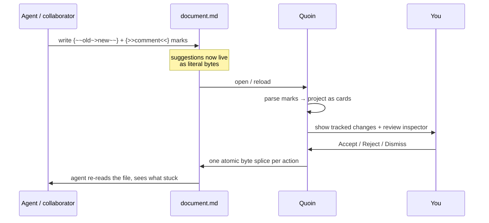

The agent proposes, you triage, and the file records the outcome — all in
plain markdown that either side can read at any point.

---

## The marks: five shapes of change

Every proposed change or annotation is one CriticMarkup mark: an opening
brace, a doubled sigil, the content, the same doubled sigil, and a closing
brace. There are exactly five shapes.

| Mark | Shape | Meaning |
| :--- | :--- | :--- |
| **Insertion** | `{++new text++}` | Suggest adding this text |
| **Deletion** | `{--old text--}` | Suggest removing this text |
| **Substitution** | `{~~old~>new~~}` | Suggest replacing *old* with *new* |
| **Comment** | `{>>a note<<}` | Leave a note (changes nothing) |
| **Highlight** | `{==important==}` | Flag a span for attention |

A substitution splits on the **first** `~>` — the old text is always to the
left of the arrow, the new text to the right. (The original CriticMarkup
reference tooling forbids a bare `>` in the old half; Quoin implements the
plain intent instead and accepts it.)

The five shapes split cleanly into two families, and the family predicts what
resolution does to the text — a **change** proposes different bytes; an
**annotation** never does:

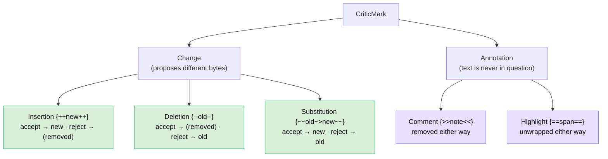

Accept All / Reject All only walks the **Change** family for exactly this
reason — comments and highlights carry no proposed bytes to accept or reject.

### Anatomy of a mark

Marks can carry an optional identity reference — `{#id}` — right after the
closing brace. That reference is the hook that links the inline mark to its
metadata in the file's endmatter (author, timestamp, reply thread).

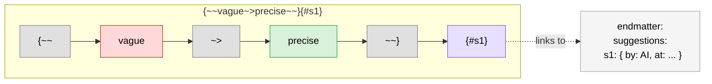

The reference is optional. A mark with no `{#id}` is still a complete, valid
suggestion — it simply carries no author or timestamp. When such a mark is
resolved, Quoin synthesizes an id so the resolution can still be recorded.

### How marks render

Marks never appear as raw braces in the reading view. They project as tracked
changes:

| Mark | Rendered as |
| :--- | :--- |
| Insertion | Text with an accent fill and underline |
| Deletion | Text struck through and dimmed |
| Substitution | Old half struck through, an arrow, new half underlined |
| Comment | A compact `💬` chip; the full note is in its tooltip and card |
| Highlight | A colored pill behind the span |

When your caret enters a marked span in edit mode, the block reveals its
literal source — the actual `{++…++}` bytes, character-for-character with the
file — because that revealed source is what your keystrokes edit. Everywhere
else, you see the change, not the syntax. This is the same syntax-reveal
projection used for every other span type; see
[`docs/design/editor-modes.md`](editor-modes.md) for the general model.

### Marks are intra-block, and inert inside code and math

Two normative rules keep marks robust:

- **A mark lives inside one block.** It can span soft line breaks within a
  paragraph, but it cannot straddle a paragraph boundary, a list item, or a
  heading. An unbalanced or block-spanning mark simply degrades to literal
  text — Quoin never half-parses a mark and eats your content.
- **Code and math are opaque.** A `{++…++}` inside an inline code span or a
  math span (`$…$`, `$$…$$`, `\(…\)`, `\[…\]`) stays literal text, exactly as
  a plain renderer would treat it. This is why opaque blocks — code, tables,
  diagrams, math — are commented *beside* rather than *inside* (see
  [Commenting opaque blocks](#commenting-opaque-blocks-code-tables-diagrams-math)).

---

## The endmatter: metadata that rides along

The marks carry *what* changed. Author, time, threading, and resolution
history live in a YAML block at the very end of the file, after a final
`---` fence. This is the RDFM (RoughDraft Flavored Markdown) convention layered
on top of classic CriticMarkup.

```markdown
Please revisit {==this sentence==}{>>Needs a source.<<}{#c1}.

---
comments:
  c1: { by: user, at: "2026-04-28T12:00:00Z" }
  c2: { body: "I can add one.", by: AI, at: "2026-04-28T12:05:00Z", re: c1 }
suggestions:
  s1: { by: AI, at: "2026-04-28T12:01:00Z" }
```

Each entry is keyed by the `{#id}` its mark carries. The fields:

| Field | Meaning |
| :--- | :--- |
| `by` | Author label; the literal `AI` marks agent authorship |
| `at` | ISO-8601 timestamp, kept verbatim as written |
| `re` | Parent id — this entry is a threaded reply |
| `status` | `resolved` when the item has been acted on |
| `resolved` | The human-readable resolution summary Quoin writes |
| `body` | Endmatter-only text (reply bodies and document-level comments) |

Reply bodies live entirely in the endmatter so that prose never accumulates
nested markup — only the *root* comment's text stays inline, where it anchors
to the words it concerns.

### The endmatter is opt-in and unambiguous

A document that ends with an ordinary thematic break must not be mistaken for
one carrying review metadata. Quoin recognizes an endmatter block only when
the trailing YAML actually parses as `comments:`/`suggestions:` sections **and**
one of these is true:

- the body references it (`{#…}` appears before the fence), or
- it carries a document-level comment (an entry with a `body` and no parent), or
- it holds resolution records (`status: resolved`) — the file's own history.

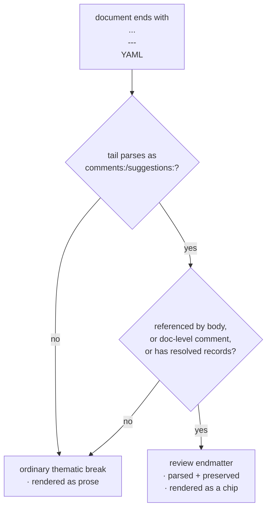

A document with marks and no endmatter is plain CriticMarkup — fully
supported. A document with neither is an ordinary markdown file, entirely
unaffected. The endmatter YAML is parsed by a small hand-written reader (no
new dependencies), tolerant of both flow form (`c1: { by: user }`) and block
form, and tolerant of CRLF line endings.

---

## The mark lifecycle, end to end

Zooming out from any one mark's anatomy, every mark travels the same road from
the moment it's written to the moment it settles into history:

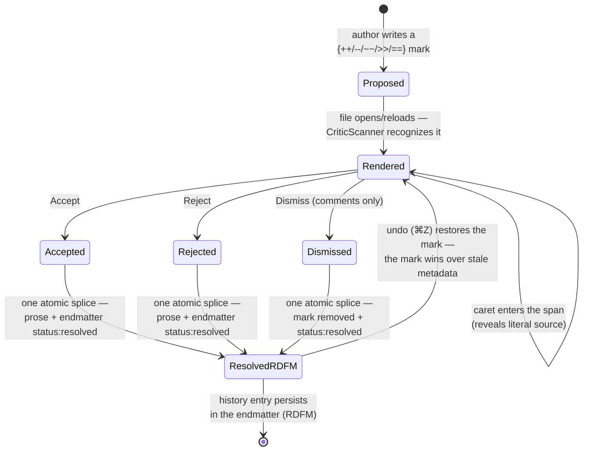

The last two transitions are the subtle part: undoing a resolution doesn't
just restore text, it restores a *live, actionable* mark, because the review
data model below treats a live mark as always authoritative over whatever its
metadata claims.

## The review data model

When Quoin parses a document, it builds a structured view of the review that
the inspector and the resolver share:

```mermaid
classDiagram
    class CriticMark {
        +Payload payload
        +ByteRange range
        +String? id
    }
    class ReviewMetadata {
        +[String: ReviewEntry] comments
        +[String: ReviewEntry] suggestions
    }
    class ReviewEntry {
        +String? by
        +String? at
        +String? re
        +String? status
        +String? resolved
        +String? body
    }
    class ReviewItem {
        +Body body
        +ByteRange markRange
        +String? id
        +String? by
        +String? at
        +[Reply] replies
        +isSuggestion() Bool
    }
    class ResolvedRecord {
        +String id
        +String? by
        +String? at
        +String summary
    }
    CriticMark --> ReviewEntry : id links to
    ReviewItem "1" --> "1" CriticMark : anchored to
    ReviewItem "1" --> "0..1" ReviewEntry : metadata
    ReviewMetadata "1" --> "*" ReviewEntry : contains
    ResolvedRecord ..> ReviewEntry : read back from status:resolved
```

A `ReviewItem` is what one card in the inspector shows: a live mark, plus its
endmatter metadata, plus any threaded replies. A `ResolvedRecord` is history —
an entry whose `status` is `resolved` and whose mark is gone from the body.

One rule governs conflicts between a mark and its metadata: **the mark wins.**
A live mark in the text is always actionable, no matter what stale metadata
says. If an undo or a hand edit restores a mark whose record already read
`resolved`, the mark's presence is the truth and its record is excluded from
history until it resolves again.

---

## Resolving a suggestion: one atomic, byte-safe edit

This is the guarantee that makes the whole system trustworthy. Accepting or
rejecting a suggestion is **one `SourceEdit`** — a single byte splice — applied
through the same `DocumentSession` pipeline that handles your keystrokes. That
means undo, debounced autosave, and stale-base protection all come for free.

The byte semantics are exact — no whitespace normalization, what is inside the
delimiters is exactly what lands:

| Mark | Accept → | Reject → |
| :--- | :--- | :--- |
| `{++new++}` | `new` | *(removed)* |
| `{--old--}` | *(removed)* | `old` |
| `{~~old~>new~~}` | `new` | `old` |
| `{>>comment<<}` | *(removed either way — it is an annotation)* | *(removed)* |
| `{==highlight==}` | *(unwrapped either way — the text was flagged, never in question)* | *(unwrapped)* |

### The splice is computed against current truth, never a stale projection

The projection you clicked may be a moment out of date — an autosave or a
concurrent edit could have shifted bytes since the card was drawn. So the
resolver never trusts the projection's offsets. It re-reads the bytes at the
mark's range from the *current* source and requires them to still parse as
exactly one whole mark. If they don't, it refuses and surfaces a "suggestion
moved" banner rather than splicing blind.

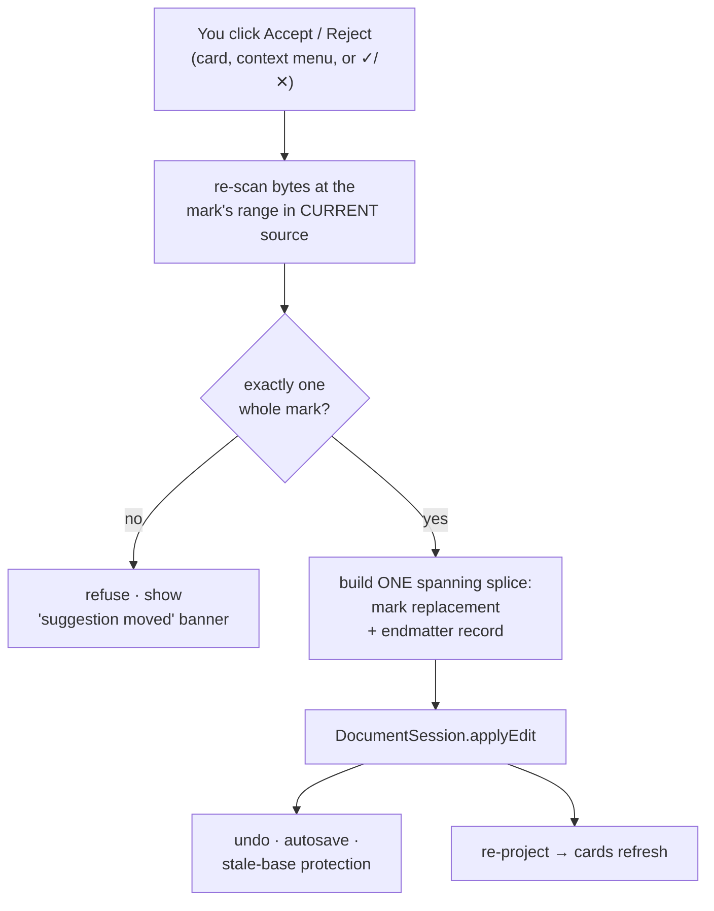

### Resolution records both the text and the history — atomically

Resolving does two things at once: it changes the prose (the mark's
replacement) **and** it updates the endmatter (the entry gains `status:
resolved` and a `resolved:` summary like `accepted · precise` or `rejected ·
kept old over new`). Both happen in **one** splice — from the mark's first byte
to the endmatter's last — so a single ⌘Z restores both together. Were the prose
edit and the metadata edit separate, one undo could restore the mark while
leaving the metadata saying resolved — a card visible but inert. A single
atomic edit makes that inconsistent state unrepresentable.

Every resolution is recorded, even for a mark that carried no `{#id}` and even
in a document that had no endmatter: an id is synthesized and an endmatter is
grown as needed. History never depends on the author having used the metadata
layer. Those records are the file's portable, agent-readable history — nothing
is lost when a suggestion is acted on; it moves from the body to the endmatter.

### Accept All / Reject All

Bulk resolution walks every insertion, deletion, and substitution in source
order, resolving each and re-scanning after each step, then collapses the whole
outcome into **one** spanning edit from the first changed byte to the end of
file. One ⌘Z restores the entire batch. Comments and highlights are
annotations, not proposed changes — bulk actions leave them in place.

---

## The review inspector

Every mark in the document appears as a card in the review inspector — a mode
of the trailing sidebar, so it works at any window width and never overlaps the
canvas.

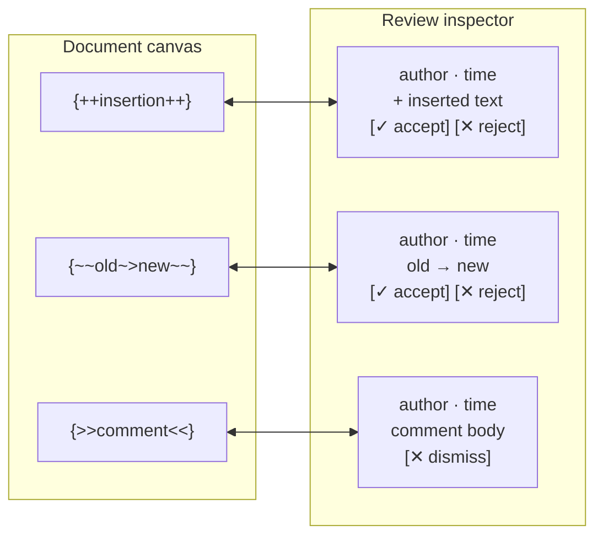

Each card shows the author (with an `AI` badge for agent authorship) and a
relative time drawn from the endmatter, the change itself in the same
suggestion tints as the inline marks, and capsule buttons — accept and reject
for suggestions, dismiss for comments. Threaded replies nest under a hairline.
Resolved items dim and their actions disappear; a separate history section
lists them, read back from the endmatter's `status: resolved` records.


The inspector follows the app's appearance, light or dark, with the same
tints and layout:

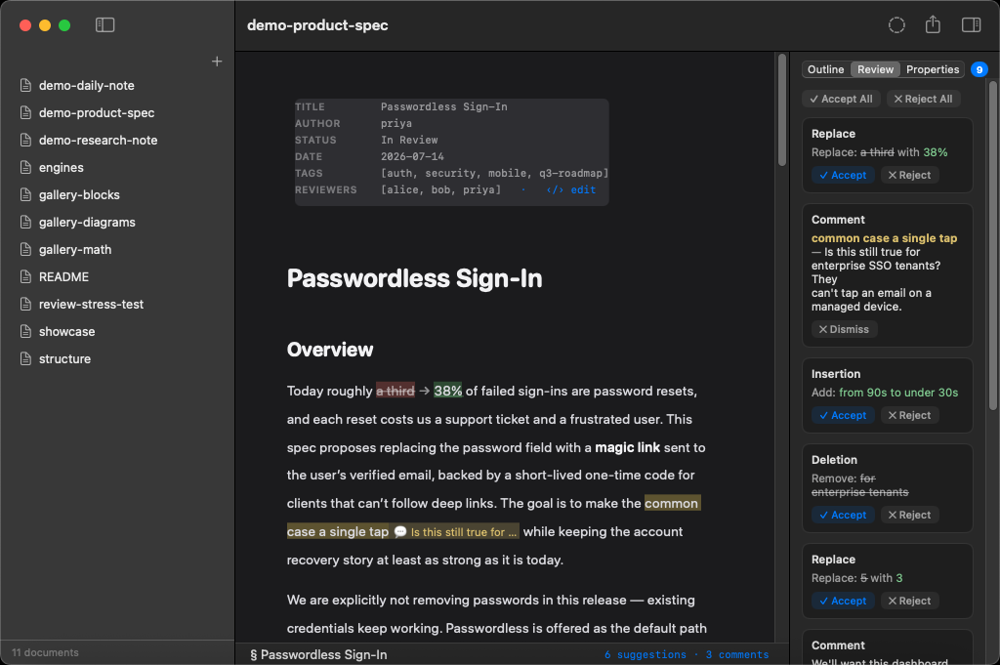

**Linkage runs both ways.** Placing your caret inside a mark highlights its
card; clicking a card scrolls its mark to the center of the viewport and
flashes an accent ring. A resolution pulses the spliced location so you can see
where the change landed, scrolling it into view if it was offscreen.

The status bar keeps a running count — for example `3 suggestions · 2
comments` — in accent color, so you always know a document carries review work
even before you open the inspector.

There are three places to resolve a mark, all routed through the same
byte-safe splice: the card's ✓/✕ capsules, a right-click on the rendered mark
(**Accept Suggestion** / **Reject Suggestion**), and Accept All / Reject All.

---

## Creating a review — without editing the prose

The reframe that makes the whole system coherent: **creating a review never
changes the prose.** A CriticMarkup mark *wraps* the text it concerns —
`{--vague--}` still contains the exact bytes "vague" — and the endmatter is
appended after the last byte of the body. So annotating a document leaves its
prose byte-identical; only *resolving* a suggestion changes what the document
says.

That gives two ways to create marks without ever typing a sigil.

### Selection gestures

Select some text and reach for the **Review** menu (or the context menu):

| Gesture | Shortcut | Produces |
| :--- | :--- | :--- |
| **Add Comment…** | ⇧⌘M | `{==sel==}{>>your note<<}{#cN}` — an anchored comment |
| **Suggest Replacement…** | ⇧⌘R | `{~~sel~>your text~~}{#sN}` |
| **Suggest Deletion** | — | `{--sel--}{#sN}` |
| **Highlight for Review** | — | `{==sel==}{#sN}` |

Add Comment and Suggest Replacement open a small popover for the text (Return
commits, Escape cancels, empty cancels). Add Comment with no selection creates
a **document-level comment** — an endmatter-only entry with a `body`, no inline
mark. Each gesture is **one atomic annotation**: the mark splice plus the
`by:`/`at:` endmatter entry, as a single spanning edit, so one undo removes the
whole thing.

The author label comes from the **Review as:** setting (Settings ▸ Review),
which defaults to your macOS account name; `AI` is reserved for agents.

### Every annotation self-calibrates before it is written

Wrapping a selection in a mark can go wrong in subtle ways — the selection
might start inside a list marker, cross a code span, or straddle a block
boundary. Rather than enumerate every hazard, Quoin **validates by
construction**: it builds the candidate source, parses it, and writes the edit
*only if* exactly the expected new mark comes back at the expected offset
carrying the allocated id, no prior mark is consumed, and the document's block
structure is unchanged. Anything else refuses — the gesture beeps or is
disabled with a tooltip.

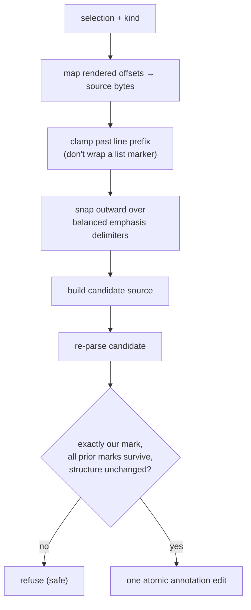

This one rule subsumes the entire constraint list. A mark born inside a code
span parses as literal, so it is refused. A block-spanning selection is
unbalanced per slice, so it is refused. Wrapping a list item's marker would
restructure the list, so it is refused. Two extra safeguards make selections
feel natural: endpoints that land inside a hidden delimiter run **snap outward**
over the emphasis characters so a whole-span selection wraps complete syntax
(never half a `**`), and a replacement that wraps styled text preserves those
delimiters so replacing rendered **bold** suggests **strong**, not `strong`.

The annotation edit is computed inside the session actor at apply time, with a
byte re-validation of the selection's expected slice — so the stale-offset
corruption class is unrepresentable at birth, not patched after the fact.

### Commenting opaque blocks (code, tables, diagrams, math)

A mark cannot live inside runnable content — code, tables, diagrams, and math
are opaque by the normative rules above. So those blocks are commented
*beside* rather than *inside*: **Add Block Comment** inserts a standalone
`{>>comment<<}{#cN}` paragraph immediately after the block, plus its endmatter
entry, as one atomic edit. The comment is fully portable and never injects a
mark into content that must parse cleanly. Editing the embed itself — as
opposed to commenting on it — is a separate flow; see
[`docs/design/embed-editing-ux.md`](embed-editing-ux.md).

---

## Review Mode: typing becomes suggestions

The second way to create marks is a mode. Toggle **Suggest Edits** (⌃⌘R) and
Quoin becomes a Google-Docs-style suggest mode, file-native: while it is on,
ordinary typing produces marks instead of direct edits.

| You do | Quoin writes |
| :--- | :--- |
| Type text | `{++text++}` |
| Delete text | `{--text--}` |
| Type over a selection | `{~~old~>new~~}` |

The mode is loud — a **Suggesting** chip in the status bar, and the review
counts tick up live — and it is per-window and never persisted on across
launch, so you cannot accidentally leave it on.

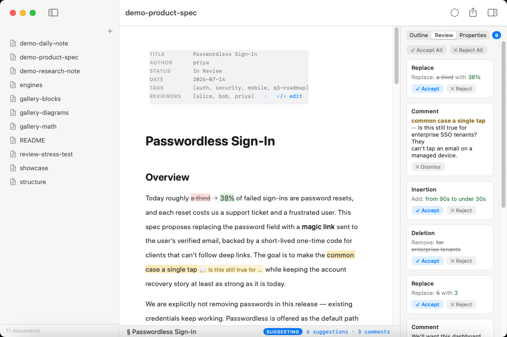

### Coalescing without state

The hard part of a suggest mode is that consecutive keystrokes must *grow* one
mark, not mint a new mark per character. Quoin solves this **statelessly, by
construction**:

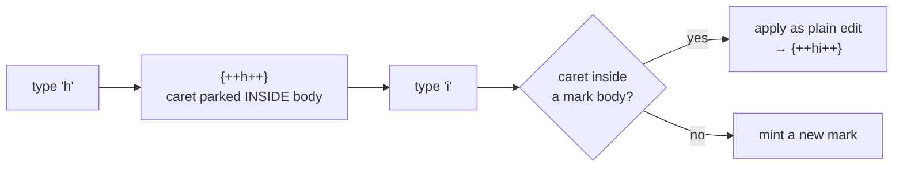

A fresh keystroke outside any mark mints a mark and parks the caret **inside**
its body. The next keystroke's position is therefore already inside a mark
body, so it applies as a plain edit and the mark simply grows — no
per-keystroke state to track or invalidate. Backspacing right after a deletion
mark extends it leftward, absorbing the previous character. Crossing a mark
boundary seals the mark.

Some edits have no faithful suggestion form — a structural newline inside a
mark, or an edit that would tear an existing mark. Review Mode **refuses** those
with a beep; it never silently applies a real edit while you believe you are
suggesting. Marks typed this way are deliberately id-less to keep each
keystroke a small, local patch; resolution synthesizes ids and records later,
so nothing is lost.

---

## The parse route: why marks need a dedicated scanner

CriticMarkup marks cannot be recovered from a normal markdown parse. Smart
punctuation turns `--` into an en-dash, GFM strikethrough consumes the
interior of `{~~…~~}`, and highlight processing half-eats `{==…==}`. By the
time cmark is done, the marks are gone.

So Quoin scans the **raw source slice** for marks before any of that, mirroring
how the math engine finds `$…$` spans:

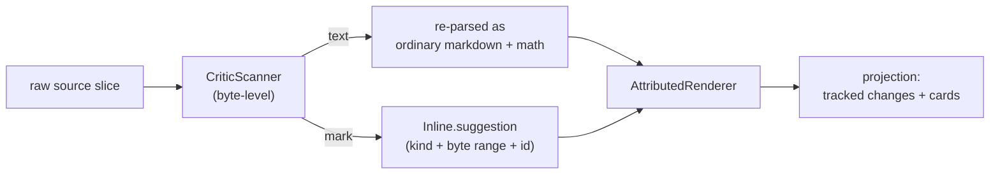

The scanner treats inline code spans (backtick runs matched by length) and math
spans as opaque, byte-for-byte the way the math scanner does — the two must
agree exactly about what is math, or a mark near a dollar amount could silently
vanish. Unbalanced marks fall through as literal text. Each recovered mark
becomes an `Inline.suggestion` carrying a **byte-exact** range, because
accept/reject needs byte precision to splice correctly.

That absolute byte range interacts with Quoin's incremental fast paths, which
shift only block ranges. Rather than track individual mark offsets, a
document with any suggestions takes the full re-parse path — a conservative
guard that keeps offsets always correct.

---

## Byte-lossless, always

The review system inherits and preserves Quoin's byte-lossless contract (see
[`docs/reference/invariants.md`](../reference/invariants.md) for the full
rule-book):

- **Untouched entries stay byte-exact.** Resolving one item rewrites only that
  entry's lines in the endmatter; every other entry keeps its original bytes.
- **Line endings are preserved.** A CRLF document keeps its `\r\n` endmatter
  delimiter and entries; the writers do their line surgery in normalized LF and
  re-apply the file's real line ending before emitting the edit.
- **Endmatter YAML is written safely.** Any value written into the endmatter is
  escaped and flattened to one physical line, so a comment containing a
  newline or a quote can never split a YAML scalar and break the block.

### One pattern, three call sites

Resolving a suggestion (above) and authoring an annotation (above) look like
separate mechanisms, but they — and Review Mode's keystroke handling — are the
same pattern instantiated three times: never trust a stale offset, validate
the candidate against current truth, and apply as one spanning edit or refuse
outright.

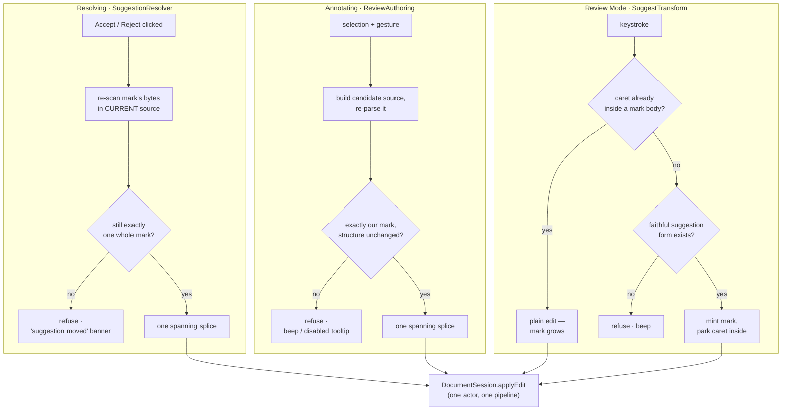

Refuse-on-drift, self-calibration-by-construction, and stateless coalescing
are three names for one discipline: an edit is computed where it is applied,
against current bytes, never against a projection that might already be
stale.

---

## Non-goals

Real-time multi-user editing, CRDTs, and base-revision conflict semantics are
out of scope — the format has none, and git is the merge layer. Marks are
intra-block by design. The review system is a durable, portable, single-writer
loop between a human and an agent, and it is deliberately kept that way.

## Where the code lives

| Concern | Type (in `Sources/QuoinCore`) |
| :--- | :--- |
| Recognize marks in raw source | `CriticScanner` |
| Accept / reject / bulk resolution | `SuggestionResolver` |
| Endmatter parse, write, history | `ReviewEndmatter` |
| Create annotations from selections | `ReviewAuthoring` |
| Review Mode keystroke → mark | `SuggestTransform` |

Rendering lives in `Sources/QuoinRender` (`AttributedRenderer` for tracked
changes, the reveal styler for literal-source editing); the inspector and the
menu wiring live in `App/macOS/Sources` (`ReviewPanel`, `ReaderModel`). The
broader machinery map is in
[`docs/reference/architecture.md`](../reference/architecture.md), and the
capability summary is in [`docs/PRODUCT.md`](../PRODUCT.md).
