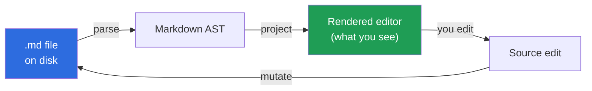
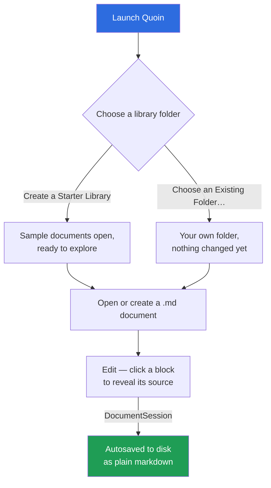
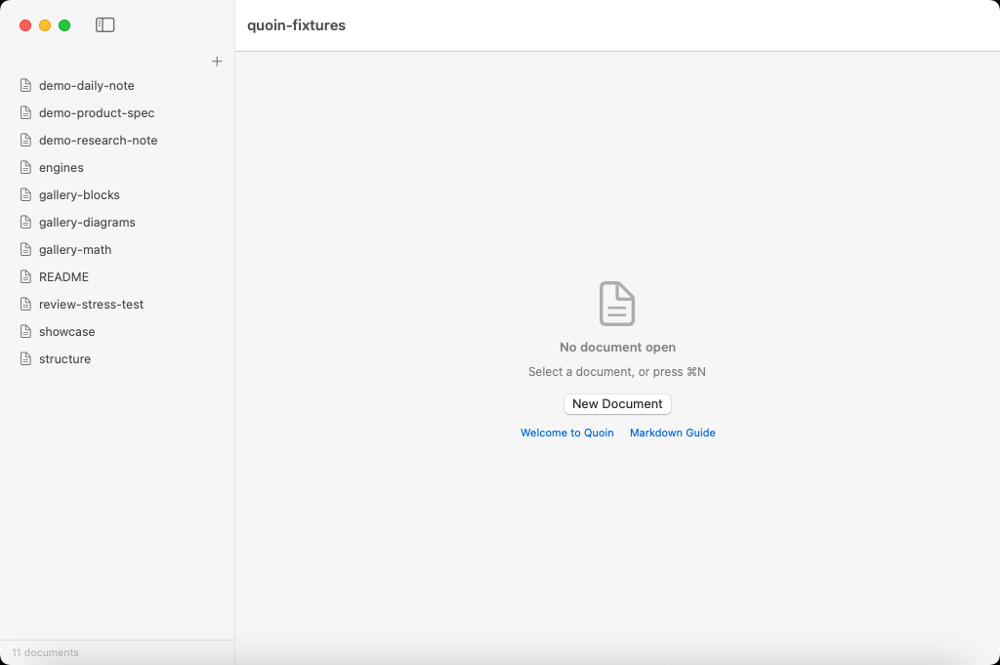
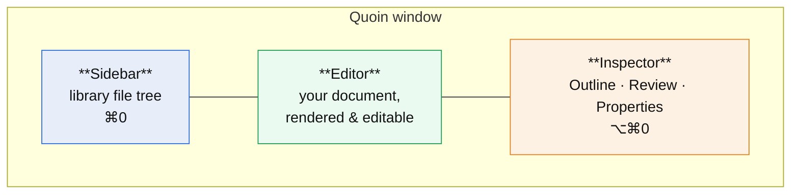
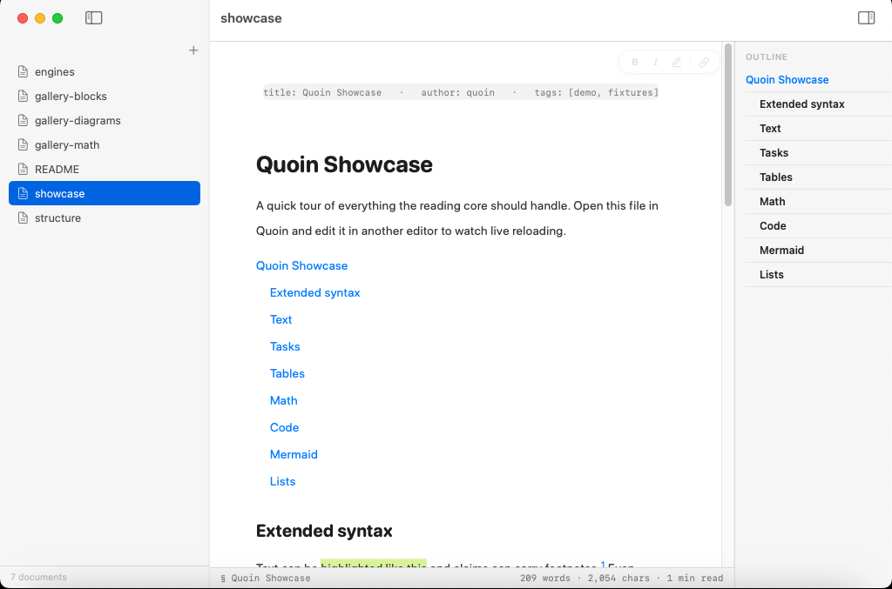
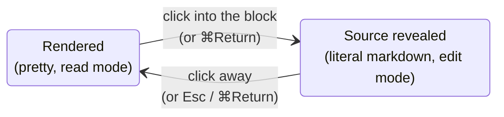
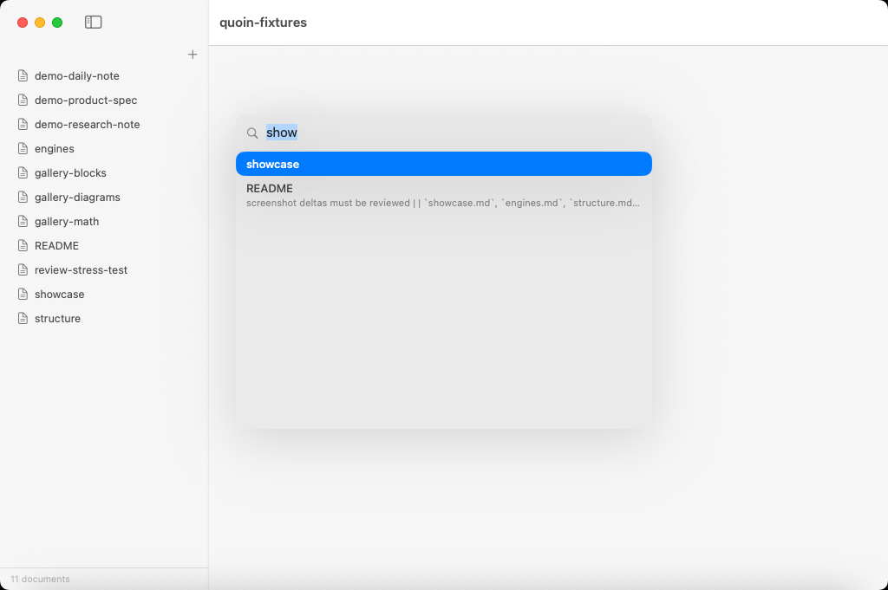
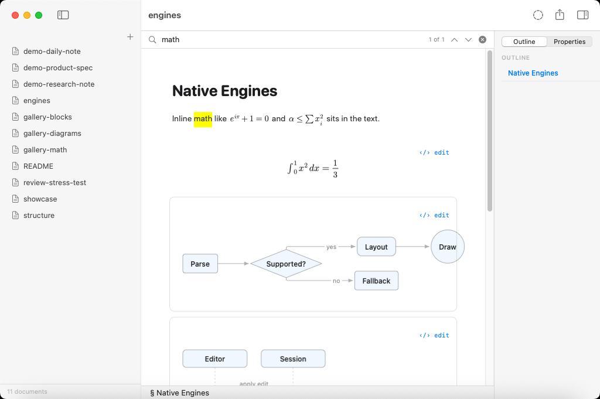
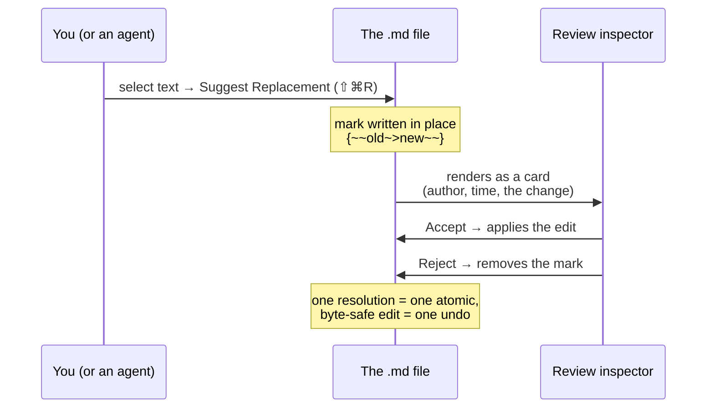

# Getting started with Quoin

Welcome. This guide takes you from a fresh install to writing, editing, and
reviewing a real document — in about five minutes. No account, no cloud, no
setup wizard. Quoin is a native macOS editor for the markdown files you
already own, so most of "getting started" is just pointing it at a folder.

If you want the full capability tour afterward, read
[What you can do with Quoin](features.md) — or the complete capability spec in
[docs/PRODUCT.md](../PRODUCT.md).

---

## The one idea that makes Quoin different

Your document is a plain `.md` file on disk. Quoin does **not** import it into
a database or convert it to some internal format. The file *is* the document,
and what you see on screen is a live
**[projection](../design/editor-modes.md)** of that file:



Every keystroke changes the markdown string; the renderer re-projects. Nothing
you don't touch is ever rewritten — round-trips are
[byte-lossless](../reference/invariants.md). That is why
Quoin can be a true WYSIWYG editor *and* leave you with clean markdown you can
open in any other tool, commit to git, or hand to an agent.

Everything below is a consequence of this one idea; the full parse → session →
project pipeline behind it is mapped in
[docs/reference/architecture.md](../reference/architecture.md).

---

## 1. First launch: choose where your documents live

Here's the whole first-run path in one picture — the rest of this guide is
each of these steps in detail:



The first time you open Quoin, it asks one question:

> **Where should your documents live?**
> Your documents stay plain `.md` files on disk. Quoin never converts or moves
> your files.

You have two ways forward:

| Choice | What happens |
| :--- | :--- |
| **Create a Starter Library** | Quoin makes a new folder with a couple of welcome documents so your first screen is a real rendered document, not an empty tree. Best if you're just trying it out. |
| **Choose an Existing Folder…** | Point Quoin at any folder of markdown you already have — your notes, a docs repo, a vault. Quoin reads what's there and changes nothing until you do. |


*The library sidebar: your folder, unchanged, as a file tree you can browse
and reorganize.*

That folder is your **library**. Folders inside it are just directories;
documents are just files. You can switch libraries any time from
**File ▸ Change Library Folder…**, or open a second folder in its own window
with **File ▸ Open Folder in New Window…** — each window remembers its folder
across relaunches.

> Quoin is sandboxed and asks macOS for permission to the folder you pick (a
> security-scoped bookmark). That permission is remembered, so you only grant
> it once per library.

---

## 2. The window at a glance




*The three regions together: sidebar, editor, and inspector.*

Three regions, two of them toggleable:

- **Sidebar** (left, **⌘0**) — the file tree of your library. Click a document
  to open it. Drag files and folders to reorganize; it's your real directory.
- **Editor** (center) — the document itself, rendered natively and directly
  editable. This is where you spend your time.
- **Inspector** (right, **⌥⌘0**) — a single trailing panel with three modes you
  switch between:
  - **Outline** — a live heading tree; click a heading to jump.
  - **Review** — every suggestion and comment as a card (see §6). It selects
    itself automatically when a document has review activity.
  - **Properties** — front-matter fields as an editable form (see §7).

Documents open in tabs across the top. Switch with **⌘1**–**⌘9**, close the
current tab with **⌘W**.

---

## 3. Create your first document

Press **⌘N** (**File ▸ New Document**), or click **New Document** on the empty
state. A new `.md` file appears in your library and opens ready to type.

Start writing markdown the way you always would — but watch what happens as you
go:

```markdown
# My first note

A paragraph with **bold**, *italic*, and a [link](https://example.com).

- [ ] a task
- [x] a finished task

> [!NOTE]
> Callouts, ==highlights==, footnotes[^1], code, math, and diagrams
> all render natively.

[^1]: Like this one.
```

Headings size up, the checkbox becomes clickable, the callout gets its tinted
box — all as native drawing, with no web view and no JavaScript anywhere.


*The same source, rendered: headings, a front-matter grid, and the live
outline — all native drawing, not HTML.*

---

## 4. How editing works: click a block, the line never jumps

This is the part that feels new. Quoin has two views of any block, and it flips
between them under your caret:



**Click into any block** and it reveals its literal markdown source —
character-for-character with the file. The `##`, the `*emphasis*` asterisks,
the link brackets: they're all right there to edit. Click away (or press
**Esc**, or **⌘Return** to toggle) and the block re-renders.


*Click into a block and its hidden markdown — headings, emphasis markers,
link syntax — becomes literal, editable text.*

The rule that makes this comfortable: **the line you're on does not move on
screen.** When a block flips between rendered and source, Quoin preserves the
vertical position of your caret's line and the block's line skeleton. No jump,
no reflow lurch, no hunting for where the cursor went. It holds across every
block type, and across window resizes and sidebar toggles too.

Because you're editing real source, delimiters are never faked. What you type
is what lands in the file.

### Formatting shortcuts

While editing a block, the usual formatting keys write real markdown into the
source:

| Action | Shortcut | Writes |
| :--- | :--- | :--- |
| Bold | **⌘B** | `**text**` |
| Italic | **⌘I** | `*text*` |
| Add Link | **⌘K** | `[text](url)` |
| Highlight | **⇧⌘H** | `==text==` (cycles a palette) |
| Edit Source / Done Editing | **⌘Return** | toggles the block open/closed |
| Move Block Up / Down | **⌥⌘↑ / ⌥⌘↓** | reorders blocks |

Click a **task checkbox** to toggle it — the change is written straight back to
`- [ ]` / `- [x]` in the file.

---

## 5. Essential shortcuts

Enough to be fluent on day one:

| Do this | Press |
| :--- | :--- |
| New document | **⌘N** |
| Open a file | **⌘O** |
| Quick Open (fuzzy jump to any document) | **⇧⌘O** |
| Daily note | **⌘D** |
| Show / hide Sidebar | **⌘0** |
| Show / hide Inspector (Outline·Review·Properties) | **⌥⌘0** |
| Find in document | **⌘F** |
| Find & Replace | **⌥⌘F** |
| Find next / previous | **⌘G / ⇧⌘G** |
| Search the whole library | **⇧⌘F** |
| Back / Forward (jump history) | **⌘[ / ⌘]** |
| Undo / Redo | **⌘Z / ⇧⌘Z** |
| Export… | **⇧⌘E** |
| Switch tabs | **⌘1**–**⌘9** |

Quoin deliberately leaves the system's own shortcuts alone (print, hide, and
so on), so nothing you rely on across macOS breaks here.

Two of those are worth seeing in action. **⇧⌘O** opens Quick Open, a fuzzy
jump to any document in the library without touching the sidebar:


*Quick Open: type a few letters, land on the document.*

**⌘F** opens the in-document find bar, with a live match count as you type:


*Find in document: matches count and highlight as you type.*

---

## 6. A first taste of the review loop

The [review loop](../design/suggestions.md) is Quoin's signature feature, and
it works precisely because of the source-of-truth idea: **suggestions and
comments live inside the `.md` file** as
[CriticMarkup](https://criticmarkup.com/)-style marks. They travel with the
document, survive in git, and can be written by a collaborator — or by an
agent — and then triaged by you in a real UI.



Try it: select a few words, then from **Format ▸ Review** choose one of:

| Gesture | Shortcut | What it leaves in the file |
| :--- | :--- | :--- |
| Add Comment… | **⇧⌘M** | `{>>your comment<<}` |
| Suggest Replacement… | **⇧⌘R** | `{~~old~>new~~}` |
| Suggest Deletion | — | `{--text--}` |
| Highlight for Review | — | `{==text==}` |

Each one wraps your selection **byte-exactly** and does not change what the
document says — it only proposes. Your suggestion shows up as a **card** in the
**Review** inspector (which pops open automatically). From a card you can
**Accept**, **Reject**, or **Dismiss** — or **Accept All / Reject All** — and
every resolution is one atomic edit and one undo. Click a card to scroll its
mark into view; put your caret in a mark to light up its card.

Want your typing itself to *become* suggestions instead of edits? Turn on
**Suggest Edits** with **⌃⌘R**. Now every insertion, deletion, and replacement
you make lands as a mark for someone else to accept — the classic tracked-
changes workflow, stored as plain text. A **SUGGESTING** chip reminds you it's
on.

Because it's all just marks in the file, this is also the **agent handoff**
story: a tool like Claude Code can write suggestions into your document, and the
cards simply appear in your panel for you to triage.

---

## 7. Properties: front matter as a form

If a document starts with YAML front matter, Quoin renders it as a tidy field
grid at the top — and lets you edit it as a **form** in the **Properties**
inspector, no YAML syntax required:

```markdown
---
title: Meeting notes
date: 2026-07-15
tags: [product, review]
draft: true
---
```

Open the **Properties** tab in the inspector and each field gets a
type-appropriate editor — a date picker for dates, a toggle for booleans, a
number field for numbers, a comma-list for arrays, plain text otherwise. There's
an **Edit as Text** escape hatch when you'd rather type raw YAML.

Properties editing is byte-conservative: a value that doesn't parse cleanly as
its type stays a string, and typed writes preserve the original precision. Your
front matter is data you can trust, not something Quoin reformats behind your
back.

---

## Where to go next

You're productive now. When you want more:

- **[What you can do with Quoin](features.md)** — the full feature tour:
  callouts, footnotes, code themes, math, diagrams, focus mode, and more.
- **[docs/PRODUCT.md](../PRODUCT.md)** — the complete capability spec, if
  you want the ground truth of what's implemented.
- **Math and diagrams** — write LaTeX with `$…$` / `$$…$$` and Mermaid in a
  ` ```mermaid ` fence; both render natively via the
  [Vinculum](https://github.com/2389-research/Vinculum) and
  [MermaidKit](https://github.com/2389-research/MermaidKit) engines — first-party
  packages under Quoin's own
  [dependency policy](../reference/dependencies.md). Click into an
  embed to [edit its source with a live side-panel
  preview](../design/embed-editing-ux.md).
- **In-app help** — **Help ▸ Welcome to Quoin** and **Help ▸ Markdown Guide**
  open live documents you can poke at without leaving the app.
- **[Screenshot manifest](screenshots.md)** — how every screenshot in these
  docs, including the ones above, is captured from the real app.

Everything you write stays a plain `.md` file you own. That's the whole idea.
