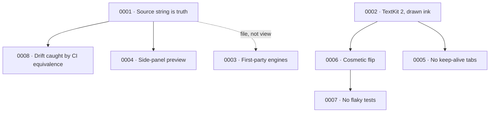

# Architecture Decision Records

An Architecture Decision Record (ADR) captures one significant, hard-to-reverse
choice: the forces that pushed on it, the decision taken, and the consequences
you now live with. Quoin keeps ADRs so that a decision — especially a *rejected*
alternative — is settled once instead of re-litigated every few months by
whoever next touches the code.

These records answer **why**, not what or how. For *what* Quoin does, read the
[feature guide](../../guide/features.md) and [PRODUCT.md](../../PRODUCT.md); for
*how* the machinery fits together, read
[architecture.md](../architecture.md) and the [invariants](../invariants.md). An
ADR is the place a reviewer's inevitable "wait, why isn't this a web view?" gets
a durable answer.

## When to add one

Write a record whenever a non-obvious road is chosen — and *especially* when a
plausible road is deliberately rejected, so nobody re-implements the dead end.
Each record follows the same shape:

| Section | What it holds |
|---|---|
| **Context** | The forces and constraints in play — what made this a real decision |
| **Decision** | The choice, stated plainly in the present tense |
| **Consequences** | What you gain, what you give up, what now becomes a rule |
| **Evidence** | The invariants, tests, and code that keep the decision honest |

Status is **Accepted** or **Superseded-by-NNNN**. A superseded record stays in
place — the trail of why a choice changed is itself worth keeping.

## The records

| # | Decision | Why it matters |
|---|---|---|
| [0001](0001-source-string-truth.md) | The markdown **string + AST is the source of truth**, never attributed strings | Byte-lossless round-trips and free interop: any tool that writes markdown writes a Quoin document. The editor is a projection of the file, not the other way around. |
| [0002](0002-textkit2.md) | **TextKit 2** with drawn-ink decorations — no HTML or web view | Zero JavaScript at runtime, native feel, and viewport-lazy layout that scales to novel-length documents. Chrome is drawn from settled fragment frames, not per-glyph background attributes. |
| [0003](0003-first-party-engines.md) | Math and diagrams are **first-party packages** ([Vinculum](https://github.com/2389-research/Vinculum), [MermaidKit](https://github.com/2389-research/MermaidKit)) consumed from GitHub | The engines are products in their own right; splitting them out keeps their large test suites off Quoin's CI and lets other hosts adopt them. |
| [0004](0004-side-panel-preview.md) | The live embed preview is a **side panel**, not an inline run | Keeps the editable source range starting at offset 0 (no mid-fragment arithmetic) and holds the last good render while mid-edit source is temporarily broken. |
| [0005](0005-no-keep-alive-tabs.md) | Keep-alive tab views are **rejected**; the model outlives the view in an app-level store | Alive-per-tab SwiftUI screens accumulate window chrome and fight over input. Instead one store owns a session per file, and scroll/caret restore across switches. |
| [0006](0006-cosmetic-flip.md) | The activation **flip transition is cosmetic** by construction | Real layout applies instantly; the animation is a throwaway snapshot overlay that can never corrupt geometry — worst case is a stale-looking fade. |
| [0007](0007-no-flaky-tests.md) | There are **no flaky tests, only bad tests** | An intermittent failure is a real defect — a nondeterministic measurement channel or a code race — and gets diagnosed and fixed, never labeled "environmental" and ignored. |
| [0008](0008-drift-by-guards.md) | Projection-path drift is prevented by **CI equivalence, not code unification** | The four projection paths single-source their shared logic and prove byte-and-attribute equality on every run, so they can't quietly diverge without merging into one function. |

## How the decisions connect

Most records radiate from one root. Because the markdown file — not the view —
is the source of truth (0001), edits must re-project cheaply and identically
across every path, which is exactly what the drift guards (0008) and the
side-panel preview (0004) protect. The native-rendering choice (0002) is what
makes the flip animation (0006) a pixel snapshot, and that snapshot discipline
is what the no-flaky-tests rule (0007) enforces in the pixel tests.

