# Quoin architecture

This is the contributor-level map: how a markdown file becomes pixels, how an
edit flows back to disk, and which invariants hold everything together. The
visual/interaction spec lives in `docs/design/handoff.md`; this document is
about the machinery. The load-bearing design decisions each have a one-page
[ADR](adr/README.md) recording their rationale — this map cites them where a
choice would otherwise look arbitrary.

## The one rule

**The markdown source string (plus its AST) is the only source of truth.**
The attributed string on screen is a *projection* of that source. Nothing in
the app ever treats the text view's contents as data: every keystroke is
intercepted, converted to a source edit, applied to the source, re-parsed, and
re-projected.

Why go to this trouble instead of editing an attributed string directly? Three
consequences fall out of it, and none of them is achievable the other way:

- **The round-trip is [byte-lossless](invariants.md).** Untouched regions of
  the file are never re-serialized, because the file is never serialized
  *from* the view at all — only the bytes an edit actually spans ever change
  on disk. Your document is the file you wrote, not a lossy re-emission of a
  rich-text model. The full guarantee, and the tests that enforce it, are
  catalogued in [`invariants.md`](invariants.md).
- **The `.md` file is portable and permanent.** It opens in any editor,
  diffs cleanly in git, and outlives Quoin. Quoin is a lens over your file,
  not a container that owns it.
- **Every feature is "just markdown."** Comments, suggestions, front-matter
  Properties, callouts, math, and diagrams are all encodings *in the text*.
  There is no sidecar database to corrupt or desync, and a collaborator (or an
  agent) editing the raw file sees exactly what Quoin sees.

This is [ADR 0001](adr/0001-source-string-truth.md).

## Dependencies

Quoin has exactly **one third-party dependency** and two first-party packages
of its own (all pinned in `Package.swift`); the full graph and the policy
behind it live in [`dependencies.md`](dependencies.md):

| Package | Version | Role | Policy |
| --- | --- | --- | --- |
| `swift-markdown` (swiftlang) | `from: 0.8.0` | CommonMark/GFM parse via cmark-gfm | the one allowed third-party dep |
| `MermaidKit` (2389-research) | `from: 1.0.0` | Mermaid diagrams (`MermaidLayout` + `MermaidRender`) | first-party, exempt |
| `Vinculum` (2389-research) | `from: 1.4.1` | LaTeX math (`VinculumLayout` + `VinculumRender`) | first-party, exempt |

[MermaidKit](https://github.com/2389-research/MermaidKit) and
[Vinculum](https://github.com/2389-research/Vinculum) are Quoin's own published
packages, consumed from GitHub exactly like any other host app would — their
engines are versioned and CI-tested on their own, so they are exempt from the
dependency policy (the policy script allowlists them). The
one-third-party-dependency rule still bites for anything genuinely external: a
new outside dependency requires a written TRD case first, and the default
answer is no. Each first-party package splits a
platform-free layout product (Foundation-only, Linux-clean) from an Apple-only
render product; QuoinCore `@_exported import`s the layout product of each
(`MermaidReexport.swift`, `VinculumReexport.swift`) so their public types stay
reachable through `import QuoinCore`. See
[ADR 0003](adr/0003-first-party-engines.md).

## Data flow

The edit loop is a one-way cycle: keystrokes never mutate the view directly —
they become source edits, and the view only ever receives re-projections.

<picture>
  <source media="(prefers-color-scheme: dark)" srcset="../images/data-flow-dark.png">
  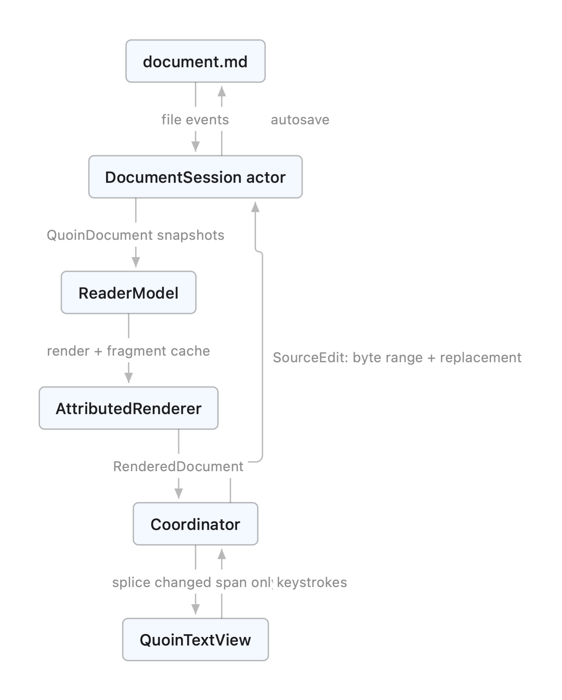
</picture>

Rendered by Quoin's own native Mermaid engine from the source below, so
this document doubles as a fixture. Regenerate with `QUOIN_DOC_DIAGRAMS=$PWD
swift test --filter testRenderDocDiagrams`.

Mermaid source

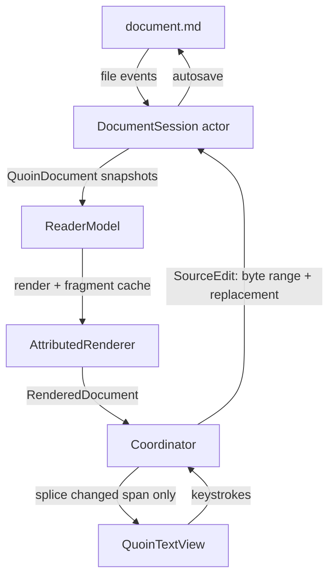

The four stages below — **parse, session, project, display** — are that cycle
read left to right. A keystroke enters at `Display`, becomes a `SourceEdit` at
`Session`, re-parses at `Parse`, re-projects at `Project`, and lands back at
`Display` as a splice. No stage ever reaches backward.

### Parse (QuoinCore)

`MarkdownConverter.parse` runs swift-markdown (cmark-gfm) and post-processes:

- **Source map.** Every block carries a `ByteRange` into the UTF-8 source.
  Block identity (`BlockID`) is `contentHash:occurrence` — stable across
  re-parses when content is unchanged, which is what the fragment cache and
  scroll anchoring key on.
- **Math scanning** happens against the *raw source slice*, not the parsed
  inline tree: cmark has no math extension and mangles `$a_b + c_d$` into
  emphasis. The scanner recognises `$…$`, `$$…$$`, `\(…\)`, and `\[…\]`
  (`MathScanner`, a Vinculum type re-exported through QuoinCore); the
  non-math remainder is re-parsed as inline markdown. Standalone display
  blocks (`$$`/`\[` alone on their lines, blank-line separated) are claimed
  from the raw source *before* cmark (`DisplayMathPrescan`, the same
  split-before-cmark precedent as front matter): a setext-lookalike interior
  line (bare `=`, `---`) would otherwise tear the span into paragraph +
  phantom heading + orphan tail. A span the scanner does not confirm as
  exactly one display segment is left to cmark untouched.
- **Extension post-passes** splice highlights (`==…==`), callout detection,
  front matter, `[TOC]`, and footnote gathering.

### Session (QuoinCore)

`DocumentSession` is an actor owning the live document: it applies
`SourceEdit`s, maintains source-level undo/redo, autosaves, watches the file,
and publishes immutable `QuoinDocument` snapshots. External changes while
edits are unsaved surface as a non-blocking conflict banner (keep mine / take
disk); self-inflicted file events are recognised by source hash.

**Session ownership.** `OpenDocumentStore` is an app-global registry: exactly
ONE `ReaderModel` (and thus one `DocumentSession` / autosaver) per file, keyed
by the resolved + standardized URL and ref-counted across every window and tab.
A first-H1 rename re-keys the entry and broadcasts so every window re-points
its tab. Because the model outlives the transient editor view, switching tabs
keeps the session and undo history alive, and the editor stashes its scroll +
caret in the model (`ViewportSnapshot`) on teardown and restores them on
return. Sessions deliberately do **not** live inside keep-alive tab views —
that road was rejected for the corruption it invites; see
[ADR 0005](adr/0005-no-keep-alive-tabs.md).

**Keystroke fast paths.** `MarkdownConverter.parseAfterEdit` re-parses
block-locally for the two things a caret does all day: typing in a plain
paragraph and typing inside a fenced embed block (code / mermaid / math). Both
paths re-parse only the edited block's source slice with the real parser —
never a hand-rolled imitation (cmark's smart punctuation once made an imitation
diverge) — and self-calibrate: the old slice must reproduce the old block
exactly, and the new slice must stay one block of the same family, grown by
exactly the edit's byte delta. Anything structural (a new fence, a paragraph
turning into a list, a footnote in the document) falls back to the full parse;
conservative rejections are always safe. Container blocks below the edit get
their ids re-derived, because a container's `contentHash` covers its children's
ranges and moves with every byte inserted above it. The editing-latency
contract — every keystroke's core slice fits in a 60 Hz frame at ANY document
size, charts or not — is enforced in CI by `EditingLatencyTests` (strategy
assertions + wall-clock ceilings over generated small/medium/large/novel
fixtures) and, for the render slice, by `EditingRenderLatencyTests`. Budgets
and methodology are cataloged in [`performance.md`](performance.md).

`parseAfterEdit`'s decision is conservative by construction: every fast path
re-parses with the real parser and self-calibrates against the old slice
before it trusts the new one, so a wrong guess always degrades to the
always-correct full parse rather than corrupting the document.

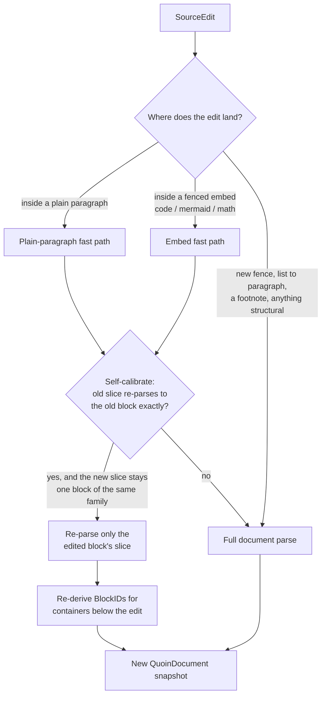

### Project (QuoinRender)

`AttributedRenderer.render` walks the block list and emits one attributed
string. The renderer's job is to spend as little work as possible per edit,
which it does by deciding, per projection, whether it can reuse cached
fragments, emit a bounded storage patch, or must fall back to a full render:

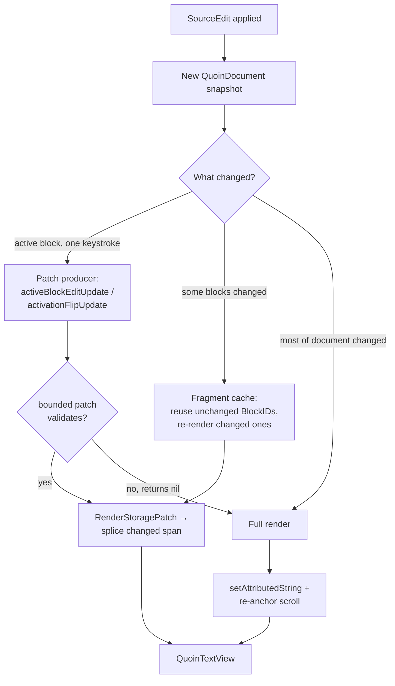

- Every block's range is tagged `QuoinAttribute.blockID`; block chrome is
  tagged `QuoinAttribute.blockDecoration` (drawn by the view, see below).
- **Fragment cache:** unchanged blocks (same `BlockID`) reuse their rendered
  fragment; only changed blocks re-render. Fragments holding unresolved async
  content (a still-decoding image placeholder) are deliberately *not* cached,
  or the placeholder would stick forever.
- **The active block** renders as literal source (`MarkdownSourceStyler`)
  instead of its projection — see "Editing model".
- **Presentation owner:** which block is editing and how it styles is decided
  ONCE per projection by the pure `presentation(for:activeBlockID:)`
  (`BlockPresentation.swift`) — `.rendered` or `.editing(flavor:chrome:)`,
  where the flavor table (prose / verbatim / preview) is the single place a
  block kind maps to reveal behavior. Exactly one block edits at a time (an
  invariant, not an accident).
- **Single derivations:** the block separator (characters AND clamp styling)
  comes from one `separator(after:before:revealedSlice:)`; the reveal's styler
  configuration comes from one `revealStylerConfig(kind:slice:)`, carried on
  `RenderedDocument.revealStyler` so the view-side caret-move restyle consumes
  it verbatim. Patch producers validate against these same derivations, so
  projection paths cannot drift (see Testing).
- **Patch producers:** the activation flip (`activationFlipUpdate`) and the
  per-keystroke active-block edit (`activeBlockEditUpdate`) build bounded
  `RenderStoragePatch`es IN the renderer, next to the render loop they must
  agree with. `RenderedDocument.storagePatches` + `patchBaseLength` carry them
  to the view; any validity failure returns nil and the model falls back to
  the always-correct full render.
- **Live preview retention** (mermaid/math side panel): the last-good artifact
  is `HeldPreview` — session state owned by `ReaderModel` and threaded through
  render passes as an explicit `inout`; the renderer holds no hidden mutable
  state. See [ADR 0004](adr/0004-side-panel-preview.md).

### Display (QuoinRender)

`QuoinTextView` (TextKit 2) displays the projection. Updates go through
`Coordinator.spliceChanges`, which diffs common prefix/suffix and replaces
only the changed span of the live `NSTextStorage` — TextKit re-lays-out just
that region, so unchanged content keeps its exact layout and the scroll offset
never jumps. A full `setAttributedString` happens only when most of the
document changed, and only that path re-anchors scroll.

**Block decorations** (code canvases, callout boxes, quote rules, diagram
frames, table rules, the front-matter chip) are drawn in `drawBackground(in:)`
from laid-out fragment frames — *never* with `.backgroundColor` attributes,
which render as ugly per-line strips. TextKit 2, drawn-ink decorations, and no
web view are [ADR 0002](adr/0002-textkit2.md).

**Every draw is a settled draw:** `viewWillDraw` finishes the viewport's layout
before any pixel paints (preserving the caret line's screen position across the
settle — the viewport invariant applies to the settle itself), so decorations
never draw against estimated geometry. One measure pass per draw
(`measureVisibleRuns`, viewport-culled) produces the geometry snapshot every
chrome consumer reads: the draw pass, the ✓ done chip's hit-test and tooltip,
the preview-panel anchor, and the accessibility element all derive from
`EditingChrome` — one measured box, so they can never disagree. The chip itself
draws in `draw(_:)`, ABOVE the glyphs, and is exposed to VoiceOver as a
pressable "Done editing" button.

One measured box feeding every consumer is what keeps the chrome from ever
disagreeing with itself:

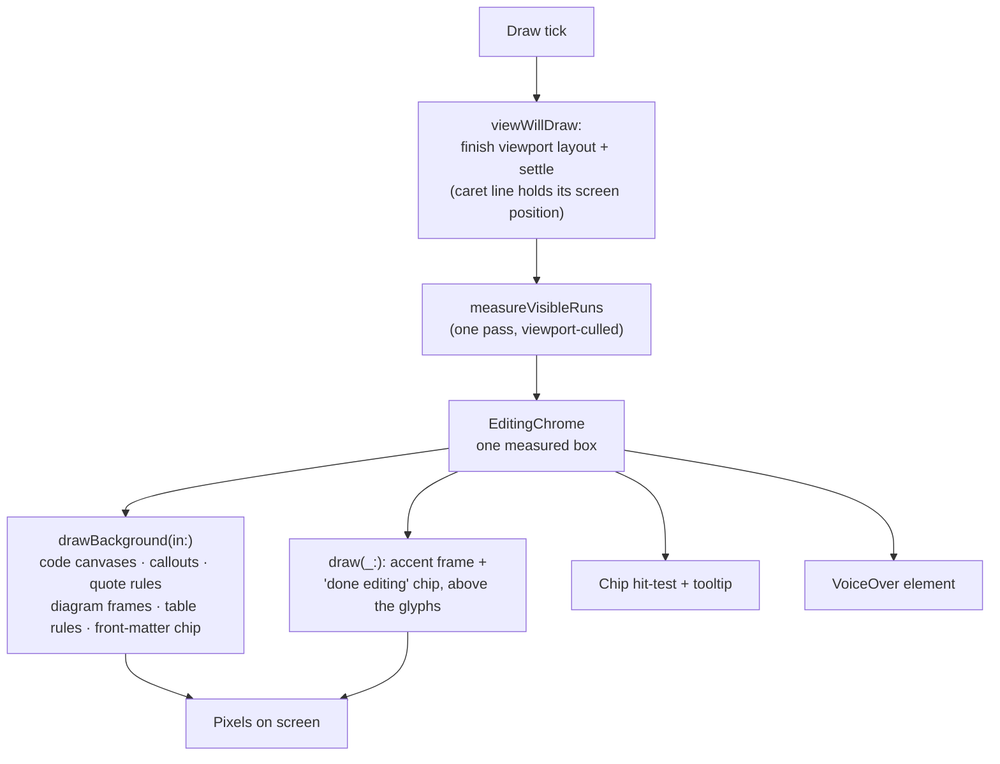

## Editing model (syntax reveal)

Clicking a block activates it: the renderer swaps that block's projection for
its **literal source**, styled but character-for-character 1:1 with the file.
This is the mechanism behind "WYSIWYG that is still just markdown" — you never
leave a rendered surface for a separate raw-text mode, and the caret you place
in the rendered text lands in the exact source byte it visually sits on. The
projection model and the reveal behavior are specified from the user-facing
side in [`editor-modes.md`](../design/editor-modes.md); this section is the
machinery underneath it.

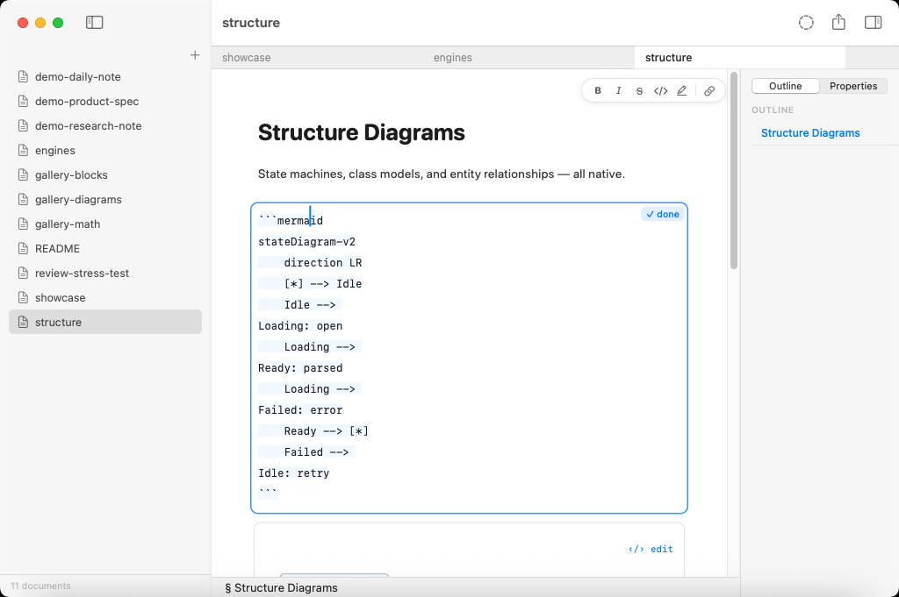

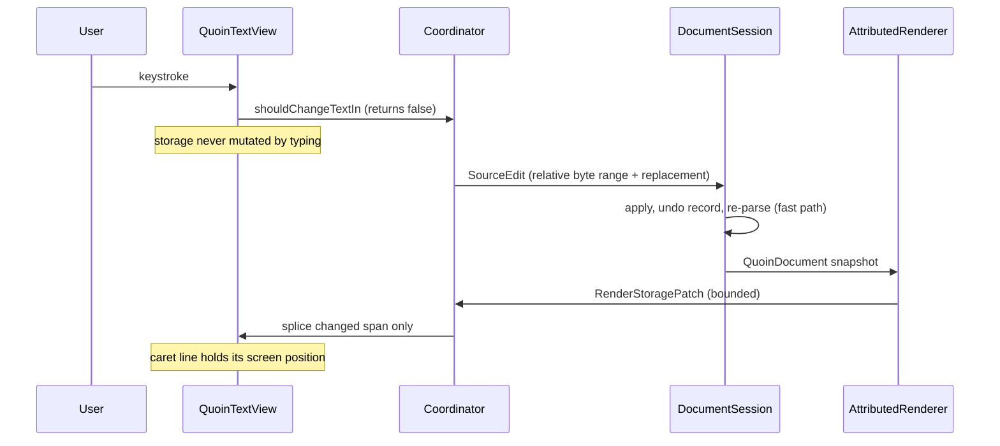

Hidden span delimiters are 1-point clear glyphs — never removed — so a caret
offset in the revealed text *is* a source offset (UTF-16 → UTF-8 mapped at the
edit boundary via `EditMapping`).

- Span delimiters (`**`, `*`, `==`, backticks, link syntax) reveal only when
  the caret is inside the span; structural prefixes (`>`, `- [ ]`) stay
  faded-visible. Caret movement restyles attributes only — the text never
  changes, so selection and the 1:1 mapping survive.
- Keystrokes are intercepted in `shouldChangeTextIn` and become relative
  byte-range edits routed through the session; the storage itself is never
  mutated by typing (always returns `false`).
- Code, tables, TOC, and HTML blocks flip to source on **double-click**;
  diagrams and math open only through explicit intent — the ‹/› edit chip,
  ⌘↩, or the context menu — so a single click (or double-click) can admire or
  select a rendered artifact without turning it into text.
- Smart pairs complete/type-over delimiters; typing a delimiter over a
  selection wraps it; format commands (⌘B etc.) without a selection act on the
  word under the caret.

When adding a new inline span type you must touch **both** sides: a renderer
case in `AttributedRenderer` and a styler pass in `MarkdownSourceStyler`, and
register its delimiter in the claimed-ranges ordering (`**` before `*`, links
before emphasis).

### Editing embeds (code, math, diagrams)

Rendered embeds are artifacts, not text, so activating one has extra
machinery — but it obeys the same 1:1-source rule. The full UX spec for this
mechanism, including the flip animation and the live-preview panel, is
[`embed-editing-ux.md`](../design/embed-editing-ux.md):

- **Caret hints carry their coordinate space.** `CaretHint.rendered` and
  `CaretHint.source` are two coordinate spaces for one caret — an embed hint is
  a SOURCE offset (1:1 with the body tag), a prose hint is a RENDERED offset.
  Feeding one through the other's mapping re-ships a caret-lands-early bug, so
  the type makes the space explicit.
- **Typing on a rendered block activates AND replays.** A keystroke on a
  rendered embed flips it to source and replays the keystroke through
  `activateBlock(pendingInsertion:)`, so the character you typed is not lost to
  the mode change.
- **Revealed fragments are `RevealedFragment`** (fragment + editable subrange);
  `editableRange.location` is ALWAYS 0 — the editable source *is* the fragment.
- **The open block's `✓ done` chip + accent frame are the `editingFrame`
  decoration** — drawn ink with its own hit-testing and tooltip, never a text
  run, so the revealed source stays 1:1.
- **Flip-back reverse-maps the caret** so leaving edit mode leaves the caret
  where the source position projects to in the rendered block.

### Live preview and flip motion

The mermaid/math live preview is a **side panel** beside the source, not an
inline run: the last-good render is held while mid-edit source is broken
(`HeldPreview`), and a pure clock-injected decision table paces presentation
(instant on success, a paused badge after ~500 ms of typing-idle, ghost
dissolves). This is [ADR 0004](adr/0004-side-panel-preview.md).

The activation flip animates via `FlipTransitionController` — snapshot-overlay
choreography, delta-keyed, Reduce-Motion-aware, with a 500 ms watchdog. It is
**cosmetic by construction**: real layout applies instantly, so a dropped or
interrupted animation can never leave the document in a wrong state
([ADR 0006](adr/0006-cosmetic-flip.md)). Snapshot-overlay pixels ship as
`NSImageView`-on-`CGImage`-crops (raster-space, upright in any hierarchy)
because no readback API (`CALayer.render(in:)`, a bare CARenderer readout) can
be trusted about orientation — each disagrees with the screen differently; the
fidelity test self-calibrates its readout against an on-screen red/blue anchor.

Keystrokes arriving before the previous edit's projection echoes back are
serialized in `ReaderCoordinator`: they queue and flush one per ack, so a
caret position is never computed against a stale projection.

## The review subsystem (QuoinCore)

Quoin's differentiator: an RDFM/CriticMarkup review loop where suggestions and
comments live **in the `.md` file** and every resolution is one atomic,
byte-safe source edit. Because the annotations are text, an agent or a
collaborator can propose edits by writing the raw file, and you triage them as
rendered cards without either side needing a shared database. The subsystem is
entirely platform-free (QuoinCore), so the app and any future CLI reuse it
unchanged. Design in [`suggestions.md`](../design/suggestions.md).

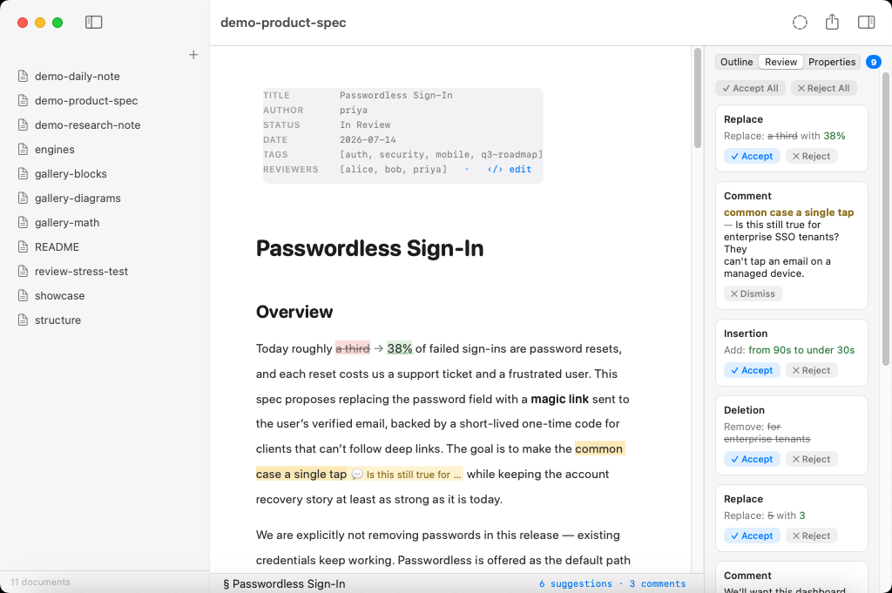

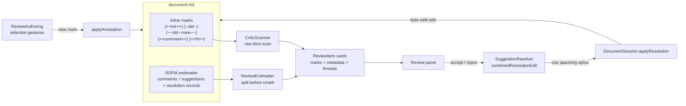

The pieces:

- **`CriticScanner`** — the raw-slice scanner for the five mark kinds
  (`{++ins++}` `{--del--}` `{~~old~>new~~}` `{>>comment<<}` `{==hl==}`) plus
  the optional trailing `{#id}`. Runs on the raw source because cmark mangles
  the delimiters (smart-punct en-dashes `{--`, GFM strikethrough eats
  `{~~…~~}`); code spans and math spans are opaque (marks inside stay literal,
  matching the RDFM normative rule). The dollar-opacity rules mirror
  `MathScanner` byte-for-byte so the two agree on what is math.
- **`ReviewEndmatter`** — the RDFM YAML endmatter (`comments:` /
  `suggestions:` maps + resolution records) sliced off the tail before cmark,
  the same split precedent as front matter. Owns detection (strict,
  CRLF-aware), the shared entry writers (`allocateID`, `appendedEntryEdit`,
  `resolutionRecordEdit`), and byte-lossless emit: writers do line surgery in
  normalized LF and re-apply the block's original line ending
  (`Detected.lineEnding`) so an untouched CRLF sibling is never downgraded.
  `escapedScalar` keeps every written value on one physical line (a raw
  newline would break the strict parser).
- **`SuggestionResolver`** — accept/reject byte semantics + the
  `combinedResolutionEdit` (mark replacement AND the endmatter record as ONE
  spanning splice, so a single ⌘Z restores both) + `resolveAllEdit` (batch as
  one edit). Composes the review-panel `ReviewItem` cards (marks + metadata +
  threads; anchored comments absorb their highlight).
- **`ReviewAuthoring`** — the create-without-editing gestures: every selection
  annotation (comment / replacement / deletion / highlight / insertion) and
  block-adjacent comments for opaque blocks. Validation is self-calibration:
  the candidate is re-parsed and accepted only if exactly the expected mark
  comes back, every prior mark survives, and the block-level structural
  signature is unchanged (an annotation must never change what the document IS
  — it clamps a whole-item selection past the list marker rather than erase
  it).
- **`SuggestTransform`** — Review Mode: a pure, STATELESS keystroke →
  suggestion transform (insertion / deletion / substitution) with coalescing
  by re-scan (a fresh keystroke mints a mark and parks the caret inside; the
  next grows it — no per-keystroke state). Refuses rather than corrupt (a sigil
  that would re-anchor the lazy closer self-calibrates and beeps; a backspace
  never extends across a mark boundary).

### The apply contract (both platforms)

Every review/properties mutation is computed INSIDE `DocumentSession` at apply
time — `applyResolution` / `applyBulkResolution` / `applyAnnotation` /
`applyFrontMatterEdit` / `removeFrontMatterField` — against the session's
current truth, behind the pipeline queue, refusing on drift (an `expectedSlice`
byte check) rather than splicing stale offsets. Computing an edit against a
view projection and applying it later is a corruption class the byte check
closes; the in-actor APIs are the seam a CLI reuses without a view layer.

### Properties (front matter)

`FrontMatterEditing` is the Properties inspector's engine: line surgery over
the leading YAML block, typed-value inference (date / bool / number / flow-list
/ string) that is byte-conservative (a value that does not parse cleanly as its
type stays a string; typed writes preserve the original precision), and
`setTypedFieldEdit` for the typed editors. Like every other mutation, its edits
land through the `DocumentSession` apply contract above.

## Engine seams — math and diagrams

Math and diagrams are **not** Quoin code. Each is a first-party package that
splits a platform-free layout product from an Apple-only render product, and
Quoin owns only the *seam*: it projects its design system onto a small theme
struct, calls one attachment-building entry point, and falls back to a labelled
source card when the engine reports the source unsupported.

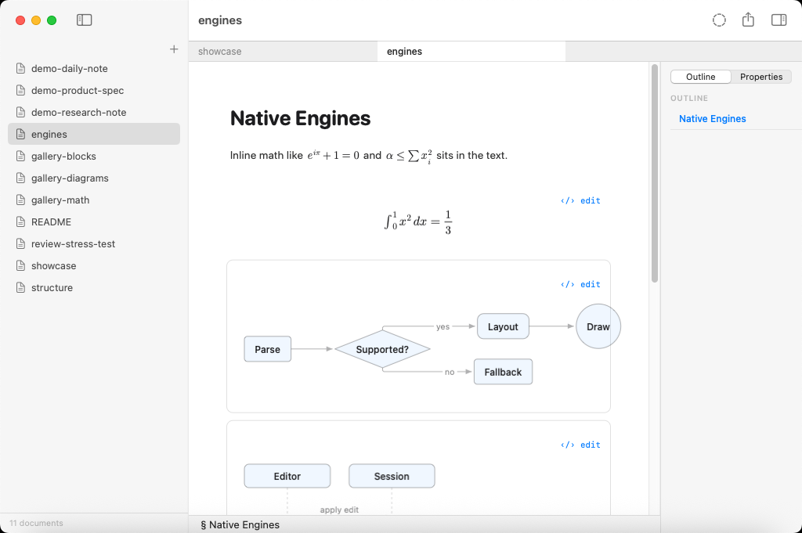

The static shape of the seam is a re-export on one side and a theme-projecting
call on the other — QuoinCore never links the render halves at all:

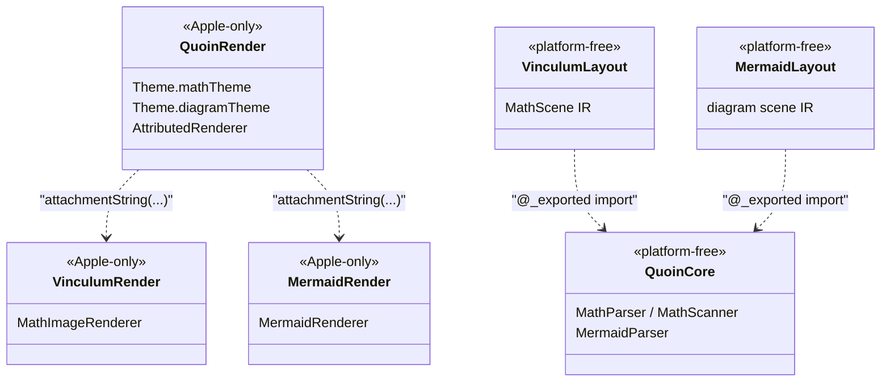

At runtime, one source slice walks through that seam once per render:

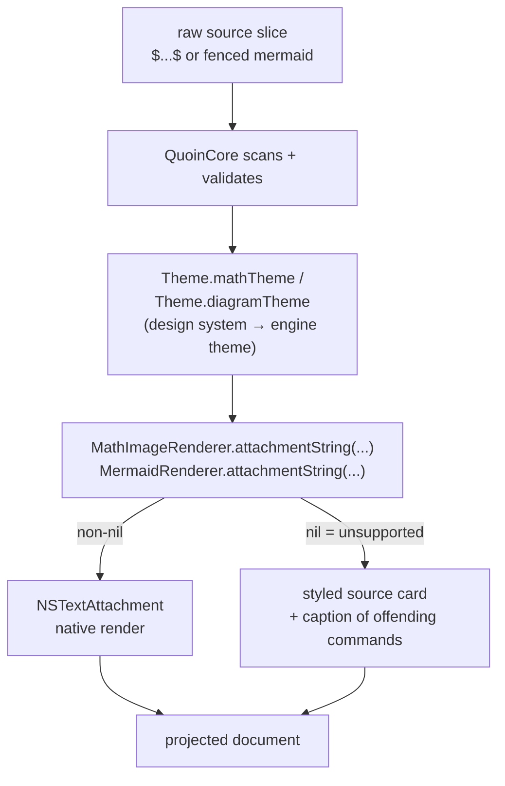

This is [ADR 0003](adr/0003-first-party-engines.md).

### Math (Vinculum)

Math lives in **Vinculum**
([`github.com/2389-research/Vinculum`](https://github.com/2389-research/Vinculum)). It
ships `VinculumLayout` (Foundation-only, builds/tests on Linux — parsing, macros, all
typesetting geometry, the OpenType MATH-table constants, the device-independent
`MathScene` IR) and `VinculumRender` (Apple-only — measuring, drawing via
CoreText/CoreGraphics, the bundled font, the cached `NSTextAttachment`).
QuoinCore `@_exported import`s `VinculumLayout` (`VinculumReexport.swift`), so
`MathParser`, `MathNode`, `MathScanner`, `MathMacros`, `MathAlphabet`, and the
model enums stay reachable through `import QuoinCore` with no per-file import.

Coverage is large — on the order of **400 commands** across 24 `MathNode`
cases: TeX-model atom-class spacing, generalized fractions, accents,
over/under constructs, stretchy delimiters with real MATH-table size variants,
boxes, stateful `\color`, math alphabets, and ~400 symbols. The exhaustive,
current matrix is Vinculum's to own — see its `docs/ARCHITECTURE.md`,
`COVERAGE.md`, and `COMMANDS.md` rather than duplicating a list here that would
only drift. `MathParser.parse` never fails: unknown commands become
`.unsupported` leaves, and `isFullySupported` / `unsupportedCommands(in:)` gate
native rendering vs. the source-card fallback.

**What Quoin owns is the integration, not the typesetting:**

- **Scanning.** `MarkdownConverter` runs `MathScanner` (re-exported) over the
  *raw source slice* — cmark has no math extension and would mangle `$a_b$` —
  recognising `$…$`, `$$…$$`, `\(…\)`, `\[…\]`.
- **Macros.** The `\newcommand` / `\def` pre-pass is host-driven: because
  definitions are document-scoped, `MarkdownConverter` collects them across
  every math segment up front (order-independent) and expands each equation's
  latex before it's stored. The source range is untouched, so byte-lossless
  round-trip and syntax reveal still see the literal source.
- **The theme seam.** `Theme.mathTheme` projects Quoin's design system onto
  Vinculum's `MathTheme` (just ink + `prefersDark`). `AttributedRenderer` calls
  `MathImageRenderer.attachmentString(latex:display:mathTheme:baseSize:)` (from
  VinculumRender); a `nil` return means unsupported and drops to the styled
  source card, whose caption is built from `MathParser.unsupportedCommands`
  naming the offending `\command`s.

Vinculum's own CI tests the parser, layout geometry (headless, via an injected
measurer), and golden renders — not Quoin's. To co-develop, point
`Package.swift` at a local checkout (`.package(path: "../Vinculum")`, don't
commit it) or `swift package edit Vinculum`, then publish, tag, and bump the
version here.

### Diagrams (MermaidKit)

Diagrams live in **MermaidKit**
([`github.com/2389-research/MermaidKit`](https://github.com/2389-research/MermaidKit))
and split the same way: `MermaidLayout` (platform-free parser + layout + scene IR +
geometry linter, Linux-clean) and `MermaidRender` (CoreGraphics/CoreText
drawing behind a `DiagramTheme` seam). QuoinCore `@_exported import`s
`MermaidLayout` (`MermaidReexport.swift`), so `MermaidParser` and friends stay
reachable through `import QuoinCore`. All Mermaid diagram types render natively
(flowchart/graph, sequence, class, state, ER, pie, gantt, journey, …); the
layout internals (Sugiyama layering, dummy-node edge routing, composite-state
recursion) are MermaidKit's to document.

Quoin's side is again just the seam and the fallback: `Theme.diagramTheme`
projects Quoin's design system onto MermaidKit's `DiagramTheme` (ink,
secondary/tertiary text, canvas, accent, hairline, `prefersDark`), and
`AttributedRenderer` calls `MermaidRenderer.attachmentString(source:theme:)`
(from MermaidRender) — an unparseable or unsupported source returns `nil` and
drops to the tidy source card. Diagram-engine changes are tested by MermaidKit's
own CI; co-develop via a local `.package(path:)` or
`swift package edit MermaidKit`, then publish, tag, and bump.

## Platform layering

The engine is built to be reused anywhere Swift compiles; only the view shell
is platform-specific.

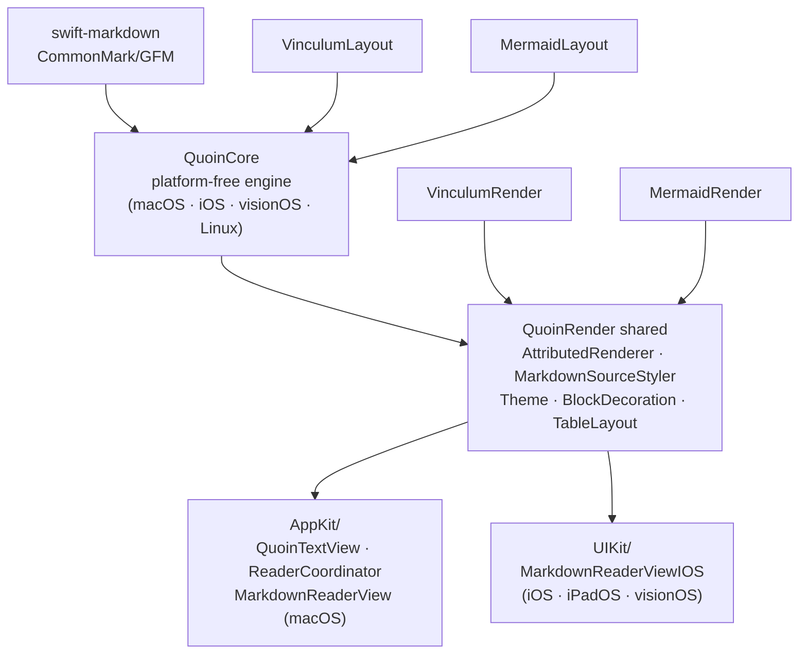

- **`QuoinCore`** imports no UI framework at all (no AppKit/UIKit/SwiftUI) —
  `CGRect` / `CGPoint` / `CGFloat` come from Foundation on Linux and
  CoreGraphics on Apple platforms, guarded by `#if canImport(CoreGraphics)`.
  It builds on macOS, iOS, iPadOS, visionOS, and Linux.
- **`QuoinRender`** splits into shared engine and platform views. The shared
  files — `AttributedRenderer`, `MarkdownSourceStyler`, `Theme`,
  `BlockDecoration`, `QuoinAttributes`, `TableLayout`, `AsyncImageStore`,
  `DocumentExporters` — are guarded `canImport(AppKit) || canImport(UIKit)` and
  branch on `PlatformFont` / `PlatformColor` / `PlatformImage` typealiases, so
  one body compiles on both AppKit and UIKit. The platform view layers live in
  their own subfolders: `AppKit/` holds the macOS `NSTextView` editor
  (`QuoinTextView`, `ReaderCoordinator`, `MarkdownReaderView`); `UIKit/` holds
  the iOS/iPadOS/visionOS reader (`MarkdownReaderViewIOS`). Each is gated so it
  simply compiles out on the other platform.

The macOS editor is *not* a separate SwiftPM target on purpose: it depends on
module-internal render helpers (`QuoinTextView.invalidateDecorations`,
`MarkdownSourceStyler`, the decoration-drawing internals), and hoisting it
across a target boundary would force that surface public — weakening
encapsulation instead of strengthening it. The `#if` gate already gives clean
per-platform compilation with everything kept internal.

Mac Catalyst is not supported: on Catalyst `canImport(AppKit)` is true, so the
AppKit guards select the AppKit branch inside a UIKit runtime and fail to
compile. Supporting it means changing those guards to
`canImport(AppKit) && !targetEnvironment(macCatalyst)` throughout.

## Testing strategy

Quoin's tests are how the invariants above stay true — several of them exist
because a projection path *could* drift, and the only durable defence is a test
that fails forever if it does ([ADR 0008](adr/0008-drift-by-guards.md)). There
are no flaky tests, only bad tests: an intermittent failure is nondeterminism
to be found and fixed, never dismissed as environmental
([ADR 0007](adr/0007-no-flaky-tests.md)).

- **Unit** (`Tests/QuoinCoreTests`): parsers, layout geometry, sessions,
  search, exporters — all platform-free, run on Linux in principle.
- **Torture** (`TortureTests`): pathological inputs must parse to *something* —
  10k-deep nesting, null bytes, unclosed everything, brace bombs.
- **Performance** (`PerformanceTests`): the PRD budgets as assertions; the
  budgets themselves and the reasoning behind them live in
  [`performance.md`](performance.md).
- **Conformance** (`RendererConformanceTests`): parses every fixture module in
  `Fixtures/renderer/`, snapshots structural metrics
  (`Snapshots/renderer-metrics.json`), and asserts every native diagram lays
  out non-degenerately. Regenerate after intentional changes with
  `QUOIN_UPDATE_SNAPSHOTS=1 swift test`.
- **Render golden** (`Tests/QuoinRenderTests`, macOS/iOS only): renders every
  fixture module through `AttributedRenderer` and snapshots a *deterministic*
  digest of the attributed string — per-run QuoinAttribute keys, font
  size/weight/traits, paragraph-style scalars, block-decoration kinds, and
  semantic color tokens (`Snapshots/render-digests.json`, same
  `QUOIN_UPDATE_SNAPSHOTS=1` idiom). It never snapshots font glyph widths,
  rasterised math/diagram bytes, or the user-configurable accent RGB (mapped to
  an `"accent"` token), so the golden is portable across machines. Math and
  diagrams are checked by attachment existence + non-degeneracy and
  font-independent structural invariants, not pixels.
- **Projection equivalence** (`ProjectorEquivalenceTests`): the big guard. For
  every renderer fixture × scripted interaction (activation flips, keystroke
  edits including the trailing-newline clamp case), the PATCH paths applied to
  live storage must be byte- and attribute-identical to a fresh full render
  (attachments compared by presence; held preview threaded identically on both
  sides). Any separator, offset, styling, or base-length drift between
  projection paths fails CI forever. Extend its interaction script when adding
  projection paths.
- **Viewport / caret fidelity** (`RevealFidelityTests`, `CaretLineAnchorTests`):
  the line the caret is on must not move on screen across any projection
  change — the viewport invariant cataloged in
  [`invariants.md`](invariants.md). Extend BOTH when adding block types or
  projection paths.
- **Editing latency** (`EditingLatencyTests`, `EditingRenderLatencyTests`):
  every keystroke's core + render slice fits in a 60 Hz frame at any document
  size.
- **Screenshots** (`App/macOS/UITests`): CI drives the real app over the
  fixture library and publishes window captures to the `ci-screenshots`
  branch — how a cloud session gets eyes on the app.

## Invariants worth defending

1. Round-trip is byte-lossless for untouched regions — nothing serializes the
   document from the view.
2. `QuoinCore` stays platform-free (`CoreGraphics` types only via
   Foundation/corelibs; no AppKit/UIKit).
3. One *third-party* dependency (swift-markdown). The two first-party GitHub
   packages — MermaidKit (diagrams) and Vinculum (math) — are Quoin's own,
   published and consumed like a host app would, and are explicitly exempt (the
   policy script allowlists them). Any new third-party dependency needs a
   written TRD case.
4. Unknown input degrades to a labelled source card — never a crash, never a
   half-render.
5. Never override system shortcuts (⌘P print, ⌘E use-selection-for-find, ⌘H
   hide).
6. Decorations are drawn geometry, not text attributes.
7. Exactly one block edits at a time; every mutation is computed inside
   `DocumentSession` against current truth, refusing on drift.

The full rule-book with enforcing tests is [`invariants.md`](invariants.md);
the decisions behind these rules are the [ADRs](adr/README.md).

## Related

- [`invariants.md`](invariants.md) — the full correctness rule-book, one
  invariant per enforcing test.
- [`dependencies.md`](dependencies.md) — the dependency graph and the
  one-third-party-dependency policy in full.
- [`performance.md`](performance.md) — the performance budgets this doc's
  fast paths and latency tests are held to.
- [`../design/editor-modes.md`](../design/editor-modes.md) — the projection
  model and syntax reveal, specified from the interaction side.
- [`../design/embed-editing-ux.md`](../design/embed-editing-ux.md) — editing
  code, math, and diagram embeds in full UX detail.
- [`../design/suggestions.md`](../design/suggestions.md) — the review/
  CriticMarkup loop this doc's review subsystem section implements.
- [`adr/README.md`](adr/README.md) — the architecture decision records cited
  throughout this map.
