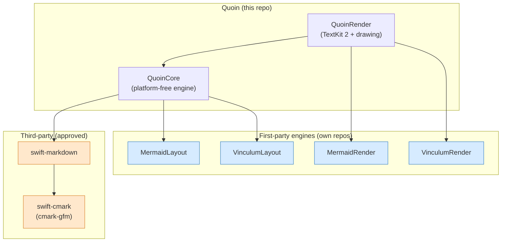

# Dependencies

Quoin runs on **one third-party code dependency**: swift-markdown. Everything
else in the build graph is either a transitive dependency of that one package,
or a Quoin-owned first-party engine.

## Why so few

Every dependency is a standing liability — supply-chain risk, binary bloat, a
compatibility surface you don't control, and lock-in to someone else's release
cadence and design choices. A native, local-only, zero-JavaScript editor whose
whole promise is that your files stay yours cannot afford to smuggle in an
unaudited transitive graph. So the policy is deliberately strict: **the default
answer to a new dependency is no.** Adding one requires written justification in
this file *before* it lands, plus an allowlist entry in
`scripts/check-dependency-policy.sh`, which fails CI if `Package.swift` or
`Package.resolved` names anything unapproved.

First-party engine packages (MermaidKit, Vinculum) are exempt — they are
Quoin's own code, just versioned in their own repos (see
[why they're separate](#first-party-engines-mermaidkit--vinculum)).

## The graph

| Package | Kind | Pin | Role |
| :--- | :--- | :--- | :--- |
| [swift-markdown](https://github.com/swiftlang/swift-markdown) | third-party (approved) | `from: 0.8.0` | The cmark-gfm parser; the entire AST |
| swift-cmark | transitive (via swift-markdown) | — | cmark-gfm itself |
| [MermaidKit](https://github.com/clintecker/MermaidKit) | first-party | `from: 0.10.0` | Native Mermaid diagram engine |
| [Vinculum](https://github.com/clintecker/Vinculum) | first-party | `from: 0.23.0` | Native LaTeX math engine |

`QuoinCore` depends only on the platform-free layout halves (Markdown,
MermaidLayout, VinculumLayout) so it builds and tests on Linux. `QuoinRender`
adds the drawing halves (MermaidRender, VinculumRender), which need
CoreText/CoreGraphics.

## swift-markdown

The one approved third-party dependency, and the foundation of the whole
product. Quoin's source of truth is the markdown string and the AST parsed from
it — never an attributed string — and that AST is swift-markdown's.

It is the right dependency to keep: writing a CommonMark+GFM parser from scratch
is a multi-year effort with an enormous compatibility surface, swift-markdown is
Apple-maintained and Apache 2.0, and it pulls only swift-cmark (cmark-gfm, the
same lineage) transitively. Attribution ships in About ▸ Acknowledgements.

## First-party engines: MermaidKit & Vinculum

Mermaid diagrams and LaTeX math are rendered by two Quoin-owned packages —
[MermaidKit](https://github.com/clintecker/MermaidKit) and
[Vinculum](https://github.com/clintecker/Vinculum) — consumed from GitHub with
`from:` pins exactly as any host app would consume them. They are first-party
code, so they are exempt from the one-third-party rule and allowlisted in the
policy script.

**Why separate packages rather than in-repo folders** (see
[ADR 0003](adr/0003-first-party-engines.md)): each engine grew large enough to
be a product in itself. Splitting them out means their test suites run in their
own CI instead of dragging Quoin's, they can serve other hosts, and their
capability matrices live in one authoritative place — their own repos — instead
of being duplicated (and silently drifting) in Quoin's docs.

Both follow the same shape:

- A **platform-free layout half** — `MermaidLayout`, `VinculumLayout` — parses
  and computes device-independent geometry (`DiagramScene`, `MathScene`).
  `QuoinCore` `@_exported import`s these, so `import QuoinCore` still exposes
  `MermaidParser`, `MathParser`, and friends.
- A **drawing half** — `MermaidRender`, `VinculumRender` — draws that geometry
  via CoreGraphics/CoreText behind a theme seam (`DiagramTheme`, `MathTheme`),
  which Quoin adapts through `Theme.diagramTheme` / `Theme.mathTheme`.
  `QuoinRender` consumes these.

To co-develop an engine: clone it beside `quoin` and temporarily point
`Package.swift` at `.package(path: "../MermaidKit")` (never commit that), or
`swift package edit`; then publish to the engine repo, tag, and bump the pin
here. Engine changes are validated by the engine's own CI, not Quoin's.

Vinculum's coverage is large (~400 commands); the exhaustive matrix lives in
Vinculum's `docs/COVERAGE.md` / `docs/COMMANDS.md`.

### Linux rendering

On Apple platforms the diagram and math engines draw natively through
CoreGraphics/CoreText (`MermaidRender`, `VinculumRender`). The layout halves
(`MermaidLayout`, `VinculumLayout`) are platform-free, so `QuoinCore` builds
and tests on Linux today — but rasterizing a diagram or equation there needs a
CoreGraphics substitute. The forward path is a PureSwift/Silica
(Cairo/FreeType) backend in the engine packages, kept strictly opt-in so a
macOS build never pulls Cairo. Quoin's macOS product does not depend on it;
it matters only to non-Apple hosts.

## Sparkle (auto-update)

Quoin ships by direct distribution, not the App Store. A direct-distribution app
with no updater strands every shipped bug forever — users won't re-download
DMGs — so update delivery is a launch requirement, and
[Sparkle 2.x](https://sparkle-project.org) is the approved answer. It is wired
into the app; the full release/notarization/appcast runbook lives in
[distribution.md](distribution.md).

**Why not hand-roll it:** a safe self-updater is security-critical
infrastructure — EdDSA-signed appcasts, delta application, atomic app
replacement, rollback, sandbox-safe XPC install. Sparkle is the Mac standard:
actively maintained, MIT, with a documented threat model. A hand-rolled updater
would be *less* safe, so the policy's own intent — minimize risk — argues *for*
adopting Sparkle here rather than against it.

How it's scoped:

- **App target only.** Sparkle is a dependency of the `App/macOS` Xcode project
  alone — never the SwiftPM graph — so `QuoinCore`/`QuoinRender` stay
  dependency-clean and Linux-buildable. The policy script allowlists `sparkle`.
- **Privacy.** The update check is Quoin's *only* network traffic. It is
  user-disableable (Settings → Advanced), default on, with a first-run
  disclosure.
- **Prerequisites** (human-only, one-time): an Apple Developer ID plus
  notarization, an appcast host, and an EdDSA key pair (private key in the
  keychain, never the repo). Full steps in [distribution.md](distribution.md).
