# Distribution & auto-update

Quoin ships by **direct download**, not the Mac App Store. That keeps the
sandbox on our terms and avoids App Review, but it means we own two things the
App Store would otherwise handle: proving the app is safe to run
(**notarization**), and delivering updates so a shipped bug isn't stranded
forever (**Sparkle**).

This document is the runbook for both. It covers what the code and scripts
already do, and — separately and explicitly — the accounts, certificates, and
keys that only a human with the developer identity can provide.

## The pipeline at a glance

```mermaid
flowchart LR
    build["xcodebuild archive<br/>(Release, hardened runtime)"]
    sign["codesign<br/>Developer ID + timestamp"]
    notarize["notarytool submit<br/>Apple notary service"]
    staple["stapler staple<br/>ticket baked in"]
    appcast["generate_appcast<br/>EdDSA-signed appcast.xml"]
    host["Upload zip + appcast<br/>to release host"]
    user["Installed Quoin<br/>Sparkle checks appcast"]

    build --> sign --> notarize --> staple --> appcast --> host
    host -.update check.-> user
    user -.downloads + verifies.-> host

    classDef script fill:#d6ebff,stroke:#3b82c4,color:#333
    class build,sign,notarize,staple,appcast script
```



The blue steps are automated by `scripts/release.sh` (which calls
`scripts/notarize.sh` for the archive→staple half). You run one command; the
prerequisites below are what make that command succeed.

## What you need to do (human-only prerequisites)

None of these can be scripted — they require your Apple identity and your
private keys. Do them once; after that, releasing is a single command.

1. **Apple Developer Program membership** — $99/year at
   [developer.apple.com](https://developer.apple.com/programs/). This is the
   gate: without it there is no Developer ID certificate and no notarization.
   Everything else waits on this.

2. **A "Developer ID Application" certificate.** In Xcode → Settings →
   Accounts → Manage Certificates → **+** → *Developer ID Application*, or via
   the developer portal. The private key lands in your login keychain; keep it
   there (and back it up — losing it means re-issuing). Find its full name with
   `security find-identity -v -p codesigning` — it reads
   `Developer ID Application: Your Name (TEAMID)`. That string is the argument
   to the release script.

3. **Notary credentials, stored once.** Create an app-specific password at
   [account.apple.com](https://account.apple.com) (Sign-In & Security →
   App-Specific Passwords), then:
   ```sh
   xcrun notarytool store-credentials quoin-notary \
     --apple-id you@example.com --team-id TEAMID
   ```
   The profile name `quoin-notary` is what `notarize.sh` expects (override with
   `QUOIN_NOTARY_PROFILE`).

4. **A Sparkle EdDSA signing key pair.** Run Sparkle's `generate_keys` once (it
   ships in the Sparkle SPM artifact — see below). It prints a **public** key
   and stores the **private** key in your keychain:
   - Paste the public key into `App/macOS/project.yml` as `SUPublicEDKey`,
     replacing the `REPLACE_WITH_YOUR_SPARKLE_EDDSA_PUBLIC_KEY` placeholder,
     then `xcodegen`. The app will only install updates signed by the matching
     private key.
   - **Never** put the private key in the repo. If it leaks, an attacker can
     sign malware your users' Quoin will trust.

5. **A place to host the appcast + downloads.** Any static host works;
   **GitHub Releases** is the simplest and is what `SUFeedURL` currently points
   at (`…/releases/latest/download/appcast.xml`). Upload `appcast.xml` and each
   `Quoin-<version>.zip` there. If you host elsewhere, update `SUFeedURL` in
   `project.yml` and pass `QUOIN_APPCAST_BASE_URL` to the release script.

Until steps 1–4 are done, the Sparkle code is wired but inert: the app builds,
launches, and shows "Check for Updates…", but the placeholder key and feed mean
no real update can be served yet. That is the intended pre-release state.

## Finding Sparkle's command-line tools

`generate_keys` and `generate_appcast` ship inside Sparkle's SPM artifact, not
on `PATH`. After building the app once (so SwiftPM fetches Sparkle):

```sh
find ~/Library/Developer/Xcode/DerivedData -name generate_appcast -perm -111 | head -1
```

`release.sh` auto-discovers `generate_appcast` this way; set `SPARKLE_BIN` to
its directory to skip the search. Run `generate_keys` from the same directory.

## Cutting a release

Once the prerequisites are in place:

```sh
# Bump the version first (marketing version in project.yml):
#   CFBundleShortVersionString: "1.0.1"

scripts/release.sh "Developer ID Application: Clint Ecker (TEAMID)"
```

That archives Release with the hardened runtime, signs with your Developer ID
and a secure timestamp, submits to Apple's notary service and waits, staples the
ticket, then signs and regenerates `appcast.xml`. Output lands in
`build/release/`. Upload the `.zip` and `appcast.xml` to your host, and existing
installs pick up the update on their next check.

Verify a build is Gatekeeper-clean before announcing it:
```sh
spctl --assess --type execute --verbose=2 build/release/Quoin.app   # → "accepted, source=Notarized Developer ID"
```

## How the app side works

- **Dependency scope.** Sparkle is a dependency of the `App/macOS` Xcode
  project **only**. `QuoinCore` and `QuoinRender` never see it, so they stay
  dependency-clean and Linux-buildable (see
  [dependencies.md](dependencies.md)). The dependency-policy guard allowlists
  `sparkle` for this reason.
- **The updater.** `SoftwareUpdater` (App/macOS) owns a
  `SPUStandardUpdaterController`, started at launch. The Quoin menu's "Check for
  Updates…" item drives a manual check; background checks follow the Info.plist
  policy (`SUEnableAutomaticChecks`, `SUScheduledCheckInterval`).
- **Entitlement.** Sandboxed Sparkle needs `com.apple.security.network.client`
  (the update check is the app's *only* network traffic) and
  `SUEnableInstallerLauncherService` so the sandboxed app can launch the
  installer via XPC. Both are set.
- **Privacy.** The update check is the single network call Quoin ever makes. It
  is user-disableable (Settings → Advanced → *Automatically check for
  updates*), disclosed on first run, and sends only what Sparkle needs to
  compare versions. Everything else about Quoin stays on your disk.

## Why Sparkle, and why notarization

A direct-distribution app with no updater strands every shipped bug forever —
users don't re-download DMGs. A self-updater is therefore a launch requirement,
and a *safe* one is security-critical infrastructure: EdDSA-signed appcasts,
atomic replacement, rollback, sandbox-safe XPC install. Hand-rolling that would
be less safe than adopting the Mac standard, so
[Sparkle 2.x](https://sparkle-project.org) (MIT, actively maintained, with a
documented threat model) is the right call — the same "minimize risk" logic that
drives the one-dependency policy argues *for* it here.

Notarization is Apple's malware scan for software distributed outside the App
Store. Without a stapled notarization ticket, Gatekeeper shows the scary
"unidentified developer" wall and many users simply can't open the app. It's not
optional for a real release.
