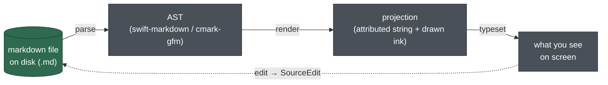
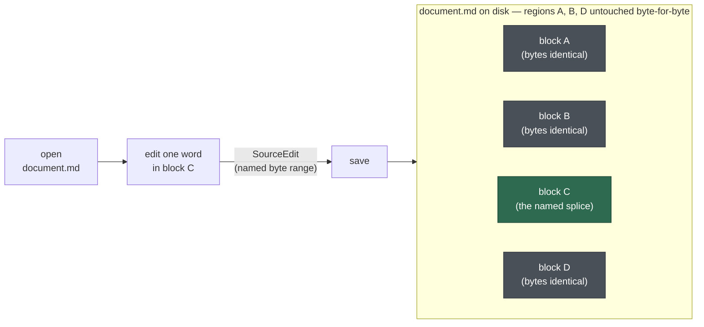
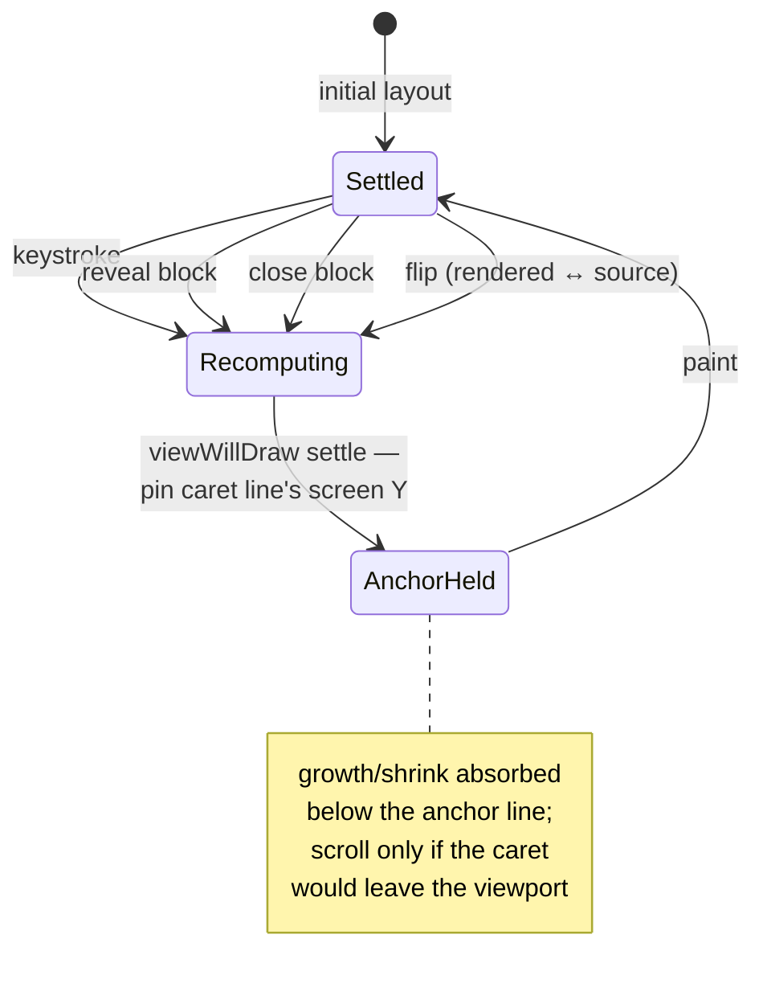
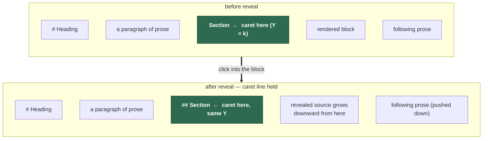
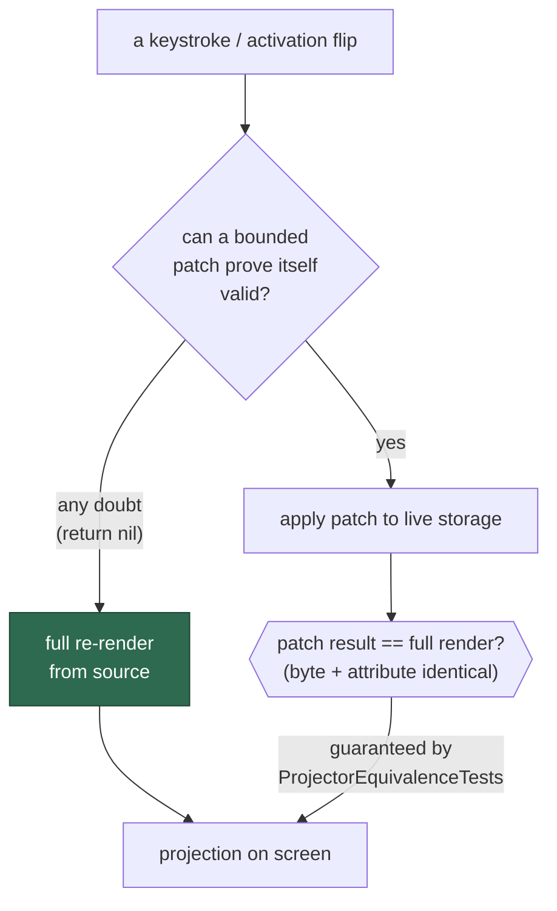
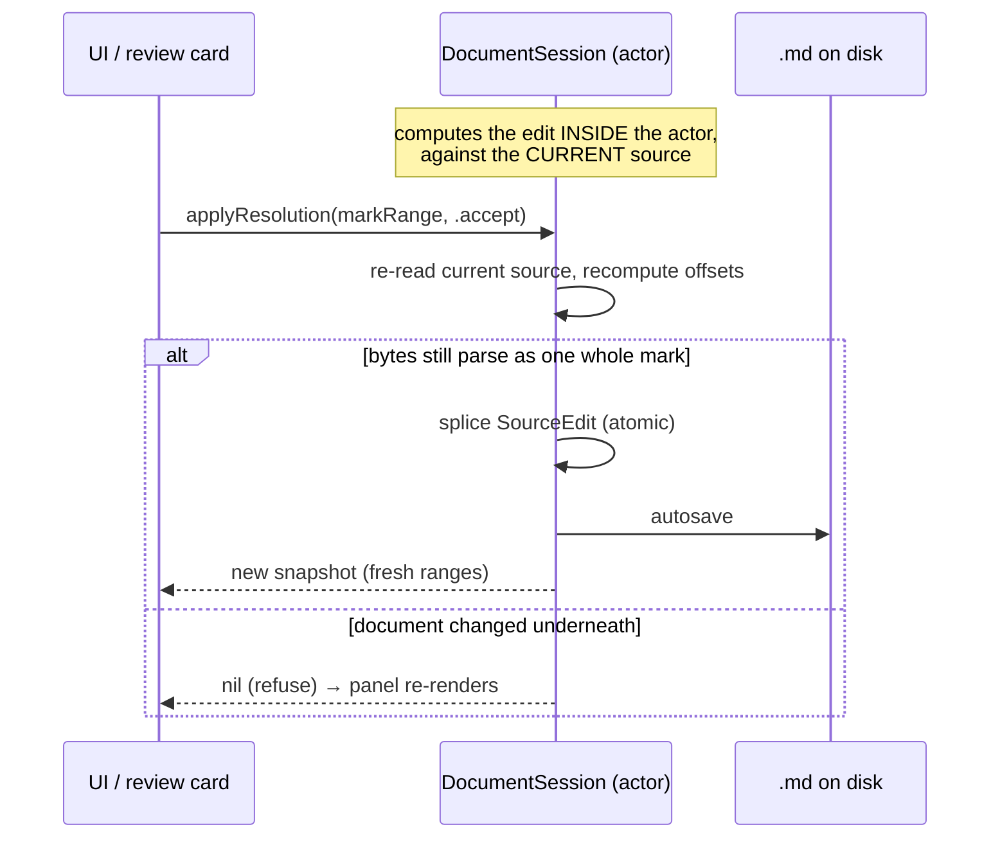

# Invariants — the rules that keep Quoin correct

Quoin is a WYSIWYG editor whose **source of truth is the markdown file itself**,
not an internal document model. Everything the editor shows is a *projection* of
that file's text plus its parsed AST. That single decision — the file is real,
the view is a shadow — is the reason Quoin can hand your bytes back untouched,
let an agent propose edits inside the `.md`, and never trap your content in an
opaque format.

Guarantees like that don't survive on good intentions. Each one below is an
**invariant**: a property the code must hold true on every edit, every reveal,
every keystroke — and a named **guard** (a test or a structural constraint) that
fails loudly the moment it's violated. If you're adding a feature, find the
invariants it touches and extend their guards; a rule without a guard is just an
opinion, and these are not opinions ([ADR 0008](adr/0008-drift-by-guards.md)
codifies this as policy, not habit).

For the machinery these invariants protect — the parse → session → project →
display pipeline, module layout, engine seams — see
[architecture.md](architecture.md). For how the projection actually looks and
behaves block-by-block, see [editor-modes.md](../design/editor-modes.md).

Each invariant is written the same way: **what it guarantees**, **why it matters
to the person using Quoin**, and **how the code enforces it**.

---

## The model everything else rests on

The file is authoritative (green). Everything else is derived (grey). The only
arrow that flows *back* to the file is an explicit byte splice — a `SourceEdit`.
There is deliberately no path from the on-screen attributed string back into the
source. Reading the sections below, keep this picture in mind: every invariant
is protecting one of these arrows. This layering is [ADR
0001](adr/0001-source-string-truth.md) — the project's founding decision, made
once and reaffirmed by every phase since.

---

## Source & round-trip

### 1. The markdown string + AST is the only source of truth

**Guarantees.** The editor is a projection. Attributed strings, layout objects,
and decoration geometry are all *derived* — never authoritative. Edits mutate
the source through `DocumentSession`, and the renderer re-projects from the new
source.

**Why it matters.** Your document is a plain `.md` file you fully own. Any tool
that writes markdown — including an AI agent proposing a review suggestion — is
writing a first-class Quoin document, because there is no hidden second
representation to keep in sync. Open it in another editor, `git diff` it, pipe it
through a script: it's just text.

**How it's enforced.** Structural, not incidental: there is no API to write an
attributed string back to the source. Data flows one way (parse → render →
typeset); the only return path is an explicit `SourceEdit`. `DocumentSession` (an
`actor`) is the sole gate through which the source can change.

### 2. Byte-lossless round-trip

**Guarantees.** Open → edit → save leaves every *untouched* region of the file
byte-for-byte identical. Recognizing a construct never rewrites it; only an
explicit `SourceEdit` splices bytes, and only the bytes it names.

**Why it matters.** Editors that reserialize from a model love to "normalize"
your file — reflowing lists, swapping `*` for `-`, restyling your fences,
reordering front matter. Quoin doesn't touch what you didn't touch. Your commits
stay small and honest; a one-word fix is a one-word diff, not a whole-file churn.
This is also what makes the [review loop](../design/suggestions.md) safe:
accepting a suggestion is a *surgical* splice, so the surrounding document is
provably unchanged.

Only the bytes the `SourceEdit` names change; every other region — including
whitespace, list-marker style, and fence formatting — survives the round-trip
identically, because there is no reserialize-from-model step to drift through.

**How it's enforced.** `SourceEdit.apply(to:)` is a pure UTF-8 range splice that
also returns its exact inverse (for undo). Exporters read the *source*, never the
projection. Session tests round-trip fixtures through open/edit/save and compare
bytes.

### 3. Revealed source is 1:1 with the file

**Guarantees.** When you click into a block, it re-renders as its literal
markdown source — character for character. Hidden delimiters (the `**` around
bold, the `#` on a heading) are *not removed*; they become 1pt clear glyphs. A
caret offset inside the revealed text **is** a source offset.

**Why it matters.** Editing feels like editing the real file, because it is. The
caret can never land "between" a rendered glyph and its hidden markup, and a
keystroke goes exactly where you'd expect in the underlying bytes. This is the
mechanical basis of Quoin's WYSIWYG-without-lying promise — the full mechanism
(caret-scoped reveal, the rendered/source duality per block) is documented in
[editor-modes.md](../design/editor-modes.md).

**How it's enforced.** `MarkdownSourceStyler` produces the revealed text and
carries the contract that delimiters are dimmed, never deleted. `EditMapping`
translates at the edit boundary. `RevealFidelityTests` asserts the revealed
string equals the source slice for every block kind.

---

## The viewport & caret invariant

### 4. The line under your caret never moves on screen

**Guarantees.** On *any* projection change — revealing a block, closing one, a
keystroke, a flip, for *every* block type — the line the caret (or click) is on
stays put on screen. Edit mode also keeps the block's vertical skeleton (its
per-line layout is transplanted, not rebuilt). Quoin scrolls only when the caret
would otherwise leave the viewport, and then by the minimum needed. This holds
for embeds too — see [embed-editing-ux.md](../design/embed-editing-ux.md) for
how it survives the rendered↔source flip specifically.

Every trigger funnels through the same settle step before a pixel paints:

**Why it matters.** This is the difference between an editor that feels solid and
one that feels haunted. When a block expands from its rendered form into taller
source, everything *below* can grow — but the thing you're looking at, the line
you're typing on, holds still. Nothing jumps out from under your eyes.

The caret line sits at the same screen Y before and after. Growth is absorbed
*below* the anchor, not by shoving the anchor upward.

**How it's enforced.** Every paint is a *settled* paint: `viewWillDraw` runs the
viewport settle — which pins the caret line's screen position across layout
resolution — before any pixel is drawn, including the case where TextKit resolves
height estimates for a very large document. `CaretLineAnchorTests` (including a
>200k-character settle case) and `RevealFidelityTests` guard it.

### 5. Caret hints carry their own coordinate space

**Guarantees.** A caret hint knows whether its offset is a `.rendered` offset (in
projected prose) or a `.source` offset (inside an embed body). Rendered offsets
are translated through `EditMapping`; source offsets are used verbatim.

**Why it matters.** Prose and embeds (math, Mermaid) live in different coordinate
systems — projected text has hidden glyphs, an embed's editable body is 1:1 with
its source. Mixing them up lands the caret a few characters early. Tagging each
hint with its space keeps clicks precise across both kinds of content. Embeds —
what they are and how their caret hints are produced — are covered in
[embed-editing-ux.md](../design/embed-editing-ux.md).

**How it's enforced.** The coordinate space is part of the hint type, so a caller
physically cannot feed a source offset through the rendered mapping.
`ReverseCaretMappingTests` and the embed caret-hint tests pin both directions.

---

## Projection equivalence & degrade-never-break

For speed, Quoin doesn't re-render the whole document on every keystroke. It
applies a *bounded patch* to live storage — restyle one block, splice one edit.
That optimization is only safe if a patched result is **indistinguishable** from
a full re-render, and if any doubt falls back to the always-correct full render.
The full performance picture — incremental parsing, patch rendering,
viewport-lazy layout, and their budgets — lives in
[performance.md](performance.md).

### 6. Every patch path equals the full render — or bails to it

**Guarantees.** Any bounded update applied to live storage is byte- and
attribute-identical to a fresh full render of the same state. If a patch can't
*prove* it's valid, it returns nil and the caller re-renders fully.

**Why it matters.** You get the responsiveness of incremental updates with none
of the drift. The document can't slowly desync from its source over a long
editing session, because the fast path is *defined* to match the slow path
exactly, and the slow path is always available as a correct floor. This is the
*degrade-never-break* principle: when the optimization can't be sure, it doesn't
guess — it does the correct, slower thing.

**How it's enforced.** `ProjectorEquivalenceTests` runs every fixture × a scripted
interaction and asserts patch output equals full-render output. Patch builders in
`AttributedRenderer` return nil at the first sign of an unhandled shape; nil means
"full render, please." The equivalence comparison must cover *every* field of the
compared model — adding a field to `QuoinDocument` means extending the equivalence
helpers in the same change, or a fast-path bug can hide behind an unchecked field.
This whole strategy — proving impossibility of drift via CI equivalence rather
than a single literal projector function — is [ADR
0008](adr/0008-drift-by-guards.md).

### 7. Each derivation lives in exactly one place

**Guarantees.** The block separator, the reveal styler config
(`revealStylerConfig`), and the presentation map (`presentation(for:)` →
`PresentationMap`) are each computed in *one* function. Consumers read the result;
they never recompute it.

**Why it matters.** Two copies of a rule drift apart. Centralizing each derivation
is what *lets* invariant 6 hold — if the patch path and the full-render path both
call the same separator function, they can't disagree about spacing. Single-source
derivation is the structural reason equivalence is even achievable.

**How it's enforced.** `BlockPresentationTests` pins the derivation tables; the
equivalence corpus catches any consumer that re-derives and drifts.

### 8. A revealed fragment's editable range starts at 0

**Guarantees.** For an embed (math, rendered by the first-party
[Vinculum](https://github.com/2389-research/Vinculum) engine, or a diagram,
rendered by the first-party [MermaidKit](https://github.com/2389-research/MermaidKit)
engine — see [dependencies.md](dependencies.md) for why both are separate
packages), the editable source *is* the fragment —
`RevealedFragment.editableRange.location == 0`. The live preview renders in a
side panel, never spliced inline.

**Why it matters.** Editing a diagram means editing its literal source with a
preview beside it; the preview can hold its last good render while your in-progress
source is momentarily unparseable, without the caret or the source ever shifting.
The full editing UX for embeds — the `‹/› edit` chip, the side panel, the flip —
is [embed-editing-ux.md](../design/embed-editing-ux.md); the decision to make the
preview a side panel rather than an inline run is [ADR
0004](adr/0004-side-panel-preview.md).

**How it's enforced.** Documented at the type and exercised by the equivalence
corpus.

### 9. Patches apply only to the storage they were diffed against

**Guarantees.** A patch carries the length of the storage it was computed against
(`patchBaseLength`). If that doesn't match the live storage at apply time, the
view resyncs by splicing to the authoritative string instead of applying a stale
patch.

**Why it matters.** UI frameworks coalesce rapid updates. Without this check, a
patch computed against one storage state could land on a newer one, corrupting the
projection. The length gate turns a possible corruption into a clean resync.

**How it's enforced.** `ProjectionCoalescingTests`. The apply site checks
`patchBaseLength == storage.length` before trusting the patch.

### 10. One block edits at a time; one caret

**Guarantees.** Exactly one block can be in the editing (revealed-source) state,
and there is exactly one caret.

**Why it matters.** It keeps the mental model simple and the projection tractable —
there's always one "active" block and everything else is rendered. The rendered
↔ source duality this presentation model resolves, per block, is the subject of
[editor-modes.md](../design/editor-modes.md).

**How it's enforced.** Structural: `PresentationMap` can only represent a single
`.editing` block, so multiple simultaneous edits are unrepresentable.

---

## Drawing

### 11. Decorations are drawn ink, never per-glyph backgrounds

**Guarantees.** Code canvases, callout boxes, quote rules, diagram frames, table
rules, and the front-matter chip are *drawn* behind the text using TextKit 2
fragment frames — never applied as `.backgroundColor` text attributes. Each
character carries exactly one `BlockDecoration`.

**Why it matters.** Per-glyph background colors render as ragged per-line strips
that don't track reflow — visually broken. Drawing the shapes as ink, keyed to
fragment geometry, means a callout is one clean rounded box that follows the text
as it wraps.

**How it's enforced.** `DecorationGeometryTests`, plus the one-decoration-per-
character rule at the attribute layer.

### 12. Every draw is a settled draw, measured once

**Guarantees.** `viewWillDraw` finishes viewport layout before any pixel is drawn,
and a single measure pass feeds *all* chrome geometry — border, done-chip,
tooltip, side-panel anchor, and the accessibility element all derive from one
`EditingChrome` box.

**Why it matters.** If chrome pieces measured themselves independently, they'd
disagree by a pixel or two and the editing frame would look loose. One box, one
truth: the accent frame, its chip, and its accessibility element are always in
exact register.

**How it's enforced.** `DecorationGeometryTests` (chrome-from-one-box,
viewport-scoped measure).

### 13. The flip animation is cosmetic by construction

**Guarantees.** When a block flips between rendered and source form, the real
layout applies *instantly*; only a frozen snapshot animates over the top. Any
user input or newer projection truncates the animation to its end state, and a
watchdog removes the cover unconditionally after a fixed timeout.

**Why it matters.** Animation is polish, never a gate on interaction. You can type
straight through a flip; the software is already in the end state, and the pretty
transition can't strand you in a half-rendered view or swallow a keystroke.

**How it's enforced.** `FlipTransitionController` owns the snapshot overlay
(Reduce-Motion-aware, with a 500ms watchdog); `FlipTransitionFidelityTests`
verifies the animation is purely a cover over already-applied layout. The
decision to make the flip cosmetic rather than animate real layout is [ADR
0006](adr/0006-cosmetic-flip.md).

---

## Sessions & data safety

The most important bytes in the world are the ones already on the user's disk.
These invariants exist so Quoin can never autosave garbage over your file.

### 14. Edits are computed atomically, inside the actor

**Guarantees.** Accept/reject a suggestion, edit a front-matter field, toggle a
task — the resulting `SourceEdit` is computed against the session's *current*
source, *inside* the `DocumentSession` actor, and applied as one atomic edit with
one undo. It is never computed against a stale projection snapshot.

**Why it matters.** In the [review loop](../design/suggestions.md), offsets are
everything. If a card were resolved using offsets computed from an old render, a
second quick "Accept" could splice mid-mark and corrupt the document — and
autosave would persist the corruption. Computing in-actor against live bytes
makes each resolution a clean, whole-mark edit. When the bytes no longer match,
the session *refuses* (returns nil) and the re-rendered panel hands back fresh
ranges for the next click.

**How it's enforced.** `applyResolution` / `applyBulkResolution` /
`applyFrontMatterEdit` all live on the `DocumentSession` actor and recompute
against `document.source`; an optional `expectedSlice` identity check refuses when
an intervening edit moved the mark. Session editing tests cover the whole-mark and
double-resolve cases. The rule is general: any UI action that derives an edit from
document state must go through a session API that computes it in-actor at apply
time, not queue an edit built against a projection snapshot.

### 15. One live session per file

**Guarantees.** A file open in multiple windows or tabs shares exactly one
`DocumentSession`, keyed by resolved + standardized URL and reference-counted.
There are never two autosavers competing for one file.

**Why it matters.** Two independent sessions for one file would race each other's
saves and lose edits. One session, shared, means every view of a document sees the
same authoritative bytes.

**How it's enforced.** `OpenDocumentStore` keys sessions by standardized URL and
ref-counts them across windows/tabs; the last release flushes and unwatches.

### 16. A file that can't be read is never bound to its URL

**Guarantees.** If opening a file fails, the session detaches (nil URL) and shows a
sticky banner. Nothing can autosave over the bytes it couldn't read.

**Why it matters.** The worst failure mode for an editor is to greet a read error
with an empty buffer and then *save that empty buffer* over your real file. Quoin
structurally can't: a session with no URL has nowhere to write.

**How it's enforced.** `ReaderModel.start` detaches the session on open failure.

### 17. Quit flushes every live session

**Guarantees.** ⌘Q drains every live session's pending save before the app
terminates, bounded by a watchdog so a single hung save can't wedge quit forever.

**Why it matters.** You expect your last edits to be on disk when the app closes.
The flush guarantees it; the watchdog guarantees quitting still works even if one
file's save is stuck.

**How it's enforced.** `applicationShouldTerminate` returns `.terminateLater`,
flushes all sessions on a detached task, and a 3-second watchdog forces
termination if a flush hangs. Covered by the session editing tests.

### 18. Stale edits are rejected, not spliced

**Guarantees.** Every edit can be stamped with the session's `contentRevision`. If
the file reloaded between the moment an edit was computed and the moment it's
applied, the session refuses it (`staleEditBase`) rather than splicing outdated
offsets.

**Why it matters.** A reload from disk (external change, conflict resolution) can
invalidate offsets computed a moment earlier. Rejecting the stale edit is how
Quoin avoids applying an outdated splice to newer bytes. Note this is the coarse
backstop — because `contentRevision` bumps on reloads, not on ordinary edits, the
finer protection is invariant 14 (compute-where-you-apply), which byte-validates
each edit against the exact bytes it targets.

**How it's enforced.** `applyEdit(baseRevision:)` compares against the live
`contentRevision` and throws `staleEditBase` on mismatch. Session editing tests
cover the reload-between-compute-and-apply window.

---

## Testing culture

### 19. There are no flaky tests, only bad tests

An intermittent failure is never dismissed as "environmental." It is either a
nondeterministic measurement channel — fix the channel — or a real race — fix the
race. A test that sometimes passes for the wrong reason is worse than no test,
because it launders a bug into a green checkmark ([ADR
0007](adr/0007-no-flaky-tests.md) records the case that established this rule).

### 20. Loop-driven tests assert a coverage floor

A corpus or property test that iterates over many cases asserts a *minimum* number
of checks actually ran. Without a floor, a bug that makes every case bail early
would show up as a passing test that verified nothing.

**How it's enforced.** `ProjectorEquivalenceTests` asserts its check-count floor,
so universal bailout can't fake a pass.

---

## When you add a feature

1. **List the invariants it touches.** A new block type hits at least 3 (revealed
   source), 4 (viewport), 6 (equivalence), and 11 (decorations). A new inline span
   needs *both* a renderer case in `AttributedRenderer` and a `MarkdownSourceStyler`
   pass, plus a delimiter registered in the claimed-ranges ordering (`**` before
   `*`, links before emphasis).
2. **Extend the named guards.** Add your case to `RevealFidelityTests`,
   `CaretLineAnchorTests`, and the `ProjectorEquivalenceTests` interaction script.
   An invariant without a guard is undone the next time someone refactors near it.
3. **Keep derivations single (invariant 7).** If you need the separator, the
   reveal config, or the presentation map, *call* the one function that produces
   it — don't recompute it inline.

The full contributor map — data flow, editing model, engine seams — lives in
[architecture.md](architecture.md).
