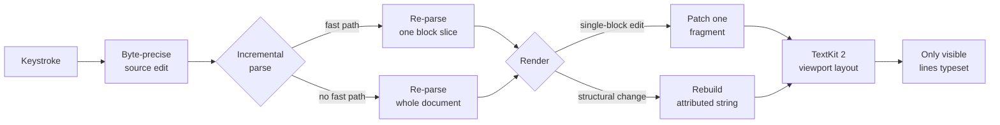
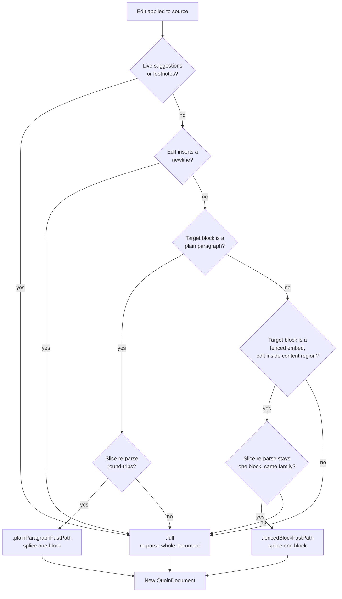
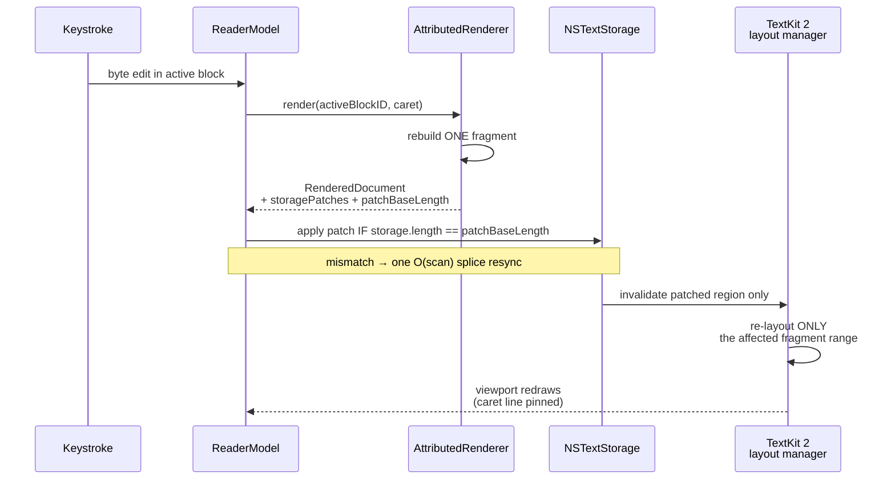
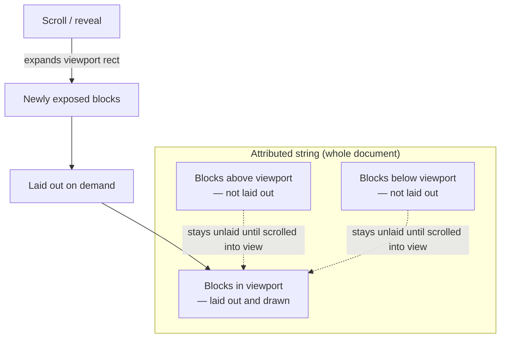
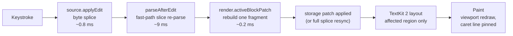

# Performance characteristics

Quoin treats the markdown **file** as the source of truth and the editor as a
live [projection](../design/editor-modes.md) of it. Every keystroke mutates the
source string, and the editor re-derives what you see from that string. That
design is what makes round-trips [byte-lossless](invariants.md) and keeps the
format open — but it also means the per-keystroke cost is, in the naive case,
"re-parse the whole document and rebuild the whole attributed string." On a
book-sized file that is hundreds of milliseconds, far past a single frame.

Quoin stays responsive by never doing the naive thing when it can avoid it.
Three mechanisms cooperate so that a keystroke in a large document costs
roughly what a keystroke in a small one does:

| Mechanism | Turns this… | …into this |
| --- | --- | --- |
| **Incremental parsing** (fast paths) | re-parse the whole document | re-parse one block's slice |
| **Patch rendering** | rebuild the whole attributed string | splice one fragment into storage |
| **Viewport-lazy layout** | lay out every line | lay out only what's on screen |



Each stage has a fast path for the common case (typing inside one block) and a
correct-but-slower fallback for everything else (edits that change document
structure). The fast paths are always *optional* — anything a fast path cannot
prove safe falls through to the full path, so correctness never depends on the
optimization firing.

---

## Why re-projection cost is the whole game

Because attributed strings are never the source of truth, there is no in-place
mutation of styled text to reason about. An edit is a byte splice into the
markdown string; the document and its projection are rebuilt *from* the new
string. This is what guarantees the invariants Quoin cares about — untouched
regions of the file survive a round-trip byte-for-byte, and the on-disk format
stays plain CommonMark+GFM — but it puts parse-and-project squarely on the
keystroke path.

So the optimization problem is: given that we re-derive from source, how do we
re-derive *as little as possible* while producing exactly what a full
re-derivation would have produced? The answer is that both the parser and the
renderer — mapped in full in the [architecture reference](architecture.md) —
are structured so a single-block edit can be proven local, and only that block
is redone.

---

## Incremental parsing (fast paths)

`MarkdownConverter.parseAfterEdit(previous:edit:)` is the parser's keystroke
entry point (see the [architecture map](architecture.md) for where it sits
relative to `DocumentSession`). It applies the byte edit, then tries two fast
paths before it will fall back to a full parse:



The result carries the `ParseStrategy` it used (`.plainParagraphFastPath`,
`.fencedBlockFastPath`, or `.full`) — the benchmark harness reads this back to
confirm which path an edit actually took. The "live suggestions or footnotes"
gate exists because both carry absolute byte ranges into inline content; see
[When the fast paths deliberately stand down](#when-the-fast-paths-deliberately-stand-down)
below, and the review loop's byte-range discipline in
[invariants.md](invariants.md).

### The self-calibrating slice re-parse

Both fast paths share one trick that keeps them honest. They do **not** contain
a hand-rolled imitation of what cmark would do. Instead they re-parse the
affected block's **source slice** with the real parser, twice, and demand that
the result match what a full parse must have produced:

1. Parse the **old** slice — it must reproduce the old block exactly (same
   kind). This is the self-calibration: if slicing this block and parsing it in
   isolation doesn't reproduce the block, the block wasn't slice-local and the
   fast path bails.
2. Parse the **new** slice — it must yield exactly **one** block of the same
   family whose length grew by exactly the edit's byte delta. Any early fence
   close, category flip, block split, or structural surprise fails this check.
3. Reproduce the block's identity — content-hash-based `BlockID`s and their
   occurrence indices are recomputed so downstream cache lookups behave
   identically to a full parse.

If every check passes, the parser splices the one rebuilt block into the
previous block list, shifts the byte ranges of every following block by the
delta, shifts the outline, and diffs (rather than recounts) the statistics.
Everything else in the document is reused untouched. Any failed check returns
`nil` and `parseAfterEdit` falls through — **conservative rejection is always
safe**, because the fallback is a correct full parse.

Why re-parse the slice instead of synthesizing the change directly? Because
cmark applies smart punctuation — straight quotes come out curly, for one — so
a hand-built inline list would diverge from a full parse wherever a paragraph
contained an apostrophe. Running the real pipeline on the slice is the only way
to be byte-identical to the full-parse result.

### Plain-paragraph fast path

The common case: typing inside an ordinary prose paragraph. It fires only when

- the edit inserts no newline (a newline can split or merge blocks),
- the target block is a paragraph whose inlines are only text and soft breaks
  (no links, emphasis, or other spans whose boundaries an edit could shift),
- the document has no live suggestions and no footnotes (see below), and
- the slice re-parse round-trips as described above.

### Fenced-block fast path

The other thing a caret does all day: typing inside a fenced
[embed](../design/embed-editing-ux.md) — a code block, a Mermaid diagram, or a
math block. Editing a chart's revealed source would otherwise re-parse the
entire document on every keystroke, which is why a diagram in a long file
could feel sluggish while prose stayed snappy. This path re-parses only the
fenced block's slice, with two extra guards specific to fences:

- the edit must stay **strictly inside the content region** — past the opening
  fence line (so the info string can't change) and before the closing fence
  line (so an edit can't delete the terminator and let the fence swallow
  following blocks, which a slice-local parse cannot see), and
- the new slice must stay in the **same embed family** (a Mermaid block can't
  silently become plain code without the full parse seeing it).


This is why a document dense with [Vinculum](https://github.com/2389-research/Vinculum)
math and [MermaidKit](https://github.com/2389-research/MermaidKit) diagrams —
see [dependencies.md](dependencies.md) for how both are consumed — doesn't cost
extra to *edit*: each embed's revealed source is its own fenced block, so
typing inside one only ever re-parses and re-renders that one slice. The
diagram or equation you're not touching never re-enters the pipeline.

### When the fast paths deliberately stand down

Both fast paths require zero live suggestions and no footnotes. Review marks
(the CriticMarkup/RDFM suggestions and comments that power the
[review loop](../design/suggestions.md)) and footnotes carry **absolute** byte
ranges inside their inline content — ranges
that block-range shifting can't reach. A fast-path edit *before* such a mark
would leave the mark's stored range and content hash stale, and a later
accept/reject would compute against drifted offsets. So the presence of any
live mark forces a full parse, which re-anchors every mark from scratch. This
is a correctness requirement, not a missed optimization: the review loop's
atomic, byte-safe accept/reject depends on marks never pointing at stale
offsets. Any new offset-carrying inline node needs the same audit against
`parseAfterEdit`.

---

## Patch rendering

`AttributedRenderer` projects a `QuoinDocument` into one attributed string. A
block's rendered fragment is a **pure function of that block**, so the renderer
keys a fragment cache on the content-hashed `BlockID`: an unchanged block reuses
its cached fragment instead of being rebuilt. That alone turns a re-render from
O(document) into O(changed blocks) — the whole-document rebuild was the dominant
per-keystroke cost.

But there is a still-cheaper path for the most common edit of all. When you type
inside the one active (revealed) block, its fragment is the only thing that
changed, and the renderer can compute a **storage patch** — a single splice of
that one fragment into the live text storage — instead of assembling a fresh
whole-document attributed string:



The published projection carries its `storagePatches` and a `patchBaseLength` —
the storage length the patches expect *before* they're applied. The view trusts
the patches **only** when the live storage is exactly the state they were
computed against. SwiftUI coalesces rapid publishes, so a view can skip an
intermediate revision; applying the next patch batch to that stale storage would
silently corrupt the projection (the caret mapping drifts and keystrokes near
the block end fall outside the editable range and get swallowed). On any
mismatch the view discards the patches and does one full splice against the
authoritative attributed string — a single O(scan) resync instead of compounding
corruption.

Patch-versus-full-render equivalence is not left to trust: `ProjectorEquivalenceTests`
proves the patch path produces byte-identical output to a full render across an
interaction corpus, and it is extended whenever a projection path changes.

A few fragments are deliberately **not** cached:

| Block kind | Why not cached |
| --- | --- |
| Table of contents | Reflects the document-wide outline, not just its own content |
| The active (revealed) block | Its fragment changes as the caret moves |
| A fragment awaiting async content | A content-hash-stable placeholder would be returned forever; it re-renders when the image decodes |

---

## Viewport-lazy layout

The final stage is typesetting, and here Quoin leans on TextKit 2. The reading
surface is a TextKit 2 `NSTextView`, and TextKit 2 does **viewport-based
layout** — it lays out only the content that is actually on screen. A
thousand-page document does not pay to lay out a thousand pages to show you one;
scrolling lays out the newly exposed region as it comes into view. This is what
keeps very large documents scrolling at full frame rate regardless of length.



Only the blocks inside the current viewport rect ever get measured glyph runs
or fragment frames; everything above and below is tracked by range only until
scrolling brings it on screen. This is also why block decorations (code
canvases, callout boxes, quote rules, diagram frames, table rules, the
front-matter chip) are drawn in `drawBackground(in:)` using TextKit 2 fragment
frames rather than per-glyph `.backgroundColor` attributes: the shapes track
reflow, and only visible fragments are ever measured or drawn.

---

## Keystroke-to-paint budget

Putting the three mechanisms together end to end gives the full budget for one
keystroke in the active block — the path the
[caret/viewport invariant](invariants.md) has to hold across:



Every number on this path is dominated by the same thing it would be without
any optimization at all: the full parse and full render are still *possible*
fallbacks (the `.full` branches in the fast-path decision tree above), but on
the common case — typing inside one paragraph or one revealed embed — each
stage does O(one block) work instead of O(document) work. The
[Benchmarks](#benchmarks) section below has the measured numbers this diagram
is built from.

---

## Benchmarks

CI performance tests are smoke tests with broad timing headroom for shared
macOS runners — they catch gross regressions, not frame-level ones. For
edit-loop work, use the local release benchmark:

```sh
scripts/benchmark-editing-responsiveness.sh
scripts/benchmark-editing-responsiveness.sh /path/to/large.md
QUOIN_BENCH_ENFORCE=1 scripts/benchmark-editing-responsiveness.sh /path/to/large.md
```

The script builds a temporary release-mode harness against the checkout, then
measures a representative middle-of-document insert end to end: the initial full
parse, cold render, block activation, the byte-precise edit, the incremental
parse (reporting which strategy fired), the active-block patch fragment, and —
for comparison — the full parse, warm-cache full render, and full-string diff
scan the same edit *would* have cost without the fast paths.

Baseline on a ~1.2 MB public-domain book fixture (`moby_dick.md`):

| Metric | Value |
| --- | ---: |
| Bytes | 1,204,081 |
| Lines | 5,402 |
| Parsed blocks | 2,701 |
| Headings | 137 |
| Edit block bytes | 170 |
| `parse.initial` | 344.85 ms |
| `render.cold` | 98.00 ms |
| `render.activateBlock` | 75.44 ms |
| Active editable UTF-16 | 170 |
| `source.applyEdit` | 0.79 ms |
| `parseAfterEdit.middleInsert` | 8.86 ms |
| `parseAfterEdit.strategy` | `plainParagraphFastPath` |
| `render.activeBlockPatch.fragment` | 0.19 ms |
| `parse.middleInsert` (fallback) | 328.92 ms |
| `render.middleInsert.warmCache` (fallback) | 44.60 ms |
| `render.fullStringDiffScan` (fallback) | 11.57 ms |

The story the numbers tell:

- **A full re-parse dominates.** On book-sized prose, `parse.middleInsert` (a
  full parse) is ~329 ms — the single largest per-edit cost, and the thing the
  fast paths exist to avoid.
- **The fast path lands near a frame.** For a plain paragraph edit,
  `parseAfterEdit.middleInsert` is ~9 ms — roughly a 37× reduction over the full
  parse — because only the edited paragraph's slice is re-parsed.
- **The patch render is sub-millisecond.** `render.activeBlockPatch.fragment`
  (~0.19 ms) replaces the one changed fragment, versus ~45 ms to rebuild the
  whole attributed string with a warm cache.
- **The fallbacks are still bounded.** When an edit *can't* take a fast path,
  fragment caching keeps the warm full render (~45 ms) and diff scan (~12 ms)
  far below the cold numbers, so even structural edits stay usable.

Exact milliseconds depend on the hardware and the fixture; re-run the script
locally rather than trusting these to the decimal. What holds across machines is
the *shape*: the fast paths cut roughly two orders of magnitude off the parse and
render that a single-block edit would otherwise cost.

### Regression guard

`QUOIN_BENCH_ENFORCE=1` applies local release thresholds with enough headroom to
catch major regressions without pretending to be a CI-stable benchmark. The
thresholds are deliberately looser than the intended interaction budget — they
are regression guards, not the target. If an enforced run fails, either a fast
path stopped firing or a stage regressed; check the reported
`parseAfterEdit.strategy` first, since a fast path silently falling back to
`.full` is the usual culprit.

---

## See also

- [architecture.md](architecture.md) — the machinery map these fast paths and
  the patch renderer live inside.
- [invariants.md](invariants.md) — the correctness guarantees (byte-lossless
  round-trips, the caret/viewport invariant) that constrain how aggressive a
  fast path is allowed to be.
- [../design/editor-modes.md](../design/editor-modes.md) — the projection and
  syntax-reveal model that makes "re-derive from source" the whole game.
- [../design/embed-editing-ux.md](../design/embed-editing-ux.md) — how
  fenced embeds (code, Mermaid, math) are edited, and why they get their own
  fast path.
- [../design/suggestions.md](../design/suggestions.md) — the review loop whose
  absolute byte ranges force a full parse while marks are live.
- [dependencies.md](dependencies.md) — how the first-party Vinculum and
  MermaidKit engines are consumed.
